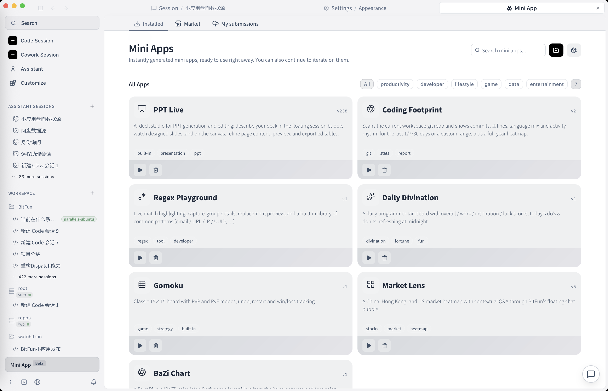

**English**  [中文](README.zh-CN.md)

<div align="center">


### An open-source desktop AI agent that turns every task into an app you can open

Writes code, produces documents, drives the desktop. The Mini Apps, the runtime, and the device-sync server are all yours. MIT.

[**⬇ Download for macOS · Windows · Linux**](https://github.com/GCWing/BitFun/releases/latest)

[Website](https://openbitfun.com/) · [Docs](./docs) · [Discussions](https://github.com/GCWing/BitFun/discussions) · [Contributing](./CONTRIBUTING.md)

[](https://github.com/GCWing/BitFun/releases)
[](https://github.com/GCWing/BitFun/releases)
[](https://github.com/GCWing/BitFun/stargazers)
[](https://github.com/GCWing/BitFun/blob/main/LICENSE)
[](https://github.com/GCWing/BitFun/releases)

[](https://trendshift.io/repositories/44672)

</div>

<!-- TODO: replace the screenshot below with a 20-30s demo GIF of a real task running end to end.
     See scripts/record-demo.sh — this is the single highest-impact asset in this README. -->


---

## Key features

| Feature | What it does |
| --- | --- |
| **Agentic Mini Apps** | A task gets its own interface — chart, board, form, panel — with a conversation bound to that interface's live state |
| **Self-hosted multi-device control** | Login, cross-device session sync, and controlling one device from another run through a relay you deploy. Zero-knowledge; no vendor cloud in the path |
| **Coding** | Plan, edit, test, and commit inside real Git repositories. Agentic, Plan, Debug, Deep Review, long-horizon tasks |
| **Office work** | Research, writing, PPT, DOCX, XLSX, PDF, meeting notes, reports |
| **Desktop execution** | Browser, terminal, desktop applications, the filesystem, and remote workspaces |
| **Four tiers of customization** | Custom Agents → MCP / Skills / Hooks → Mini Apps → source-level changes |
| **Performance** | 98.67% average KV cache hit rate; flashgrep searches Chromium-scale trees ~36x faster |
| **Cross-platform and open** | Windows, macOS, and Linux. MIT. Model-agnostic — you choose what it runs on |

---

## Why BitFun

**Agentic Mini Apps.** Most agents push every task through the same chat box. BitFun builds the task its own interface instead — a chart, a board, a form, a panel — and binds a conversation to that interface's live state. You ask about what is on screen rather than re-describing it. Community builds already range from market dashboards to domain-specific tools.



**Self-hosted multi-device control.** Account login, cross-device session and settings sync, and controlling one signed-in device from another all run through a relay *you* deploy. Nothing is brokered by a vendor's cloud — the distinction that decides whether this is allowed inside a company network at all. The relay is zero-knowledge: clients derive keys locally, and the server only ever holds Argon2id hashes and AES-GCM-wrapped material.

**A runtime you can reshape.** Four continuous tiers, from a single Markdown file to forking the runtime: custom Agents → MCP / Skills / Codex-compatible Hooks → Mini Apps → source-level changes. You extend BitFun using BitFun.

**KV cache that actually hits.** Agent cost is dominated not by generated tokens but by context re-sent every turn, and a single timestamp or reordered tool list invalidates the cache from that byte onward. Prompt assembly is byte-stable across turns: **98.67%** average cache hit rate over a SWE-Bench-Pro run.

**flashgrep.** An agent re-searches the same repository dozens to hundreds of times per task, and cold traversal on every tool call can cost more than inference itself. A resident cross-turn index cuts search time by up to **94.6%** on Chromium-scale trees — roughly **36x** on average.

---

## Install

**Download a build** — grab the latest installer from [Releases](https://github.com/GCWing/BitFun/releases/latest), install it, configure your model, and you are ready to go.

**Or run from source:**

```bash
pnpm install
pnpm run desktop:dev
```

Prerequisites: [Node.js](https://nodejs.org/) 22.12+ (LTS recommended), [pnpm](https://pnpm.io/) 10.15.0 via Corepack, the [Rust toolchain](https://rustup.rs/), and the [Tauri prerequisites](https://v2.tauri.app/start/prerequisites/). More detail in [CONTRIBUTING.md](./CONTRIBUTING.md).

---

## What you can hand to BitFun

Two kinds of complex work: shipping code in real repositories, and turning source material into office deliverables. When a task needs the browser, desktop apps, the terminal, or a remote environment, BitFun can enter the real workspace.

| Scenario | Delivery goal | Typical capabilities |
| --- | --- | --- |
| **Coding** | Move from a real repository to a mergeable result. | Agentic, Plan, Debug, testing, Git, Deep Review, long-horizon tasks, and benchmarks. |
| **Office Work** | Move from source material to deliverable documents. | Research, PPT, DOCX, XLSX, PDF, summarization, writing, meeting notes, and reports. |

**Shared capabilities**

- **Interface layer**: Mini Apps give a task its own UI, with the conversation bound to that UI's live state.
- **Execution layer**: the filesystem, terminals, Git, browser operation, desktop applications, Computer Use, and remote workspaces let the Agent reach the real environment when a task leaves the editor.
- **Customization layer**: MCP, Skills, Hooks, custom Agents, and source-level extension let BitFun keep growing around your tools, roles, and interfaces.

---

## Agent core metrics

The data below evaluates BitFun's core Agent capabilities, all measured with **Deepseek-V4-Pro**.

> [!NOTE]
> These are BitFun's initial evaluation results, with each case run once. Benchmarks fluctuate with task sampling, model versions, runtime environment, and single-run variance, so treat these as an initial sanity signal that the Agent is already reasonably capable — not as a fixed ranking claim or a final ceiling. Full benchmark details will follow.

**1. Completion results** — BitFun leads Open Code and Claude Code on both **SWE-Bench-Pro** (complex software engineering) and **SWE-Bench-Verified** (human-verified GitHub issue fixes).


Benchmark references: [SWE-Bench-Pro](https://labs.scale.com/leaderboard/swe_bench_pro_public) / [SWE-Bench-Verified](https://www.swebench.com/verified.html)

**2. Token economy** — Agent economy needs to be evaluated across end-to-end token consumption, execution time, and KV Cache reuse. From the same SWE-Bench-Pro round, BitFun's average KV Cache hit rate was **98.67%**. The follow-up report will add broader cost and latency metrics.


**3. Context retrieval at scale** — Agent experience also depends on how quickly it retrieves context in very large projects. On tens-of-millions-line repositories such as Chromium, BitFun uses **flashgrep** to cut search time by up to **94.6%**, averaging a **36.1x** speedup.


---

## Customize your BitFun

BitFun's extension paths progress continuously from light to deep customization:

| Tier | Path | Best for |
| --- | --- | --- |
| **L1** | Custom Agent | Defining roles, flows, constraints, and tool bundles. |
| **L2** | MCP / Skills / [Hooks](docs/features/agent-hooks.md) | Connecting external tools and professional capabilities, and running your own commands at Agent lifecycle points — fully Codex-hook compatible, so existing hook scripts work as-is. |
| **L3** | Mini App | Generating dedicated interfaces, forms, panels, or visualizations for tasks. |
| **L4** | Source-level customization | Changing tools, adapters, UI, Runtime, or product shape. |

You can use BitFun's Code Agent to extend BitFun itself.

---

## Where this is going

- **Lights-Out Factory** (in progress): Design during the day, let tasks flow to the server and run through the night, then review the results in the morning.
- **Infinite Radius** (in progress): Extending from desktop and browser to mobile, wearables, and more devices, so work stays accessible and continuous.
- **App Evolution**: Build tailored workflows with custom Agents, MCP, Skills, Mini Apps, or source-level customization. **Community contributors have already created specialized versions for short-form drama, media, and more**.
- **Better, Faster, Cheaper**: Pursue greater efficiency, better results, and lower cost.
- **Ultimate Desktop**: Continuously refine an easier-to-use, more capable, and more beautiful desktop experience.


---

## Community & contributing

Questions, ideas, and bug reports are all welcome in [Discussions](https://github.com/GCWing/BitFun/discussions) and [Issues](https://github.com/GCWing/BitFun/issues).

Stars, Issues, and PRs are welcome. We especially care about:

1. Code Agent, Deep Review, debugging, and long-task execution capabilities
2. Cowork, research, document, and desktop workflows
3. MCP, Skills, Mini App, LSP plugins, and new domain Agents
4. Runtime stability, performance, context efficiency, and verifiability

Please submit PRs directly to the `main` branch. For more details, see [CONTRIBUTING.md](./CONTRIBUTING.md).

---

## Disclaimer

1. This project is spare-time exploration and research into next-generation human-machine collaboration, not a commercial profit-making project.
2. This project is 97%+ built through Vibe Coding. Code feedback is welcome, and AI-assisted refactoring and optimization are encouraged.
3. This project depends on and references many open-source projects. Thanks to all open-source authors. **If your rights are affected, please contact us for remediation.**

---
