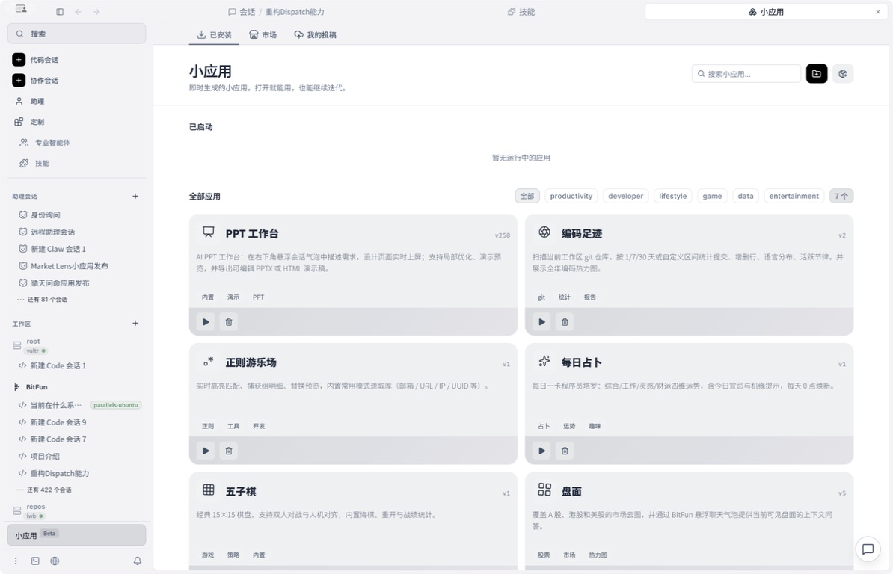

**中文**  [English](README.md)

<div align="center">


### 开源桌面 AI Agent —— 每个任务，都给你一个能打开的应用

能写代码、能做文档、能操控桌面。小应用、Runtime、多设备互控的服务器，全部归你。MIT。

[**⬇ 下载 macOS · Windows · Linux 版**](https://github.com/GCWing/BitFun/releases/latest)

[官网](https://openbitfun.com/) · [文档](./docs) · [讨论区](https://github.com/GCWing/BitFun/discussions) · [参与贡献](./CONTRIBUTING_CN.md)

[](https://github.com/GCWing/BitFun/releases)
[](https://github.com/GCWing/BitFun/releases)
[](https://github.com/GCWing/BitFun/stargazers)
[](https://github.com/GCWing/BitFun/blob/main/LICENSE)
[](https://github.com/GCWing/BitFun/releases)

[](https://trendshift.io/repositories/44672)

</div>

<!-- TODO: 把下面这张截图换成 20-30 秒的真实任务演示 GIF，
     录制脚本见 scripts/record-demo.sh —— 这是整个 README 里最值得做的一张图。 -->


---

## 核心特性

| 特性 | 说明 |
| --- | --- |
| **Agentic Mini App** | 为任务生成专属界面——图表、看板、表单、面板——对话绑定该界面的实时状态 |
| **自部署多设备互联互控** | 账号登录、跨设备会话同步、设备间操控，全部走你自己部署的 relay。零知识加密，不经第三方云 |
| **编码交付** | 在真实 Git 仓库里规划、改代码、跑测试、提交。Agentic、Plan、Debug、Deep Review、长程任务 |
| **办公交付** | 调研、写作、PPT、DOCX、XLSX、PDF、会议纪要、报告 |
| **桌面执行层** | 浏览器、终端、桌面软件、文件系统、远程工作区 |
| **四层可定制** | 自定义 Agent → MCP / Skills / Hooks → Mini App → 源码级改造 |
| **性能** | KV Cache 平均命中率 98.67%；flashgrep 在千万行仓库上搜索平均快约 36 倍 |
| **跨平台开源** | Windows、macOS、Linux 三端。MIT。模型自选，不绑定厂商 |

---

## 为什么是 BitFun

**Agentic Mini App。** 多数 Agent 把所有任务都挤进同一个对话框，BitFun 选择为任务造一个专属界面——图表、看板、表单、面板——并让对话绑定这个界面的实时状态。你问的是眼前看到的东西，不必再把它复述一遍。社区已经做出从行情面板到各类垂直领域工具的版本。



**自部署的多设备互联互控。** 账号登录、跨设备会话与配置同步、用一台设备操控另一台已登录设备，全部走**你自己部署**的 relay，不经任何第三方云中转——这往往直接决定了它在企业内网里能不能用。relay 是零知识设计：密钥在客户端本地派生，服务端只保存 Argon2id 哈希和 AES-GCM 封装后的材料。

**可以改到底的 Runtime。** 从一个 Markdown 文件到 fork 整个 Runtime，四层连续：自定义 Agent → MCP / Skills / 兼容 Codex 的 Hooks → Mini App → 源码级改造。你可以用 BitFun 来扩展 BitFun。

**真正命中的 KV Cache。** Agent 的成本大头不是生成的 token，而是每轮重复发送的上下文；而一个时间戳、一次工具列表重排序，就会让缓存从那个字节开始全部失效。运行时保证 prompt 前缀逐字节稳定：一轮 SWE-Bench-Pro 实测平均命中率 **98.67%**。

**flashgrep。** Agent 在一个任务里会把同一个仓库检索几十到上百次，每次工具调用都冷启动遍历，开销可能超过模型推理本身。跨轮次常驻索引在 Chromium 这类千万行仓库上把搜索耗时最高降低 **94.6%**，平均约 **36 倍**。

---

## 安装

**直接下载** —— 前往 [Releases](https://github.com/GCWing/BitFun/releases/latest) 下载最新桌面端安装包，安装后配置模型即可开始使用。

**或从源码运行：**

```bash
pnpm install
pnpm run desktop:dev
```

前置依赖：[Node.js](https://nodejs.org/) 22.12+（推荐 LTS）、[pnpm](https://pnpm.io/) 10.15.0（建议通过 Corepack 使用）、[Rust 工具链](https://rustup.rs/)、[Tauri 前置依赖](https://v2.tauri.app/start/prerequisites/)。更多说明见 [CONTRIBUTING_CN.md](./CONTRIBUTING_CN.md)。

---

## 你可以把什么交给 BitFun

两类复杂工作：在真实仓库里完成编码交付，在资料和文件中完成办公交付。遇到需要浏览器、桌面软件、终端或远程环境的任务时，它可以进入真实工作现场。

| 场景 | 目标交付 | 典型能力 |
| --- | --- | --- |
| **编码** | 从真实仓库推进到可合并结果。 | Agentic、Plan、Debug、测试、Git、Deep Review、长程任务、Benchmark。 |
| **办公** | 从资料推进到可交付文档。 | Research、PPT、DOCX、XLSX、PDF、总结、写作、会议纪要、报告。 |

**通用能力**

- **界面层**：Mini App 为任务生成专属 UI，并让对话绑定这个 UI 的实时状态。
- **执行层**：文件系统、终端、Git、浏览器操作、桌面应用、Computer Use 和远程工作区，让任务走出编辑器时 Agent 仍能触达真实环境。
- **定制层**：MCP、Skills、Hooks、Agent 自定义和源码级扩展，让 BitFun 按你的工具链、角色和界面继续生长。

---

## Agent 核心指标

下面的数据用于观察 BitFun Agent 的核心能力，统一使用 **Deepseek-V4-Pro** 测得。

> [!NOTE]
> 当前数据为每个 case 跑 1 次得到的 BitFun 初始评测结果。评测会受到任务抽样、模型版本、运行环境和单次执行偶然性的影响，存在一定波动；这组数据仅用于说明当前 Agent 已具备可用的基础竞争力，并不代表固定排名或最终上限。后续会持续优化并放出完整评测详情。

**1. 完成效果** —— BitFun 在 **SWE-Bench-Pro**（复杂软件工程）和 **SWE-Bench-Verified**（人工验证的 GitHub issue 修复）上均领先 Open Code 与 Claude Code。


评测集说明：[SWE-Bench-Pro](https://labs.scale.com/leaderboard/swe_bench_pro_public) / [SWE-Bench-Verified](https://www.swebench.com/verified.html)

**2. Token 经济** —— Agent 执行是否经济，需要综合评估端到端 Token 消耗、执行耗时和 KV Cache 复用。同一轮 SWE-Bench-Pro 中，BitFun 的平均 KV Cache 命中率为 **98.67%**。后续完整评测会继续补充成本与耗时指标。


**3. 超大工程下的上下文检索** —— 成本之外，Agent 体验还取决于它能否在超大工程里快速找回上下文。面对 Chromium 这类千万行级代码仓库，BitFun 通过 **flashgrep** 最高降低约 **94.6%** 搜索耗时，平均加速约 **36.1x**。


---

## 定制你的 BitFun

BitFun 的扩展路径从轻到重连续展开：

| 层级 | 方式 | 适合场景 |
| --- | --- | --- |
| **L1** | Agent 自定义 | 定义角色、流程、约束和工具组合。 |
| **L2** | MCP / Skills / [Hooks](docs/features/agent-hooks.zh-CN.md) | 接入外部工具和专业能力，并在 Agent 生命周期节点运行你自己的命令 —— 完全兼容 Codex Hooks，已有脚本无需适配。 |
| **L3** | Mini App | 为任务生成专属界面、表单、面板或可视化。 |
| **L4** | 源码级改造 | 修改工具、适配器、UI、Runtime 或产品形态。 |

你可以用 BitFun 的 Code Agent 来扩展 BitFun 本身。

---

## 我们要做成什么样

- **黑灯工厂**（正在构建中）：白天设计，夜间任务流转到服务器持续执行，早上直接验收成果。
- **无限半径**（正在构建中）：从桌面、浏览器持续延伸到移动端、可穿戴等更多设备，让工作随时接入、连续协作。
- **应用进化**：支持自定义 Agent、MCP、Skills、Mini App 乃至源码级改造，组合专属工作流；**社区伙伴已拓展出短剧、媒体等丰富版本**。
- **多快好省**：追求更高效率、更优效果与更低成本。
- **极致桌面**：持续打磨更易用、更好用、更漂亮的桌面体验。


---

## 社区与贡献

有问题、想法或 Bug，欢迎到 [讨论区](https://github.com/GCWing/BitFun/discussions) 和 [Issues](https://github.com/GCWing/BitFun/issues) 交流。

欢迎 Star、Issue 和 PR。我们尤其关注：

1. Code Agent、Deep Review、调试和长任务执行能力
2. Cowork、调研、文档和桌面工作流
3. MCP、Skills、Mini App、LSP 插件和新领域 Agent
4. Runtime 稳定性、性能、上下文效率和可验证性

请将 PR 直接提交至 `main` 分支。更多说明见 [CONTRIBUTING_CN.md](./CONTRIBUTING_CN.md)。

---

## 声明

1. 本项目为业余时间探索、研究构建下一代人机协同交互，非商用盈利项目。
2. 本项目 97%+ 由 Vibe Coding 完成，代码问题欢迎指正，也欢迎通过 AI 进行重构优化。
3. 本项目依赖和参考了众多开源软件。感谢所有开源作者。如侵犯您的相关权益，请联系我们整改。
