# Agent Runtime 部署与多实例边界

本文定义 Desktop、TUI、Headless CLI、Agent SDK 与本机控制端并存时，BitFun Agent Runtime 的部署、所有权和隔离边界。

Agent Runtime 的模块职责见 [`agent-runtime-services-design.md`](agent-runtime-services-design.md)，公开 SDK 见
[`agent-sdk-product-architecture.md`](agent-sdk-product-architecture.md)，第三方 JS/TS 进程见
[`extensions/plugin-runtime-design.md`](extensions/plugin-runtime-design.md)。

## 1. 决策与当前状态

BitFun 只有一套 Agent Runtime 行为。`Embedded` 和 `Shared` 只描述同一套 Runtime 的物理部署方式，不是两套实现。

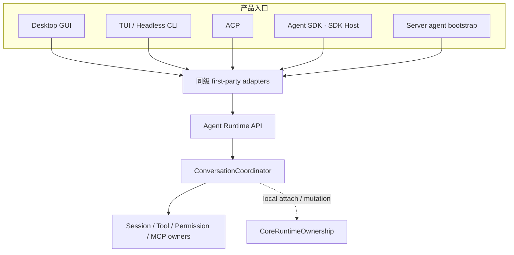

当前代码状态必须和目标设计分开阅读：

| 范围 | 当前状态 |
|---|---|
| Embedded Desktop GUI | 继续使用 Desktop 事件投影和 Tauri adapter；按实际打开的本机 workspace 延迟取得并持有 Embedded ownership，不增加后台进程 |
| Embedded TUI/Headless CLI/Peer Host | Session、Turn、Permission 和事件订阅统一通过同一个 Rust Runtime SDK（当前 preview）；CLI crate 只保留第一方 adapter 和各形态自己的展示/断流策略 |
| ACP/SDK Host | 使用同一个 Runtime 事件入口的 session-scoped 订阅；各自协议和进程生命周期保持独立 |
| Runtime ownership | Desktop、CLI、ACP、SDK Host 和现有 Server agent bootstrap 共用 Core owner；Embedded 取得共享锁，Shared TUI 取得独占锁，同一 workspace 上两种 deployment 互斥 |
| Session 写入 | BitFun Runtime 的持久化 Session 由 `SessionManager` 管理；同一存储位置中的同一 Session 同时只允许一个本机进程写入，list/view 等只读操作不受影响 |
| 当前 HTTP Server | 只提供 health/info/WebSocket 外壳，未装配 Agent Runtime，因此不取得 workspace ownership；`bootstrap.rs` 仅保持 agent-enabled composition 的一致边界，不由当前入口启动 |
| Shared local IPC | 未发布的本机协议已有 discovery、实例锁、严格握手、Session 控制权、有界事件流和 cleanup；唯一 consumer 是第一方交互式 TUI adapter |
| Shared TUI | `bitfun --shared` / `bitfun chat --shared` 可列出、创建、恢复 Session，删除未被控制的空闲非当前 Session，通过 `/fork` 从完整历史或选中提示词之前创建分支，重命名当前 Session，读取 transcript，切换当前 Session 的 Agent mode/model，通过 `/reload [skills|instructions]` 刷新声明式上下文，通过 `/compact` 或 `/summarize` 压缩当前 Session 上下文，提交/取消 Turn，处理 Permission 和 UserInput；默认仍是 Embedded |
| Shared GUI/Headless/ACP/SDK Host/Remote | 未交付，也不会由 `--shared` 隐式启用；Replay、Observer、通用 Controller transfer 和 Session archive 同样不在当前协议中 |

因此当前交付的是一条窄的、显式启用的 Shared TUI deployment，不是通用本机 Server。具体 `EventQueue` 仍由 Core 产品装配；IPC 只把当前 TUI 必需的强类型操作和事件映射到同一个 Runtime owner，没有事件重放或公开协议承诺。

## 2. 最少名词

| 名词 | 唯一含义 | 不等于 |
|---|---|---|
| Agent Runtime | 负责 Session、Turn、Tool、MCP、Permission、Hook、事件和持久化行为的既有模块 | 进程名、Server 或 SDK |
| Embedded deployment | Runtime 与调用入口位于同一 Rust 进程 | 简化版 Runtime |
| Shared deployment | 同一 Runtime 由一个本机进程承载，多个第一方 Client 通过私有 IPC 使用 | 新 Runtime、公开 Server 或 Agent SDK |
| Agent SDK Host | 将公开 SDK 合同映射到 Runtime API 的私有进程/adapter | CLI、Shared deployment 或 Plugin Host |
| Plugin Host | 运行 Node/Bun 和第三方插件代码的受监督子进程 | Agent Runtime 或 Rust IPC client |

`Host` 只表示“一个进程承载某些模块”的内部关系，不新增普通用户必须理解或管理的产品入口。

## 3. Logical View · Level 1

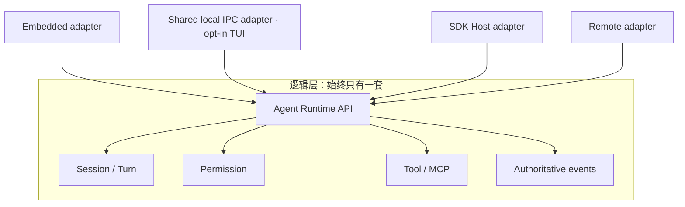

复用的是 Runtime API、权威事实和 owner；不复用 renderer、CLI 参数、SDK wire、远程认证或平台窗口生命周期。任何新能力必须先进入既有 Runtime owner，再由需要它的 adapter 映射，禁止在 Shared 路径复制业务实现。

### 3.1 Embedded 事件交付

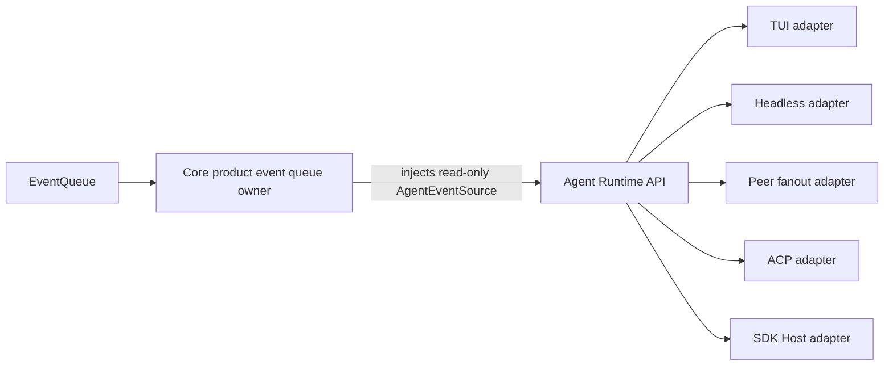

- Core product assembly 创建事件 source，并维持旧消费队列的排空 task；第一方产品入口不再获得第二个订阅 API。
- TUI、Headless CLI 和 Peer Host 只从 `AgentRuntime` 订阅，不能直接持有 Core-specific event source。
- `bitfun-core` 的旧 event-source/builder API 仅保留为 deprecated 源码兼容 facade；它们委托给同一个 Core owner，不形成第二套运行时或第一方调用路径。
- 各 adapter 继续拥有自己的失败投影：TUI 标记当前视图不可信，Headless CLI 返回非成功终态，Peer Host 中断其拥有的 turns，ACP 取消 turn 并返回协议错误，SDK Host 终结 Query 并提供 `RestartHost` recovery。
- 有界 receiver 的 `Lagged` 或 `Closed` 是显式失败；当前没有 cursor/replay 合同，禁止伪装成透明恢复。
- 这条链路仍全部位于当前 Embedded 进程，不增加 SDK Host、IPC 或后台进程依赖。

## 4. Process View · Level 1

### 4.1 Runtime ownership

ownership 分成“产品决策”和“文件锁原语”两层；入口不再各自拼 key、目录或锁模式：

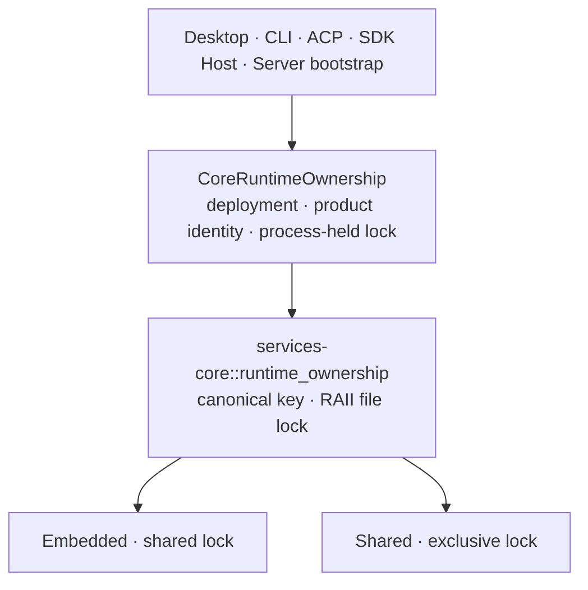

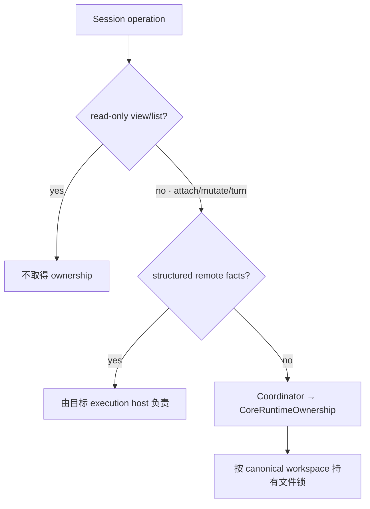

| 场景 | 行为 | 原因 |
|---|---|---|
| 多个 Embedded 进程访问同一 workspace | 共享锁允许并存 | 保持单实例、CI 和隔离测试的既有成本模型 |
| Shared 与任一 Embedded 访问同一 workspace | 后启动者返回稳定错误码和启动建议 | 防止同一 workspace 同时存在两种 Runtime deployment |
| Desktop 打开多个 workspace | 首次 attach/write 时逐个取得并持有文件锁 | 不把窗口数、Session 数等同于 Runtime 进程数 |
| 只读 list/view | 不加锁 | ownership 只管理 Runtime deployment，不扩大成读取权限 |
| 已解析且带有效 `connection_id` 的 remote workspace | 本机不加锁 | 与 Session storage 的远端判据一致；`host` 提示本身不能绕过本地锁 |
| 当前只读 HTTP Server | 不创建 Core owner | 没有 Agent Runtime 就没有 ownership 可声明 |

`CoreRuntimeOwnership` 只选择 deployment、产品 identity 并在进程存活期间持有锁；`services-core` 只负责 canonical key 和跨进程锁。二者都不选择 workspace、不启动 Runtime，也不替代 Session 单写、数据库事务、文件冲突控制或安全沙箱。

### 4.2 Session 单写

workspace 可以被多个 Embedded 进程同时打开，但持久化 Session 不能被多个进程同时写入。保护粒度是“实际 Session 存储位置 + Session ID”，不是窗口、TUI 实例或 workspace。

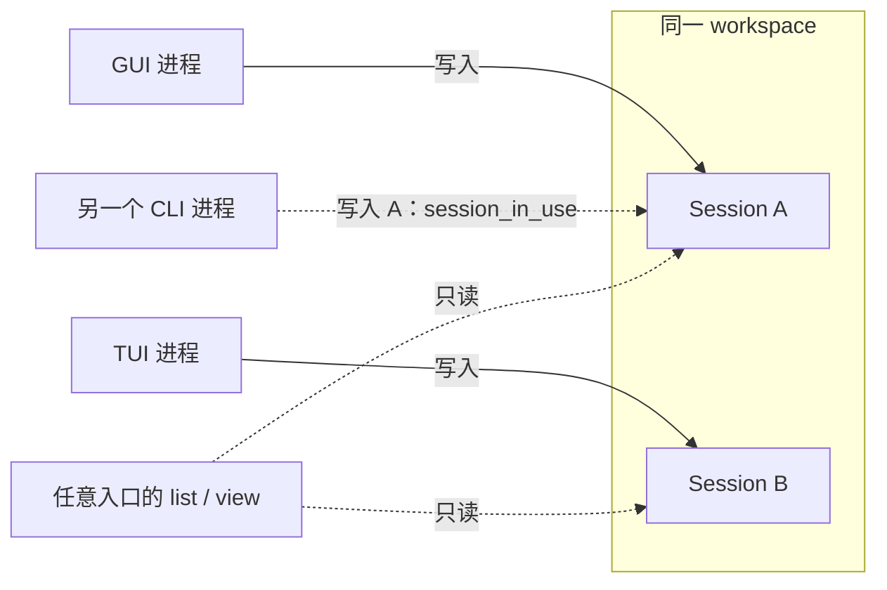

BitFun Runtime Session 只有 `SessionManager` 决定何时开始和结束写入；底层持久化方法复用同一文件锁，不再实现第二套判断。各产品入口只投影同一个 `session_in_use` 事实，不重新判断锁状态：

| 入口 | 冲突呈现 | 恢复方式 |
|---|---|---|
| Agent SDK / BitFun ACP | 结构化 `session_in_use`；SDK Host 映射为可重试的 `action_required` | 调用方在原实例关闭 Session 后重试 |
| Embedded / Shared TUI | 明确提示 Session 已在另一实例打开；切换失败时保留当前 Session | 用户关闭另一实例后再次选择；不自动等待或切换 |
| Desktop / Peer GUI | 历史视图保持只读可见；首次写入显示持久提示和显式“重试”操作 | 用户关闭另一实例后点击重试；不自动提交消息 |
| Headless `json` | 失败结果带 `error_code=session_in_use`，详细说明进入结果和 stderr | 调用方依据稳定码决定是否重试 |
| Headless `stream-json` | 复用已有 `SystemError`，`error=session_in_use`、`recoverable=true` | 调用方结束本次非零退出后重新执行 |

Desktop 作为 ACP client 管理的外部 agent Session 不经过该 Runtime owner，不在本节的 Session 单写范围内。`recoverable` 只表示关闭现有 writer 后可以重新调用，不表示自动等待、自动抢占或恢复当前调用。

| 场景 | 行为 |
|---|---|
| 同一进程重复 restore 同一 Session | 返回已加载的 Session，不重复取得或释放写入权 |
| 另一个进程打开同一存储位置中的同一 Session | 立即返回 `session_in_use`；不等待、不自动抢占 |
| 多个进程打开同一 workspace 中的不同 Session | 允许，各 Session 独立写入 |
| 多个进程更新同一 Session 列表索引 | 按存储位置串行更新共享索引，不影响不同 Session 文件并行写入 |
| `.`、`..`、符号链接或 Windows 路径大小写指向同一存储位置 | 视为同一个 Session 存储位置 |
| 相同 Session ID 位于不同存储位置 | 文件锁相互独立；同一 `SessionManager` 仍按 Session ID 保持唯一绑定，不能同时加载 |
| Session 存储路径无法解析或错误地指向文件系统根目录 | 在发布内存状态前返回错误，不创建可写 Session |
| create/restore 在发布到内存前失败、取消或超时 | 临时文件锁随操作释放；后续进程可以重试 |
| save、cleanup 或 unload 失败 | 已加载 Session 继续持有写入权，避免另一个进程接手不完整状态 |
| unload 或 delete 成功 | 释放写入权 |
| 进程崩溃或被强制结束 | 操作系统释放文件锁；残留锁文件本身不代表 Session 仍在使用 |
| Remote workspace | 在实际 Session 存储所在机器执行同一检查；控制端不得用本机路径替代 |

该机制不增加后台进程、轮询、连接或常驻线程，也不改变 Shared TUI 的连接控制规则。临时 Session 不写入磁盘，因此不参与此检查。

### 4.3 私有本机 IPC

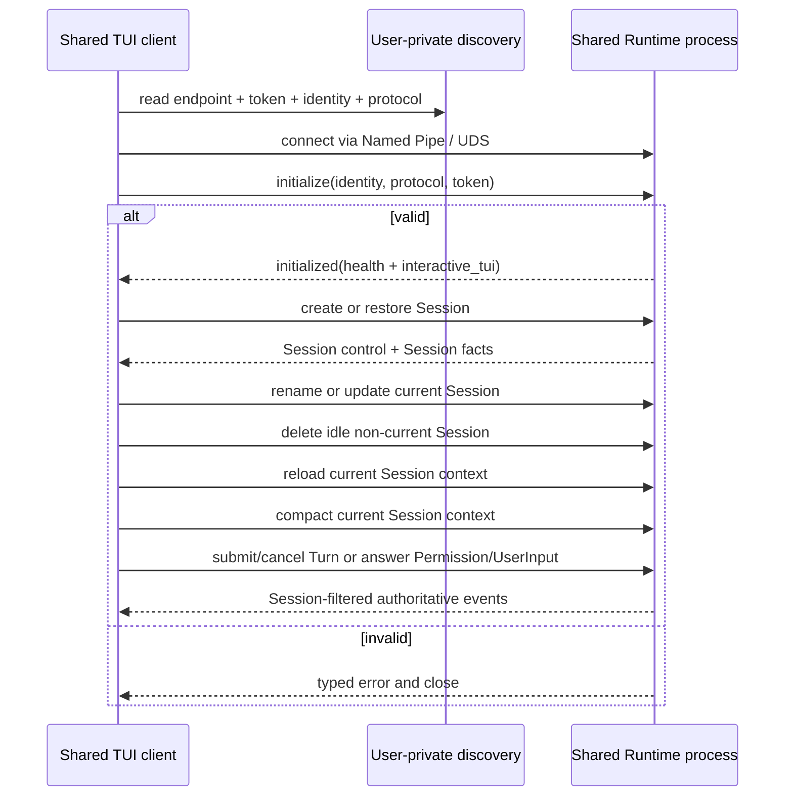

当前私有协议（v9）只覆盖 TUI 已有用户旅程需要的窄操作：

| 已支持 | 明确不支持 |
|---|---|
| Health、Session list/create、原子 restore（含 transcript 与 pending Permission）、删除未被控制的空闲 Session、当前 Session fork（含 transcript）、rename、Agent mode/model update、声明式上下文 reload | Session archive、跨 workspace attach、transcript 分页、模型目录/默认值和 Agent/Subagent 管理 |
| Turn submit/cancel、当前 Session 手动 context compaction | replay、cursor、resume event stream |
| pending/respond Permission、submit UserInput answers | observer、通用 controller transfer、多 Session multiplex |
| 连接断开清理、Session-filtered events | detach/observer/通用 controller transfer、SDK callbacks、GUI/Remote/Peer/ACP/Headless wire |

这些操作先满足以下本机 IPC 地基，而不把协议升级为公开 SDK：

- workspace、产品、release channel、用户和协议版本共同生成实例身份；
- instance lock 而不是 PID/discovery 文件决定唯一 server owner；
- Windows 使用拒绝远程连接的 Named Pipe；Unix 使用短且由 instance identity 决定的稳定 Domain Socket 名称，权限为 `0600`；
- discovery 所在目录必须由未来 composition 选择为当前用户私有目录；
- discovery 通过同目录临时文件原子替换；Unix endpoint 保留原生路径字节，路径过长时在 bind 前返回明确错误；
- 第一帧必须完成 token、instance identity 和 protocol version 校验；
- 未认证握手预算为 2 秒；认证后的单次操作、响应写入和断线取消预算为 120 秒，避免坏客户端长期占用连接或 Runtime handler；
- JSON frame 使用 4-byte 长度前缀；request 在发送前执行 128 KiB 上限（覆盖 TUI 已有的 64 KiB 粘贴输入及类型化信封），response/event 在序列化时执行 8 MiB 上限。超限返回类型化错误，不能进行无界分配；超过该上限的历史 Session 暂由 Embedded TUI 打开，不在本阶段引入分页协议；
- 未认证连接也计入有界 connection budget，单个客户端不能无限制造 server task；
- 未知 frame/operation 信封字段、未知 operation、错误身份和不兼容版本 fail closed；复用的 Runtime DTO 按其既有反序列化契约处理字段；
- 一个连接最多控制一个 Session、同时最多提交一个活动 Turn；一个 Session 同时只有一个 controller。create/restore/fork 在完整结果通过大小检查后才原子切换控制权，失败时保留原 Session。fork 只接受当前 controller 的空闲 Session；无选中 Turn 时复制到最新持久化 Turn，指定 `before_turn_id` 时只复制该 Turn 之前的历史。活动 Turn 期间不能切换或 fork Session，也不能修改其名称、Agent mode 或 model；删除只作用于非当前且未被任何连接控制的 Session。
- Submit 与手动 context compaction 都使用调用方已有的 `turn_id` 标识不确定结果；若操作超时，返回 `outcome_unknown`、关闭连接并按该 ID 取消。手动 compaction 要求当前 controller 且 Session 空闲，由 Core 通过与普通对话 Turn 共用的原子准入路径创建一个可审计 maintenance Turn，并在取得所有权后读取压缩上下文：planning 阶段允许取消，atomic commit 开始后忽略晚到取消并保持 Processing 直至终态持久化完成。maintenance Turn 保留在权威 transcript 中但不进入模型上下文，live/restored payload 使用同一 compression ID 和 `applied` 事实；commit 后的持久化故障发布明确失败终态而不是遗留 Processing。断连取消只有得到确认后才释放 Session 控制权；无法确认时继续隔离该 Session，直到 Runtime 进程退出。
- Session delete/rename 和 Agent mode/model update 复用既有 Runtime 端口和校验，Runtime 对最终结果保持权威并拒绝无效目标。它们都是有副作用操作；发送前编码或 frame 上限失败表示请求未执行，连接仍可使用。rename 写入失败时恢复旧 metadata：确认恢复后返回明确失败，无法确认时返回 `outcome_unknown`。Shared Client 在请求写入后响应超时或丢失连接时也返回 `outcome_unknown` 并断开连接。两种情况都不自动重试：rename 由用户恢复 Session 并核对当前值；delete 由用户重新打开 `/sessions` 核对目标是否仍存在。模式与模型目录仍是同版本第一方产品事实，不加入 IPC。
- 声明式上下文 reload 只失效当前 Session 的 instructions 缓存，并按目标复用 Skill Registry 刷新；它可在活动 Turn 中执行但不改写该 Turn，generation 保护保证下一条消息重建上下文。它不引入 watcher、热替换或第二套 Runtime owner。
- Shared TUI 的模型选择器复用 Client 已有的只读产品配置来显示同版本模型目录；它只把选中的 model ID 通过 `update current Session model` 交给 Runtime。Client 不持有 Session 写入权，也不通过 IPC 管理模型目录或默认值。
- Agent 事件流 lag/closed 后 fail closed；Permission lag 先从 Runtime 权威 pending 集合重建，重建失败或流关闭时取消当前 Turn 并退出。路由到父 Session 的嵌套 Permission 与 AskUserQuestion 复用现有 TUI 交互，不新增第二套 UI 状态。
- Windows Shared Runtime 在初始化前把自身放入 kill-on-close Job；Unix 仅在应用内优雅退出路径中通过受管子进程组回收后代。Runtime 被 `SIGTERM`、`SIGKILL` 或崩溃直接终止后的 Unix 后代回收不在当前保证内。两者都只负责生命周期，不是安全沙箱。
- 最后一个连接离开后等待 30 秒再退出；新连接会取消 idle 退出。退出只删除自己发布的 discovery；Unix 下继任 owner 会在持有实例锁后清理同一 identity 的陈旧 socket。

这是一条本机同用户边界，不是沙箱、远程协议或公开兼容承诺。

### 4.4 Serialization、并发与性能

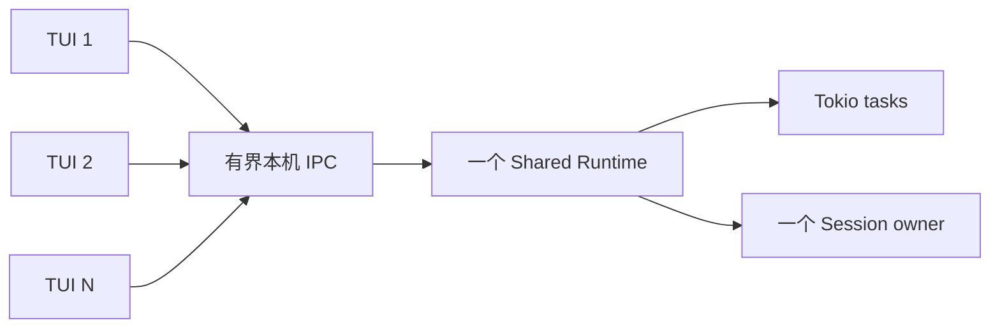

多个 Shared TUI 复用一个 Runtime 进程。每个连接使用独立异步任务，但连接、命令队列和事件队列都有上限；达到连接上限时暂停接收新连接，慢客户端不能建立无界任务或队列。默认不增加 Runtime 进程池，因为复制 Session 状态、模型连接和缓存会扩大一致性成本。只有经测量证明某类无状态 CPU 工作可独立分片时，才评审额外 worker 进程。

| 路径 | 数据边界 | 性能约束 |
|---|---|---|
| Embedded | 第一方 adapter 以 Rust 类型直接调用 `AgentRuntime` | 不初始化本机 IPC，不执行 JSON framing、序列化或反序列化 |
| Shared request | Client 将 operation 编码一次并写入一个长度前缀 frame | 请求保持 128 KiB 上限；业务层只接收类型化 operation |
| Shared response/event | Server 将结果或事件编码一次后写出 | 响应/事件保持 8 MiB 上限；超限使事件流明确失效，不能无界分配 |
| Shared receive | 每个方向只有一个严格 transport decode 边界 | 未知信封字段和不兼容版本 fail closed；严格校验可以检查规范化 JSON，但不能把动态 JSON 传入 Runtime owner |
| 多 TUI | 一个 Runtime、最多 64 个连接；每个 Client 的 command channel 容量为 64、event channel 容量为 256 | request gate 使每个 Client 同时只有一个请求进入 channel；事件落后时失效而非无限缓存 |

协议只承载当前交互所需的小型控制请求和既有事件。大 transcript 继续受 frame 上限约束；本阶段不为假设场景增加通用分页、二进制 side channel、压缩或批处理协议。

## 5. Development and Physical Views · Level 1

### 5.1 Development View

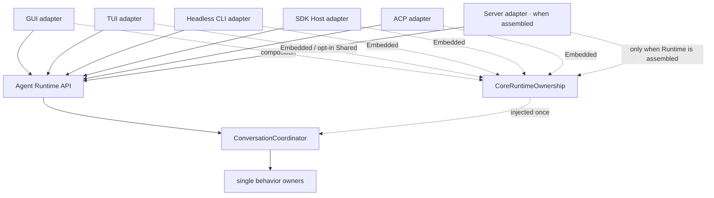

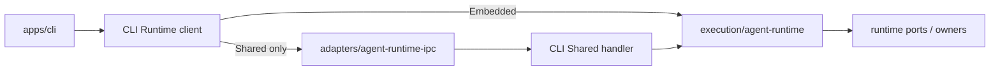

CLI adapter 负责命令解析、TUI 状态和错误文案；私有 IPC 只负责本机传输、连接控制和类型映射；Agent Runtime 与 owner 负责 Session 校验、持久化和权威结果。业务代码通过同一个 CLI Runtime client 调用能力，不根据部署形态复制业务分支。

- CLI 不依赖 SDK Host，GUI/TUI 也不依赖公开 SDK package。
- 交互式 TUI 的启动页和会话页复用一个 CLI 私有 Runtime client；Session、Turn、Permission 和事件订阅都使用 Rust Runtime SDK（当前 preview）。该 client 只是第一方 adapter，不是公开 SDK、SDK Host client 或第二套 Runtime。
- Headless CLI 和 Peer Host 使用同一 Runtime 订阅入口，但分别保留确定性退出与 Peer fanout 语义；共享订阅入口不等于共享 renderer 或产品生命周期。
- TUI 不是 Server；未来是否连接 Shared deployment 是部署选择，不改变 TUI 的 renderer/键位职责。
- Agent SDK Host 只服务外部 SDK 合同，不成为第一方 rich-client 的通用底座。
- Headless CLI 默认继续 Embedded；CI 或测试可保持独立进程和独立 workspace，不承担后台实例成本。
- Tauri 仍负责窗口和桌面能力；未来它可以管理 Shared process 的启动/重连，但不拥有 Agent Runtime 业务生命周期。

### 5.2 Physical View

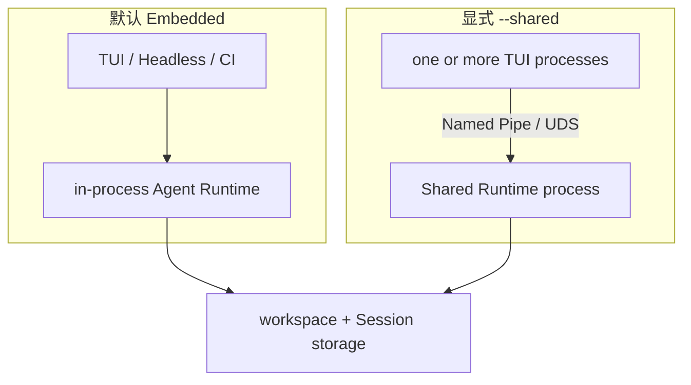

默认交互式 TUI、Headless CLI 和 CI 保持 Embedded。只有显式 `--shared` 的交互式 TUI 进入 Shared；同一 workspace 的两种部署互斥。多开 TUI 增加 Client 进程和有界连接，不按 Client 数量复制 Runtime、Session owner 或 Plugin Host。

### 5.3 Scenario (+1) · Rename current Session

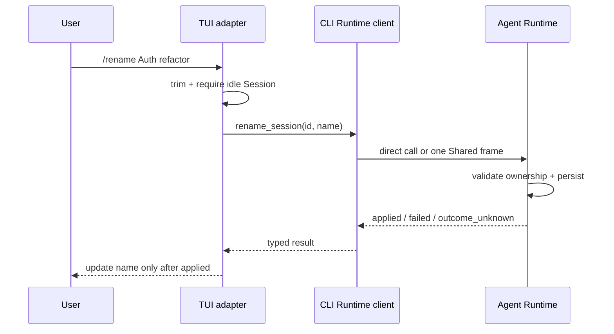

Embedded 和 Shared 最终调用同一 `AgentRuntime::rename_session`。Runtime 只有在确认旧名称已保留时才返回明确失败；持久化恢复无法确认时，两种部署都返回 `outcome_unknown`。Shared 还会在请求已发送但权威响应丢失时返回该结果并关闭连接。用户恢复 Session、检查当前名称后再决定是否重试。

### 5.4 Scenario (+1) · Delete an idle Session

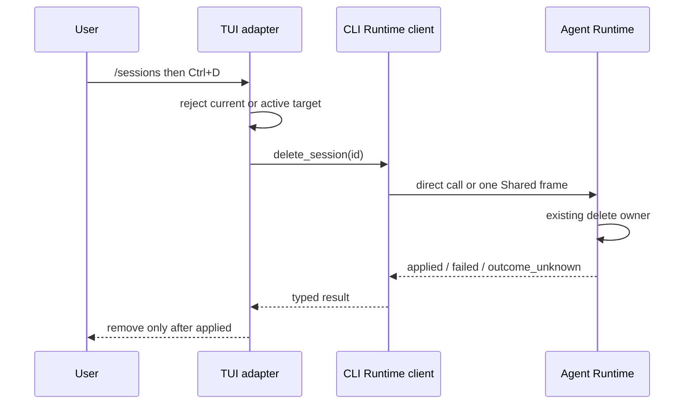

Embedded 和 Shared 最终调用同一 `AgentRuntime::delete_session`。Shared Server 只在请求方没有活动 Turn、目标 Session 未被任何 Client 控制时调用 Runtime owner；`session_in_use` 和 `not_found` 保持结构化错误。TUI 复用现有单个 Session 异步任务槽位，不阻塞事件循环，也不自动重试结果不确定的删除。

## 6. 隔离和生命周期原则

实例身份与 ownership key 分工不同：

| 事实 | 用途 |
|---|---|
| canonical workspace + product | 防止 Embedded 与 Shared 同时拥有同一工作区 Runtime |
| workspace + product + release channel + user + protocol | 定位兼容的本机 Shared instance |
| stable local endpoint + bearer token + owner id | endpoint 定位同一 instance；随机 token 认证本轮 server；owner id 防止旧实例误删新 discovery |
| 实际 Session 存储位置 + Session ID | 限制持久化 Session 的跨进程并发写入；不由 IPC 协议定义 |

当前 Shared TUI 只有 controller，没有 observer 或 detached Query：一个 Client 关闭不会删除 Session；它会取消仍拥有的活动 Turn，只有取消得到确认才释放 Session 控制权，否则继续隔离该 Session，直到 Runtime 退出。最后一个 Client 关闭后，Runtime 进入 30 秒空闲期；期间重连可继续使用，超时后 Runtime 正常关闭。若未来增加后台任务、observer 或 Remote 引用，必须先扩展 Runtime-aware drain，不能把这些引用塞进当前简单连接计数。

对普通单实例用户，未显式启用 Shared deployment 时不增加后台进程、连接、发现扫描或常驻内存。

## 7. 能力扩展原则

未来每增加一类 Shared 能力，都必须同时满足：

1. 已有明确第一方 consumer 和用户旅程；
2. 行为由现有 Runtime owner 提供，IPC 只映射 typed request/result/event；
3. 定义权限、取消、deadline、断线、背压和副作用结果不确定性；
4. Embedded 与 Shared 使用同一行为 fixture；
5. 新能力不被顺带发布为 Agent SDK、Remote 或浏览器 API。

Session/Turn、事件恢复、Permission/UserInput、Controller、配置管理和 Remote 应分别通过上述门槛，不能一次性加入一个“全量 Shared API”。

当前 IPC crate 只是一条可删除的预集成边界：

| 约束 | 当前决定 |
|---|---|
| 当前 consumer | 仅第一方交互式 TUI adapter；不自动包含 GUI、Headless CLI、Remote 或 SDK Host |
| 稳定测试合同 | 本机 endpoint、initialize-first、128 KiB request / 8 MiB response-event 上限、连接上限、owner-checked cleanup、原子 Session controller 切换、单连接单活动 Turn、事件流失效后 fail closed、断连取消、30 秒空闲退出 |
| 当前业务范围 | Session list/create/restore/delete、Turn/transcript、当前 Session name/Agent mode/model、Permission/UserInput 的 TUI 必需子集；任何新增操作都需要真实 consumer 和 owner 等价测试 |
| 协议地位 | crate 保持 `publish = false`；这是 workspace 内私有协议，不是 Agent SDK 或远程兼容承诺 |

架构守卫只允许 CLI 消费该 crate；IPC 可以复用稳定的 Event、Product Domain 与 Runtime Port DTO，但禁止依赖 Runtime 实现、SDK Host、services、Tauri 或远程网络 transport。

## 8. 与竞品的取舍

| 产品 | 已验证做法 | BitFun 采用 | 不照搬 |
|---|---|---|---|
| [OpenCode Server/SDK](https://opencode.ai/docs/server/) | Server-first；类型化 SDK 直接消费 Server API | 一个 Runtime owner 可以服务多个第一方 Client | 不让默认 TUI 承担 HTTP/OpenAPI 编解码，也不把全量 route 固化为私有 Shared wire |
| [Codex App Server](https://developers.openai.com/codex/app-server/) | App Server 为 rich client 和 remote TUI 提供 JSON-RPC；自动化继续使用 SDK；WebSocket transport 仍是实验性接口 | rich-client 私有协议与公开 SDK 分层，并为 Shared 入口保留有界本机 transport | 不让默认 CLI 依赖 App Server，也不复制其完整 schema 或实验性远程 transport |
| [Claude Agent SDK](https://code.claude.com/docs/en/agent-sdk/typescript) | Agent loop 由长期运行的 CLI 子进程承载，并提供 `startup()` 预热以减少首次请求成本 | 长期交互可以复用已启动进程，空闲后回收 | 不让第一方 Embedded TUI 为接口统一付出子进程和编解码成本，也不把多 TUI 映射为多个 Runtime |

三种产品说明了不同部署的有效边界：server-first 适合稳定多客户端协议，长期子进程适合语言 SDK，进程内调用适合默认本机交互。BitFun 采用混合部署，不把任何一种形态强制成所有入口的公共底座；当前也没有为了追赶功能表一次性增加 Session/Tool/Permission 超集。

## 9. 不变量

- 只有一套 Agent Runtime 业务实现；部署差异不能产生第二套 Session、Tool、Permission 或 MCP owner。
- Client、窗口、Session 或 workspace 数量不会自动等量增加 Runtime 或 Plugin Host 进程。
- 私有 IPC 不成为公开 SDK、Remote、Peer、HTTP 或浏览器协议。
- 默认 GUI/TUI/Headless CLI、ACP 与 SDK Host 保持 Embedded；只有交互式 TUI 的显式 `--shared` 选择 Shared。互斥按 `workspace + product` 生效，不再按入口名称缩窄。
- Account/session cloud sync 仍使用既有 Core compatibility 边界，不属于 Shared Runtime 支持。
- Remote workspace 的文件、凭据、进程和 Runtime 位于目标执行域，禁止静默回落本机。
- 未经真实 consumer 验证的接口不进入 wire；当前 wire 只包含表中列出的 Shared TUI 操作。
