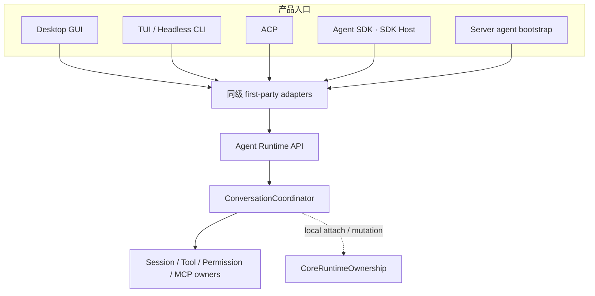
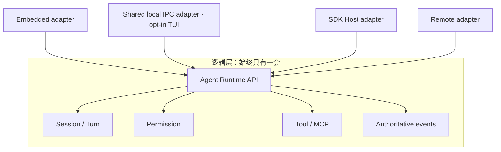
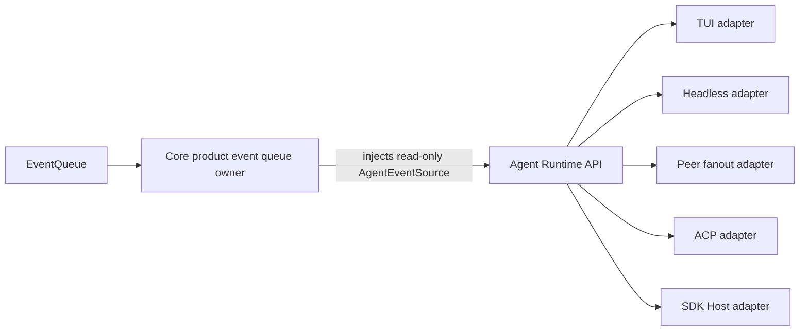
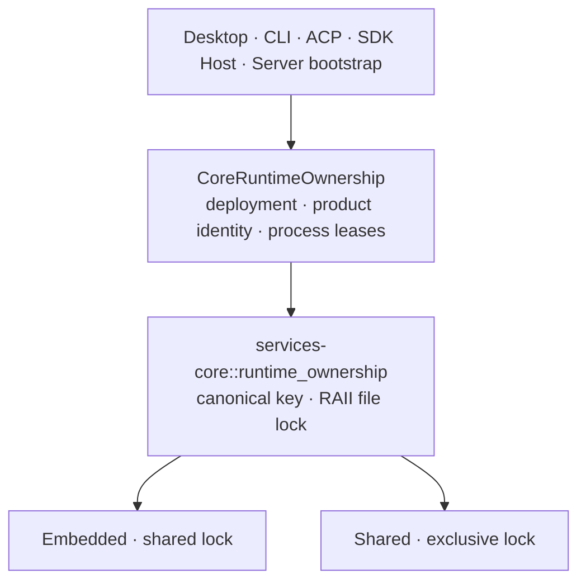
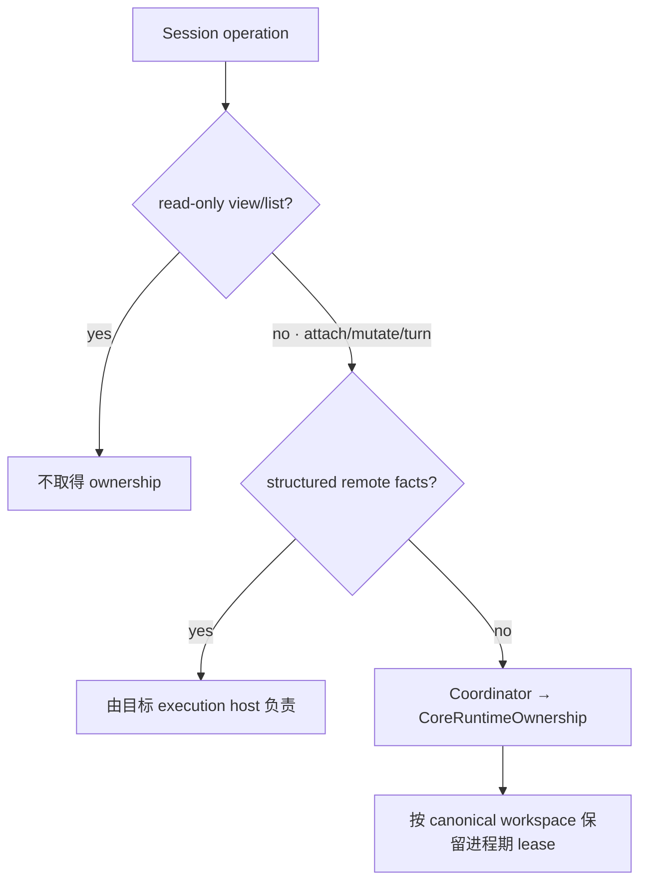
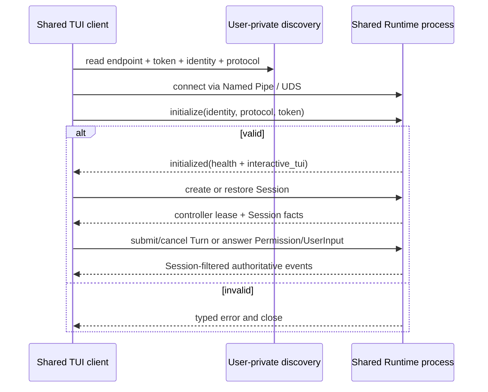
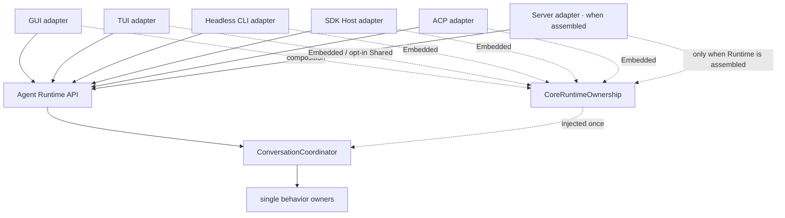

# Agent Runtime 部署与多实例边界

本文定义 Desktop、TUI、Headless CLI、Agent SDK 与本机控制端并存时，BitFun Agent Runtime 的部署、所有权和隔离边界。

Agent Runtime 的模块职责见 [`agent-runtime-services-design.md`](agent-runtime-services-design.md)，公开 SDK 见
[`agent-sdk-product-architecture.md`](agent-sdk-product-architecture.md)，第三方 JS/TS 进程见
[`extensions/plugin-runtime-design.md`](extensions/plugin-runtime-design.md)。

## 1. 决策与当前状态

BitFun 只有一套 Agent Runtime 行为。`Embedded` 和 `Shared` 只描述同一套 Runtime 的物理部署方式，不是两套实现。

当前代码状态必须和目标设计分开阅读：

| 范围 | 当前状态 |
|---|---|
| Embedded Desktop GUI | 继续使用 Desktop 事件投影和 Tauri adapter；按实际打开的本机 workspace 延迟取得并持有 Embedded ownership，不增加后台进程 |
| Embedded TUI/Headless CLI/Peer Host | Session、Turn、Permission 和事件订阅统一通过同一个 Rust Runtime SDK（当前 preview）；CLI crate 只保留第一方 adapter 和各形态自己的展示/断流策略 |
| ACP/SDK Host | 使用同一个 Runtime 事件入口的 session-scoped 订阅；各自协议和进程生命周期保持独立 |
| Runtime ownership | Desktop、CLI、ACP、SDK Host 和现有 Server agent bootstrap 共用 Core owner；Embedded 取得共享锁，Shared TUI 取得独占锁，同一 workspace 上两种 deployment 互斥 |
| 当前 HTTP Server | 只提供 health/info/WebSocket 外壳，未装配 Agent Runtime，因此不取得 workspace ownership；`bootstrap.rs` 仅保持 agent-enabled composition 的一致边界，不由当前入口启动 |
| Shared local IPC | 未发布的本机协议已有 discovery、实例锁、严格握手、Session 控制租约、有界事件流和 cleanup；唯一 consumer 是第一方交互式 TUI adapter |
| Shared TUI | `bitfun --shared` / `bitfun chat --shared` 可列出、创建、恢复 Session，读取 transcript，提交/取消 Turn，处理 Permission 和 UserInput；默认仍是 Embedded |
| Shared GUI/Headless/ACP/SDK Host/Remote | 未交付，也不会由 `--shared` 隐式启用；Replay、Observer、Controller transfer、Session delete/fork 同样不在当前协议中 |

因此当前交付的是一条窄的、显式启用的 Shared TUI deployment，不是通用本机 Server。具体 `EventQueue` 仍由 Core 产品装配；IPC 只把当前 TUI 必需的强类型操作和事件映射到同一个 Runtime owner，没有事件重放或公开协议承诺。

## 2. 最少名词

| 名词 | 唯一含义 | 不等于 |
|---|---|---|
| Agent Runtime | 负责 Session、Turn、Tool、MCP、Permission、Hook、事件和持久化行为的既有模块 | 进程名、Server 或 SDK |
| Embedded deployment | Runtime 与调用入口位于同一 Rust 进程 | 简化版 Runtime |
| Shared deployment | 同一 Runtime 未来由一个本机进程承载，多个第一方 Client 通过私有 IPC 使用 | 新 Runtime、公开 Server 或 Agent SDK |
| Agent SDK Host | 将公开 SDK 合同映射到 Runtime API 的私有进程/adapter | CLI、Shared deployment 或 Plugin Host |
| Plugin Host | 运行 Node/Bun 和第三方插件代码的受监督子进程 | Agent Runtime 或 Rust IPC client |

`Host` 只表示“一个进程承载某些模块”的内部关系，不新增普通用户必须理解或管理的产品入口。

## 3. 逻辑复用与物理部署

复用的是 Runtime API、权威事实和 owner；不复用 renderer、CLI 参数、SDK wire、远程认证或平台窗口生命周期。任何新能力必须先进入既有 Runtime owner，再由需要它的 adapter 映射，禁止在 Shared 路径复制业务实现。

### 3.1 Embedded 事件交付

- Core product assembly 创建事件 source，并维持旧消费队列的排空 task；第一方产品入口不再获得第二个订阅 API。
- TUI、Headless CLI 和 Peer Host 只从 `AgentRuntime` 订阅，不能直接持有 Core-specific event source。
- `bitfun-core` 的旧 event-source/builder API 仅保留为 deprecated 源码兼容 facade；它们委托给同一个 Core owner，不形成第二套运行时或第一方调用路径。
- 各 adapter 继续拥有自己的失败投影：TUI 标记当前视图不可信，Headless CLI 返回非成功终态，Peer Host 中断其拥有的 turns，ACP 取消 turn 并返回协议错误，SDK Host 终结 Query 并提供 `RestartHost` recovery。
- 有界 receiver 的 `Lagged` 或 `Closed` 是显式失败；当前没有 cursor/replay 合同，禁止伪装成透明恢复。
- 这条链路仍全部位于当前 Embedded 进程，不增加 SDK Host、IPC 或后台进程依赖。

## 4. 当前基础架构

### 4.1 Runtime ownership

ownership 分成“产品决策”和“文件锁原语”两层；入口不再各自拼 key、目录或锁模式：

| 场景 | 行为 | 原因 |
|---|---|---|
| 多个 Embedded 进程访问同一 workspace | 共享锁允许并存 | 保持单实例、CI 和隔离测试的既有成本模型 |
| Shared 与任一 Embedded 访问同一 workspace | 后启动者返回稳定错误码和启动建议 | 防止同一 workspace 同时存在两种 Runtime deployment |
| Desktop 打开多个 workspace | 首次 attach/write 时逐个取得并保留 lease | 不把窗口数、Session 数等同于 Runtime 进程数 |
| 只读 list/view | 不加锁 | ownership 只管理 Runtime deployment，不扩大成读取权限 |
| 已解析且带有效 `connection_id` 的 remote workspace | 本机不加锁 | 与 Session storage 的远端判据一致；`host` 提示本身不能绕过本地锁 |
| 当前只读 HTTP Server | 不创建 Core owner | 没有 Agent Runtime 就没有 ownership 可声明 |

`CoreRuntimeOwnership` 只选择 deployment、产品 identity 并保留进程期 lease；`services-core` 只负责 canonical key 和跨进程锁。二者都不选择 workspace、不启动 Runtime，也不替代 Session 单写、数据库事务、文件冲突控制或安全沙箱。

### 4.2 私有本机 IPC

当前协议只覆盖第一个 TUI 纵向切片：

| 已支持 | 明确不支持 |
|---|---|
| Health、Session list/create、原子 restore（含 transcript 与 pending Permission） | Session delete/fork、跨 workspace attach、transcript 分页 |
| Turn submit/cancel | replay、cursor、resume event stream |
| pending/respond Permission、submit UserInput answers | observer、controller transfer、多 Session multiplex |
| 连接断开清理、Session-filtered events | detach/observer/controller transfer、SDK callbacks、GUI/Remote/Peer/ACP/Headless wire |

这些操作先满足以下本机 IPC 地基，而不把协议升级为公开 SDK：

- workspace、产品、release channel、用户和协议版本共同生成实例身份；
- instance lock 而不是 PID/discovery 文件决定唯一 server owner；
- Windows 使用拒绝远程连接的 Named Pipe；Unix 使用短且由 instance identity 决定的稳定 Domain Socket 名称，权限为 `0600`；
- discovery 所在目录必须由未来 composition 选择为当前用户私有目录；
- discovery 通过同目录临时文件原子替换；Unix endpoint 保留原生路径字节，路径过长时在 bind 前返回明确错误；
- 第一帧必须完成 token、instance identity 和 protocol version 校验；
- 未认证握手预算为 2 秒；认证后的单次操作、响应写入和断线取消预算为 120 秒，避免坏客户端长期占用连接或 Runtime handler；
- JSON frame 使用 4-byte 长度前缀；request 在发送前执行 128 KiB 上限（覆盖 TUI 已有的 64 KiB 粘贴输入及类型化信封），response/event 在序列化时执行 8 MiB 上限。超限返回类型化错误，不能进行无界分配；超过该上限的历史 Session 暂由 Embedded TUI 打开，不在本阶段引入分页协议；
- 未认证连接也计入有界 connection budget，单个客户端不能无限制造 server task；
- 未知字段、未知 operation、错误身份和不兼容版本 fail closed；
- 一个连接最多控制一个 Session、同时最多提交一个活动 Turn；一个 Session 同时只有一个 controller。create/restore 在完整结果通过大小检查后才原子切换控制权，失败时保留原 Session。活动 Turn 期间不能切换 Session。
- Submit 使用调用方已有的 `turn_id` 标识不确定结果；若提交超时，返回 `outcome_unknown`、关闭连接并按该 ID 取消。断连取消只有得到确认后才释放 Session 租约；无法确认时租约保持隔离，直到 Runtime 进程退出。
- Agent 事件流 lag/closed 后 fail closed；Permission lag 先从 Runtime 权威 pending 集合重建，重建失败或流关闭时取消当前 Turn 并退出。路由到父 Session 的嵌套 Permission 与 AskUserQuestion 复用现有 TUI 交互，不新增第二套 UI 状态。
- Windows Shared Runtime 在初始化前把自身放入 kill-on-close Job；Unix 仅在应用内优雅退出路径中通过受管子进程组回收后代。Runtime 被 `SIGTERM`、`SIGKILL` 或崩溃直接终止后的 Unix 后代回收不在当前保证内。两者都只负责生命周期，不是安全沙箱。
- 最后一个连接离开后等待 30 秒再退出；新连接会取消 idle 退出。退出只删除自己发布的 discovery；Unix 下继任 owner 会在持有实例锁后清理同一 identity 的陈旧 socket。

这是一条本机同用户边界，不是沙箱、远程协议或公开兼容承诺。

## 5. 产品入口保持同级

- CLI 不依赖 SDK Host，GUI/TUI 也不依赖公开 SDK package。
- 交互式 TUI 的启动页和会话页复用一个 CLI 私有 Runtime client；Session、Turn、Permission 和事件订阅都使用 Rust Runtime SDK（当前 preview）。该 client 只是第一方 adapter，不是公开 SDK、SDK Host client 或第二套 Runtime。
- Headless CLI 和 Peer Host 使用同一 Runtime 订阅入口，但分别保留确定性退出与 Peer fanout 语义；共享订阅入口不等于共享 renderer 或产品生命周期。
- TUI 不是 Server；未来是否连接 Shared deployment 是部署选择，不改变 TUI 的 renderer/键位职责。
- Agent SDK Host 只服务外部 SDK 合同，不成为第一方 rich-client 的通用底座。
- Headless CLI 默认继续 Embedded；CI 或测试可保持独立进程和独立 workspace，不承担后台实例成本。
- Tauri 仍负责窗口和桌面能力；未来它可以管理 Shared process 的启动/重连，但不拥有 Agent Runtime 业务生命周期。

## 6. 隔离和生命周期原则

实例身份与 ownership key 分工不同：

| 事实 | 用途 |
|---|---|
| canonical workspace + product | 防止 Embedded 与 Shared 同时拥有同一工作区 Runtime |
| workspace + product + release channel + user + protocol | 定位兼容的本机 Shared instance |
| stable local endpoint + bearer token + owner id | endpoint 定位同一 instance；随机 token 认证本轮 server；owner id 防止旧实例误删新 discovery |
| Session identity | 未来 Runtime 内的持久化和写入隔离；不由 IPC foundation 定义 |

当前 Shared TUI 只有 controller，没有 observer 或 detached Query：一个 Client 关闭不会删除 Session；它会取消仍拥有的活动 Turn，只有取消得到确认才释放 Session 控制租约，否则该租约隔离到 Runtime 退出。最后一个 Client 关闭后，Runtime 进入 30 秒空闲期；期间重连可继续使用，超时后 Runtime 正常关闭。若未来增加后台任务、observer 或 Remote 引用，必须先扩展 Runtime-aware drain，不能把这些引用塞进当前简单连接计数。

对普通单实例用户，未显式启用 Shared deployment 时不增加后台进程、连接、发现扫描或常驻内存。

## 7. 能力扩展原则

未来每增加一类 Shared 能力，都必须同时满足：

1. 已有明确第一方 consumer 和用户旅程；
2. 行为由现有 Runtime owner 提供，IPC 只映射 typed request/result/event；
3. 定义权限、取消、deadline、断线、背压和副作用结果不确定性；
4. Embedded 与 Shared 使用同一行为 fixture；
5. 新能力不被顺带发布为 Agent SDK、Remote 或浏览器 API。

Session/Turn、事件恢复、Permission/UserInput、Controller、配置管理和 Remote 应分别通过上述门槛，不能一次性加入一个“全量 Shared API”。

当前 IPC crate 只是一条可删除的预集成边界：

| 约束 | 当前决定 |
|---|---|
| 当前 consumer | 仅第一方交互式 TUI adapter；不自动包含 GUI、Headless CLI、Remote 或 SDK Host |
| 稳定测试合同 | 本机 endpoint、initialize-first、128 KiB request / 8 MiB response-event 上限、连接上限、owner-checked cleanup、原子 Session controller 切换、单连接单活动 Turn、事件流失效后 fail closed、断连取消、30 秒空闲退出 |
| 当前业务范围 | Session/Turn/transcript/Permission/UserInput 的 TUI 必需子集；任何新增操作都需要真实 consumer 和 owner 等价测试 |
| 协议地位 | crate 保持 `publish = false`；这是 workspace 内私有协议，不是 Agent SDK 或远程兼容承诺 |

架构守卫只允许 CLI 消费该 crate；IPC 可以复用稳定的 Event、Product Domain 与 Runtime Port DTO，但禁止依赖 Runtime 实现、SDK Host、services、Tauri 或远程网络 transport。

## 8. 与竞品的取舍

| 产品 | 已验证做法 | BitFun 采用 | 不照搬 |
|---|---|---|---|
| OpenCode | Core/Server 支持 TUI/Web/Desktop/SDK 多客户端 | 一个 Runtime owner 可服务多个第一方 Client | 不把全量 HTTP/OpenAPI route 提前固化为 Shared 或公开 SDK |
| Codex | App Server 面向 rich client；SDK 面向自动化 | rich-client 私有协议与公开 SDK 分层 | 不让 CLI 默认依赖 Server，也不把 App Server schema 原样复制 |
| Claude Code | 默认单进程；Remote/SDK 路径显式启用 | 默认单实例无额外常驻成本，Shared 必须显式且有真实收益 | 不提前引入云中继、移动端或全机器 daemon 心智 |

当前先落 identity、ownership、local transport 和 handshake，与这些产品共同采用的“先稳定宿主边界，再开放能力”一致；没有为了追赶功能表一次性增加 Session/Tool/Permission 超集。

## 9. 不变量

- 只有一套 Agent Runtime 业务实现；部署差异不能产生第二套 Session、Tool、Permission 或 MCP owner。
- Client、窗口、Session 或 workspace 数量不会自动等量增加 Runtime 或 Plugin Host 进程。
- 私有 IPC 不成为公开 SDK、Remote、Peer、HTTP 或浏览器协议。
- 默认 GUI/TUI/Headless CLI、ACP 与 SDK Host 保持 Embedded；只有交互式 TUI 的显式 `--shared` 选择 Shared。互斥按 `workspace + product` 生效，不再按入口名称缩窄。
- Account/session cloud sync 仍使用既有 Core compatibility 边界，不属于 Shared Runtime 支持。
- Remote workspace 的文件、凭据、进程和 Runtime 位于目标执行域，禁止静默回落本机。
- 未经真实 consumer 验证的接口不进入 wire；当前 wire 只包含表中列出的 Shared TUI 操作。
