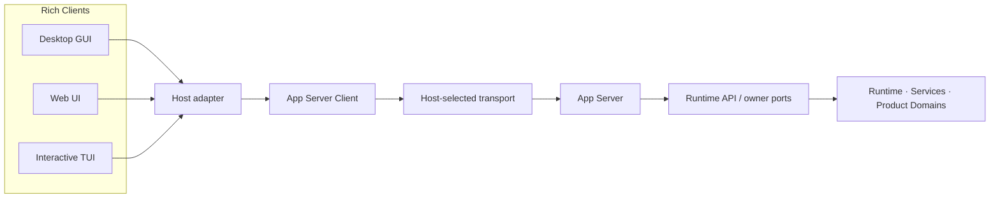
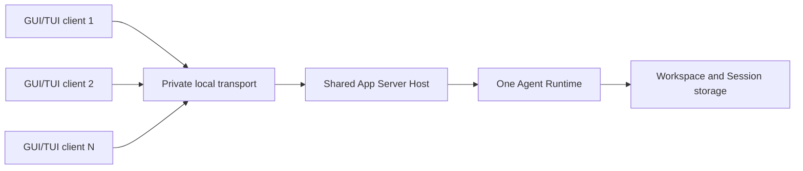

# App Server 架构设计

> 状态：Proposed target；关键决策与替换门槛尚待架构评审。
>
> 基线日期：2026-08-05。
>
> 本文记录 BitFun Rich Client 与产品后端之间的候选 App Server 边界，不是已批准的权威架构。具体 TUI 迁移阶段、接口盘点和当前缺口见
> [`tui-app-server-decoupling-refactor-plan.md`](../specs/plans/tui-app-server-decoupling-refactor-plan.md)；Agent Runtime 的进程、所有权和实例隔离见
> [`agent-runtime-deployment-design.md`](agent-runtime-deployment-design.md)；产品 owner 与分层依赖见
> [`product-architecture.md`](product-architecture.md)。评审完成前，当前调用路径以已接线代码和上述稳定架构文档为准。

## 1. Proposed decision

当前首选候选是用 App Server 统一第一方 Rich Client 的产品后端接口。它尚未批准；下列约束只描述该候选被选中后的目标状态：

- Desktop GUI、Web UI 和交互式 TUI 都是 App Server Rich Client。
- Rich Client 的 Embedded deployment 也必须经过 App Server；它创建同进程私有 App Server，并通过私有 in-memory transport 连接。
- Embedded 不表示直连 Runtime，也不要求独立后台进程、网络监听或跨客户端实例发现。
- Embedded 与 Shared 复用同一 App Server client、协议版本、method、DTO、类型化错误、能力发现、事件和取消语义。
- Embedded 与 Shared 只在 transport、App Server 实例所有权、客户端数量、连接治理和资源生命周期上不同。
- Headless CLI/CI、ACP、Peer Host 和公开 Agent SDK 不是 Rich Client，不因该候选被强制改用 App Server；它们继续使用各自经评审的 adapter。
- App Server 是协议适配层，不接管 Agent Runtime、Service 或 Product Domain 的业务所有权。

若选择该候选，不能用“Embedded 位于同一进程”作为 Rich Client 绕过 App Server 的理由，也不能用“统一 GUI/TUI 接口”把所有自动化和外部协议强制收敛到 App Server。

### 1.1 Alternatives under review

| 候选 | 结构 | 收益 | 成本与风险 | 采用门槛 |
| --- | --- | --- | --- | --- |
| A. App Server-first Rich Clients（当前首选） | Desktop、Web、Embedded/Shared TUI 复用一个 wire 与 typed client | 跨 Rich Client 合同和 fixture 最集中 | Embedded 编解码与 runtime/thread 成本；Desktop/Web 迁移面大；Shared 必须重新交付连接治理 | 真实 Desktop/TUI consumer、跨 transport parity、性能和安全门槛全部通过 |
| B. Deployment-specific product adapters | Desktop、Web、Embedded TUI、Shared TUI 各保留窄 adapter，共享 owner ports | 每个 Host 可按自身生命周期优化，迁移风险较低 | DTO、错误、恢复和行为 fixture 可能分叉；跨入口一致性需额外治理 | 证明长期重复成本低于统一 wire 成本，并建立跨 adapter 行为合同 |
| C. Shared Runtime use cases with separate wires | 提取稳定用例/结果，Embedded 使用 Rust adapter，Shared 保留 v17 或后继 wire，Web 使用 App Server | 业务语义集中，同时允许 deployment-specific framing、安全和性能 | 需要清晰区分 use-case DTO 与 wire DTO；client 不能假装同一协议 | 证明共享 use case 不泄漏 Runtime 实现，并分别验证每条 wire 的故障语义 |

评审可以选择 A、B、C 或其受限组合。已有 `TuiBackend`、App Server 和 v17 是评估证据，不自动决定最终架构。

### 1.2 Costs of the preferred candidate

- Embedded Rich Client 需要承担 App Server client/server、JSON-RPC 编解码、事件队列和专用 runtime/thread 的启动、内存与延迟成本；必须以基准证明该成本可接受。
- 迁移期会同时维护 App Server 与 Runtime IPC v17 两条 wire；新增核心用例需保持 `TuiBackend` 行为等价，不能让双写期形成两个业务 owner。
- Shared App Server 需要重新交付 v17 已有的 framing、方向性 limits、鉴权、实例身份、controller/lease、断连取消、未知结果和空闲退出，不能只复用 method/DTO。
- Desktop 迁移必须划清 controller-local capability、Tauri 生命周期和工作区 Host capability；Web/Remote 扩展还需要独立的认证、授权和多租户资源治理。

### 1.3 当前实现状态

目标架构与已交付能力必须分开描述：

| 范围 | 当前状态 | 目标 |
| --- | --- | --- |
| Embedded TUI | 已创建私有 `BitfunAppServer`，通过 in-memory transport 连接 `AppServerClient` | 完成剩余管理面迁移和行为等价验证 |
| Shared TUI | 仍通过私有 Runtime IPC v17 连接独立 Runtime Host | App Server Shared transport 达到可靠性等价后迁移 |
| Desktop GUI | 主要仍使用 Tauri command 和桌面事件投影 | Tauri 收窄为 Host adapter，产品请求统一进入 App Server |
| Web Host | 当前 Server 已组装 Embedded Runtime，WebSocket 直接承载 `BitfunAppServer`；仅适用于 loopback 单用户模式 | 补齐连接身份、作用域绑定和 Host allowlist 后才能扩展部署范围 |
| App Server protocol/client | 已拆为 behavior-light crate，已有版本、能力、限制、错误和部分事件恢复类型 | 补齐 Host 注入能力、可靠性语义及跨 transport 合同测试 |
| App Server server | 已注册 app、agent、session、permission、TUI/workspace、git、config 和 i18n handler | 按真实 owner 和 Host 装配收窄能力，不以已存在 DTO 代替可用性证据 |

Shared TUI 继续使用 Runtime IPC 是当前 compatibility boundary。只有候选 A 获批且替换门槛通过后，才迁移或删除该 IPC；候选 B/C 可能将 private v17 或后继协议保留为受控的长期物理 wire。

### 1.4 Decision and replacement gates

在满足下列门槛前，不得把候选 A 标记为 approved，也不得用 Shared App Server 替换 v17：

| 门槛 | 必需证据 |
| --- | --- |
| Framing 与 limits | request/response/event/attachment 的方向性上限、无界分配防护、慢 client/backpressure 和超限结果均有跨 transport 测试 |
| 身份与作用域 | 实例身份、每连接认证、user/product/workspace/execution-domain 绑定和 method allowlist fail closed |
| Controller 与 Session 单写 | controller/observer/lease、断连隔离、跨进程 Session writer 冲突和转移规则有 owner-level 决策与竞争测试 |
| 事件恢复 | 明确 snapshot/replay owner、连接内 cursor、跨连接是否持久化、lag/closed/invalidation 和 resync 行为 |
| 取消与未知结果 | disconnect/shutdown 取消、迟到响应、operation identity、`outcome_unknown` 查询/恢复和禁止盲重试 |
| Host capability | Desktop local effect 与工作区 capability 边界、provider 注入、Remote unsupported 和 Web/Remote auth 已定稿 |
| 生命周期与性能 | discovery、startup、idle exit、crash cleanup、延迟、吞吐、内存和 Embedded thread/runtime 成本有预算与测量 |
| 迁移与回滚 | 同一第一方 consumer 完成 opt-in 双栈 parity；升级/降级和 v17 rollback 可重复验证；删除条件有明确 owner 批准 |

## 2. 问题与目标

GUI、Web 和 TUI 若分别围绕 Tauri command、WebSocket route、CLI/Core 直连维护产品接口，会产生以下问题：

- 同一用例出现多套 DTO、错误码、默认值和字段归一化。
- 某一入口完成权限、取消或远程工作区支持，其他入口仍静默缺失。
- 事件被不同 Host 投影后丢失身份、顺序或恢复信息。
- UI 组件与 Tauri、Core singleton 或私有 Runtime IPC 绑定，无法验证跨入口行为等价。
- “handler 已存在”“DTO 已生成”或“能力被硬编码为 available”被误当成端到端能力已交付。

App Server 的目标是提供一个可版本化、可生成 client、可跨 Embedded/Shared transport 验证的 Rich Client 合同，同时保持业务 owner 平台无关。它统一的是产品后端行为，不统一 GUI/TUI renderer、布局、键位、窗口、终端或 controller-local effect。

## 3. 范围与非目标

本文范围包括：

- Rich Client 的请求、响应、notification、错误、取消和恢复合同。
- Embedded、Shared 和 WebSocket Host 的 transport 与生命周期边界。
- Host 能力、transport limit、身份和执行域的协商。
- Desktop/Tauri、Web 和 TUI 的接入规则。
- App Server crate、Runtime owner 和产品装配之间的依赖方向。

本文不负责：

- 迁移 Runtime owner、重写 Session/Turn/Permission/MCP 等业务实现。
- 把 App Server 变成通用 Core RPC、Tool RPC 或任意内部函数调用协议。
- 强制 Headless CLI/CI、ACP、Peer Host 或公开 Agent SDK 使用 App Server。
- 统一 GUI 与 TUI 的状态机、renderer、布局、主题键或键位模型。
- 把 WebSocket transport 宣称为已具备多用户或公网安全性的公开 API。
- 不允许临时兼容路径在没有明确决策、维护责任、版本规则和退出条件的情况下意外变成永久协议。若最终选择候选 B/C，应把保留的 Shared wire 明确定义为正式的部署专用协议，而不是继续称为临时兼容路径。

## 4. 术语

| 名词 | 含义 | 不等于 |
| --- | --- | --- |
| App Server | 将版本化 Rich Client wire 映射到 Runtime API、Service 和 Product Domain owner 的协议适配层 | 业务 owner、通用 RPC 总线、必然独立的进程 |
| App Server Client | 只依赖 wire contract、由 Host 提供 transport 的类型化客户端 | Runtime SDK、Server 构造器、UI 状态 owner |
| Rich Client | 需要持续会话、交互事件和产品管理面的第一方 GUI/Web/TUI | Headless automation、ACP、公开 SDK |
| Host | 组装 App Server、选择 transport、注入能力并管理生命周期的产品入口 | 新业务层、普通用户必须管理的 Server 产品 |
| Embedded App Server | 与 Rich Client Host 位于同一 OS 进程的私有 App Server 实例 | Runtime 直连、网络 Server、共享后台进程 |
| Shared App Server | 由独立本机 Host 承载、允许多个已认证第一方 client 使用的 App Server 实例 | 公网 API、Agent SDK Host、每个 client 一个 Runtime |
| Runtime owner | 持有 Session、Turn、Permission、Tool/MCP、Hook、事件和持久化事实的既有模块 | App Server handler 或 UI read model |
| Host capability | 当前 Host 确实组装并允许调用的产品能力 | schema 中存在的方法全集 |
| controller-local effect | 剪贴板、外部编辑器、终端 raw mode、窗口和本地导出等只属于控制端的行为 | 工作区或 Runtime 能力 |

## 5. 逻辑架构



依赖和调用方向始终从入口流向 owner。Host 负责 transport 认证、连接作用域、capability/allowlist 和平台能力；App Server handler
负责 method 合同校验、handler 注册、DTO 转换和 Runtime/domain error 到 wire error 的映射。业务一致性、权限上限、持久化和权威状态
仍由对应 owner 提交。

### 5.1 四层合同

| 层 | 负责 | 不负责 |
| --- | --- | --- |
| 行为合同 | 用例语义、状态转移、权限、幂等/重试、错误、事件和恢复条件 | transport framing、UI 展示 |
| Wire 合同 | method、DTO、版本兼容、类型化错误和 notification envelope | Runtime 内部类型、Host 句柄 |
| Host 合同 | transport、可用能力、限制、身份、作用域、生命周期和 controller-local provider | 复制业务规则或权威状态 |
| Owner 合同 | Runtime/Service/Product Domain 的业务事实、校验和提交 | JSON-RPC、Tauri、WebSocket、Ratatui |

行为合同是 Embedded 与 Shared 等价的核心。仅复用 JSON 字段但在断连、超时、事件落后或权限上表现不同，不算统一 App Server 接口。

## 6. Embedded deployment

Embedded Rich Client 的标准路径是：

```text
Rich Client
  -> Host adapter
  -> AppServerClient
  -> private in-memory transport
  -> private App Server instance
  -> Runtime API / owners
```

Embedded Host 必须：

1. 组装 Runtime 和 App Server，并将同一 owner 的端口注入 server。
2. 创建方向固定的私有 in-memory transport pair。
3. 通过正式 App Server Client 完成 initialize、请求、事件和 shutdown。
4. 保证 server task/thread 在 Host 退出时被取消并回收。
5. 使用与 Shared 相同的 schema、错误和行为测试。

Embedded 可以省略只对跨进程多客户端有意义的机制：endpoint discovery、进程 token、外部实例锁、多客户端 controller lease 和空闲后台退出。省略这些机制不能改变请求结果、事件顺序、取消结果或 capability 语义。

进程内 transport 仍可能执行 JSON-RPC 编解码。该成本是候选 A 必须测量的工程取舍；只有基准、资源预算和真实 consumer 证明可接受后，
才能把强制经过 App Server 作为批准约束。允许评估 transport buffer、生成代码和批量事件优化，但不能用未经验证的性能假设提前排除候选 B/C。

## 7. Shared deployment

Shared deployment 由一个本机 App Server Host 承载一个 Runtime owner，多个第一方 Rich Client 通过受控 Pipe、UDS 或等价私有 transport 连接：



Shared Host 在基础 App Server 合同之外必须提供：

- 安全 endpoint discovery、实例身份和同用户认证材料。
- initialize-first 握手、协议版本和 client identity 校验。
- workspace、用户、产品和 execution domain 绑定。
- 连接数、请求队列、事件队列和 frame 大小上限。
- 每个 Session 的 controller/lease、冲突和转移规则。
- 断连时取消连接拥有的活动操作，并隔离未完成清理的 lease。
- 有序 writer、并发 reader、背压和慢 client 失效策略。
- 无客户端且无活动任务时的受控空闲退出。
- 副作用请求在超时或断连后的 `outcome_unknown` 结果。

当前 Runtime IPC v17 已具有 128 KiB request、8 MiB response/event、token、实例身份、controller/lease、断连取消、有界事件流、`outcome_unknown` 和空闲退出等合同。在 App Server Shared transport 逐项获得等价测试前，该 IPC 可以作为 Shared TUI 的兼容 adapter 保留；不得先切换 transport 再以功能回退换取表面统一。

## 8. Desktop GUI 与 Tauri

Desktop 的目标调用路径是：

```text
React UI
  -> frontend infrastructure / generated App Server client
  -> Desktop Host transport adapter
  -> Embedded or Shared App Server
```

Tauri 继续拥有窗口、菜单、系统托盘、文件选择器、剪贴板、通知和进程级生命周期。Session、Turn、Workspace、Permission、Config、MCP、Skill、Hook 等产品后端能力必须迁入 App Server。

迁移规则：

- UI 组件不得直接调用 Tauri API；调用进入前端 infrastructure/adapter。
- Tauri command 若只承载产品后端用例，应由 App Server method 替代并逐步删除。
- 必须由桌面原生 API 完成的 client-local capability 保留 Host-native 实现；需要与工作区或 Runtime 交互时拆成 App Server 数据流和本地 effect 两段。
- Tauri event bridge 只能投递 App Server typed notification 或桌面专属事件，不能形成第二套 Runtime 事件语义。
- Desktop Host 可在 Embedded 与 Shared 之间切换，但 UI 和生成 client 不包含 Runtime 直连分支。

## 9. Web 与远程 Host

WebSocket 是 App Server 的一种 transport，不是另一套业务 API。Web Host 必须使用同一 method、DTO、错误和事件合同，同时根据部署场景构造显式 capability allowlist。

当前 WebSocket Host 只适用于单用户、loopback、受控 Origin 场景。Origin allowlist 和 loopback bind 不能替代以下安全机制：

- 每连接认证和不可伪造的 client identity。
- 用户、workspace、产品和 execution domain 的作用域绑定。
- method/capability allowlist 与 owner 级授权。
- permission context、审计身份和撤销。
- 连接、请求、frame、事件速率和资源配额。

在这些机制交付并验证前，不得把当前 WebSocket Host 暴露到不可信网络、多用户部署或公开 SDK。Remote workspace 的 Runtime、凭据、文件和进程必须位于目标执行域；Host 不得在远端能力缺失时静默回退 controller 本机。

## 10. 能力发现与 transport limits

`app/initialize` 返回的是当前连接实际可用的能力和 transport 限制，不是 protocol crate 中所有 DTO 的静态清单。

能力状态由 Host 根据以下事实构造：

- 产品组装结果和 delivery profile。
- 当前注入的 Runtime/Service/Product Domain provider。
- transport、平台和远程执行域的支持程度。
- 用户、组织和连接级策略。
- provider 健康与当前降级状态。

规则如下：

1. 只有生产 handler、provider、授权和行为测试都存在时，能力才可标记为 `Available`。
2. 不可用能力保留稳定 ID，并返回类型化 `Unavailable { reason }` 或 `unsupported`，不能静默回退旧路径。
3. Host 未注入 provider 时不得因 handler 或 DTO 存在而宣传能力，例如 context reload。
4. transport limits 必须反映当前连接的真实限制；不能把 server 内部默认值宣传为所有 transport 的通用事实。
5. method 级 allowlist 必须是 capability 声明的子集，fallback handler 不能扩大可调用面。

当前实现中通用 App Server 初始化声明 16 MiB frame，而 WebSocket Host 接收上限为 256 KiB，Shared Runtime IPC 又区分 128 KiB request 与 8 MiB response/event。目标合同需要表达方向和 transport 的真实限制；在扩展 schema 前，Host 至少必须返回不超过底层 transport 的有效上限。

## 11. 事件、恢复与取消

权威 Runtime 事件通过同一 App Server connection 以 typed notification 发送。Host 不得让 client 绕过 App Server 直接订阅 Core `EventQueue`，也不得用有损 frontend projection 替代权威事件流。

每个事件流至少需要：

- 稳定 stream identity。
- 单调 sequence/cursor。
- 与 Session、Turn、request 和 execution domain 的关联身份。
- `closed`、`lagged`、`invalidated` 和 `recoverable` 的明确区分。
- snapshot/sync 或要求重新装载 Session 的恢复指令。

client 落后、frame 超限或连接中断时不能假装事件完整。可恢复流从 server 确认的 cursor/snapshot 继续；不可恢复流进入 invalidated，UI 必须停止基于旧 read model 提交依赖状态的新操作，直到 resync 完成。

取消属于行为合同：

- 每个活动请求和长任务具有稳定 request/operation identity。
- client 取消、Host shutdown 和连接断开映射到对应 owner 的取消路径。
- Shared Host 只取消该连接拥有的操作，不影响其他 controller 的独立任务。
- 取消完成与“取消请求已接收”必须区分；资源和 lease 仅在终态确认后释放。

## 12. 副作用、超时与重试

有副作用的请求必须携带可关联的 request identity，并由合同声明重试语义。若 client 在请求可能已提交后超时或断连，结果必须返回或投影为 `outcome_unknown`：

- `outcome_unknown` 默认 `retryable = false`。
- client 禁止盲目重试 create、submit、permission response、rename、delete 等 mutation。
- client 应先通过 request identity、Session snapshot 或 owner 查询确认结果，再决定恢复动作。
- 纯查询只有在合同声明幂等且不会扩大资源消耗时才可自动重试。

Embedded 虽然较少发生物理断连，也必须保留同一错误类型和 client 处理分支，确保切换 Shared 后不会改变产品行为。

## 13. 安全模型

App Server 是完整产品控制面，安全决策必须绑定到连接和业务作用域，而不是只信任 transport 地址。

| 维度 | 要求 |
| --- | --- |
| 连接身份 | initialize 前完成 transport 级认证；建立不可伪造的 connection/client identity |
| 实例身份 | Shared client 校验 discovery 得到的实例与握手返回一致，拒绝陈旧或替换实例 |
| 业务作用域 | 每个连接绑定 user、product、workspace 和 execution domain；请求不能通过 path 字符串越界 |
| 权限上下文 | permission request/response 关联 client、Session、Turn 和审计主体，Host 不能提高 owner 策略上限 |
| 能力暴露 | Host 使用显式 allowlist；未知方法和未装配能力 fail closed |
| 资源治理 | 连接、请求、frame、队列、并发、速率和任务生命周期有界 |
| 远程边界 | 凭据、文件、进程和 Runtime 留在目标执行域；禁止本地 fallback |

Embedded 的私有 transport 可以依赖同进程构造身份，但仍必须传递明确的 Host/connection context，不能让 handler 从全局环境猜测调用主体。

## 14. Crate 与所有权边界

| 路径 | 所有权 |
| --- | --- |
| `src/crates/interfaces/app-server-protocol` | behavior-light wire DTO、method、错误、事件 envelope 和角色定义 |
| `src/crates/interfaces/app-server-client` | transport-agnostic client、请求和 notification 分发 |
| `src/crates/interfaces/app-server` | server 生命周期、生产 handler 注册、wire/owner 转换和 Runtime 错误映射 |
| `src/apps/*` | Host 组装、transport、身份、capability/limit 构造、生命周期和平台能力 |
| `contracts/*`、`execution/*`、`services/*`、`assembly/core` | 稳定事实、Runtime 行为、具体服务和产品 owner |

边界规则：

- protocol/client 的依赖闭包不得引入 `bitfun-core`、Runtime 实现、Service 实现或 `product-full`。
- server wiring 可以依赖生产 handler 所需的明确 owner feature，但禁止选择 `bitfun-core/product-full`。
- 新 domain 只能增加真实 handler 所需的最窄 owner feature，并通过边界检查证明依赖方向。
- protocol DTO 不复制 Runtime 内部对象；只暴露 Rich Client 需要的稳定字段和 read model。
- transport 实现留在 Host/adapter 边界，generic role/transport helper 保持 schema-free。
- App Server 不持有第二份 Session、Permission、Config 或 capability 权威状态。

## 15. 迁移顺序

迁移按行为闭环推进，不按 method 数量推进：

1. **锁定合同基础**：稳定 protocol/client crate、版本、错误、能力、限制和事件 envelope；增加 Embedded contract test。
2. **完成 Embedded TUI**：所有交互式 TUI 产品请求经 `TuiBackend -> AppServerClient`；移除 Core、Runtime SDK、Service singleton 和 Runtime IPC 的 TUI-facing 依赖。
3. **迁移 Desktop GUI**：按 Session/Turn/Permission、Workspace、Config/MCP/Extension 等垂直切片迁移；每片完成后删除重复 Tauri DTO/handler。
4. **补齐 Shared 语义**：把 authentication、instance identity、controller/lease、framing、背压、断连取消、idle exit、event recovery 和 `outcome_unknown` 纳入 App Server Host/transport。
5. **评审 Shared TUI 迁移**：候选 A 获批且 1.4 节门槛通过后，才用同一 client/schema 替换 Runtime IPC compatibility adapter；旧 wire 仅在 rollback 窗口结束并获得 owner 批准后删除。若选择 B/C，则记录 v17 的长期 owner、版本和删除条件。
6. **收紧 Web Host**：由 Host 注入 allowlist、作用域和真实 limits；完成安全绑定前保持 loopback 单用户限制。
7. **删除旁路**：移除 Rich Client 的 Core/Runtime 直连、重复事件投影和无生产消费方的旧 route。

迁移期间不得在 App Server 返回 unsupported 后静默调用旧 Tauri/Core/IPC 路径。需要暂存旧路径时，必须由 Host 在启动时明确选择完整 adapter，且 UI 只看到一个 `TuiBackend` 或 frontend infrastructure 接口。

## 16. 验证与完成标准

### 16.1 必需验证

- protocol serialization、版本上下界、未知字段和类型化错误合同测试。
- 同一用例在 Embedded in-memory 与 Shared process transport 上的行为等价测试。
- Host capability/provider/allowlist 组合测试，以及真实 transport limit 测试。
- request identity、取消、断连、超时和 `outcome_unknown` 测试。
- 事件顺序、lag、invalidated、cursor/snapshot resync 和慢 client 测试。
- Shared authentication、instance identity、workspace/execution binding、controller/lease 和 idle exit 测试。
- Desktop GUI 与 TUI 对 Session、Turn、Permission、Workspace 和配置能力的跨入口等价测试。
- Cargo 依赖闭包和 `product-full` 禁止规则。
- TypeScript/Rust client 生成结果与 schema 一致性检查。

### 16.2 完成定义

若选择候选 A，只有同时满足以下条件，App Server Rich Client 架构才算完成：

1. Desktop GUI、Web UI 和交互式 TUI 的产品后端请求与订阅均经过 App Server。
2. Embedded 与 Shared 使用同一 client、method、DTO、错误和事件恢复合同，UI 不包含部署分支。
3. Shared transport 达到现有 Runtime IPC 的鉴权、lease、取消、背压、限制、失效和生命周期等价。
4. capability 和 limits 来自 Host 的真实装配与 transport，不再由通用 handler 无条件硬编码。
5. Rich Client 不直接依赖 Core singleton、Runtime SDK、Tauri 业务 command 或私有 Runtime IPC。
6. App Server handler 不持有业务权威状态，不复制 owner 校验和策略。
7. Remote workspace 和多用户连接具有明确身份、作用域、授权和 fail-closed 行为。
8. 重复 Tauri/Web/IPC DTO、旧 handler 和事件旁路已删除，或有明确的兼容期限与删除证据。
9. 上述合同、行为、安全、依赖和跨入口测试全部通过。

## 17. Proposed constraints and open decisions

### 17.1 Proposed target constraints

- 若候选 A 获批，Rich Client Embedded 必须经过私有 in-process App Server。
- Embedded 和 Shared 只有部署与连接治理差异，不产生第二套产品行为。
- App Server 只映射 owner，不成为 Session、Turn、Permission、Tool/MCP、Config 或事件 owner。
- Host capability 必须由真实装配、授权和 transport 共同决定。
- 事件丢失、断连和未知副作用结果必须显式可见，不能用轮询或盲重试掩盖。
- Headless CLI/CI、ACP、Peer Host 和公开 SDK 保持独立 adapter，除非另有经评审的真实消费需求。
- 一个 client、窗口、workspace 或 Session 不默认对应一个 Runtime 或 Plugin Host 进程。

### 17.2 尚待实现评审决定

- App Server limits schema 是否拆分 request、response、event 和附件/流式传输上限。
- Shared transport 最终复用现有 Pipe/UDS framing，还是在相同可靠性合同上采用新的 framing adapter。
- controller/observer/read-only client 的公开 capability 表达和转移 UX。
- 事件 snapshot 的 owner、粒度、保留窗口和 cursor 持久化策略。
- Desktop client-local capability 的请求方向：App Server 反向 request、Host provider port，或显式两段式工作流。
- Web/Remote 的认证凭据来源、刷新、撤销和多租户资源配额。

这些待决项会影响候选选择，不能被实现默认值或迁移进度替代。评审结论必须记录所选候选、拒绝其他候选的理由、门槛 owner、验证证据和回滚/删除条件；在此之前，当前 Embedded App Server 与 Shared v17 路径都保持有效。
