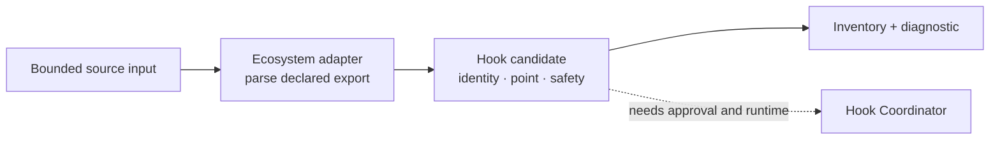
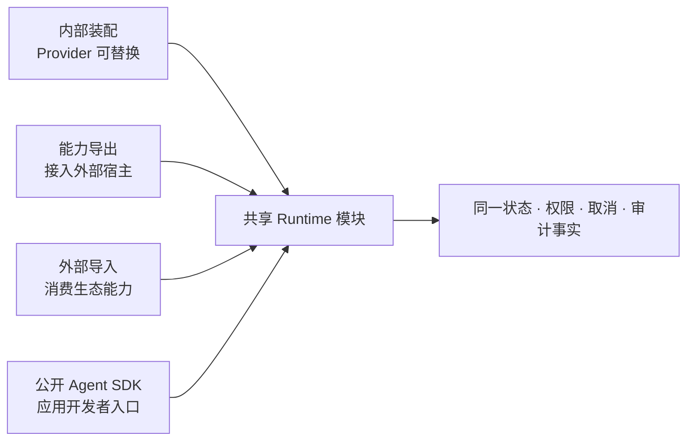

# BitFun 能力装配、导入导出与外部宿主集成设计

本文定义 BitFun 如何把记忆、上下文、工作流、Subagent、工具和调度策略做成可装配能力，以及这些能力如何在
不修改外部产品内核的前提下接入 OpenCode、Claude Code、Codex、Trae 等宿主。本文同时约束反向路径：外部
配置、插件和能力如何进入 BitFun。

仓库级依赖方向、接口边界和产品形态以[产品运行时架构](../product-architecture.md)为准；共享 Agent Runtime API、
运行时服务、工具和工作流归属见[智能体内核与运行时服务](../agent-runtime-services-design.md)；第三方进程可靠性见
[插件运行时与 Plugin Host](plugin-runtime-design.md)；外部来源的发现、确认和产品体验见
[外部 AI 工作内容](external-ai-work-sources-design.md)；OpenCode 的具体兼容承诺见
[OpenCode 扩展兼容总览](opencode-extension-compatibility.md)。公开 BitFun Agent SDK 的产品心智、SDK Host 和
各入口关系见[Agent SDK 产品与宿主架构](../agent-sdk-product-architecture.md)。

本文是目标设计和演进约束，不表示已存在一个通用 `CapabilityRuntime` crate、稳定公共 SDK、跨宿主插件包或下文
所有 Provider 接口。只有真实消费方、独立版本边界和端到端验证同时成立的接口才能进入公开面。

## 1. 设计结论、目标与非目标

BitFun 采用“一个能力核心，多种宿主适配”的方向，而不是试图发布一个能直接安装到所有产品的相同插件包：

1. **BitFun 内部装配**：产品组装选择已编译能力、Provider/factory 和能力上限；运行时能力归属模块使用不可变静态组装结果，并维护不可变的能力版本快照。
2. **外部能力进入 BitFun**：生态 adapter 保留外部来源、顺序和行为，再转换成 BitFun 能力专属贡献。
3. **BitFun 能力进入外部产品**：对外能力接口暴露少量明确操作，MCP、Skill、Plugin 或 Hook adapter 再映射到具体宿主；
   这条“能力导出”路径不同于使用公开 BitFun Agent SDK 构建完整 Agent 应用。
4. **以外部 Runtime 组装新产品**：Claude Agent SDK、Codex App Server、OpenCode Server 等可成为新产品的执行内核，
   但这不等于替换原 Claude Code、Codex 或 OpenCode 产品中的内核模块。

目标：

- 允许记忆、上下文贡献、压缩策略、工作流、Subagent 定义、工具提供方和部分调度策略独立替换或组合。
- 保持会话/轮次身份、状态提交、权限上限、取消、资源额度、事件因果和审计只有一个权威归属模块。
- 对外按宿主真实扩展面提供能力，不把 SDK 控制接口、产品插件和源码级定制混成同一兼容结论。
- 让每个阶段只交付一条可观察纵向路径；未实现项明确降级，不阻塞已完成能力。
- 用户可以理解能力来源、当前状态、覆盖关系、风险、成本和恢复动作。

非目标：

- 不定义跨 OpenCode、Claude Code、Codex、Trae 的通用插件 manifest 或 Hook ABI。
- 不建立一个可以定位任意服务、任意状态和任意生态对象的全局服务定位器。
- 不开放第三方代码替换权限归属模块、状态机、审计、取消树、资源硬上限或产品身份。
- 不设计跨 GUI/TUI 的通用组件协议，不承诺把外部原始 UI 组件树直接运行在 BitFun。
- 不承诺跨宿主完整迁移私有 transcript、文件系统快照、凭据、进程、终端或未文档化状态。
- 不复制完整 OpenCode Server、Claude Code 或 Codex 产品协议来证明插件兼容。
- 不为了覆盖竞品矩阵同时实现全部 Memory、Workflow、Hook、Subagent、Server 和 Remote 能力。

### Hook 静态视图与执行边界

静态识别只负责把宿主源码中可证明的声明转换为类型明确的候选，不能据此宣称 Hook 已受信任、可排序或可执行：



- 只有位于适配器已知声明位置、语义可静态证明的属性才能成为候选；动态属性、spread、普通字符串引用和通用事件
  payload 不被猜测成 Hook。
- 静态候选的 safety declaration 默认不完整，运行状态保持 unavailable；来源审批也不能自动把声明升级为可执行。
- 解析失败必须产生明确诊断，不能与“来源没有 Hook”等价，也不能回退到字符串扫描猜测贡献。
- adapter 只生成稳定、低基数的诊断分类；源码、路径、内容和 contribution identity 仅用于受限审计关联，不能成为
  metric label。纯映射不建立第二套日志或指标归属模块。
- 在真实执行消费者出现前，不预置 resolver、terminal decision、排序、冲突、override 或通用 Hook ABI；执行接入后仍由
  唯一 Hook Coordinator 负责顺序、deadline、取消、隔离和最终诊断。

## 2. 能力分类与可替换边界

“模块可拆卸”不等于“所有事实都可以被替换”。能力按下表分为实现、策略、贡献和内核事实：

| 领域 | 可装配或替换 | 必须由现有归属模块保持权威 |
|---|---|---|
| Memory | 存储实现、检索器、排序器、写入候选处理器、保留策略 | 记忆来源、使用范围、版本、删除/撤销事实、权限、审计和注入决策 |
| Context | 上下文贡献器、预算分配策略、相关性排序、压缩 Provider | 会话历史、当前轮次、禁止字段、最终上下文提交、token/成本事实 |
| Workflow / Harness | 工作流 Provider、计划、步骤和结果处理器 | Run 身份、状态转换、取消、恢复、产物引用和资源上限 |
| Subagent | 定义、角色、模型/工具候选、委派策略、结果聚合器 | 父子 lineage、权限上限、并发额度、取消传播、递归保护和结果交付 |
| Tool | 内置、MCP、插件和接口 Tool Provider；名称解析和展示可按明确规则组合 | 最终 schema 校验、调用时权限、执行身份、结果状态、产物和副作用审计 |
| Model routing | Provider adapter、候选排序、成本/质量偏好和失败回退策略 | 可用模型事实、组织上限、凭据归属、用量/成本记账和最终调用身份 |
| Scheduler | 优先级、权重、候选排序和公平性策略 | 是否允许执行、队列容量、硬并发上限、期限、取消和旧结果拒绝 |
| Hook / Event | 类型化变换器、验证器、Observer、Telemetry Processor | Hook 顺序规则、超时、最终状态提交、事件身份、因果链和保留策略 |

每类装配点必须声明一种组合语义，不能依赖一个全局优先级解释所有冲突：

| 组合规则 | 适用场景 | 规则 |
|---|---|---|
| 单选 | 主 Session Store、最终 Compactor 等只能有一个当前负责模块的能力 | 组装时选出一个 Provider；运行时不允许两个实现双写。 |
| 顺序执行 | Context Transformer、Prompt/Tool Hook、验证器 | 顺序由能力归属模块或生态 adapter 明确；每步校验，失败规则必须明确。 |
| 同名并存 | Tools、Commands、Agents | 按来源保留候选，再按名称和使用范围解析；同名不静默跨生态覆盖。展示顺序不自动决定胜者。 |
| 按既有顺序覆盖 | 现有 Skill 根 | 按现有 Skill 加载顺序解析同名项；被覆盖项继续可见。来源信息只用于解释结果。 |
| 失败回退 | Memory Retriever、模型 Provider、外部服务 | 只对声明为可恢复的错误切换；权限拒绝、取消和副作用不自动切换。 |
| 结果汇总 | 只读事件 Observer、运维遥测 | 各 Observer 互相隔离；不能阻塞或改变业务结果。 |

新增组合规则的门槛：

1. 已有一个权威归属模块和真实调用路径。
2. 出现第二个真实实现或外部消费者，现有结构已经无法清楚表达。
3. 已定义组合、错误、取消、状态、权限、降级和退场语义。
4. 可以用一条纵向测试证明替换后没有第二个状态归属模块。

因此不会先创建 `MemoryProviderRegistry`、`ContextProviderRegistry` 等一整套公共对象，再等待未来调用方填充。

## 3. 逻辑架构与双向数据流

### 3.1 外部能力进入 BitFun


### 3.2 Runtime 内部提交


### 3.3 BitFun 能力进入外部宿主


这些图只表达职责关系，不要求新增一个大而全的运行时服务。对应职责继续分布在现有归属模块：

当前 GUI、TUI/CLI、Server 和 Remote 通过各自 adapter 消费产品组装后的 Agent Runtime API、能力服务、只读视图或
Runtime 接口，不经过对外能力接口，也不经过公开语言 SDK package。公开 SDK 尚未交付；目标态由 SDK Host adapter
调用同一 Agent Runtime API，而不是让现有入口改为依赖 Python/TypeScript package。
只有某个具体 DTO 同时出现真实内外部消费者并满足独立版本要求时，才评审
共享该 DTO；不能让内部入口与外部宿主共享全部内部接口。

| 部分 | 负责 | 不负责 |
|---|---|---|
| 能力归属模块 | 定义稳定事实和组合规则，在静态产品上限内解析动态候选、冲突与当前策略，完成最终校验并提交唯一的当前能力版本 | 解释外部产品格式、重新选择 Delivery Profile、修改产品定义或管理 UI。 |
| Product Assembly | 选择已编译 Provider/factory 和受支持的组合规则、验证依赖与产品上限、生成静态产品组装结果 | 发现动态用户来源、执行插件、保存当前能力版本或成为运行中可变注册表。 |
| 生态导入 adapter | 保留单一生态的来源、格式、顺序、错误和生命周期语义 | 定义跨生态最低公分母或直接提交 BitFun 权威状态。 |
| PluginRuntimeClient | 当前监督第三方调用的期限、同一插件串行调用、重复请求结果、响应校验与故障诊断；目标再增加队列上限、取消后的结果失效和旧连接结果拒绝 | 成为物理进程、插件生命周期归属模块、公共 SDK、来源优先级归属模块或产品能力归属模块。 |
| 对外能力接口 | 暴露真实消费者需要的窄用例、只读状态、事件和明确错误 | 暴露内部 manager、插件内部 ABI、任意服务查找或产品 UI。 |
| 外部宿主 adapter | 把这些接口映射为某宿主的 MCP、Skill、Plugin、Hook、SDK 或 Server 调用 | 声称突破宿主未提供的生命周期、状态或替换能力。 |

当前外部 Subagent 输入切片落实了上述边界：`contracts/product-domains` 只定义来源无关的 Subagent contribution、
来源、兼容状态、摘要和冲突契约；OpenCode adapter 独立维护本生态来源与字段语义；`ExternalSourceControlPlane` 隔离 provider
失败并发布不可变候选；现有 AgentRegistry/Task 归属模块再解析模型、工具、权限上限和同名路由。产品主体不读取
OpenCode 类型，也不通过统一 agent JSON 理解未来 Codex/Claude Code。

新的外部 Subagent 调用在执行前取得现有运行租约，固定 `runtime_agent_key` 和模型绑定；前台或后台调用
都持有该 lease 到结束。来源更新或撤下只改变后续调用，已接受调用继续使用启动时固定的 prompt/model/tool；安全策略收紧
仍由现有归属模块按原规则优先执行。当前外部 Subagent 不支持 session follow-up，结果与管理界面必须明确标为 single-run，
不能用持久化 session 绕过重新审批或重新解析当前来源。

当前外部来源控制能力进一步落实了内部宿主共享边界：Command、Tool、Subagent、MCP 的调用内容、审批与冲突仍归各自
归属模块；`ExternalSourceControlPlane` 只统一有限的来源刷新、provider 隔离和旧结果拒绝；
`ExternalSourceControlSnapshotV1` 只包含 discovery/desired/review/runtime/support、Host 能力、诊断和恢复动作。
Desktop、TUI 和 Peer 发送同一组固定控制动作，Server 只返回相同 DTO 的只读视图。该 DTO 是当前产品宿主契约，
不是公共插件 SDK；没有独立仓库外消费方和版本策略前，不扩张为外部宿主 adapter 的通用接口。

对外能力接口不等于公开 BitFun Agent SDK。前者只为一个外部宿主暴露当前场景需要的最小能力子集；后者通过
`AgentClient`、`client.query()`、Session、Query、只读 Turn 事实、Tool/MCP、Permission、Hook 和 Event/Result
提供完整 Agent 应用心智，并通过 SDK Host
调用同一 Agent Runtime API。外部产品只需要调用一个 BitFun workflow 时，不应被迫嵌入完整 Agent Runtime
或公开 SDK。

### 3.4 宿主 adapter 的产品交付生命周期

每个实际交付的外部宿主集成都必须指定一个现有产品特性或产品入口负责；在首个集成出现前，不创建跨宿主安装器、
manifest、插件商店或通用生命周期 manager。外部宿主/包管理器仍是物理安装状态的权威来源，BitFun 只保存自己的
期望状态、宿主映射和对账结果，不伪造“已安装/已卸载”。外部宿主 adapter 负责把以下操作映射到单一宿主，但不保存
第二份权威状态：

- 分发单元和校验版本，以及用户/组织/工作区/项目的注册使用范围。
- `install/register -> enable -> invoke -> disable -> uninstall -> restore` 的可观察结果和类型化错误。
- 升级前兼容检查、失败后沿用上一合规版本或显式回滚；不把准备完成当成已生效。
- `disable` 先阻止 BitFun 发起的新调用并撤下宿主贡献；若宿主仍报告生效，状态保持需处理而非静默成功。
- `uninstall` 只清理该 adapter 拥有的包、注册项、随附本地进程、缓存和凭据引用；删除用户或宿主数据需要单独确认。
- BitFun 被移除、宿主升级或 adapter 崩溃后的恢复/清理入口，以及无法自动清理时的精确人工步骤。

能力归属模块继续只负责用例和权威运行时事实；`PluginRuntimeClient` 当前负责调用路由、期限、同一逻辑实例串行化、
重复请求结果缓存、响应校验、诊断和故障暂停，实际第三方
JS/TS 代码由 Plugin Host 执行。两者都不接管外部宿主的分发生命周期。

## 4. 身份、状态与持久化

### 4.1 身份

跨宿主调用至少需要区分以下身份事实；字段名称仅说明语义，不提前固定公共 DTO：

- 能力身份：稳定 Capability ID 与能力契约版本。
- Provider 身份：实现 ID、来源限定身份和内容版本；跨版本保持可追踪。
- 调用绑定身份：能力版本和执行域，用于拒绝旧版本的迟到结果，不并入稳定 Provider 身份。
- 来源、配置和策略的适用范围由各自归属模块单独表达；产品、用户、组织、工作区、项目、会话和单次运行不得被压成一个通用 `scope`。
- 执行身份：本地/Remote 执行域、实际用户、工作目录和平台能力。
- 运行身份：session、turn、workflow run、subagent、tool call、hook call。
- 宿主映射：BitFun 身份与外部 host session/thread/task/tool-use ID 的可选映射。

外部 ID 只能作为映射事实，不能取代 BitFun 自己的 session/turn/run 身份。一个 Claude/Codex/OpenCode session
映射失败时，可以降级为无恢复的一次调用，不能伪造已建立双向持久会话。

### 4.2 状态权威

同一能力需要区分以下事实，避免“文件被发现”直接变成“能力可用”：

```text
desired     用户、产品或组织希望启用什么
prepared    哪个候选已经完成解析、依赖准备或隔离加载
active      当前新调用绑定哪个不可变版本
effective   结合产品上限、权限、宿主能力和健康后真正可调用的结果
observed    UI、SDK 和遥测看到的只读视图
```

- 每个事实只有一个归属模块；其他模块通过命令或提案请求变更，通过只读视图消费结果。
- Adapter、Plugin、Hook 和外部 SDK 客户端不能直接写 `active/effective`。
- UI 隐藏、宿主菜单缺失或插件配置未加载不等于后端能力已停用。
- 一级用户状态继续复用外部来源文档中的“已发现、已应用、可用、需确认、更新中、沿用上一版本、部分受限、
  暂时过期、已移除/已停用、不可用”，内部 `ready/draining/restarting` 只作为详情。

### 4.3 能力版本与迟到结果

每次可执行来源、动态 Provider 集合或关键运行时策略变化，由对应能力归属模块或 `ExternalSourceControlPlane` 生成候选
版本；这不是重新执行 Product Assembly，也不把动态来源加入产品组装输入：

1. 在后台解析、准备并验证候选。
2. 比较 Provider、权限、运行条件、事件和可见贡献差异。
3. 由该能力的归属模块一次提交新版本，并让后续调用使用它。
4. 已开始的调用继续使用启动时的版本，按原期限完成或被取消。
5. 已停用版本的迟到响应会被拒绝，不得写入新状态。

明确删除、撤销、停用或权限收紧必须阻止新调用并撤下旧贡献；候选升级失败只有在旧版本仍健康且符合当前
策略时才能继续服务。缓存是恢复手段，不是绕过用户意图或安全策略的授权。

上述后台准备只适用于不会执行第三方代码的步骤。Plugin Host 更新必须遵循
[`plugin-runtime-design.md`](plugin-runtime-design.md#43-更新与安全重启)：旧 Host 运行时只做静态检查和依赖准备；
确认旧进程树停止后才加载新代码，因此不会让旧调用跨越 Plugin Host 更新继续执行。

### 4.4 持久化与 fork

- Session transcript、文件系统、终端、进程、外部服务和凭据是不同状态域，不能因为会话可 resume/fork 就宣称
  工作空间已经快照或回滚。
- Provider 持久化必须记录 schema/version、来源、适用范围、运行版本和删除语义；禁止多个 Provider 双写同一事实。
- Memory 条目必须保留 provenance、使用范围、创建/更新时间、失效/删除状态和可选置信信息；压缩摘要不能覆盖原始
  权威 transcript。
- Remote 断线后先重新协商执行域、宿主能力和当前能力版本，再恢复调用；不得静默回本机执行。

## 5. 生命周期、并发、取消与重试

### 5.1 分层预算

并发额度形成包含关系，而不是每个模块自行维护无关计数：

```text
产品/进程预算
  -> 实际执行宿主/安全主体预算
    -> Session / Workflow Run 预算
      -> Subagent / Provider 预算
        -> Tool / Hook 调用预算
```

内核负责判断能否执行，并控制队列容量、期限、取消和硬上限；外部 Scheduling Policy 只能在已允许执行的候选中排序、分配
权重或建议公平性。具体默认数值必须由第一个端到端切片测量后确定，不在设计文档中预设。

最低要求：

- 所有队列有界；过载返回稳定错误和建议，不无限等待或无限创建后台任务。
- 交互调用和后台工作分开预算；插件健康检查不能与长工具调用共用唯一通道。
- 公平性至少防止单个来源、provider、workflow 或 subagent 长期饿死其他会话。只有某个归属模块确实按工作区维护并发状态时，
  工作区才增加为该模块的局部预算维度，不能成为通用运行时或进程复用键。
- 外部宿主无法表达 BitFun 的并发策略时，由 BitFun 侧收紧，不把宿主“已接受”当成已获得本地资源。

### 5.2 取消树

取消从产品操作向 session/turn、workflow step、subagent、tool/hook、worker 传播。每层必须返回以下之一：

- 已在副作用前取消。
- 已请求取消，但外部副作用可能已经发生。
- 不支持协作取消，已隔离或终止执行单元。
- 已完成，取消到达过晚。

外部宿主 adapter 必须把宿主 `AbortSignal`、turn interruption 或 session stop 映射到同一取消树；映射能力缺失时显示
明确降级，不能让 UI 先显示“已取消”而后台继续无限运行。

### 5.3 重复请求与重试

- 查询、健康检查和明确允许重复执行的准备步骤可以在有限次数等待后重试。
- 工具写入、发送消息、删除、支付、发布、外部变更和未知副作用默认不自动重放。
- 每次调用带稳定请求身份和当前能力版本；接收方用请求身份去重，但不承诺跨所有外部系统只执行一次。
- `process-lost`、网络断开或宿主超时只说明结果未知，不能直接推导为“未执行”；当前独立脚本 worker 可以继续使用
  已有的 `worker-lost` 窄错误码。
- 失败回退不能绕过权限拒绝、用户取消、组织上限或明确不支持。

## 6. 冲突识别与确定性解析

必须分别识别以下冲突，而不是统一显示“插件冲突”：

| 冲突 | 例子 | 处理 |
|---|---|---|
| 来源冲突 | 用户/项目/组织层给出不同值 | 由对应生态 adapter 保留其正式来源顺序。 |
| 身份冲突 | 不同来源声明相同插件 ID | 管理身份保持来源限定，不合并启停和更新状态。 |
| 组合冲突 | 两个主 Memory Store 或 Compactor | 按单选或失败回退规则选择；未决时不激活。 |
| 名称冲突 | 外部 Tool 与内置 Tool 同名 | 保留各来源候选；生态内按官方规则，跨生态或本地按内容摘要选择。 |
| 行为冲突 | Hook 顺序、并行或错误策略不同 | 导入语义由对应生态导入 adapter 保留，导出语义由对应外部宿主 adapter 保留；二者只共享能力归属模块提供的明确事实，不共享生命周期或状态模型。 |
| schema/版本冲突 | 新字段、事件或 Tool schema 不兼容 | 版本协商并局部降级；未知写入不执行、不伪造成功。 |
| 权限冲突 | Hook 允许但组织策略拒绝 | 最终有效权限取上限交集；拒绝不能被低层放宽。 |
| 资源冲突 | Provider 超出并发、token 或进程额度 | 拒绝或排队；不靠插件优先级抢占安全额度。 |
| 能力版本冲突 | 旧调用结果覆盖新状态 | 每次调用携带能力归属模块的当前版本；版本不匹配时拒绝结果。 |
| UI 冲突 | 键位、Route、Panel、Dialog 重名 | 由对应 GUI/TUI 入口解析，并提供可退出的替代路径。 |

解析结果应形成只读 Resolution Report，最小包含能力、适用范围、候选来源/版本、组合规则、最终顺序或选择、被拒绝/
降级原因、有效权限上限和恢复动作。报告只解释现有状态，不保存新的权威状态。

需要用户选择时，内容摘要包含“能力 + 逻辑名称 + 全部候选身份与内容版本 + scope”。内容摘要未变不重复询问；候选集合、
内容版本、执行位置或权限范围变化后重新检查。产品保护项只限身份、数据隔离、权限入口、故障恢复、升级/卸载完整性
和法律要求，不能把所有内置能力设成不可覆盖。

同名候选在 GUI/TUI 中固定先展示 BitFun 来源，其余生态按稳定 `provider_id` 排序，同一生态内部沿用 adapter 的
正式来源顺序。这个顺序只用于减少阅读成本；用户未选择时仍保持冲突未决，不能把“BitFun 排在第一”误实现为静默激活。

## 7. 权限、信任与执行边界

权限检查分成五个不同阶段：

1. **来源许可**：来源是否允许被发现、读取和进入候选清单。
2. **准备与 import 权限**：是否允许安装依赖、读取凭据、联网、启动进程或 import 第三方代码。
3. **贡献注册**：动态发现的 Tool、Hook、Agent 或界面贡献是否允许进入有效集合。
4. **调用时决策**：具体 session/turn/agent 在当前参数和 effect 下是否允许执行。
5. **真实执行隔离**：OS、容器、Sandbox、Remote 执行域和宿主权限实际上能限制什么。

这些阶段不能互相替代。来源已批准不表示每次工具调用都允许；Tool permission 已允许也不能证明插件直接使用脚本
运行时产生的文件、网络或子进程副作用已经被拦截。

有效权限是以下上限的交集：

```text
已编译能力 ∩ 产品能力上限 ∩ 组织策略 ∩ 用户有效授权 ∩ 当前执行域可执行限制 ∩ 宿主约束
```

- 任一层拒绝都不能被 外部宿主 adapter、Hook、Provider 或用户级配置放宽。
- 外部能力进入 BitFun，或外部宿主调用 BitFun 能力时，宿主 allow/ask/deny、Hook 合并和审批顺序由 adapter 保留，
  有效权限仍不能放宽 BitFun 上限。BitFun 插件参与宿主自身 Tool/Agent 流程时，宿主负责其状态和最终权限；
  BitFun 只能在自己发起或执行的调用内进一步收紧，不能宣称接管宿主权限。
- 凭据只通过归属模块管理的引用和最小使用范围代理，值不进入插件状态、事件、日志、Resolution Report 或公共 DTO。
- 凭据引用必须支持过期、轮换和撤销；来源停用、scope 收窄或执行域变化后不能继续复用旧代理。
- Memory/Context 输入标记 provenance、隐私级别和使用范围；外部内容默认按不可信数据处理，防止提示注入和记忆污染。
- 第三方包记录来源、固定版本、内容摘要、依赖和安装行为；签名或产品内置身份不绕过运行时权限和故障隔离。

## 8. 事件、打点与日志、指标和诊断

事件与“产品打点”分为三类：

| 类型 | 用途 | 是否能影响控制流 |
|---|---|---|
| 领域事件 | Session、Turn、Workflow、Subagent、Tool、Permission 和能力版本变化 | 只有对应归属模块认可的消费者可以影响控制流。 |
| 运维遥测 | 延迟、队列、错误、资源、重试、降级、恢复、适配损失 | 不影响业务状态；用于诊断和容量。 |
| 产品分析 | 功能采用、漏斗、体验指标 | 必须受同意、脱敏、采样和保留策略约束，不能作为权威状态。 |

跨协议公开事件只有在真实 Server/SDK 消费方出现时才固定 schema。固定前至少需要以下语义：

- `event_id`、schema version、时间和同一流内 sequence。
- correlation/causation，用于关联 session、turn、workflow、subagent、tool 和 hook。
- capability、provider、source、运行版本、适用范围和执行域。
- outcome、类型化错误、是否可重试、是否可能已产生副作用。
- payload 或 artifact reference，以及隐私/脱敏分类。

外部来源控制错误已经统一提供 `code/stage/retryable/correlation/causation/recoveryActions`，供 GUI、TUI、
Peer 和 Server 做一致映射；用户文案仍归各宿主，不能解析 `detail` 控制流程。当前实现只使用有界结构化日志，不据此
宣称公共事件或完整产品分析打点已经固定；后续指标应复用 operation、运行版本和 stage 等已有身份，不能另建权威状态。

投递按 at-least-once 和可去重设计；不承诺跨进程、网络和第三方宿主 exactly-once。Observer 失败只影响观测，不
回滚业务结果。外部宿主事件转换必须记录 loss/degradation，例如“宿主没有 queue-wait 事件”或“只能观察
PostToolUse，无法观察 admission”。

首批应测量的指标保持少而有用：

- discovery/preparation/activation 延迟和失败原因。
- queue wait、执行时间、取消延迟、过载和资源预算命中。
- Hook/Tool/Subagent 成功、失败、超时、拒绝和未知结果。
- Memory 检索命中与实际注入、Context token 预算、压缩前后 token 差和恢复失败。
- 冲突、用户选择、失败回退、能力受限、沿用上一版本和回滚。
- 每个外部宿主 adapter 的 native/translated/degraded/unsupported 次数。
- token、模型费用和外部服务成本的单一归属，避免宿主与 BitFun 重复计数。

Prompt、代码、文件路径、凭据、Memory 内容和 Tool 输入输出默认不进入产品分析；运维日志需要内容时使用摘要、引用
或显式诊断开关，并遵守数据驻留、保留和删除要求。

## 9. 兼容定义与外部宿主边界

兼容性必须同时检查六层，API 能调用只表示第一步：

1. 来源/语法：配置、manifest、目录和字段是否可读取。
2. 能力：宿主是否提供相应 Tool、Hook、Agent、Session 或 Server 入口。
3. 行为：顺序、覆盖、并行、错误和权限合并是否等价。
4. 生命周期：启动、取消、恢复、fork、更新、停用和崩溃语义是否等价。
5. 安全与观测：执行域、审批、审计和事件损失是否可解释。
6. 产品体验：用户是否知道当前状态、降级、成本和恢复动作。

每个真实外部宿主 adapter 按能力维护 `native / translated / degraded / unsupported / experimental`，并记录固定宿主
版本、样例、已知损失和回退行为。表中的 `translated/degraded` 只表示固定样例通过后可能达到的最高映射等级，
不是当前实现状态。下表只是 2026-07-17 核对的公开能力上限，不是 BitFun 已实现兼容记录；除
OpenCode 专项文档已固定的版本外，Claude Code、Codex 和 Trae 目前只有官方滚动文档证据，未固定版本/样例的
adapter 一律保持 `experimental/unsupported`，不能据本表标记产品可用。

### 9.1 接入现有产品的扩展面

| 宿主 | 可接入 | 不能据此认为 | 证据状态 |
|---|---|---|---|
| Claude Code | Context、Agent、Tool、Hook、MCP | 可替换 Agent Loop、历史、调度或最终权限 | [Hooks](https://code.claude.com/docs/en/hooks)；滚动文档，仍需固定样例 |
| Codex | Context Hook、Subagent、MCP、有限命令拦截 | 可替换 Compactor、调度、全部 Tool 或最终权限 | [Hooks](https://github.com/openai/codex/blob/main/docs/hooks.md)；滚动文档，仍需固定样例 |
| OpenCode | 配置、Agent、Skill、Plugin、Tool、MCP | 实验 Hook 已稳定，或插件可替换会话内核和调度 | [专项文档](opencode-extension-compatibility.md#1-基线与判断方法)与 [Plugins](https://opencode.ai/docs/plugins/) |
| Trae | Rules、Skill、Memory、Custom Agent、MCP | Hooks、压缩和调度已有稳定公开接口 | [Changelog](https://www.trae.ai/changelog)；尚无固定样例 |

### 9.2 使用其他产品的 SDK/Server 组装新宿主

| Runtime 接口 | 可获得的控制 | 不能据此宣称 |
|---|---|---|
| Claude Agent SDK | Query、Session、Tool、Permission、Hook、Subagent、MCP | 已替换 Claude Code 内核，或其会话与文件系统行为等同 BitFun。[Overview](https://code.claude.com/docs/en/agent-sdk/overview) |
| Codex App Server / SDK | thread/turn/item、恢复、取消、审批和事件 | 已替换 Codex 内部 Memory、Compactor、Scheduler 或 Tool；实验方法也不自动稳定。[App Server](https://github.com/openai/codex/blob/main/codex-rs/app-server/README.md) |
| OpenCode Server / SDK | HTTP/OpenAPI、Session、Abort、SSE | Plugin 已拥有内部调度，或 Server 可以跳过认证与网络隔离。[SDK](https://opencode.ai/docs/sdk/)、[Server](https://opencode.ai/docs/server/) |
| Trae | 尚无已验证的同等级通用 Agent Server/SDK | 在公开稳定控制接口出现前，不进入新宿主控制接口的交付承诺。 |

两张表分别验收，不能用 SDK/Server 的控制能力抬高现有产品插件覆盖率。无论哪种路径，都不使用“覆盖竞品完整
能力”描述部分 Hook 或 MCP 集成。

BitFun 自身公开 SDK 不直接选择上述三种形态之一：公开心智使用 Agent、Session、Turn、Tool、MCP、
Permission 和 Hook 等行业通用概念，并以固定的 Claude Agent SDK 稳定能力作为 GA 下限之一；本地宿主采用
Codex App Server 式的版本、schema、双向请求、能力协商和流量控制纪律；默认 managed SDK Host/显式连接模式参考
OpenCode，多语言协议与发布一致性参考 Copilot SDK。最终结构和发布门槛以
[`agent-sdk-product-architecture.md`](../agent-sdk-product-architecture.md) 为准。

## 10. 产品体验要求

1. **不阻塞正常工作**：发现、准备、兼容检查和无关待确认项在后台进行；当前操作真正依赖不可用能力时，由该能力 owner
   返回普通失败并指向对应的权限或配置入口，不增加跨能力任务结果类型。
2. **能力状态可解释**：设置页、CLI 和 SDK 能看到来源范围、执行位置、外部宿主、native/degraded 状态、最终 Provider、权限
   上限、最近错误和恢复动作；默认界面只显示需处理项和聚合摘要。
3. **不重复打扰**：同一来源/能力/候选内容摘要只询问一次；内部 `prepare/ready/activate` 阶段不逐层重复审批。
4. **不中断当前任务**：候选失败时只保留仍合规的当前能力版本；单一 Provider 或
   adapter 故障不升级为所有会话不可用。
5. **能力受限时仍可操作**：不支持的 UI、Hook 或取消能力必须隐藏无效操作或提供可退出的替代路径；不能打开空白页面、
   永久 spinner 或无法退出的 modal。
6. **覆盖可恢复**：用户能查看被覆盖和覆盖来源；停用覆盖来源后按同一解析规则恢复，不要求手工修复内部状态。
7. **成本可见**：模型、外部服务、后台检索和 Subagent 可能增加成本时，在首次使用或策略设置中解释；不为遥测
   自动扩大数据采集。
8. **非交互入口稳定**：返回结构化状态、错误和退出码，不弹交互 UI、不自动批准，也不让无关待办改变当前输出。
9. **宿主状态可对账**：安装、启停、升级和卸载以宿主实际状态为准；残留 Hook、sidecar、注册项或授权必须显示为
   需处理并给出清理动作，不能只更新 BitFun UI 后宣称完成。

## 11. 成熟条件

机制设计完整不等于产品能力已经交付。内部装配、能力导出、外部导入和公开 Agent SDK 是四个相互独立的成熟度维度；
一个维度的完成状态不能抬高另一个维度，也不能用单一阶段号概括整体成熟度。



| 成熟度维度 | 必要证据 | 可以声明成熟的条件 | 不能据此推导 |
|---|---|---|---|
| 内部装配 | 已有唯一归属模块和第二个真实 Provider | 两个 Provider 可替换，能力版本、状态、降级路径与入口行为等价 | 已有公开 SDK、外部宿主兼容或通用注册表 |
| 能力导出 | 具名外部消费者、固定宿主版本、具体用例和验收责任人 | 注册、启停、调用、权限、取消、事件、降级、卸载和恢复形成真实完整流程 | 覆盖该宿主全部能力、形成通用 Hook ABI 或完整 SDK |
| 外部能力导入 | 固定生态样例、字段明确的 adapter 和明确执行模块 | 能力完成发现、确认、执行、取消、故障、更新和 UX 完整流程，且各产品入口没有第二份权威状态 | 静态发现等于可执行、兼容整个生态或可以执行原始 UI contribution |
| 公开 Agent SDK | 具名应用开发者、固定 Session/Turn fixture 和明确 Runtime 归属模块 | 两个语言绑定、匹配 Host、升级路径、仓库外消费者和固定竞品能力矩阵同时成立 | Rust Runtime SDK、SDK Host 候选或内部测试已经构成公开产品 |

四个维度可以独立演进，但相交处只能复用同一个 Tool/MCP/Permission/Hook 归属模块。生态 adapter 负责来源和语义映射，
Agent SDK 负责语言 API 与 callback 通信；两者都不能建立私有 HookBus、MCP 注册表或 Permission 状态模块。
必要证据不足时，不创建空公共接口，也不把研究状态的宿主能力标记为 experimental 可用。

停止扩大能力面的条件：

- 同一事实出现第二个写入模块，或 adapter 开始保存内核权威状态。
- 新增无当前调用方的 DTO、trait、registry、事件 taxonomy 或配置格式。
- 为一个宿主特例修改通用内核语义，或让兄弟 adapter 互相依赖。
- 无法解释权限上限、取消、副作用结果、成本或用户恢复动作。
- 只有静态解析、单测或编译成功，却把能力标记为可用或兼容。
- 单项能力扩大需要同时改 Runtime、插件协议、所有入口、权限系统和 UI。

## 12. 风险登记与接受边界

| 优先级 | 风险 | 必须具备的控制 | 可接受或延期的边界 |
|---|---|---|---|
| P0 | 两个模块同时维护权威状态，或旧版本污染新状态 | 唯一归属模块、不可变版本、迟到结果拒绝测试 | 不接受。 |
| P0 | 权限被 Hook/Provider/宿主放宽 | 五阶段权限、上限交集、调用时 effect 判断 | 不接受；无法落实的受限模式禁用相应能力。 |
| P0 | 可能产生副作用的操作被自动重放 | 请求身份、结果未知分类、副作用默认不重试 | 不接受。 |
| P0 | 取消后继续运行或资源失控 | 取消树、有界队列、deadline、进程树回收、残余风险展示 | 无硬资源限制平台可保留明确残余风险，不能宣称完全隔离。 |
| P0 | Memory/Context 注入污染或泄密 | provenance、scope、权限、脱敏、删除语义和不可信内容处理 | 不接受静默跨项目或跨用户共享。 |
| P1 | 宿主 Hook 顺序和并发语义不一致 | adapter 固定样例、版本和 conformance test | 未验证版本保持 experimental/unsupported。 |
| P1 | 事件丢失、重复和指标双计数 | 记录调用关系、去重依据、已知丢失情况，并只计算一次成本 | 允许重复投递，不承诺每条事件恰好到达一次。 |
| P1 | 凭据、依赖和安装脚本供应链风险 | 凭据引用、固定版本/摘要、安装行为可见、进程隔离 | 深签名生态、通用 SBOM 门户可延期到真实发行需求。 |
| P1 | 第三方许可、服务条款或品牌边界被误用 | 只依赖公开接口和允许的分发路径；不冒充竞品二进制或官方兼容认证 | 每个正式分发 adapter 在发布前单独完成许可与条款复核。 |
| P1 | Subagent/Workflow 递归和成本爆炸 | lineage、递归保护、分层预算、成本事件 | 高级自动扩缩容不在首批范围。 |
| P1 | Remote 执行域和路径错配 | 记录逻辑身份、重新协商、不静默改用本机 | 跨域无缝迁移可延期。 |
| P2 | 原始外部 UI 无法等价 | 明确 unsupported、可退出降级界面 | 原始 renderer/组件树长期可不支持。 |
| P2 | 跨宿主私有会话完全迁移 | 明确 transcript 与 workspace 边界 | 不作为 SDK 或 adapter 发布前置条件。 |

## 13. 设计完成与文档治理

本设计达到“可指导渐进开发”的判定是：

- 能回答每项能力谁拥有状态、谁可以替换、如何组合、如何取消、如何降级和谁最终提交。
- 能区分外部能力进入 BitFun、BitFun 能力进入现有宿主、以及用外部 Runtime 构建新产品三种路径。
- 宿主覆盖矩阵明确公开上限和不支持项，不把未来目标描述为当前实现。
- 每个成熟度维度中的单项能力扩大都有一个可观察结果、独立成熟条件和停止扩大条件。
- 产品体验覆盖后台发现、非阻塞确认、状态解释、覆盖恢复、失败降级、成本和非交互入口。

本文件不固定具体 Rust/TypeScript 类型和默认并发数。实现某项能力时，只在对应归属文档补该能力真实需要的
接口、状态和验证；宿主版本变化只更新相应 adapter 审计，不修改通用内核事实。若某项实现需要本文未允许的第二
权威状态模块、跨生态通用数据对象或全局服务定位器，应先修正文档并重新审查，而不是在代码中隐式扩张。
