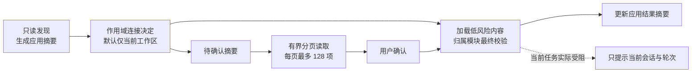

# 外部 AI 应用连接与管理详细设计

本文定义“外部 AI 应用”在 Desktop Settings、交互式 TUI 和非交互 CLI 中的应用级连接与管理体验。稳定架构、归属模块和运行视图见[外部 AI 工作内容架构](external-ai-work-sources-design.md)，实施顺序见[外部 AI 应用连接体验执行计划](../../specs/plans/external-ai-app-connection-experience-plan.md)。

本文只描述交互、应用级读模型、动作语义和宿主投影，不重定义生态解析、能力归属、执行权限或插件运行时。

> **实现状态：部分交付。** 当前分支保留严格 V1 兼容路径，并已交付独立 V2 应用快照、作用域化连接偏好与迁移、分页批量确认、Desktop/Peer 投影，以及 Desktop Settings 和交互式 TUI 消费。App Server 只在真实注入 management owner 的宿主中暴露这些方法；Shared Runtime 与通用 Server 不伪装支持。任务相关 `action-required`、非交互 CLI 结果和 `HookManagementSnapshot` 仍是后续工作。Hook 管理继续沿用独立 owner 和现有安全审核契约，其产品入口与展示规则见第 5.5、7.1 和 8.3 节。

## 1. 问题与设计目标

当前 Settings 页面把接入策略、物理来源、Tool、Subagent、MCP、冲突、诊断和 Safe Mode 平铺在同一页面。用户必须理解内部能力分类，才能完成“使用另一个 AI 应用中的能力”这一主任务。

目标是：

1. 以外部应用而不是能力类型作为首次连接和日常管理入口。
2. 明确区分发现、连接和加载，避免“发现即运行”。
3. 对低风险声明式内容采用低摩擦默认路径，对可执行或权限扩大的内容集中确认。
4. 给连接动作明确完成反馈，说明已启用、待确认和受限内容。
5. 适配 Settings 约 600px 的正文宽度，采用纵向单列和渐进披露。
6. 提示低侵入、一次性、状态驱动；用户已决定后不重复打扰。
7. GUI 与 TUI 共享产品语义、状态、默认策略和决策结果，不共享布局与渲染实现。

## 2. 范围与非目标

本设计覆盖：

- Desktop Web UI 的应用首页、详情、批量确认和高级设置；
- TUI `/extensions` 的应用摘要、连接和批量确认；
- 非交互 CLI 的任务相关 `action-required`；
- Peer Host / Server 对共享应用级读模型和类型化动作的投影；
- 默认连接产品事实、提示去重和跨宿主决策一致性。

本设计不包含：

- 外部聊天历史或项目迁移；
- 将持续来源复制成 BitFun 原生配置；
- 自动连接或加载所有检测到的应用；
- 自动运行所有 Tool、Subagent、MCP、Hook、进程或网络能力；
- 改变生态配置解析、能力归属、权限归属或安全上限；
- GUI/TUI 共享布局、组件、主题 key、快捷键或渲染 schema；
- 无法可靠实现的全局撤销；
- 扩展 OpenCode legacy managed-package 路径为目标运行时模型。

“导入”只用于真正复制或迁移数据的独立能力。持续兼容来源统一使用“发现、连接、加载、断开连接”。

### 2.1 核心术语

正文优先使用中文，协议字段保留代码名：

| 术语 | 含义 |
|---|---|
| 执行域（`execution_domain_id`） | 外部事实被读取、能力被加载的真实宿主边界 |
| 工作区作用域（`workspace_scope_id`） | 宿主为当前工作区计算的不透明策略键，只在所属执行域内有效 |
| 用户默认（`user_default`） | 同一执行域内，没有工作区覆盖时使用的缺省决定 |
| 工作区覆盖（`workspace_override`） | 只影响当前工作区、且优先于用户默认的决定 |
| 发现代次（`generation`） | 一次不可变发现结果的版本，用于拒绝过期操作 |
| 偏好版本（`preference_revision`） | 用户决定文档的版本，用于并发保护 |

## 3. 产品状态模型

### 3.1 发现

发现是只读扫描：识别外部应用及其用户级、项目级或工作区级候选，生成脱敏摘要、支持范围和风险事实。

发现不得注册运行时能力、启动外部进程、建立网络连接、读取凭据值、改写配置，或把候选加入模型可调用集合。

### 3.2 连接

连接表示用户或产品默认策略允许 BitFun 在明确的执行域和策略作用域内持续读取并同步某个生态。连接是应用级、作用域相关的状态，不等同于允许其全部内容运行，也不能从一个工作区或宿主外溢到另一个执行域。

连接结果必须包含：

- 已连接的应用；
- 已自动启用的低风险内容；
- 等待确认的类别和数量；
- 被安全上限阻止或暂不可用的内容；
- 唯一下一步主操作。

### 3.3 加载

加载表示将策略允许或用户确认的具体能力注册到真实归属模块。只有同时满足以下条件的内容可以加载：

- 低风险声明式内容已被共享策略允许自动应用，或用户已确认该能力；
- 未超过产品、组织、宿主能力、Safe Mode 和安全上限；
- 发现代次、偏好版本、决策键与行为版本仍有效；
- 对应能力归属模块已完成自身校验、准备和注册。

下图是目标产品流，不代表当前 V1 已具备这些能力：



### 3.4 面向用户的应用级状态

首页只展示五种应用级摘要：

| 状态 | 含义 | 默认主操作 |
|---|---|---|
| 已连接 | 连接有效，当前没有必须处理的应用级事项 | 查看 |
| 发现可用配置 | 已发现候选，但尚未连接 | 连接 |
| 未发现配置 | 支持该应用，但当前执行域没有配置 | 无强调操作 |
| 需要处理 | 存在待确认、权限扩大、阻断性冲突或应用级恢复事项 | 检查 |
| 暂时不可用 | 连接、同步或宿主状态失败，且存在恢复路径 | 重试或查看原因 |

这些是从底层发现、期望连接、确认、运行、支持、健康和冲突事实派生的持久产品摘要，不替代架构文档定义的正交生命周期。优先级为：`需要处理 > 暂时不可用 > 已连接 > 发现可用配置 > 未发现配置`；Safe Mode 作为全局显著状态单独展示，不被该优先级隐藏。当前轮次的任务依赖作为短期、作用域化导航上下文单独呈现，不写回应用状态。

“已启用”只描述能力结果，不替代“已连接”。应用可以已连接，同时仍有部分能力等待确认或被限制。

## 4. 默认连接与推荐集合

### 4.1 默认连接产品事实

默认连接由 Product Assembly 提供的生态能力事实决定，不能在 React、TUI 或协议 adapter 中按 `ecosystemId` 硬编码。

首期策略：

- OpenCode：允许默认连接；低风险声明式能力按策略自动加载；Tool、Subagent、MCP、进程、网络、环境变量或权限扩大仍进入确认。
- Codex、Claude Code：默认只发现，不连接、不加载；用户可主动连接。

读模型同时给出默认值和原因，例如适配成熟度、支持范围、产品策略或当前宿主限制。明确的“断开连接”或“暂不使用”优先于后续默认连接，不能被自动发现覆盖。

### 4.2 推荐集合

批量确认默认选中共享控制面计算的推荐集合，高风险项默认不选。推荐计算至少考虑：

- 能力类别和行为风险；
- 本地进程、网络、环境变量、文件范围和权限扩大；
- 来源、作用域与适配支持范围；
- 宿主能力、Safe Mode、产品/组织安全上限；
- 冲突、诊断和兼容状态；
- 用户既有决策及其绑定的行为版本。

宿主只能展示推荐、允许用户在安全上限内调整并提交选择，不能自行提高推荐等级或放宽上限。

### 4.3 作用域与旧偏好迁移

连接决定沿用现有集成策略的两级语义，而不是建立一个跨工作区的全局布尔值：

- `user_default` 绑定 `execution_domain_id + application_id`，不带工作区作用域，只作为同一执行域内工作区的缺省值；
- `workspace_override` 绑定 `execution_domain_id + workspace_scope_id + application_id`，优先于 user default；
- `workspace_scope_id` 直接复用 `assembly/core` 现有 `workspace_policy_key` 生成的不透明键：`workspace:` 加规范化工作区 SHA-256 的前 16 字节十六进制。它由事实所在宿主计算并随快照返回，控制端只原样回传；它不是路径、没有反查索引，也不建立新的全局工作区注册表。Peer/Remote 宿主必须在自身执行域计算，控制端不得用本机目录代算；
- 现有 `workspace_overrides` 已以同一不透明键为键，迁移可以原样枚举，不需要也不得反查绝对路径。宿主身份或执行域改变后旧键不能跨域复用；显式无工作区使用 `none`，不是任意工作区的通配符；
- 偏好版本、提示键和确认计划都在同一作用域内解释，不能跨作用域去重或重放。

现有 `ExternalSourcesConfig` 已保存 integration policy、来源抑制、Tool/Subagent/MCP 审批和冲突决定，但没有应用连接字段。`integration_policy.enabled=false` 同时表示结构体默认值和用户显式关闭，而且现有 MCP revision-key 初始化可能把默认对象自动写成文件；因此不能再用“有文件/无文件”或 `false` 单独还原用户意图。升级必须先读取原始存储状态，再进入会物化默认文件的 helper，并在现有原子读改写路径中执行可重入迁移：

1. `WorkspaceExternalSourceService` 的启动迁移关口必须成为偏好存储的第一次访问：它先读取原始文件存在性和 `schema`，完成或保留迁移后，才允许发现、MCP 版本键初始化或 V2 接口继续。只有确认从未存在过偏好文件的新安装才写入 `config_origin=fresh_v2`，保持“无用户决定”并应用新的产品默认。已有旧文件或不兼容策略重置都不能重新归类为 fresh V2。
2. 迁移关口在内存中一次计算所有旧用户默认和 `workspace_overrides` 的连接决定；每项都按 `(execution_domain_id, application_id, workspace_scope_id?)` 写入真实连接状态与 `decision_origin`，无法归属的项写为 `needs_review`。`connection_schema_migration_version` 只表示整份文档已完成一次原子转换，不引入逐作用域的迁移生命周期。
3. 任何旧文件中的 `integration_policy.enabled=false` 都保守迁移为该作用域的显式未连接，`decision_origin=legacy_safety`；这包括由旧版自动生成、无法与用户显式关闭区分的默认文件。该规则优先于“已有有效使用”判断，保证升级不意外启用能力；可能要求从未手动关闭的旧用户重新连接一次，并应在迁移说明中明确，而不能用 OpenCode 新默认覆盖。
4. 仅当旧策略的 `integration_policy.enabled=true`，且该作用域已有效使用某生态——至少一项能力的实际访问级别为 `ask_before_use`/`auto`，或存在可归属到该生态的有效审批、冲突决定或活动路由——才迁移为已连接，避免升级静默撤下现有 Claude Code/Codex/OpenCode 能力。现有 `workspace_overrides` 直接按不透明 `workspace_scope_id` 逐项迁移。
5. 审批、拒绝和冲突记录不因连接迁移而删除；重新连接时仍需决策键与行为版本匹配，权限扩大继续重新确认。无法可靠归属到应用、执行域或某一作用域的旧记录写为连接状态 `needs_review`，该作用域继续使用 V1 路径，不得猜测连接、静默停用或用新默认接管。
6. 若读取到未知未来 `schemaMajor`，必须沿用现有不兼容策略的安全拒绝语义：不迁移、不应用默认、不写任何 V2 决定，也不触发偏好文件重写，逐字节保留包含不透明策略的原文件。用户执行既有“备份并重置”时，在同一原子更新中保存原策略、写入 `config_origin=incompatible_reset` 和显式未连接决定；该来源永不应用默认连接，只有用户随后显式连接才能启用能力。
7. 全部作用域决定、`connection_schema_migration_version` 和既有审批/冲突事实必须在同一次锁内原子替换中提交。成功时不存在“部分迁移”；失败则保持原文件和完整 V1 运行路径，重启后重新计算并重试整次转换。

Instruction、Skill、Hook 和显式复制成 BitFun 原生配置的内容继续由各自归属模块决定。只有归属模块已提供来源限定的激活/撤下端口时，应用连接才能协调其持续外部来源；否则应用摘要必须标记 `managed_separately` 或部分支持，断开连接不得虚假宣称已卸载。已经复制的原生 Hook/MCP 等快照不随外部应用断开而删除。

## 5. Desktop Settings 信息架构

### 5.1 首页

首页沿用现有 `ConfigPageLayout` 的 760px 正文最大宽度。接入设置不能藏在详情或“高级设置”深层，默认页面只保留：

1. 一个应用级总开关，控制是否使用外部 AI 应用能力；
2. 一个推荐模式入口，默认由产品安全策略自动完成发现、连接和低风险能力加载；
3. “需要确认”入口，仅在确有少量不能安全自动决定的事项时显示数量；
4. 一个可展开的应用/能力树，供用户查看结果或覆盖单项决定；
5. Safe Mode，仅在生效或当前宿主可操作时显著展示。

首页不平铺 Tool、Subagent、MCP、Hook、来源路径、冲突、完整诊断、scope 和兼容参数。应用树默认折叠，只在用户希望检查单项状态时展开。

默认路径的目标不是让用户逐项配置，而是由产品完成大多数决定：只读发现自动执行；成熟适配中安全上限内的低风险声明式内容按推荐策略自动连接和加载；已有等价决定静默复用；普通更新静默同步。只有可执行内容首次信任、实质权限扩大、无法自动选择的真实冲突，或宿主安全策略要求时才进入“需要确认”。

用户处理全部待确认事项应在一个页面或弹层内完成：默认应用共享推荐集合，提供“使用推荐设置”和“暂不启用”少量主操作；可展开树只用于查看和调整例外项。正常流程不要求用户理解能力分类、来源文件、作用域或诊断码。

应用行与能力节点用于解释自动化结果，而不是要求用户逐项决策。顶层只显示应用名、整体状态和简短结果；展开后才显示能力类别与单项状态。没有问题的应用不展示操作按钮，连接、断开或单项覆盖通过同一树内的上下文操作完成。

### 5.2 应用树与逐级披露

默认页面不再要求用户进入独立应用详情才能接入或查看结果。应用树按外部应用分组；每个折叠行只包含展开箭头、应用名称、已启用能力图标和应用总开关：

- 打开应用总开关等价于“使用推荐设置”，系统自动应用安全且无歧义的决定，不启动配置向导；
- 关闭应用总开关撤下该应用贡献的运行能力，但不修改外部配置、不删除已保存决定，也不影响其他应用；
- 只显示已启用能力类型的紧凑图标，未启用类型不占位；图标全名、数量和状态原因通过 tooltip 或无障碍标签提供；
- 应用或能力下存在待确认项时只显示圆点/计数，不重复放置确认按钮或说明段落；
- 展开应用后显示能力类型及类型开关，再展开能力类型才显示单项覆盖；单项明细不是正常使用的前置步骤。

正常状态下不显示“管理连接”、恢复或确认文案。低频作用域覆盖、来源路径、完整诊断、兼容说明和恢复动作进入高级设置。Safe Mode 生效时仍必须显著显示，不能因折叠隐藏。

### 5.3 单一确认入口

Tool、Subagent、MCP、Hook 和无法自动决定的真实冲突进入同一个确认页面或弹层，不使用连续弹窗，也不要求按应用重复提交。顶部仅在存在真实待确认项时显示一个带数量的入口；应用树只负责定位相关应用和能力。

确认页默认只显示总数、简短风险摘要和共享推荐集合，并提供“使用推荐设置”和“暂不启用”两个主要决定。用户展开分类或单项后，才展示名称、来源、路径、命令、环境变量名、网络目标、冲突和行为变化。敏感值、完整 prompt、完整 URL query 和未经脱敏的绝对路径不进入公共快照。

系统应把确认项压缩到最少：只读发现、低风险声明式能力、行为等价更新、已有有效决定和无歧义优先级自动完成。首次可执行内容信任、实质权限扩大、无法安全自动消解的冲突及组织策略要求才需要确认。待确认项在决定前不运行，但同应用其他安全能力继续生效。

提交不要求客户端读取全部分页：`review_id` 绑定同一不可变确认计划，`selection_baseline` 只能是共享推荐集合或空集合，`selection_overrides` 只携带与基线不同的稳定项目引用和选择结果。服务端从同代权威计划还原完整选择，依次应用基线和改动项，再校验作用域、偏好版本、发现代次、决策键、行为版本、安全上限和最大选择数。计划过期或引用不属于该计划时整批拒绝，不能把不同页面或不同代次拼接。

批量语义：

- stale revision、无效 generation 或宿主能力整体不兼容时，整个请求不应用；
- owner 允许逐项业务拒绝时，响应返回逐项结果；宿主只把成功项标为已启用；
- “整个请求不应用”只保证分派前的 identity、revision 和 generation 预检；开始分派后若 owner 状态并发变化，可以同时返回已应用项和类型化 stale/failed 项，不承诺跨 owner 回滚；
- 未知结果不能假定成功；
- 失败项保留可行动原因与恢复动作。

### 5.4 高级设置

以下内容后置到可展开树或高级设置：全局/项目 scope、生态与能力覆盖、物理来源、完整诊断、配置位置、Safe Mode 恢复和兼容说明。高级设置不是正常接入的前置入口，也不能重复承载应用总开关或待确认主操作。

### 5.5 扩展能力与 Hook

External AI Apps 是 GUI 中查看外部应用及其能力的唯一 Settings 一级入口。Hook 与 Command、Skill、Agent、Tool、MCP 等并列，是扩展能力类型之一；不能把 Hook 提升为与外部应用并列的产品域，也不能为了统一界面创建承载所有能力载荷的通用 Extension 对象。

应用树中的能力节点把 Hook 与其他类型并列展示。折叠应用行只显示已启用的 Hook 图标；展开后显示已启用数量和待确认标记，再展开 Hook 节点才列出原生、已导入和可审核单项。Hook 摘要至少区分已启用、待确认、需要更新、部分兼容和异常；技术性的“已发现/可导入/已导入”只在单项详情中表达，不作为顶层用户状态。

Hook 节点同时覆盖：

1. BitFun 用户级和项目级原生 Hook；
2. 已导入并由 BitFun 管理的外部 Hook；
3. Claude Code、Codex 等外部应用中可审核导入的 Hook；
4. Hook 总开关、项目 Hook 开关、配置位置和兼容说明，这些内容作为类型专属高级控制呈现。

该节点优先用图标、开关和计数回答当前哪些 Hook 会运行、来自哪里以及是否需要确认；解释文字进入 tooltip、无障碍标签或按需详情。完整命令、依赖、matcher 和诊断只随单项展开。Settings 不再单列 Agent Hooks 一级入口；既有深链可兼容导航到 External AI Apps 并展开对应 Hook 节点，但不能继续形成第二套管理页面。

Hook 数据仍由 `native_hooks`、`external_hooks` catalog 和 `external_hook_import` 各自拥有。External AI Apps 只消费应用与能力摘要，不复制可执行载荷、不修改外部来源文件，也不取代 Hook 的精确计划审核、revision fencing、行为版本和运行开关。

加载遵循渐进披露：默认页只读取轻量摘要；用户展开应用、能力节点，或已有 Hook 相关真实待办时才读取对应详情。不能为了默认页精确计数而预加载命令和依赖；摘要不足时使用图标状态而不是触发无界扫描。

### 5.6 当前 V1 修复切片

在组合 `HookManagementSnapshot` 尚未交付时，Desktop 仍必须保证既有 Hook 管理能力可达，但不能为此恢复第二个 Settings 一级入口或复制一套 Hook 数据 owner。当前 V1 修复切片采用以下过渡边界：

1. `External AI Apps` 保持唯一一级入口；页面内提供一个按需展开的 Hook 专属区域，复用现有 `app.hooks` 配置、`external_hooks` catalog 和 `external_hook_import` 操作。区域未展开时不读取 Hook 详情；旧 `hooks` 深链进入本页并自动展开、聚焦该区域。
2. Hook 区域只做现有 owner 的组合呈现，不创建新的后端协议、不复制可执行载荷，也不把现有 Hook 操作改接到 external-source policy。后续组合快照交付时替换读模型，不改变现有写操作的 owner。
3. 应用总开关从 `custom` 关闭时只把当前 mode 设为 `disabled`，不清除当前作用域的 capability overrides；重新打开时，存在保留 override 的应用恢复为 `custom`，否则进入 `recommended`。显式重置会清除 override，因此仍返回推荐模式。
4. 应用树的能力状态展示生效权限，而不是连接计划中的推荐权限。`auto`、`ask_before_use`、`discover_only` 和 `disabled` 必须有不同且准确的用户文案；推荐值只用于产生默认决定，不能冒充当前状态。
5. 首次加载且没有可展示快照时，页面显示可访问的错误提示和带文字的重试操作，并暂不展示依赖快照的应用树与高级设置。已有 last-valid 快照时继续展示该快照，同时标记降级状态，不能因刷新失败把现有内容替换为空白页。
6. 新增或调整的 appearance part 必须在同一 DOM 节点声明所属 component，并与 appearance 注册表一一对应；不能通过放宽审计或保留不存在的 part 让检查通过。

该切片必须用生产路径组件测试覆盖旧深链到 Hook 区域、Hook owner API 可达、`custom -> disabled -> custom` 权威快照往返、四种生效权限文案、无快照错误恢复和 last-valid 降级显示，并通过 appearance contract audit。它不实现完整 Hook 摘要计数、跨宿主通知决定或新的共享连接协议。

## 6. 提示、去重和恢复

### 6.1 首次发现

不使用启动弹窗。允许的入口是：

- 聊天区一次性非阻塞轻提示；
- Settings 导航低侵入状态；
- Settings 内应用摘要。

文案只说明“发现了可连接的应用”，不能暗示能力已经加载。

### 6.2 持久化去重

提示与用户决定由共享持久化事实驱动，不能只保存在某个 GUI/TUI 进程。去重键至少包含：

- execution domain ID；
- `user_default` 或 `workspace_override`；workspace override 还包含 Host 返回的 `workspace_scope_id`；
- application / ecosystem ID；
- 内容或行为版本；
- 风险摘要版本；
- 用户决定状态。

用户关闭、完成确认、断开连接或选择“暂不使用”后，同一作用域、同一有效版本不再主动提示。仅数量变化但行为和风险未扩大时，只更新 Settings 摘要。用户级决定可以作为同一执行域的缺省值，workspace override 只影响对应 `workspace_scope_id`；任何决定都不能跨执行域传播。

### 6.3 再次主动提示

仅允许：

1. 当前任务真正依赖待确认能力并因此受阻或降级；
2. 已确认内容发生实质权限扩大，需要重新确认。

权限扩大包括新增进程执行、网络访问、环境变量读取、更宽文件范围、工具集合扩大、模型或 Subagent 行为变化。行为等价刷新、普通路径变化和未连接应用更新不构成主动提示理由。

“当前任务受影响”不是持久化应用快照字段，也不参与应用级提示去重。能力归属模块在实际解析或调用依赖时，如果被连接策略或批量确认阻止，就返回类型化依赖事实；Agent Runtime 负责把它关联到根轮次并沿现有 Agent 事件流发布。现有 `session_id + turn_id` 已唯一标识根任务，不再新增一套任务身份。一个轮次的待确认能力不能改变另一个并发轮次的状态或退出结果。

子代理结果不得只凭“来自当前会话树”就使根任务失败。Runtime 使用现有 `SubagentSessionLinked` 的父 session、父 turn 和父 tool-call 关系追溯来源：只有根 turn 仍在等待该子代理调用时，子代理的阻断事实才聚合到根任务；无关、后台或已经脱离等待链的子代理结果保留在其来源 turn。事件在对应根任务结束事件之前发出，CLI/Host 只消费与当前根 session、turn 完全匹配的结果。

### 6.4 错误与恢复

必须区分发现失败、连接失败、同步暂时失败但沿用上一版本、stale revision、Host/Remote 不支持、Safe Mode 或 safety ceiling 阻止。

读模型提供类型化恢复动作，例如刷新、重试、重新连接、重新审阅、解决冲突、安装运行时、升级/重连 Host 或退出 Safe Mode。宿主不得解析错误文本决定控制流。

## 7. TUI 与非交互 CLI

### 7.1 TUI

`/extensions` 是应用级摘要和首次连接主入口，展示与 Settings 首页等价的状态、默认策略、数量和主操作。

`/extensions review` 提供与 GUI 等价的批量确认语义：共享推荐集合、高风险默认不选、可展开技术详情并调整。能力管理沿用竞品与 BitFun 已建立的直达命令：`/hooks`、`/tools`、`/agent` 和 `/mcp` 都是完整专项入口，不要求用户先进入 `/extensions`，也不新增 `/extensions hooks` 一类层级。GUI 的应用/能力导航不能被强加为 TUI 命令心智。

`/hooks` 同时展示 BitFun 用户级和项目级 Hook、已导入的外部 Hook，以及 Claude Code、Codex 等应用中可审核的 Hook 来源，并提供现有审核、导入、更新、启停和移除操作。`/hooks_external` 与 `/hooks-external` 仅保留解析兼容，不进入推荐帮助和补全。TUI 与 GUI 使用同一后端派生状态和安全操作，但各自保留适合表面的布局。

首次发现只显示一次非阻塞摘要；无关待办不阻塞聊天输入。

### 7.2 非交互 CLI

非交互命令不等待确认输入。只有当前操作真正依赖待确认能力时返回类型化 `action-required`，包含：

- 受影响应用和能力摘要；
- 风险原因；
- 可执行的后续动作或交互入口；
- 当前操作是否可降级继续。

与当前操作无关的待确认能力不能导致命令失败。

## 8. 应用级读模型

产品级协调 owner 应通过独立 V2 协议提供宿主可直接投影的版本化应用级读模型：

```text
ExternalApplicationSnapshotV2
  schema_version = 2
  execution_domain_id
  workspace_scope_id?  # 复用宿主的 workspace_policy_key；none 表示无工作区，不是通配符
  effective_connection_scope
  refresh_generation
  preference_revision
  safe_mode
  host_capabilities
  applications[]
    application_id / ecosystem_id / display_name
    discovery / connection / health
    effective_status / primary_action
    default_connection_policy + reason
    enabled / pending_review / blocked / conflict counts
    risk_summary
    notice_key / user_decision
    recovery_actions
  review_summary
    review_id / total_count / category_counts / max_selection_count
    risk_summary / recommendation_summary / safety_ceiling
```

应用级对象是对同一生态多个物理来源和能力事实的聚合。它不携带可执行载荷，不取代现有目录与能力专属 DTO。首页快照只携带批量确认摘要，不能内嵌完整项目列表；否则每次轮询都会重复序列化与首页无关的大量候选。

用户进入批量确认页后，客户端再调用有界只读接口取得稳定引用：

```text
ExternalApplicationReviewPageV2
  schema_version = 2
  execution_domain_id / workspace_scope_id? / target_scope
  review_id / preference_revision / expected_generations
  cursor / next_cursor / total_count
  items[]  # 每页最多 128，只含 item reference、显示摘要、推荐与安全上限
```

首次打开确认页时，请求不带 cursor 和 expected generations；若后台发现已在首页快照后完成，Host 可以返回当前只读确认计划，并以响应中的 `review_id` 和 generations 作为后续翻页与提交的唯一基准。偏好版本、执行域、工作区和目标作用域仍必须完全匹配。首次响应之后，分页游标严格绑定作用域、`review_id`、偏好版本和发现代次；任一事实变化都返回过期并重新读取，不能把旧页与新页拼接。详细页通过稳定项目引用关联现有 Tool、Subagent、MCP 和冲突投影；总量继续服从现有归属模块上限，完整提示词、命令正文、凭据和可执行载荷不进入分页响应。

状态和主操作由共享归属模块派生；React、TUI、Peer 和 Server 不重复实现优先级规则。

### 8.3 Hook 管理读模型与通知决定

Hook owner 应提供一个面向产品表面的版本化组合读模型，供 External AI Apps 和 TUI `/hooks` 使用。它组合原生 Hook 概览、外部 Hook catalog 与导入摘要，但不成为新的数据 owner：

```text
HookManagementSnapshot
  schema_version / revision
  native
    enabled / project_hooks_enabled
    configured_count / active_count / issue_count
  applications[]
    ecosystem_id / display_name
    discovered_count / importable_count
    imported_count / enabled_count
    update_count / unsupported_count / issue_count
    attention_state
  imports[]
    existing import summaries
  notice?
    notice_key / attention_reason / acknowledged
```

摘要不得携带完整命令、环境变量值、依赖文件正文、matcher 正文或其他执行载荷。能力专属操作继续调用现有 Hook API；写操作成功后返回或重新读取权威快照，客户端不能长期维护乐观派生状态。现有 `ExternalHookImportSnapshotV1` 能直接表达的字段应复用，不能复制一套同构导入协议。

首次发现圆点的已查看事实必须由事实所在 Host 持久化，不能只写 React `localStorage`。最小决定键包含 execution domain、可选 workspace scope、ecosystem、notice kind 和行为或摘要版本。`acknowledged` 只消除低侵入提示，不代表信任、导入或允许运行；安全决定仍由现有计划指纹、revision、行为版本和运行开关控制。相同行为版本跨重启不重复提示，只有新审核、实质权限扩大、已激活 Hook 失效或真实冲突才能产生新 notice。

冲突由能力 owner 在默认状态确实不能共存、用户正在启用冲突项，或外部变化使既有决定失效时产生。仅发现多个候选或数量变化不构成冲突，也不触发打断式确认。

任务依赖通过执行路径单独返回，不进入可轮询、可持久化的应用快照：

```text
AgenticEvent::ExternalDependencyActionRequired
  schema_version = 2
  execution_domain_id / workspace_scope_id?
  session_id / turn_id                                  # 根任务身份
  origin_session_id / origin_turn_id / origin_tool_call_id?
  dependency_refs[] / risk_summary / can_degrade
  recovery_actions
```

该契约归 `bitfun-events` 所有，而不是应用快照归属模块或 CLI。`AgentSubmissionResult` 仍只表示轮次已被接收；Runtime 在真实能力解析路径产生事件，现有 App Server `agent/event` 与 Shared Runtime IPC `RuntimeIpcEvent::Agent` 承载 `AgenticEventEnvelope`。新增事件前必须补齐 App Server 协议/客户端、Shared IPC 协议版本兼容处理和 Embedded/Shared 等价测试。

该事件与外部来源 V1/V2 接口是两个版本边界，不能因为应用快照是 V2，就假设旧 App Server 客户端能解析新的 `AgenticEvent` 类型。实现必须提升 App Server 协议版本，并按每条连接协商出的版本过滤新事件；旧协议连接不得收到未知类型。若无法可靠过滤，则提升最低协议版本并在初始化阶段安全拒绝旧客户端。Shared IPC 同步提升其严格 `PROTOCOL_VERSION`。新客户端连接旧宿主时必须明确返回“任务依赖结果不支持”，不能从结束文本推断。只有根会话和根轮次完全匹配的任务可以据此返回 `action-required`；Settings 可把它作为短期导航上下文读取，但不能合并成所有任务共享的应用状态。

### 8.1 V1/V2 协议边界与协商

现有 `ExternalSourceControlSnapshotV1`、`ExternalSourceControlActionV1`、`ExternalSourceRecoveryActionV1` 和 V1 `hostCapabilities` 保持字段与闭合枚举不变。应用级快照、连接动作、批量确认、`upgrade-host` 语义以及新增能力位不得追加到 V1 对象。

`get_external_application_snapshot_v2` 不提交用户决定或运行能力写动作，直接承担版本探测，不再增加单独的版本信息接口。首次激活对应 owner 时允许执行可重入偏好迁移并启动既有后台发现；当前 V2 偏好读取不得重复写回。确认分页只读取已激活 owner 的不可变结果，不能冷启动服务或发现：

- 新宿主返回严格的 V2 快照和 `host_capabilities`；客户端校验成功后，才可读取分页确认项或发送 V2 写操作；
- 旧宿主对 V2 快照返回传输层 method-not-found 时，客户端回退显示 V1 来源/能力管理并禁用 V2 写操作；
- “升级宿主”由新客户端根据 method-not-found 本地投影，不能向旧宿主发送未知 V2 动作，也不能要求旧宿主返回 V1 不认识的恢复类型；
- 旧客户端只调用原 V1 接口，因此新宿主必须继续生成严格 V1 响应；V1/V2 快照不得拼接成混合数据结构；
- 数据结构不匹配、宿主身份变化或重连后，所有未完成 V2 写操作和分页游标失效并重新读取快照。

兼容测试必须覆盖旧客户端 → 新宿主、新客户端 → 旧宿主、V2 同代成功、未知数据结构/枚举安全拒绝，以及重连后旧响应不能覆盖新执行域或工作区作用域。

### 8.2 性能与演进约束

- 应用快照和确认分页必须从当前不可变发现结果派生；首次快照可触发既有 owner 的迁移和后台发现，确认分页不得重新扫描文件、冷启动 owner、启动外部进程或持有偏好写锁。
- 首页只返回摘要，确认页每页最多 128 项。完整候选总量继续服从各归属模块已有上限，不建立第二套无界缓存。
- 共享缓存只允许按执行域、工作区作用域、发现代次和偏好版本精确失效；React、TUI、Peer 与 Server 不得各自维护产品状态机。
- 归属模块的加载与卸载在锁外执行；迁移关口只阻塞外部来源读写，不阻塞项目打开或无关 Agent 任务。
- 实现 PR 必须记录 V1/V2 快照大小和聚焦读取延迟的前后对比。没有基线时不宣称性能提升；出现明显回退时先减少返回数据或重复计算，再考虑新增缓存。
- 后续只有出现真实消费者和独立兼容要求时，才增加新的版本化接口；不提前扩展 V1，也不为单一 V2 接口建立通用协议目录。

## 9. 类型化动作

V2 控制协议应提供闭合动作：

- `ConnectApplication`；
- `DisconnectApplication`；
- `SetApplicationDeferred`（暂不使用）；
- `SubmitApplicationReview`；
- `Refresh`；
- V2 投影需要的来源开关、策略更新和 `SetSafeMode`；既有 V1 action 保持原样，不扩充枚举。

每个 V2 写操作信封必须携带 `execution_domain_id`、`target_scope`、`operation_id` 和该作用域的 `expected_preference_revision`；`workspace_override` 必须携带 `workspace_scope_id`，`user_default` 必须省略它。无工作区的读取使用显式 `none`，不能当作通配符。宿主必须确认这些身份与当前连接绑定一致，不能使用控制端当前目录推断目标。宿主默认动作只能提交当前工作区范围；全执行域默认必须来自用户明确选择。

`operation_id` 只用于请求/响应关联和界面中的待处理操作排序，不提供业务幂等、结果缓存或跨重启重放。客户端不得在同一活动连接内为并发请求复用它；服务端也不会因 ID 相同而重放旧结果。偏好版本是唯一写并发保护：响应丢失后，客户端必须重新读取权威快照，再决定是否发起新操作；不能用相同 `operation_id` 绕过过期版本。`SubmitApplicationReview` 还必须携带 `review_id`、选择基线和有界改动项，服务端从该计划取得各归属模块的发现代次、决策键和行为版本。

断开连接必须停止继续同步、卸载由该连接注册的运行能力、保留必要审计与用户决定、不改写外部配置、不影响其他生态，并返回不再可用的能力摘要。重新连接只复用仍与 decision key / behavior version 匹配且策略允许的决定；权限扩大重新确认。

## 10. Web UI 组件边界

现有 `ExternalSourcesConfig` 收敛为页面 controller，并拆分为：

- `ExternalAppsOverview`：应用首页；
- `ExternalAttentionSummary`：真实待办；
- `ExternalAppDetail`：单应用结果与管理；
- `ExternalAppReview`：批量确认；
- `ExternalAdvancedSettings`：scope、来源、冲突、诊断和 Safe Mode；
- controller/hook：读取、轮询、mutation sequencing 和恢复；
- presentation helpers：格式化展示，不做策略判断。

拆分必须保留现有请求序列、accepted sequence、pending mutation、scope mutation 栅栏、stale read/mutation 防护和失败恢复。UI 继续通过 infrastructure API，不直接调用 Tauri。

## 11. 关键场景

### 11.1 首次发现 OpenCode

1. 只读发现；
2. 产品事实允许默认连接；
3. 建立持续连接；
4. 加载策略允许的低风险内容；
5. 生成高风险推荐集合；
6. 一次性显示连接结果和待办；
7. 用户提交批量 review 后加载成功项；同一行为版本不重复提示。

### 11.2 首次发现 Codex 或 Claude Code

1. 只读发现；
2. 显示“发现可用配置”；
3. 不连接、不加载；
4. 一次性轻提示或 Settings 状态；
5. 用户主动连接后进入相同风险确认流程。

### 11.3 多应用并存

- 发现多个应用只增加候选；
- 只有产品事实允许且未被用户拒绝的生态可默认连接；
- 未连接应用不注册运行能力，也不参与运行时冲突；
- 一个应用的连接、审批或断开不隐式改变另一个应用；
- 已连接应用之间的真实冲突由共享归属模块生成待办。

### 11.4 内容更新

- 行为等价且风险不扩大：保持决定，静默更新摘要；
- 是否可复用旧决定由共享策略判定，宿主不猜测；
- 权限扩大：扩大部分安全拒绝，生成重新确认；
- 偏好版本过期：刷新权威状态后重新确认。

## 12. 可访问性、文案与 i18n

- 保持 600px 单列阅读轴，不依赖宽屏左右主从布局；
- 每行只有一个强调主操作；
- 状态不能只靠颜色，必须有文本或图标标签；
- 批量选择、展开和恢复动作支持键盘与清晰焦点；
- 使用现有主题令牌，不新增无归属色值；
- 统一文案：“发现、连接、等待确认、已启用、需要处理、断开连接”；
- 用户可见文案进入对应 i18n namespace；日志保持英文且无 emoji。

## 13. 验收标准

### 13.1 共享契约与运行时

- OpenCode 默认连接，其他生态默认只发现；
- 默认策略来自共享产品事实，而不是宿主生态 ID 分支；
- 发现不注册运行能力；
- 连接只自动加载允许的低风险内容；
- 推荐集合、高风险默认不选和 safety ceiling 可验证；
- 批量确认的偏好版本/发现代次、整体失效与逐项结果可验证；
- 断开或暂不使用后不被默认策略覆盖；
- 权限扩大重新确认；
- 未连接应用不参与运行时冲突；
- 断开卸载对应能力且不改写外部配置；
- Safe Mode、旧宿主、Remote/只读场景继续安全拒绝。
- 旧偏好迁移保留显式 disabled/discover-only、已有效使用的能力、审批与冲突决定，并以升级/重启 fixture 证明不会静默改变行为；
- user default、workspace override、本机/Peer/Remote 在 execution domain 与 workspace scope 上相互隔离；
- V1 枚举和字段保持不变，V2 只在独立协商成功后使用，双向新旧组合测试通过；
- 任务相关 `action-required` 绑定 session/turn outcome，不从全局应用快照推断。

### 13.2 GUI

- 默认页只呈现总状态、单一确认入口、刷新和按应用分组的可展开树；
- 应用折叠行只显示名称、已启用能力图标和应用总开关，解释文字进入 tooltip 或按需详情；
- 打开应用自动应用推荐设置，不启动逐项配置流程；关闭应用撤下其运行能力且不修改外部文件；
- 应用树把 Hook 与其他扩展能力并列，逐级展开后同时覆盖 BitFun 原生和外部来源；
- Settings 不再单列 Agent Hooks 一级入口，旧深链导航到 External AI Apps 并展开 Hook 节点；
- 所有例外通过一个确认入口一次处理，只有首次可执行信任、权限扩大和真实冲突进入确认；
- 首次发现圆点由 Host 持久化去重，同一行为版本跨重启不重复；
- 批量默认选择与共享推荐一致，待确认单项不阻塞其他安全能力；
- 技术详情默认折叠；
- 过期读取或写操作不覆盖新状态；
- 现有 Safe Mode、审批、冲突、诊断和脱敏测试保持通过；
- type-check、i18n 和主题治理通过。

### 13.3 TUI 与非交互 CLI

- GUI/TUI 对同一 fixture 的应用状态、默认策略和数量一致；
- `/extensions review` 提交同一批量决定；
- `/hooks` 完整显示并管理 BitFun 原生、已导入和可审核的外部 Hook，且不新增 `/extensions hooks`；
- `/hooks_external` 与 `/hooks-external` 仅保留解析兼容，非交互 `bitfun hooks` 契约保持稳定；
- 提示去重跨进程和宿主生效；
- 无关待办不阻塞交互；
- 非交互仅在当前任务受影响时返回 `action-required`；
- Host/Remote 差异通过共享能力与恢复动作表达。
