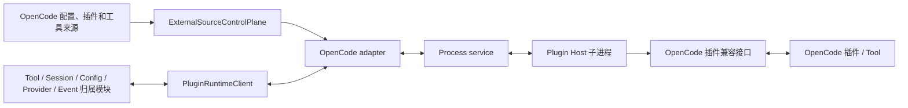

# OpenCode 插件运行时适配设计

本文定义 BitFun 如何在自己的运行时中加载和执行 OpenCode 服务插件、自定义工具和稳定钩子。总体能力状态见
[`opencode-extension-compatibility.md`](opencode-extension-compatibility.md)，配置来源见
[`opencode-config-assets-adapter-design.md`](opencode-config-assets-adapter-design.md)，通用进程与调用边界见
[`plugin-runtime-design.md`](plugin-runtime-design.md)，终端插件见
[`opencode-tui-plugin-adapter-design.md`](opencode-tui-plugin-adapter-design.md)。
外部来源的产品提示、风险分级和用户选择见
[`external-ai-work-sources-design.md`](external-ai-work-sources-design.md)。

固定接口以 `v1.18.4` 稳定提交的 [`packages/plugin/src/index.ts`](https://github.com/anomalyco/opencode/blob/49c69c5ed3ccf706b61b3febb43c8aaff7f8325e/packages/plugin/src/index.ts)、
[`packages/plugin/src/tool.ts`](https://github.com/anomalyco/opencode/blob/49c69c5ed3ccf706b61b3febb43c8aaff7f8325e/packages/plugin/src/tool.ts)
和实际插件 loader/npm 服务为准；[插件文档](https://opencode.ai/docs/plugins/)用于行为说明。

本文同时区分当前端到端能力与完整目标。当前实现已支持用户/项目 standalone `.js` Tool 的静态发现、非阻塞审批、
Node worker `load/invoke/cancel/dispose`、现有 Tool Runtime 注册、同名冲突选择与更新/删除撤下；`.ts` 和依赖型 JS
只显示不支持。完整 Zod/TypeScript、package plugin、OpenCode 兼容 Client 和稳定 Hook 仍是目标设计，
不能把当前 standalone Tool 的 Node 子集写成完整运行时兼容。

2026-07 的前瞻检查显示 OpenCode `v2` 仍以 Bun 作为 package manager、开发和默认编译路径，同时提供 Node 26 SEA
并行构建与 Node 启动器。该分支尚未形成稳定运行时承诺，因此 BitFun 保持 `ScriptToolRuntime`/worker protocol
运行时中立：当前 `.js` 子集使用系统 Node；只有固定的 TypeScript、Zod、`$` 或 package plugin 样例证明需要时，
才增加 Node 转译或 Bun-compatible 脚本执行后端，不把任一物理运行时固化进插件内部 ABI。

## 1. 核心决策

BitFun 自行实现 OpenCode 插件兼容链路，不启动完整 OpenCode Runtime：

- package plugin 的第三方 JS/TS 在 Plugin Host 子进程中运行；兼容进程级事实相同的插件默认共享 Host，详细
  复用、拆分、更新和恢复规则统一由[插件运行时设计](plugin-runtime-design.md)定义。
- 物理执行后端由 `ScriptToolRuntime` 所在的 services 实现选择。当前 standalone `.js` 子集使用经实际 `--version` 探测的系统 Node；
  TypeScript、模块解析、Zod refinement 和 `$` 必须按固定样例选择 Node 转译或 Bun-compatible adapter，不能互相猜测语义。
  若随产品交付运行时，发布前必须完成对应平台的许可证、签名、更新和体积验证。
- 依赖准备不使用 `bun install` 猜测 OpenCode 行为。`v1.18.4` 兼容模块使用 npm 配置、`@npmcli/arborist`、
  `package-lock.json` 和 `ignoreScripts: true`；后续 OpenCode 版本改变实现时随兼容版本更新。
- 执行进程提供 OpenCode 兼容上下文和插件接口；插件无需感知 BitFun Rust 内部类型。
- OpenCode Adapter 把插件调用、钩子变换和工具结果转换成类型化进程消息。
- Rust 主应用内的 `PluginRuntimeClient` 当前负责调用路由、期限、同一插件实例串行化、`idempotency_key` 结果、响应校验、
  故障诊断；队列上限、取消后的结果失效和旧连接结果拒绝，是端口具备相应身份后的目标能力。它不是 Host。
- Tool、Session、Message、Config、Provider、Permission、Event 等归属模块校验并提交最终结果。
- 可执行来源首次按来源、插件身份和执行域确认；激活后的默认本地运行策略以兼容性为先，不把严格沙箱作为插件可用的
  前置条件，用户、产品和组织可以按需收紧。

这里的“自行实现兼容链路”只表示 BitFun 负责来源发现、依赖准备、Plugin Host 监督、OpenCode API 适配、进程通信、
Rust 能力转发和状态恢复；并不表示重写 JavaScript 引擎，也不表示在后台启动 OpenCode 的 Agent Runtime。插件工厂和钩子
在所选脚本执行后端中运行，需要 BitFun 能力时通过兼容接口转发给 Rust 归属模块。

当前 standalone Tool 路径使用的 `ScriptToolRuntime` 是与提供方无关的窄端口，`NodeScriptToolRuntime` 只用于受支持的单文件 JavaScript standalone Tool。
它不把 Node 固化进插件内部 ABI，也不承担 OpenCode 格式、审批或冲突规则；后续 Node 转译或 Bun-compatible services 实现可以替换物理执行实现而
无需修改 Tool owner、产品表面或其他生态 adapter。

“最终由归属模块提交”不是把 OpenCode 可写钩子降级成只读通知。默认策略允许合法钩子变换生效；归属模块只负责
结构校验、状态一致性和已配置策略，不改变 OpenCode 的正常可观察语义。

## 2. 运行结构



启动和调用分开：

```text
发现来源 -> 解析入口、依赖声明与 import 前摘要 -> 判断是否允许执行
         -> [首次启用或运行条件扩大：pending-preparation]
         -> 生成执行版本记录 -> [有旧 Host：停止并确认] -> 启动新进程 -> import 插件
         -> 收集真实贡献 -> 归属模块校验并注册 -> 开放调用

运行时事件/工具调用 -> PluginRuntimeClient -> Adapter -> Process service -> Plugin Host -> 插件
                    -> 结果/变换 -> Process service -> Adapter -> Client 校验 -> 归属模块提交
```

插件执行进程是兼容载体，不是第二智能体内核。它不拥有 BitFun 会话状态、最终工具结果、配置文件写入或
权限存储。
Product Assembly 只选择并构造已编译的 adapter/provider，再注入 `PluginRuntimeBinding`、`ScriptToolRuntime` 和产品
能力/策略上限；它不发现来源或 import 插件。OpenCode 来源适配器把配置快照和生态顺序提供给现有
`ExternalSourceControlPlane`；依赖准备逻辑与 services 执行实现准备已经批准的插件文件和依赖，后者唯一持有 Plugin Host 进程树并检查物理健康；
`PluginRuntimeClient` 只管理调用可靠性、诊断与故障隔离，并使用既有来源和能力模块提供的插件启停事实。插件文件变化不能成为产品组装的隐式输入。

### 2.1 开发视图

| 开发部分 | 负责 | 不能承担 |
|---|---|---|
| OpenCode 来源适配器 + `ExternalSourceControlPlane` | 前者保留生态解析与顺序，后者维护来源身份、监听、候选快照和切换决定 | 写 BitFun 配置、保存凭据、决定产品提示、管理 Plugin Host 或提交贡献 |
| 外部来源目录与激活策略 | 展示来源、能力摘要和适用范围，保存用户加载偏好，并结合各归属模块与组织上限给出自动应用、待确认或限制结论 | 解释 OpenCode 加载顺序、import module、管理 Plugin Host 或代替调用时权限判断 |
| 依赖准备服务 | 按兼容版本管理 npm 配置、Arborist、package-lock、缓存和安装锁 | 执行插件代码或擅自启用安装脚本 |
| `ScriptToolRuntime` 与 services 实现 | 选择脚本执行后端，唯一持有 Plugin Host 进程树/句柄，负责物理健康探测和资源回收 | 把 Rust 侧实现命名为 Host、理解 OpenCode Hook 语义、把物理后端固化进插件 ABI 或提交 BitFun 业务状态 |
| Plugin Host 内的 OpenCode 适配库 | 加载真实模块，提供插件工厂上下文、`client`、`$` 和生态入口 API | 暴露 Rust 内部类型或自行修改 BitFun 存储 |
| 进程协议适配器 | 把工具、Hook、Client 和生命周期调用转换成类型化消息 | 使用任意 JSON 和字符串事件替代所有接口 |
| `PluginRuntimeClient` | 当前负责期限、同一插件串行调用、重复请求结果、响应校验与故障诊断；目标再增加队列上限、取消后的结果失效、旧连接结果拒绝和进程失联处理 | 持有 OS 进程句柄/进程树、拥有插件生命周期，或决定 OpenCode 加载顺序、权限结果和工具结果 |
| Tool / Config / Permission / Session / Provider / Event 归属模块 | 校验并提交最终状态 | 直接加载第三方 JS/TS 模块 |

实现顺序以真实消费方为准：先建立工具调用和稳定 Hook 所需的窄接口，再补 Client 方法和 TUI 插件入口；不先设计
覆盖多个生态的通用脚本 SDK。进程协议可以共享请求身份、期限、取消和错误封装，但不同调用的业务字段保持
类型化。

## 3. 默认策略与可调权限

### 3.1 OpenCode 兼容策略（本地默认）

- 使用与固定样例匹配的脚本执行后端加载 JS/TS；当前 `.js` 子集使用系统 Node，依赖按固定 OpenCode 版本的 npm/Arborist 语义准备。
- 自动发现项目/用户插件、standalone tools 和配置目录 `package.json`。
- OpenCode 配置列出的插件和标准插件/工具目录自动进入来源清单，但首次不得直接 import。系统按“来源限定身份 +
  插件身份 + 执行位置 + 能力摘要”形成非阻塞待确认项；用户处理后，同一摘要下的依赖准备、Plugin Host 启动和贡献注册
  不再逐层重复确认。
- 来源发现与第三方模块 import 是两个边界。首次启用，以及 import 前能够判断的文件/网络/进程权限、凭据范围、环境变量、依赖安装
  行为或执行位置扩大时，系统依据来源、插件身份、实际执行位置和 OS 用户、产品/组织策略上限与环境范围重新确认并计算
  启动参数；不能直接复用发现时、上一个内容版本或另一执行位置的结论。
- 确认提示不阻塞打开项目、TUI 输入或无关会话；确认前不得准备会执行安装脚本的依赖、import module、启动
  Plugin Host、读取凭据或产生直接脚本副作用。当前兼容版本仍保持 `ignoreScripts: true`。
- 用户确认的是来源和插件身份的加载偏好，而不是泛化的“信任整个仓库”。全局来源偏好在同一执行域只主动
  提示一次，项目可以覆盖；每次 activation/import 仍须根据有效来源图、工作目录、实际 OS 用户、凭据、
  环境和策略重新检查。workspace 只在对应配置或插件实例确有独立状态时进入该状态键，不拥有 runtime 或进程。
  跨项目本身不重复询问，只有新调用扩大工作目录、文件/网络/进程权限、凭据或能力时确认。Remote 使用独立偏好和执行结论，不静默
  继承本机选择。
- 已批准 L3 来源的代码更新只有在来源身份/完整性可验证、来源更新策略允许，且工作目录、文件/网络/进程权限、
  凭据、环境变量和安装行为均未扩大时，才可以安排安全重启。旧 Host 仍服务时只能执行不运行插件代码的检查和依赖准备；
  新模块必须在旧进程树确认停止后 import。真实工具、Hook 和其他动态贡献在 import 后比较；若贡献扩大需要确认，则停止
  新 Host 并显示差异，确认后按同一顺序重新加载。产品不能宣称后置确认可以撤销 import 已产生的直接副作用。
- 在 `discovered/pending-preparation/preparing/pending-activation` 阶段收到的停用或收紧操作必须取消尚未开始的加载。
  import 尚未开始时必须先重新检查有效策略；import 已开始后必须阻止贡献注册和后续调用，终止并确认整个新 Host
  进程树已经回收，再按当前策略恢复仍合规的插件。已经发生的文件、网络或进程副作用不能宣称已撤销。
- 允许当前用户在该执行域通常拥有的文件、网络、进程、环境变量和动态 import 能力；依赖安装脚本仍按
  OpenCode 稳定版默认禁用，不能因“默认开放”而扩大权限。
- 提供真实 `$` shell 语义、`directory`、`worktree`、`project` 和兼容 Client。
- 复现 OpenCode 稳定版的插件加载顺序、钩子顺序、命名和覆盖行为。
- 不因缺少 BitFun 专用清单或未声明静态工具集合阻止发现；风险由实际能力摘要决定，不用一个“高风险”标签
  代替来源、插件身份和执行域确认以及 import 前策略重算。

### 3.2 可选受限策略

权限分成两层，不能把 Plugin Host 能看见的调用范围误写成对任意脚本的沙箱：

| 控制层 | 可执行机制 | 控制粒度 |
|---|---|---|
| 经插件兼容接口 / Tool Runtime 的 BitFun 能力 | 在 Rust 归属模块检查来源、凭据、文件范围、工具覆盖、配置写入、模型请求修改和界面贡献 | 可按调用和贡献细分 |
| 脚本运行时直接文件、网络、环境和子进程能力 | 兼容模式使用当前执行用户；受限模式只能依赖真实操作系统或容器边界 | 只能按执行环境粗粒度限制；边界无法落实时停用插件 |

用户、产品或组织可以选择兼容/受限策略，并在插件兼容接口调整自己有权修改的细项。策略必须满足：

- 限制项是显式配置，不是隐式默认。
- 拒绝只影响超出策略的贡献或调用，其他能力继续运行。
- 诊断明确区分插件故障与 `policy-limited`。
- 更低层配置不能放宽组织或产品设置的上限。
- 用户可以查看最终有效策略并调整自己有权调整的部分。

| 执行域 | 首期可执行边界 | 严格文件/网络隔离不可用时 |
|---|---|---|
| 本地 Windows | Job Object 管理进程树和可执行资源预算 | 禁用需要相应直接能力的外部插件，报告 `policy-limited` |
| 本地 Linux | process group；可用时使用 cgroup/rlimit | 没有容器/namespace 等真实边界时同上 |
| 本地 macOS | process group 与可执行的 rlimit | 没有真实 sandbox/container 边界时同上 |
| Remote | 使用远端账号或远端容器的真实边界，不回退到本机 | 远端不能落实策略时同上 |

### 3.3 高权限残余风险

兼容脚本运行时中的代码可以直接调用运行时文件、网络和进程接口。这些直接副作用无法全部经过 Rust
Permission 归属模块拦截。插件激活后的默认兼容策略接受这一点，等价于用户运行本地开发工具；诊断页面必须展示执行用户、
来源、依赖、工作目录和当前策略。需要严格拦截时，用户必须选择真实可执行的受限环境；当前平台不能落实所选
边界时，依赖该直接能力的插件必须停用并报告 `policy-limited`，不能用一条策略记录冒充已经拦截。

## 4. 来源与执行版本

OpenCode 项目和用户目录可以直接成为兼容来源。OpenCode 来源适配器把解析结果提交给
`ExternalSourceControlPlane` 形成候选快照；只有
来源、插件身份和执行域已经确认且 import 前策略重算通过的候选才生成可启动的执行版本记录，但不要求作者手工构造
`.bitfun/plugins`：

| 记录内容 | 目的 |
|---|---|
| 来源使用范围与加载顺序 | 保留 global/project/config/directory 语义。 |
| 插件和工具入口 | 固定本次准备加载的模块。 |
| 配置目录 `package.json`、npm 配置、`package-lock.json` 及内容摘要 | 判断何时需要重新准备依赖。 |
| 软件包实际解析版本、完整性信息和安装目录摘要（能够取得时） | 避免只记录包名导致错误复用缓存。 |
| 脚本执行后端、版本、平台和架构 | 解释平台差异并选择正确 Plugin Host。 |
| 原生模块和运行时发现的动态依赖 | 展示风险并在变化后使相关缓存失效；安装脚本在当前兼容版本中禁用。 |
| 内容摘要、能力/权限摘要和生成时间 | 缓存失效、确认复用、诊断和重载。 |

首次确认完成后，来源身份/完整性可验证、来源更新策略允许，且 import 前可见的运行条件与执行位置均未变化的普通更新
不新增准备前确认。内容变化后先保持仍合规的健康旧进程服务，并在后台完成不执行插件代码的来源检查和依赖准备。
准备完成后进入短暂停机窗口：停止并确认旧 Host，再加载新 Host、比较真实贡献并注册。静态准备失败时旧进程可继续服务；
旧 Host 停止后的加载或注册失败则保持不可用，只有存在内容摘要匹配的完整旧版本文件时才能按同一顺序重新启动旧版本。
软件包版本/完整性、远程内容，或 import 前已知的文件/网络/进程权限、凭据、环境变量、依赖安装行为、执行位置发生未获
更新策略覆盖的变化时保持 `pending-preparation`，不能先 import 再提示。

执行版本记录是 BitFun 的内部缓存和诊断信息，不是源码备份、新的插件包规范或用户确认记录，也不要求所有动态 import 在启动前
形成完整依赖清单。本地开发插件缺少 package-lock 或完整性元数据时仍可运行，但旧 worker 崩溃或产品重启后，
只有保留了内容摘要匹配的完整软件包或文件副本，才能重建旧版本；本地原位源码已变化且没有精确字节时，必须显示
“上一版本不可恢复”，不能从当前来源重建后仍冒充旧版本。运行时发现新依赖后只更新当前版本记录，不能追溯改写
旧版本身份。

BitFun 原生 `bitfun.plugin.json` 包继续使用现有来源校验；OpenCode 兼容来源与原生包最终进入相同 Plugin Host
可靠性边界，但来源格式、安装和更新生命周期不必相同。

## 5. 工具与插件加载

### 5.1 Standalone tools

当前 standalone Tool 边界：

- 扫描用户全局、legacy、显式配置目录和项目层级 `{tool,tools}/*.ts|js`；扫描只形成静态来源/工具清单，首次确认
  前不 import。`.ts`、非精确 `@opencode-ai/plugin` import、其他 import、动态 import 和 `require` 标记不支持。
- 受支持的单文件 `.js` 支持 default 和多个 named export，按 `<file>` / `<file>_<export>` 命名；“单文件”是当前
  loader 兼容边界，不是安全结论。worker 内基础 schema shim 覆盖 string/number/boolean/enum/array/object、
  description、optional/default，以及按类型映射的 min/max，不宣称等价完整 Zod。
- worker 只返回 identity、description、JSON Schema 和字符串输出；`directory/worktree/sessionID/abort` 使用真实调用
  上下文。`metadata`、`ask`、附件和任意对象结果不支持，避免无消费方的泛协议扩张。
- 每个 standalone Tool 使用一个持久 worker 并保留其模块单例状态；合作式取消先触发 `AbortSignal`，脚本阻塞事件循环时
  500 ms 后终止整个 worker。普通请求 30 秒超时后也终止 worker；更短的产品 Tool 期限丢弃调用 future 时，
  runtime drop guard 同样终止 worker，并在退出完成前保留该脚本的串行许可。不自动重放调用；输出为 1 MiB，单协议帧
  为 8 MiB，无法认证的 stdout 累计到 1 MiB 后终止 worker。`import.meta.url` 使用已校验的来源 URL。
- 当前进程不是 OS 沙箱。模块使用独立 VM realm 且协议响应令牌不经 stdin 暴露，只用于降低偶然协议破坏，不能阻止
  已批准脚本获得当前用户的文件、网络、环境和进程能力，也不构成针对恶意模块的协议认证；获批脚本控制其 worker
  内的执行语义。当前脚本 worker 与 local stdio MCP 已共享进程树边界：Unix 使用独立 process group，Windows 在恢复
  子进程前加入 kill-on-close Job Object；如果附着失败，则不启动 worker。硬取消会回收已纳管后代，但不限制文件/网络、CPU、
  内存或边界外逃逸进程，必须在 Desktop 与 CLI/TUI 确认详情持续披露。
- global、project、legacy 或 `OPENCODE_CONFIG_DIR` 任一目录读取失败时记录绑定该 source 的诊断并继续扫描其他目录，
  不把单目录 I/O 故障升级成整个 OpenCode Tool provider 不可用。
- invoke 超时、空闲/调用中 worker 退出或 cancel 硬终止时，来自该 worker 连接的状态事件会立即撤下该脚本
  的全部路由并进入 `load_failed`；连接被替换后，旧连接迟到的退出事件会被忽略。调用不重放，下一次 Tool
  Catalog 暴露前只进行一次恢复尝试，失败后等待显式刷新或来源变化。零 route mux 继续作为 registry 稳定拦截点，
  防止并发内置/MCP 注册绕过同名冲突策略。

完整目标在不改变 provider 与归属模块边界的前提下继续补齐：

- 与固定样例匹配的 Node 转译或 Bun-compatible adapter 真实加载 JS/TS、依赖、default/具名导出；原始 Zod shape、refinement 和 `execute` 留在 worker，
  worker 用原始 Zod `safeParse` 校验调用，只把模型可见 JSON Schema 传给 Rust。
- `ToolContext` 补齐 message/agent 等真实执行上下文；`metadata({ title?, metadata? })` 与 `ask()` 通过反向类型化
  调用更新流式元数据和请求权限。
- ToolResult 的 title/output/metadata 与 `attachments: { type: "file", mime, url, filename? }[]` 逐项转换；附件
  URL 只能指向插件执行域可授权读取的文件或受支持地址，不能把本地路径静默解释为远端文件。
- 任意语言包装继续由插件代码启动子进程；Plugin Host 不另建语言专用工具 ABI。

### 5.2 服务插件

- 优先加载 v1 server 入口：模块 default export 必须是 `{ id?, server }`，并且不能同时导出 tui 入口。
- v1 文件/path server 插件必须提供非空 `id`；npm 插件缺省 `id` 时回退 package name。旧式函数导出回退
  不套用 v1 id 契约，但状态页仍使用来源身份区分。
- 软件包入口优先 `exports["./server"]`，其次只对 server 使用 `main`；存在 `exports` 但没有 server/main 时不回退包根。
- 文件目录可以回退 `index.ts/tsx/js/mjs/cjs`；npm 插件还必须通过 `engines.opencode` 版本范围检查。
- 只有未识别为 v1 模块时才枚举旧式函数导出作为兼容回退；“一个模块多个插件函数”不是 v1 主路径。
- 外部插件顺序直接使用[完整配置来源顺序](opencode-config-assets-adapter-design.md#31-opencode-来源顺序)产生的
  `plugin_origins`：包括各配置来源以及 `ConfigPaths.directories` 中的全局配置目录、项目 `.opencode`、
  `~/.opencode` 和 `OPENCODE_CONFIG_DIR` 目录扫描结果；不能简化成四级 global/project 顺序。
- Internal auth/provider 插件先于所有 external 插件；`--pure` / `OPENCODE_PURE` 只跳过 external 插件。
- 稳定版会跳过已经内置的旧认证包名。BitFun 只有在存在行为等价的内置替代时才应用该别名；否则不得静默
  跳过，必须继续加载或报告缺失的替代能力。
- 已经允许执行的来源，其依赖和插件文件可以并行准备，但插件工厂和 Hook 激活必须按确定顺序提交。
- npm spec 按解析后的 package name 去重，版本是否相同不影响身份，后来源胜出；file spec 按解析后的精确
  file URL 去重。本地和软件包来源不因相似名称合并，胜出项仍保留完整来源和 options。
- 无 custom tool 的 event/config/auth/provider-only 插件仍然可以加载和启用。

未知 pure/禁用开关不能按“继续加载”处理。无法解释时应停止 external 插件候选的激活并给出一次明确诊断，避免
用户期望纯净启动时仍执行第三方代码。

稳定版的软件包缓存命中后不会主动刷新 bare `latest`。BitFun 必须先复现这一实际加载行为；“检查更新”和更新通知
属于明确的产品增强。只有用户触发更新、配置 spec 变化或更新策略明确允许时才重新解析版本，并按第 9 节准备
候选版本，不能把后台静默换包宣称为 OpenCode 等价行为。

### 5.3 注册与覆盖

执行进程加载完成后返回真实贡献清单。静态分析只用于快速预览，不能要求动态工具集合与预览完全一致：

- 运行时新增或缺失工具只更新本次真实贡献和差异诊断。
- 用户策略对能力类别有限制时，超出上限的贡献被拒绝，其他贡献继续注册。
- BitFun 产品边界优先于 OpenCode 的静默覆盖顺序：同名外部 Tool、BitFun 内置和 MCP 候选形成包含身份与内容版本
  的冲突内容摘要；候选集合来自静态识别定义，不因某个 worker 暂不可用而消失。用户选择前保留当前本地实现；显式选择
外部实现后，任一候选变化或加载失败都要求重新选择，不静默回退。生态内原始顺序仍由 OpenCode adapter 解释。
- 产品或组织可保护少量安全关键工具。保护冲突必须在加载状态中可见，不能静默改名或丢弃。
- 工具调用继续进入现有可调用工具集合、期限、取消和结果类型；不新增只供插件使用的第二套调用状态机。

当前 `ProviderCandidate` 只表示 custom tool 提供方，不得用于表达 OpenCode `provider` Hook；两者必须使用语义明确的独立窄合同。

## 6. 钩子适配与权威提交

### 6.1 钩子分类

| 分类 | 钩子 | 调用规则 |
|---|---|---|
| 生命周期 | `dispose` | 给定期限执行；超时后回收执行进程。 |
| 观察 | `event` | 代理版本化事件，插件异常不影响事件源。 |
| 注册 | `tool`、`auth`、`provider` | 加载期收集真实定义，按归属模块类型化注册。 |
| 输入变换 | `config`、`chat.message`、`chat.params`、`chat.headers`、`command.execute.before`、`tool.execute.before`、`shell.env`、`tool.definition` | 保持插件顺序依次应用；每步做结构和大小检查，最终值交给归属模块。 |
| 输出变换 | `tool.execute.after` | 保留原始工具结果和审计引用，对展示输出、title、metadata 依次应用。 |
| 权限决策 | `permission.ask` | 默认兼容策略接受 OpenCode ask/deny/allow 语义；显式用户/组织上限可收紧。 |

### 6.2 变换规则

- 输入 Hook 看到前一个 Hook 已经变换的值，顺序与 OpenCode 一致。
- `tool.execute.before` 完成后重新校验最终参数 schema，权限界面展示最终副作用对象。
- `tool.definition` 改变的是模型可见的 JSON Schema；真实调用仍在 worker 中由工具原始 Zod shape/refinement
  `safeParse`。这是 OpenCode 的双表示语义，不能为了“看起来一致”把 JSON Schema 反推成不等价的 Zod。
- `tool.execute.after` 不能删除底层原始结果和审计引用；用户可见结果遵循 OpenCode 变换，但诊断仍能定位原始失败。
- `config` 变换作用于当前兼容结果，不直接覆盖来源文件。
- `chat.headers` 和 `shell.env` 的敏感值不进入日志或普通诊断。
- 单个 Hook 抛错只使本次 Hook 调用失败。是否终止当前命令/工具按照 OpenCode 行为和调用类型决定，不升级为
  BitFun 主进程故障。

### 6.3 Permission Hook

默认兼容策略下，`permission.ask` 可以按照 OpenCode 语义修改 ask/deny/allow。BitFun 用户或组织设置了不可
突破上限时：

- deny 可以继续收紧；
- allow 只能在当前策略上限内生效；
- 超出上限返回 `policy-limited`，同时保留插件原始决定和最终决定的审计来源；
- 不能把策略拒绝伪装成插件返回 deny。

## 7. OpenCode 插件兼容接口

插件工厂获得与 OpenCode 对齐的上下文：

| 上下文 | BitFun 实现 |
|---|---|
| `project` | 当前执行域的项目身份和兼容字段。 |
| `directory` | 实际插件工作目录。 |
| `worktree` | 实际工作树根；Remote 时是远端路径。 |
| `serverUrl` | 指向 worker 执行域内真实可访问的回环兼容服务；它实现固定版本中插件实际需要的 OpenCode 路由，而不是暴露完整外部 Server。 |
| `client` | 插件专用方法代理，经类型化进程通信映射到 BitFun 归属模块。 |
| `$` | 默认兼容策略提供真实 shell；受限策略可提供受控替代并返回差异。 |

Client 方法按固定版本建立接口清单：

- 已支持方法转成稳定请求并返回 OpenCode 兼容结果。
- 已知未支持方法抛出稳定 `unsupported` 错误，包含方法、版本、插件和替代建议。
- 只读、可选、且 OpenCode 允许空值的方法才能返回空结果；写入和副作用方法不得伪造成功。
- 未知新方法由代理捕获并进入一次性兼容诊断，不能导致 Rust panic 或无限递归。
- Client 返回的大对象使用分页、流或大对象引用，避免阻塞进程通信。

`client` 与回环 `serverUrl` 复用同一组 Rust 能力处理器。插件直接 `fetch(serverUrl)` 时，已声明支持的路由返回
OpenCode 兼容响应；未支持路由返回版本化的 `404/501` 与诊断，不挂起连接或伪造成功。该回环服务只对对应
worker 可见，不能自动成为 BitFun 面向外部用户的 OpenCode Server 兼容承诺。

该接口只存在于 OpenCode adapter 与 Plugin Host 之间，不是独立架构层或 BitFun 公共 SDK，也不要求其他产品
入口使用 OpenCode 类型。

## 8. 可靠性与鲁棒降级

### 8.1 故障域

进程复用、必要拆分、安全重启、崩溃扩散、进程树回收和重启预算统一以
[插件运行时设计](plugin-runtime-design.md)为准，本文件不重复定义第二套模型。OpenCode 特有要求只有两点：

- 插件初始化与 Hook 链保持固定版本的确定顺序；单个初始化异常且 Host 仍健康时回滚该插件贡献并继续加载。
- OpenCode 稳定实现允许同进程插件观察 `globalThis`、进程环境或模块缓存。BitFun 默认共享 Plugin Host，但只保证
  官方 PluginInput、Hook 顺序和显式接口；既不主动切断，也不承诺未文档化的插件间全局协作。

### 8.2 调用协议

每条跨进程请求包含协议版本、request id、插件实例、调用类型、期限、取消 id、输入摘要和大小预算。每个 Host 使用独立 IPC
连接，请求只在产生它的连接内结算。services 的 `process-lost` 绑定失效连接；`PluginRuntimeClient` 据此找到在途请求和受影响插件，
不在协议中增加 Host 或插件版本编号。当前只读预览协议尚未交付该连接级行为，因此不能据现有 DTO 宣称安全重启已经交付。还必须具备：

- 初始化、Hook、Tool、Client 和 dispose 各自可配置期限。
- 取消传播和进程失联检测。
- 有界队列和并发上限；过载返回 `overloaded`，不无限排队。
- 输入、输出和日志大小限制；大结果保存后只传递引用。
- 心跳和健康状态不与单次业务调用共用被阻塞的队列。
- 迟到响应、重复响应、未知 request id 和已替换连接的响应直接丢弃并诊断。

各类调用必须使用独立、可配置且受产品或组织上限约束的等待预算。初始默认值在首个端到端能力中测量后，
由现有配置归属模块确定；设计文档不重复固定常数，状态页必须显示最终生效值，也不能用无限等待作为兼容回退：

| 调用类别 | 期限归属与可见状态 | 超时结果与重试 |
|---|---|---|
| 依赖准备 | 后台预算；显示准备阶段，可取消或停用插件 | 准备失败；健康旧进程可继续，手动重试 |
| 初始化/模块 import | Host 启动和插件初始化预算；显示正在启动，可取消 | 新 Host 失败；保持不可用，满足条件时重启完整旧版本 |
| 顺序变换 Hook | 单 Hook 与整条链均有预算；显示当前插件与 Hook，可取消业务操作 | 当前操作失败，不静默跳过，也不自动重放 |
| 通知型 `event` | 通知链预算；不阻塞主界面，可停用相应 Hook 或插件 | 丢弃本次通知并聚合诊断，不重试 |
| Tool | 继承本次工具期限并受宿主上限约束；复用工具进度和取消 | 返回 `timeout/cancelled`；可能有副作用，不自动重放 |
| Client 代理 | 读写分别配置；显示插件正在访问的能力，可取消本次请求 | 写请求不重试；只读请求仅在明确暂时不可用时按归属模块策略重试 |
| `tool.execute.after` | 后处理链预算；显示当前后处理插件 | 原工具不重放；保留原始结果并附超时诊断 |
| `dispose` | 清理总预算；不得阻止产品退出 | 到期终止对应 Plugin Host 进程树，不重试清理 |

取消当前调用不等于停用插件；停用插件会拒绝新调用并取消该插件的全部在途调用。等待提示必须区分依赖
准备、排队、插件执行、重启和策略限制，不能统一显示为“处理中”。

### 8.3 错误隔离

稳定错误至少区分：`action-required`、`unsupported`、`incompatible-version`、`dependency-failed`、`plugin-failed`、`timeout`、
`cancelled`、`overloaded`、`policy-limited`、`process-lost`、`temporarily-unavailable` 和 `invalid-response`。当前 standalone
Tool 契约仍可保留已发布的 `worker-lost` 名称，不把它误用于目标 package-plugin 共享进程。
`temporarily-unavailable` 允许在既定退避后重试；其他错误是否可重试由对应能力明确声明。

- 错误按插件、能力和根因聚合；相同错误限流，不持续刷日志或界面提示。
- 已知不兼容能力只禁用相应贡献；插件其他工具和 Hook 继续工作。
- 连续失败可以暂停对应 Hook 或工具，用户可以查看原因并恢复；不能无提示永久隔离。
- 插件状态页显示最后健康时间、失败能力、恢复动作和当前执行版本，不要求用户阅读原始日志。
- UI/TUI 线程不等待依赖安装、插件初始化或长 Hook；一级状态显示“更新中”或“部分受限”，详情说明准备和降级阶段。
- Plugin Host 丢失时，相关插件实例的在途调用统一以 `process-lost` 失败，绝不自动重放可能已有副作用的调用。
  同一次物理进程故障只消费一次有界重启预算；预算耗尽进入 `paused`。用户手动重试可开启新预算，但不恢复或
  重放旧调用。

## 9. 生命周期

用户可见状态及确认阶段由[外部来源设计](external-ai-work-sources-design.md#7-状态与提示规则)唯一维护；Plugin Host
进程的启动、更新、故障和退出由[插件运行时设计](plugin-runtime-design.md#4-生命周期)唯一维护。本文件只补充
OpenCode 特有规则：来源已经允许执行时可直接准备，动态贡献未扩大时可直接激活；插件和 Hook 初始化按固定版本顺序
提交；显式停用、删除、来源撤销或安全策略失效必须撤下旧贡献，不能用旧 Host 绕过当前意图。

软件包更新先比较版本、完整性、更新策略和 import 前可见的运行条件。静态准备期间健康且仍合规的旧 Host 可以继续服务；
真正 import 前必须停止旧 Host 并确认完整进程树已经回收，再启动新 Host、校验贡献并注册。新 Host 失败时保持不可用；
只有内容摘要匹配的完整旧版本文件仍在时，才可以按相同停机顺序重启旧版本。不能并行 import 新旧模块后再假装能够
回滚全局副作用。

## 10. Remote 与执行域

- 项目插件在工作区所在执行域发现、安装依赖和运行。
- `directory`、`worktree`、Client、`$`、网络和凭据都指向该执行域。
- 本地界面只代理状态、事件和用户操作，不执行远端插件的本地 fallback。
- 用户全局插件是否传播到 Remote 必须由用户显式选择 local/remote scope；不能按同名目录自动复制。
- 当前执行版本、依赖缓存和 Plugin Host 健康由远端 services 执行实现管理。
- 连接中断时调用返回 `temporarily-unavailable`，恢复后重新协商版本和当前注册项。

## 11. 当前实现与后续迁移

当前 standalone Tool 端到端能力位于正确分层：通用契约位于 product domains/runtime ports，OpenCode 路径与
格式位于独立 adapter，来源版本位于 `ExternalSourceControlPlane`，审批/冲突/工作区路由位于 Core，物理 Node
进程位于 `NodeScriptToolRuntime`，Desktop/CLI/TUI 只消费快照和操作。后续 adapter 不依赖 OpenCode 私有类型。

当前仍需保留并逐步迁移的边界：

- `bitfun.plugin.json` 不是所有 OpenCode 插件的强制作者格式。
- 静态候选不是完整工具真实定义；当前 standalone Tool 路径在 load 时核对预期 export，不匹配就拒绝加载；完整 Plugin Host 后续比较动态贡献差异。
- 无 custom tool 的插件仍可因 Hook、auth 或 provider 被启用。
- `client/server` 不再一律拒绝；由 OpenCode adapter 的插件兼容接口映射到现有归属模块。
- 可写 Hook 不再一律拒绝；改为依次变换、结构校验和归属模块提交。
- 不再把所有插件能力统一视为必须逐次批准的“高风险候选”；只在首次来源与插件启用、能力/权限扩大或执行域
  变化时确认，同一摘要下的内部生命周期不重复询问。
- 现有通用插件调用与效果 DTO 不继续扩张承载所有调用；分别使用 source lifecycle、
  worker invoke 和类型明确的 Hook 变换等窄路径。
- 当前原位本地文件路径没有内容摘要匹配的完整旧版本副本，更新 load 失败会撤下对应插件；只有未来保存摘要匹配的精确字节后，
  才能实现“健康旧进程继续服务”而不从新源码伪造旧版本。

## 12. 验证要求

至少使用固定 OpenCode 版本的真实 fixture 验证：

1. v1 default server 入口、旧式多函数回退、standalone tools、配置目录依赖和动态 import。
2. npm/Arborist、npm 配置、package-lock、`ignoreScripts: true`、入口回退与 `engines.opencode`。
3. 插件加载顺序、Hook 顺序、同名工具覆盖和确定性重启。
4. Zod/JSON Schema 双表示、refinement、AbortSignal、metadata、ask 和 `tool.definition`。
5. 所有稳定 Hook 的输入、合法变换、错误、超时和多插件链式行为。
6. Client、`$`、directory/worktree/project/serverUrl 的本地和 Remote 语义。
7. 插件初始化失败、运行崩溃、死循环、内存异常、超大结果、队列过载和用户取消。
8. 未知配置、未知 Client 方法、未知事件和版本不匹配不导致 panic、卡顿或日志风暴。
9. 默认兼容策略与受限策略的行为差异可解释，策略拒绝不误报为插件故障。
10. 插件更新、停用、standalone worker 或 Plugin Host 重启后旧工具定义和迟到响应不能继续生效。
11. 首次发现不执行代码；确认后同一摘要不重复询问，代码更新还须满足来源身份/完整性和更新策略；
    import 前可见的运行条件扩大进入 `pending-preparation`，import 后贡献扩大进入 `pending-activation`。
12. 更新失败、来源暂时不可读、明确删除、重新出现和全局来源在多项目中的切换分别符合目标语义。
