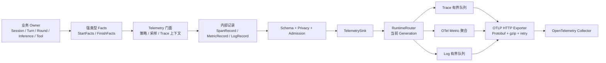

# BitFun Observability 实现导读：从业务 Owner 到 OTLP

Purpose：解释当前代码中业务观测流程和 Observability 底座如何协作，并提供可以直接跟读的源码入口。

Scope：Agent Session、Turn、Round、Inference、Tool、Permission、Compression，以及 `bitfun-observability`、`bitfun-observability-otel`。

Status：implemented（按当前实现维护）

Authority language：Chinese

Related：[`observability-telemetry-design.md`](observability-telemetry-design.md)、[`logging.md`](../development/logging.md)

## 1. 先建立整体认识

这套实现不是给现有 `log` / `tracing` 安装一个通用 OpenTelemetry Layer，也不是监听产品事件后重建调用链。它由两部分组成：

1. 业务 Owner 在真实异步操作边界产生强类型的开始事实和终态事实，并显式传递 Trace 上下文。
2. Observability 底座把事实转换为受 Schema 约束的 Span、Metric 和 OTel Log，再通过有界异步管线发送给 OTLP Collector。

两个主要 crate 的职责是：

| Crate | 职责 | 不负责什么 |
|---|---|---|
| `bitfun-observability` | 强类型安全领域事实、Trace 上下文、静态 Descriptor、隐私校验、采样、信号投影、准入控制，以及封闭的 Debug 敏感记录和脱敏/截断；SDK 无关的 `TelemetrySink` | 不依赖 OTel SDK，不读产品配置，不访问网络，不提供任意事件名/JSON 接口 |
| `bitfun-observability-otel` | 配置验证、安装标识、OTel SDK 映射、Metric 聚合、安全 Trace/Log 与 Debug Log 的独立有界队列、OTLP HTTP、重试、健康状态、重配置和关闭 | 不转发普通日志或产品事件，不放宽安全 Trace/Metric/Log schema |



## 2. 业务观测流程是怎样落到真实执行链上的

### 2.1 Host 创建并注入同一个 `Telemetry`

每个 Native Host 持有 `TelemetryRuntimeHandle`，从运行时取得轻量、可克隆的 `Telemetry`，再注入产品组装层。Host 同时负责用户开关、部署配置、密钥和进程关闭；业务模块不接触 Collector endpoint 或凭据。

当前 Host 入口：

- CLI：[`initialize_cli_telemetry`](../../src/apps/cli/src/main.rs#L1392)，其中创建 Runtime、应用配置并通过 [`cli_telemetry`](../../src/apps/cli/src/main.rs#L1384) 暴露门面。
- Desktop：[`TelemetryRuntimeHandle::new`](../../src/apps/desktop/src/lib.rs#L464)，随后把 [`telemetry_runtime.telemetry()`](../../src/apps/desktop/src/lib.rs#L563) 注入 Agent 系统。
- Server：[`TelemetryRuntimeHandle::new`](../../src/apps/server/src/main.rs#L98)。
- Relay：[`TelemetryRuntimeHandle::new`](../../src/apps/relay-server/src/main.rs#L27)。
- SDK Host：[`TelemetryRuntimeHandle::new`](../../src/apps/sdk-host/src/main.rs#L22)，并把门面传给 [`SdkHostRuntime::build`](../../src/apps/sdk-host/src/main.rs#L48)。

最终形成的依赖方向是：

```text
Host owns TelemetryRuntimeHandle
  └─ Telemetry（可克隆门面）
       └─ 注入 ExecutionEngine / RoundExecutor / ToolPipeline / Coordinator
```

### 2.2 Owner 使用统一的 `start -> execute -> finish`

以 Turn 为例，真正的 Owner 是 `ExecutionEngine::execute_dialog_turn`，源码入口在 [`execution_engine.rs`](../../src/crates/assembly/core/src/agentic/execution/execution_engine.rs#L3114)：

```rust
let turn_observation = start_turn_with_relation(
    &self.telemetry,
    start_facts,
    context.observation_relation.clone(),
);
let turn_context = turn_observation.context();

let result = self
    .execute_dialog_turn_impl(/* ... */, turn_context)
    .await;

let finish_facts = match &result {
    Ok(result) => /* 从真实结果构造 TurnFinishFacts */,
    Err(error) => /* 从类型化错误构造 TurnFinishFacts */,
};
turn_observation.finish(finish_facts);
```

对应的准确位置是：

- 创建 Turn Observation：[`start_turn_with_relation_and_content_facts`](../../src/crates/assembly/core/src/agentic/execution/execution_engine.rs#L3156)。
- 取得并下传父上下文：[`turn_observation.context()`](../../src/crates/assembly/core/src/agentic/execution/execution_engine.rs#L3168)。
- 执行原有业务：[`execute_dialog_turn_impl`](../../src/crates/assembly/core/src/agentic/execution/execution_engine.rs#L3220)。
- 从真实 `Result` 构造终态：[`TurnFinishFacts`](../../src/crates/assembly/core/src/agentic/execution/execution_engine.rs#L3239)。
- 唯一结束点：[`turn_observation.finish_with_output_length`](../../src/crates/assembly/core/src/agentic/execution/execution_engine.rs#L3276)。

这里最重要的不是调用形式，而是 Owner 语义：谁最终知道操作成功、失败、取消或超时，谁就负责结束 Observation。中间事件、UI 事件和下游回调都不能替 Owner 猜测终态。

### 2.3 Trace 层级由显式上下文形成

当前 Agent 主链路是：

```text
Turn
└─ Round
   ├─ Inference Request
   │  └─ Inference Attempt
   └─ Tool Execute
      ├─ Permission Evaluate
      └─ Permission Confirmation
```

Round 在 [`RoundExecutor::execute_round`](../../src/crates/assembly/core/src/agentic/execution/round_executor.rs#L292) 中创建：

- 以 Turn Context 为 parent 创建 Round：[`start_round`](../../src/crates/assembly/core/src/agentic/execution/round_executor.rs#L301)。
- 将 Round Context 写回本轮执行上下文：[`observation.context()`](../../src/crates/assembly/core/src/agentic/execution/round_executor.rs#L309)。
- 从真正的 `RoundResult` 或错误生成终态并结束：[`observation.finish`](../../src/crates/assembly/core/src/agentic/execution/round_executor.rs#L320)。

Inference 和每次 Attempt 在相同的 Round Owner 内建立：

- Inference Request：[`start_inference_with_request_facts`](../../src/crates/assembly/core/src/agentic/execution/round_executor.rs#L394)。
- 取得 Inference Context：[`inference_observation.context()`](../../src/crates/assembly/core/src/agentic/execution/round_executor.rs#L412)。
- 每次实际请求建立 Attempt：[`start_inference_attempt`](../../src/crates/assembly/core/src/agentic/execution/round_executor.rs#L437)。
- Attempt 通过一次性 `Option::take()` 闭包确保只结束一次：[`finish_attempt`](../../src/crates/assembly/core/src/agentic/execution/round_executor.rs#L444)。
- Request 成功终态包含 TTFT、Token、响应长度和部分恢复标记：[`finish_with_response_facts`](../../src/crates/assembly/core/src/agentic/execution/round_executor.rs#L1095)。
- Request 失败终态保留安全错误分类、HTTP 状态分类和可重试性：[`InferenceFinishFacts`](../../src/crates/assembly/core/src/agentic/execution/round_executor.rs#L1127)。

Tool 和 Permission 的 Owner 位于 `ToolPipeline`：

- 权限策略评估：[`draft_permission_plan`](../../src/crates/assembly/core/src/agentic/tools/pipeline/tool_pipeline.rs#L759) 中调用 [`start_permission_evaluation`](../../src/crates/assembly/core/src/agentic/tools/pipeline/tool_pipeline.rs#L773)。
- 用户确认等待：[`await_permission_execution_plan`](../../src/crates/assembly/core/src/agentic/tools/pipeline/tool_pipeline.rs#L1267) 中调用 [`start_permission_confirmation`](../../src/crates/assembly/core/src/agentic/tools/pipeline/tool_pipeline.rs#L1295)。
- 单个 Tool 的真实执行边界：[`execute_single_tool`](../../src/crates/assembly/core/src/agentic/tools/pipeline/tool_pipeline.rs#L1883)。
- Tool Observation 创建和 Context 下传：[`start_tool`](../../src/crates/assembly/core/src/agentic/tools/pipeline/tool_pipeline.rs#L1899)。
- 从任务状态和类型化错误统一决定完成状态、失败来源、各阶段耗时和退出分类：[`ToolFinishFacts`](../../src/crates/assembly/core/src/agentic/tools/pipeline/tool_pipeline.rs#L2027)。
- Tool 唯一结束点：[`observation.finish`](../../src/crates/assembly/core/src/agentic/tools/pipeline/tool_pipeline.rs#L2088)。

其他真实 Owner：

- Session create/resume/delete 的公共包装：[`observe_session_operation`](../../src/crates/assembly/core/src/agentic/coordination/coordinator.rs#L2098)。
- Session create 的直接边界：[`start_session`](../../src/crates/assembly/core/src/agentic/coordination/coordinator.rs#L2490)。
- Session delete 的直接边界：[`start_session`](../../src/crates/assembly/core/src/agentic/coordination/coordinator.rs#L6539)。
- 自动 Compression：[`start_compression`](../../src/crates/assembly/core/src/agentic/execution/execution_engine.rs#L2425)。
- 手动 Compression：[`start_compression`](../../src/crates/assembly/core/src/agentic/execution/execution_engine.rs#L2751)。

### 2.4 业务值先被压缩成有限、安全的分类

原始业务数据不能直接成为遥测 Attribute。组装层先把它映射成稳定、有限集合：

- `BitFunError -> CompletionFacts/SafeErrorType`：[`completion_from_error`](../../src/crates/assembly/core/src/agentic/observability.rs#L95)。
- Tool 错误同时映射完成事实和失败归属：[`tool_failure_from_error`](../../src/crates/assembly/core/src/agentic/observability.rs#L128)。
- Agent 模式分类：[`agent_mode_class`](../../src/crates/assembly/core/src/agentic/observability.rs#L214)。
- Turn 触发来源：[`turn_trigger`](../../src/crates/assembly/core/src/agentic/observability.rs#L235)。
- Finish Reason 分类：[`finish_reason_class`](../../src/crates/assembly/core/src/agentic/observability.rs#L245)。
- Model 分类：[`model_class_from_category`](../../src/crates/assembly/core/src/agentic/observability.rs#L259)。
- Provider 和协议分类：[`inference_classes`](../../src/crates/assembly/core/src/agentic/observability.rs#L274)。
- Tool class/source/kind 分类：[`tool_identity`](../../src/crates/assembly/core/src/agentic/observability.rs#L296)。

按照当前决策，安全 Tool kind 仍保留有限的工具名精确匹配名单；已知名称映射到 `Filesystem/Search/Shell/Git/Browser/ComputerUse/Protocol/Task`，未知名称回退为 `Other`，未知 MCP Tool 回退为 `Protocol`。原始 Tool 名称不会进入安全 Attribute/Metric，只会在明确授权的 Debug Tool 记录中出现。

### 2.5 业务层实际调用的是领域 API，不是通用 `record()`

所有安全领域 API 都集中在 [`domains.rs`](../../src/crates/execution/observability/src/domains.rs#L1)，其中只暴露有限枚举、布尔值、计数和时长，不提供 Prompt、路径、业务 ID、任意名称或原始错误的槽位。

主要入口：

- Startup：[`start_startup`](../../src/crates/execution/observability/src/domains.rs#L355)。
- Session：[`start_session`](../../src/crates/execution/observability/src/domains.rs#L379)。
- Session 配置：[`record_session_config`](../../src/crates/execution/observability/src/domains.rs)。
- Slash command：[`record_slash_command`](../../src/crates/execution/observability/src/domains.rs#L404)。
- 图片附件批次：[`record_image_attachments`](../../src/crates/execution/observability/src/domains.rs)。
- Turn：[`start_turn_with_relation_and_content_facts`](../../src/crates/execution/observability/src/domains.rs#L535)。
- Round：[`start_round`](../../src/crates/execution/observability/src/domains.rs#L580)。
- Inference Attempt：[`start_inference_attempt`](../../src/crates/execution/observability/src/domains.rs#L773)。
- Inference Request：[`start_inference_with_request_facts`](../../src/crates/execution/observability/src/domains.rs#L814)。
- Token Usage：[`record_inference_usage`](../../src/crates/execution/observability/src/domains.rs#L863)。
- Tool：[`start_tool`](../../src/crates/execution/observability/src/domains.rs#L965)。
- Permission Evaluate：[`start_permission_evaluation`](../../src/crates/execution/observability/src/domains.rs#L1051)。
- Permission Confirmation：[`start_permission_confirmation`](../../src/crates/execution/observability/src/domains.rs#L1092)。
- Compression：[`start_compression`](../../src/crates/execution/observability/src/domains.rs#L1173)。

领域层使用 [`observation!` 宏](../../src/crates/execution/observability/src/domains.rs#L324) 为每个操作生成专用 Observation。专用 `finish(FinishFacts)` 先把领域事实转为有限 Attribute、`SpanStatus` 和 `Severity`，再进入通用 `TelemetrySpan::finish_terminal`。

Debug 走另一套封闭 API：[`DebugTelemetryRecord`](../../src/crates/execution/observability/src/debug.rs) 只有 Turn、Inference、Tool 和 Approval 固定变体；真实 owner 调用 [`Telemetry::record_debug`](../../src/crates/execution/observability/src/facade.rs)，不能传入任意事件名。Debug 不修改上述安全领域 API。

Debug Log 复用所属业务操作的事件名：Turn 使用 `bitfun.agent.turn`，Inference 使用 `bitfun.inference.request` / `bitfun.inference.attempt`，Tool 使用 `bitfun.tool.execute`，Approval 使用 `bitfun.permission.evaluate` / `bitfun.permission.confirmation`。请求、响应、结果和失败由封闭正文中的 `record_type` 区分。Slash command 是普通类型化事件 `bitfun.agent.slash_command`，只记录有限命令类别、来源和是否带参数，不记录原始命令或参数。Recovery 不建独立事件：重试、部分恢复、参数修复、上下文溢出等事实归回 Inference、Tool 或 Compression owner；原始错误和原始参数仅作为对应 owner Debug 记录的内容。`bitfun.debug.*` 只用于 Debug 通道的 schema、原始大小和截断元数据。

每个 Debug 内容字段使用 [`DebugContentField`](../../src/crates/execution/observability/src/debug.rs) 包装，固定包含 `value`、`original_size_bytes` 和 `truncated`。先对结构化秘密键做整值替换，再对自由文本做模式脱敏，最后按共享内容预算做确定性的头尾截断；序列化后的整条记录仍受 256 KiB 上限保护。Turn 结果中的修改文件路径只来自当前 Turn Snapshot 文件操作事实，Tool 的 `part_index` 只来自类型化 `tool_call_order`。

## 3. Observability 底座本身如何实现

### 3.1 自定义 SDK 无关的数据模型

基础模型定义在 [`model.rs`](../../src/crates/execution/observability/src/model.rs#L39)，没有直接把 OTel SDK 类型暴露给业务代码。

核心类型包括：

- `SpanContext`：仅包含 16-byte Trace ID、8-byte Span ID 和 sampled 标志。
- `ObservationContext`：进程内 Trace Context 加共享的单操作容量预算。
- `SpanRecord`、`MetricRecord`、`LogRecord`：通过隐私门后交给 Sink 的内部记录。
- `ValidatedRecord`：三类内部记录的统一枚举。

Attribute 值只有三类，定义在 [`AttributeValue`](../../src/crates/execution/observability/src/model.rs#L163)：

```rust
pub enum AttributeValue {
    Enum(&'static str),
    Bool(bool),
    U64(u64),
}
```

安全 Attribute 没有任意 `String`、JSON、错误链或 payload。`Attribute` 的构造函数是 crate-private，产品代码不能绕过领域 Facts 创建任意字段。安全信号隐私控制的第一道门因此是 Rust 类型系统，而不是发送前的字符串替换。Debug 的 String/JSON 仅存在于封闭记录内部，并在 [`prepare_debug_record`](../../src/crates/execution/observability/src/debug.rs) 中先做结构化整值替换、自由文本模式脱敏和有界截断。

### 3.2 Trace ID、父子关系和跨进程传播

Root Span 使用 UUID 生成 Trace ID，并用 Trace ID 的前 64 位做稳定比例采样；Child 继承 Trace ID 和采样决定，只生成新的 Span ID。实现位于 [`SpanContext::root/child`](../../src/crates/execution/observability/src/model.rs#L109)。

关系类型 [`TraceRelation`](../../src/crates/execution/observability/src/model.rs#L50) 有三种：

- `Root`：新建独立 Trace。
- `Parent`：同步或结构化子操作，继承父 Trace。
- `Link`：可能比启动者活得更久的后台操作，新建 Trace 并 Link 原上下文。

跨进程传播使用最小化的 W3C envelope，入口在 [`trace_context.rs`](../../src/crates/execution/observability/src/trace_context.rs#L9)。它只接受经过认证的 BitFun peer，并且只传播 `traceparent` 和受限的 `bitfun` tracestate；不支持 baggage、Session ID、安装标识、用户或机器信息。

### 3.3 Schema 是唯一允许出站的静态白名单

[`schema.rs`](../../src/crates/execution/observability/src/schema.rs#L1) 定义 `FieldView` 和 `DescriptorView`。每个 Descriptor 固定声明：

- 信号名称和版本。
- Trace、Metric 或 Log 类型。
- 最低 Telemetry Level。
- 允许字段、字段类型和枚举值。
- 必填项以及是否允许成为 Metric label。
- Metric 单位或固定 Log body。
- 业务 Owner、频率等级和单操作上限。

各领域字段白名单从 [`STARTUP_FIELDS`](../../src/crates/execution/observability/src/schema.rs#L298) 开始。Descriptor 通过 [`descriptors!` 宏](../../src/crates/execution/observability/src/schema.rs#L728) 注册；普通 Operation 通常对应四个描述符：

```text
bitfun.tool.execute             Trace Span
bitfun.tool.execute.total       Counter，单位 1
bitfun.tool.execute.duration    Histogram，单位秒
bitfun.tool.execute             OTel Log，固定正文
```

完整注册表位于 [`descriptor_registry`](../../src/crates/execution/observability/src/schema.rs#L1020)。Token 用量另外注册四个聚合 Histogram。

每条记录发送前都经过 [`validate`](../../src/crates/execution/observability/src/schema.rs#L1141)：

1. Descriptor 必须已注册。
2. Attribute 不能超过 32 个。
3. 不能出现重复 Key。
4. Key 必须属于当前信号白名单。
5. 类型必须匹配。
6. 枚举值必须属于静态有限集合。
7. 必填字段不能缺失。
8. 失败 Span/Log 必须带安全的 `error.type`。
9. OTel Log body 必须与 Descriptor 中的固定正文完全一致。

### 3.4 `Telemetry` 门面维护策略和 Observation 生命周期

门面构建入口是 [`Telemetry::build_with_resource`](../../src/crates/execution/observability/src/facade.rs#L187)。内部保存：

```text
TelemetryResource
当前 PolicySnapshot
enabled 原子开关
policy_revision
采样序列
TelemetrySink
AdmissionController
accepted / rejected / skipped 诊断计数
```

开始操作进入 [`start_operation_with_relation`](../../src/crates/execution/observability/src/facade.rs#L252)：

- `Off`：返回完全禁用的 guard，不构造 Attribute。
- `Basic`：不创建 Trace，只保留可用于最终 Metric/Log 的终态 guard。
- `Diagnostic`：在 Trace 开启且采样命中后创建带 Context 的 Span guard。
- `Debug`：面向评测和完整排障，安全 Trace、成功 Log 与单独授权的 Debug 敏感 Log 均按 `1.0` 全采样；Metric 仍保持聚合，不产生逐 chunk 记录。
- Parent 复用父操作预算；Link 创建新操作预算。
- 采样未命中或 Span 准入失败时，降级为 terminal-only guard，Metric/Log 仍可工作。

持有状态的 [`TelemetrySpan`](../../src/crates/execution/observability/src/facade.rs#L686) 保存开始时间、起始属性、Trace Context、parent、links、policy revision、操作预算和关闭标志。

### 3.5 一次终态如何生成 Span、Metric 和 Log

领域 Observation 最终调用 [`TelemetrySpan::finish_terminal`](../../src/crates/execution/observability/src/facade.rs#L766)：

1. 根据单调时钟计算 `duration_ms`。
2. 合并 Start Facts 和 Finish Facts。
3. 若存在采样 Context，则生成一个 `SpanRecord`。
4. 对承担终态投影的 Operation 调用 `record_terminal_projection_at_revision`。
5. 标记 guard 已关闭，重复 `finish` 不会再次发出记录。

终态投影实现在 [`record_terminal_projection_at_revision`](../../src/crates/execution/observability/src/facade.rs#L433)：

- 总数：`xxx.total += 1`。
- 耗时：`xxx.duration` Histogram，内部从毫秒换算为秒。
- 日志：失败/警告保留，成功日志按 `success_log_sample_ratio` 采样；正文来自静态 Descriptor。
- 若存在采样 Span Context，Log 带 Trace ID/Span ID；Basic 模式不会伪造 Trace Context。

一个重要的当前实现例外是：`InferenceAttempt` 的 `terminal_active` 被设为 `false`，见 [`TelemetrySpan` 构造](../../src/crates/execution/observability/src/facade.rs#L333) 和 [`terminal_only`](../../src/crates/execution/observability/src/facade.rs#L737)。因此 Attempt 当前只在 Diagnostic 且采样命中时产生 Span，不直接投影 Attempt Metric/Log；请求级 Inference 负责请求聚合终态和 Token Metric。

如果 active guard 没有显式结束就被 Drop，[`TelemetrySpan::drop`](../../src/crates/execution/observability/src/facade.rs#L815) 会用 `outcome=incomplete` 关闭 Span，并在该 Operation 承担终态投影时生成警告终态，避免悬空的活跃 Span。

### 3.6 每条记录的最终内核出口

所有安全内部记录都经过 [`emit_if_allowed`](../../src/crates/execution/observability/src/facade.rs#L571)：

```text
核对 policy revision
  -> 核对 level 与 signal 开关
  -> Schema / Privacy validate
  -> Admission 限速与基数检查
  -> catch_unwind 调用 TelemetrySink
  -> 更新 accepted / rejected / skipped
```

`catch_unwind` 隔离 Sink panic；Exporter 或 Sink 的异常不会冒泡到产品控制流。

Debug 入口 [`record_debug`](../../src/crates/execution/observability/src/facade.rs) 先检查 `level == Debug` 和 policy revision，再执行脱敏/截断并调用 `TelemetrySink::emit_debug`。它不经过普通 Descriptor/Attribute 通道，也不使用普通成功采样；revision 在准备前后各检查一次，避免降级竞态把旧敏感记录交给新 generation。

### 3.7 Admission 如何防止遥测自身失控

[`AdmissionController`](../../src/crates/execution/observability/src/admission.rs#L53) 是进程级准入控制器，限制：

- 最大活跃 Observation Context 数。
- 最大活跃 Span 数。
- 单 Operation 活跃及累计 Span 数。
- 单 Operation Log 数。
- Trace、Metric、Log 的 Token Bucket 速率。
- 单 Metric Instrument 的 Series 数。
- 进程内全部 Metric Series 数。

Metric Attribute 组合会生成 fingerprint。新标签组合超过预算时仅拒绝该遥测记录，不阻塞或终止业务执行。`Off` 快路径在到达这些锁之前就返回。

### 3.8 `TelemetrySink` 把 portable 内核与发送实现隔开

SDK 无关的出口只有 [`TelemetrySink`](../../src/crates/execution/observability/src/sink.rs#L4)：

```rust
pub trait TelemetrySink: Send + Sync + 'static {
    fn configure_resource(&self, resource: TelemetryResource) {}
    fn emit(&self, record: ValidatedRecord);
    fn emit_debug(&self, record: DebugLogRecord) {}
    fn discard_pending(&self) {}
    fn discard_debug_pending(&self) {}
}
```

生产环境使用 OTel Runtime 的 `RuntimeRouter`，测试使用同文件中的 `InMemorySink`，禁用状态使用 `NoopSink`。因此领域层和测试不需要启动网络或 OTel SDK。

## 4. OTel Runtime 如何把安全记录发出去

### 4.1 Runtime、Router 与 Generation

[`TelemetryRuntimeHandle::new`](../../src/crates/services/observability-otel/src/runtime.rs#L195) 创建一个初始为 `Off` 的 `Telemetry`，其 Sink 是 [`RuntimeRouter`](../../src/crates/services/observability-otel/src/runtime.rs#L37)：

```text
Telemetry
  -> RuntimeRouter
       -> Option<Arc<OtelGeneration>>
```

`RuntimeRouter::emit` 只把已经通过内核验证的 `ValidatedRecord` 路由到当前 Generation；`emit_debug` 只接受已经脱敏和截断的 `DebugLogRecord`。没有有效 Generation 时都直接忽略，不让业务失败。

### 4.2 配置验证和匿名安装标识

[`TelemetryRuntimeHandle::apply_config`](../../src/crates/services/observability-otel/src/runtime.rs#L249) 执行完整配置切换。有效配置的验证入口是 [`validate_enabled_config`](../../src/crates/services/observability-otel/src/settings.rs#L282)，它检查：

- 用户等级不是 `Off`。
- 至少有一种有效 Signal。
- Endpoint 是无凭据、Query、Fragment 和额外 Path 的 HTTP(S) base URL。
- 除开发/测试的显式 Loopback 外必须使用 HTTPS。
- Batch 条数、字节、间隔、请求超时和关闭超时处于安全上限内。
- Basic/Diagnostic 采样率只能收紧产品默认值；Debug 的 Trace 和成功 Log 固定为 `1.0`，部署配置不能将其降低。
- 重试次数、退避时间和总预算有上限。
- Secret Header 名称和值受限，且不能覆盖 `traceparent`、`baggage` 等保留 Header。

部署配置结构在 [`TelemetryDeploymentConfig`](../../src/crates/services/observability-otel/src/settings.rs#L110)，Product Host 从编译期产品配置读取，Server/Relay 从部署环境读取；用户配置不能指定 Collector 或密钥。持久化配置是 [`TelemetryUserConfigV2`](../../src/crates/execution/observability/src/config.rs)，保存 `level` 和 `sensitive_content_consent`；legacy bool、V1 与未知新版本都按 fail-closed 规则迁移/执行。Desktop 选择 Debug 时由 [`TelemetryConfigSection`](../../src/web-ui/src/infrastructure/config/components/TelemetryConfigSection.tsx) 显示风险确认；Server/Relay 只把 `BITFUN_TELEMETRY_LEVEL=debug` 当作显式运维授权。

Runtime 只在配置有效且遥测启用后创建本地 root identity。它使用 receiver audience 做 HMAC，产生 receiver-scoped 的匿名 ID；本地 root 永远不进入 `TelemetryResource`。实现在 [`InstallationIdentityStore::scoped_id`](../../src/crates/services/observability-otel/src/identity.rs#L30)。

Resource 字段白名单在 [`resource.rs`](../../src/crates/execution/observability/src/resource.rs#L70)，只包含入口、服务版本、短期实例 ID、部署环境、有限平台枚举、Release Channel、Schema 版本和 receiver-scoped 匿名安装 ID。

### 4.3 为什么重配置不会混入旧数据

每次有效配置变化都会构建新的 [`OtelGeneration`](../../src/crates/services/observability-otel/src/pipeline.rs#L127)。切换顺序是：

1. 验证新配置并构建新 Generation。
2. `TelemetryControl::close_admission` 暂停新记录。
3. `RuntimeRouter` 原子替换当前 Generation。
4. revoke、discard 并关闭旧 Generation；离开 Debug 时立即清空敏感队列。
5. 应用新 `PolicySnapshot`，递增 policy revision，再开放准入。

已开始的 Observation 记录了旧 policy revision；它稍后结束时会在 `emit_if_allowed` 被判为 stale。网络侧还有 [`GenerationGate`](../../src/crates/services/observability-otel/src/transport.rs#L23)，旧 Generation 正在等待请求或退避时也能被撤销。

### 4.4 四种 Signal 的管线不同

[`OtelGeneration::build`](../../src/crates/services/observability-otel/src/pipeline.rs#L161) 根据有效能力分别建立三条管线；统一入口是 [`OtelGeneration::emit`](../../src/crates/services/observability-otel/src/pipeline.rs#L333)：

| Signal | 内部处理 |
|---|---|
| Trace | `SpanRecord -> SpanData -> BoundedBatchScheduler -> SpanExporter` |
| Metric | `MetricRecord -> Counter/Histogram -> SdkMeterProvider/PeriodicReader -> MetricExporter` |
| Safe Log | `LogRecord -> SdkLogRecord -> QueueLogProcessor -> BoundedBatchScheduler -> LogExporter` |
| Debug Log | `DebugLogRecord -> SdkLogRecord -> 独立 QueueLogProcessor/BoundedBatchScheduler -> LogExporter` |

映射入口：

- Span：[`span_data`](../../src/crates/services/observability-otel/src/pipeline.rs#L502)，保留 ID、Parent、Links、起止时间、安全 Attribute 和安全状态文本 `operation_failed`。
- Log：[`log_data`](../../src/crates/services/observability-otel/src/pipeline.rs#L533)，映射事件名、时间、Severity、固定正文、安全 Attribute 和可选 Trace Context。
- Debug Log：[`debug_log_data`](../../src/crates/services/observability-otel/src/pipeline.rs)，使用独立 `bitfun.observability.debug` instrumentation scope 和固定 `data_class=debug_sensitive`，并附原始字节数与截断标志。
- Metric：[`MetricInstruments`](../../src/crates/services/observability-otel/src/pipeline.rs#L77)，按注册名称缓存 Counter/Histogram instrument。
- Resource：[`otel_resource`](../../src/crates/services/observability-otel/src/pipeline.rs#L600)。
- Attribute：[`otel_attributes`](../../src/crates/services/observability-otel/src/pipeline.rs#L652)。

Metric 使用 Cumulative Temporality 和 PeriodicReader。[`metric_view`](../../src/crates/services/observability-otel/src/pipeline.rs#L685) 为秒、Token 和一般数值提供固定 Histogram bucket，并再次设置 256 的 cardinality limit。

### 4.5 Trace/Log 为什么不会阻塞 Agent

Trace、安全 Log 和 Debug Log 使用自研的 [`BoundedBatchScheduler`](../../src/crates/services/observability-otel/src/scheduler.rs#L55)。Debug 有独立的 `256` 条/`8 MiB` 内存队列、`1 MiB` batch 上限，不与安全 Log 争用容量，也不增加磁盘重试缓存。每个队列同时限制保留记录数和估算字节数。

业务线程只调用 [`try_enqueue`](../../src/crates/services/observability-otel/src/scheduler.rs#L129)：

- 使用 `try_lock`，锁忙则丢弃遥测。
- 队列关闭、记录数达到上限或总字节达到上限时丢弃遥测。
- 不等待队列容量，不访问网络，不做同步重试。
- 入队成功只唤醒后台 Worker。

后台 [`worker_loop`](../../src/crates/services/observability-otel/src/scheduler.rs#L243) 根据最大 Batch 条数、最大 Batch 字节、定时间隔或显式 Flush 组批，并在专用 `bitfun-otel-*` 线程中调用 Exporter。容量统计包含正在发送的记录，避免慢请求让内存绕过队列上限。

设计原则是：宁可有计数地丢失遥测，也不能让遥测反压 Agent 主流程。

### 4.6 OTLP 编码、gzip 和 HTTP 重试

内部没有手写完整 OTLP Protobuf 编码。它先把安全内部记录映射为 OTel SDK 类型，再由 `opentelemetry_otlp` Exporter 编码标准 Protobuf。

Exporter 构建入口：

- Trace：[`build_span_exporter`](../../src/crates/services/observability-otel/src/pipeline.rs#L785)。
- Log：[`build_log_exporter`](../../src/crates/services/observability-otel/src/pipeline.rs#L808)。
- Metric：[`MetricExporter::builder`](../../src/crates/services/observability-otel/src/pipeline.rs#L233)。

它们通过 OTLP HTTP 发送到：

```text
/v1/traces
/v1/metrics
/v1/logs
```

默认使用 gzip、`reqwest` 和 rustls，并禁用 HTTP redirect。自定义 [`GuardedHttpClient::send_bytes`](../../src/crates/services/observability-otel/src/transport.rs#L97) 在发送前识别信号类型和记录数量，以便精确统计服务端确认和拒绝。

[`send_with_retry`](../../src/crates/services/observability-otel/src/transport.rs#L137) 的规则是：

- `429/502/503/504` 可以重试。
- Connect、Timeout 和 Request error 可以重试。
- 可能的 TLS/证书错误不重试。
- 使用 exponential backoff、jitter，并尊重受上限约束的 `Retry-After`。
- 重试次数和总耗时都受配置预算限制。
- 等待响应、读取响应和退避期间都会监听 Generation revoke。
- 解析 OTLP partial success，区分 acknowledged 和 server rejected。
- 无法确定 Collector 是否接收时计为 ambiguous，而不是误报为已确认或本地丢弃。

### 4.7 Flush、Shutdown 和 Health

Runtime 支持：

- [`force_flush`](../../src/crates/services/observability-otel/src/runtime.rs#L361)：在总时限内刷新 Trace、Log 和 Metric。
- [`shutdown`](../../src/crates/services/observability-otel/src/runtime.rs#L369)：先关闭新准入，再有界刷新并停止 Generation。
- [`cancel_and_discard`](../../src/crates/services/observability-otel/src/runtime.rs#L393)：异常路径立即 revoke 并丢弃队列。
- [`reset_identity`](../../src/crates/services/observability-otel/src/runtime.rs#L404)：先关闭运行时，再删除本地 root identity。

健康快照定义在 [`TelemetryHealthSnapshot`](../../src/crates/services/observability-otel/src/diagnostics.rs#L17)，包含：

- `Closed/Starting/Healthy/Degraded/Backlogged/ShuttingDown` 状态。
- 当前用户等级、有效等级和 Generation。
- 排队记录数、字节数和 in-flight batch。
- retry、locally dropped、ambiguous、acknowledged、server rejected。
- 最近一次成功时间。

[`OtelGeneration::health`](../../src/crates/services/observability-otel/src/pipeline.rs#L362) 综合队列积压、Exporter 失败和服务端拒绝判断状态。健康数据只供本地控制面查询，不通过失败中的同一遥测管线递归发送。

## 5. 用一个 Tool 失败串起整条链路

假设 Shell Tool 执行超时：

```text
ToolPipeline 掌握真实 Result 和任务状态
  -> tool_failure_from_error
       completion = timeout
       error.type = timeout
       failure_source = timeout
  -> ToolFinishFacts
  -> ToolObservation::finish
  -> TelemetrySpan::finish_terminal
       sampled 时生成 SpanRecord(status=Error)
       生成 bitfun.tool.execute.total += 1
       生成 bitfun.tool.execute.duration Histogram
       生成固定正文 OTel Log(severity=Error)
  -> emit_if_allowed
       revision / level / schema / privacy / admission
  -> RuntimeRouter -> 当前 OtelGeneration
       Trace/Log 尝试进入有界队列
       Metric 写入 OTel Histogram/Counter 聚合器
  -> OTel SDK 编码 Protobuf + gzip
  -> GuardedHttpClient 按预算重试
  -> Collector 确认、部分拒绝或客户端记为 dropped/ambiguous
```

安全 Span/Metric/Log 中不会出现：原始命令、Tool 参数、Tool 输出、文件路径、完整错误消息、Session ID、用户 ID 或 Collector 密钥。若 Debug 已明确授权，同一个 Tool owner 还会恰好产生一次 `ToolRequest` 和一次 `ToolResult/ToolFailure` 敏感记录；已知凭据会整值替换，记录超过 256 KiB 会头尾截断，账号/设备身份和 Collector 密钥仍不会进入。

## 6. 三个容易误解的边界

### 6.1 它不是普通日志上报

普通 `log` / `tracing` 仍是本地诊断。Observability 不安装“把所有日志发送到 OTel”的桥接层。安全通道只消费强类型领域 Facts；Debug 通道只消费真实业务 owner 构造的封闭记录，模型交换边界直接复用其权威 request/response 事实，而不是读取本地模型交换文件或日志。

### 6.2 Metric/Log 不依赖 Trace 一定被采样

Basic 模式不创建 Trace，但仍能生成 Metric 和经过采样的结构化终态 Log。Diagnostic 模式中即使某个 Trace 未命中采样，也可以降级为 terminal-only guard，继续保留聚合信号。

### 6.3 产品事件不是 Trace 状态机

产品事件继续服务 UI、Host 和既有跨模块协作，但 Turn、Round、Inference、Tool 等终态由真实业务 Owner 直接结束 Observation。Telemetry 不通过监听 `AgenticEvent` 猜测开始/结束，也不要求为了遥测把敏感字段加入公共事件契约。

## 7. 推荐源码阅读顺序

第一次阅读按以下顺序最容易建立完整模型：

1. 先看真实 Turn Owner：[`ExecutionEngine::execute_dialog_turn`](../../src/crates/assembly/core/src/agentic/execution/execution_engine.rs#L3107)。
2. 再看领域 API 如何限制输入：[`domains.rs`](../../src/crates/execution/observability/src/domains.rs#L1)。
3. 看内部 Record 和 Trace Context：[`model.rs`](../../src/crates/execution/observability/src/model.rs#L39)。
4. 看 Descriptor 和字段白名单：[`schema.rs`](../../src/crates/execution/observability/src/schema.rs#L643)。
5. 看 Observation 如何采样和投影：[`start_operation_with_relation`](../../src/crates/execution/observability/src/facade.rs#L249) 与 [`finish_terminal`](../../src/crates/execution/observability/src/facade.rs#L676)。
6. 看 Runtime 如何切换 Generation：[`apply_config`](../../src/crates/services/observability-otel/src/runtime.rs#L249)。
7. 看四种 Signal 如何映射到 OTel：[`OtelGeneration::build`](../../src/crates/services/observability-otel/src/pipeline.rs#L161)。
8. 看有界批处理：[`try_enqueue`](../../src/crates/services/observability-otel/src/scheduler.rs#L129)。
9. 最后看网络确认和重试：[`send_with_retry`](../../src/crates/services/observability-otel/src/transport.rs#L137)。
10. Debug 排障链路看封闭记录与脱敏：[`debug.rs`](../../src/crates/execution/observability/src/debug.rs)，再看 [`record_debug`](../../src/crates/execution/observability/src/facade.rs) 和 [`debug_log_data`](../../src/crates/services/observability-otel/src/pipeline.rs)。

读完这条路径后，再按需要进入 Session、Permission、Compression 或各 Host 的具体 Owner。

## 8. 现有点位、字段与通俗说明

本节按当前 [`schema.rs`](../../src/crates/execution/observability/src/schema.rs) 的真实出站名称汇总，供评测、Collector 查询和代码验收使用。字段缺少类型化事实时直接省略，不用 `0`、空字符串或错误文本反推。除三个即时事件外，业务操作通常投影同名 Span、`<name>.total` Counter、`<name>.duration` Histogram 和固定正文 Log；Debug 下安全 Trace、成功 Log 与敏感 Debug Log 均按 `1.0` 全采样，Metric 仍聚合发送。

### 8.1 安全业务点位

|点位|触发时机|安全字段|一句话说明|
|---|---|---|---|
|`bitfun.app.startup`|应用启动结束|`bitfun.app.startup.outcome`、`bitfun.app.startup.duration_ms`、`error.type`|看应用有没有正常启动、启动花了多久、失败属于哪类问题。|
|`bitfun.agent.session`|Session 创建、恢复或删除结束|`bitfun.agent.session.operation`、`bitfun.agent.session.class`、`bitfun.agent.session.remote`、`bitfun.agent.session.outcome`、`bitfun.agent.session.duration_ms`、`error.type`|看会话执行了什么生命周期操作、属于哪类会话、是否远程以及结果如何。|
|`bitfun.agent.session.config`|Session 创建或恢复成功|`bitfun.agent.session.config.max_context_tokens`、`bitfun.agent.session.config.max_turns`、`bitfun.agent.session.config.auto_compact`、`bitfun.agent.session.config.context_compression_enabled`|记录这个会话实际采用的轮数、上下文和自动压缩配置。|
|`bitfun.agent.slash_command`|命令路由确认一次 slash command|`bitfun.agent.slash_command.class`、`bitfun.agent.slash_command.source`、`bitfun.agent.slash_command.has_arguments`|看用户调用了哪类命令、命令来自哪里、是否带参数，但不记录原始命令。|
|`bitfun.agent.input_attachment`|统一提交边界接受或拒绝一批图片|`bitfun.agent.input_attachment.outcome`、`image_count`、`image_size_known_count`、`image_dimensions_known_count`、`image_total_size_bytes`、`image_max_size_bytes`、`image_max_width`、`image_max_height`、`image_has_png`、`image_has_jpeg`、`image_has_webp`、`image_has_gif`、`image_has_other`（均使用完整点位前缀）|看一次提交带了多少图片、图片规模和格式，以及最终是否被接受。|
|`bitfun.agent.turn`|一个用户或系统 Turn 结束|`bitfun.agent.turn.mode_class`、`trigger`、`remote`、`subagent`、`sequence`、`input_length`、`output_length`、`outcome`、`finish_reason`、`round_count`、`tool_count`、`first_result_ms`、`modified_file_count`、`added_lines`、`deleted_lines`、`duration_ms`（均使用完整点位前缀），以及 `error.type`|看一轮任务从哪里触发、做了多少工作、改了多少代码、多久结束以及为什么结束。|
|`bitfun.agent.round`|Turn 内一次模型 Round 结束|`bitfun.agent.round.index_bucket`、`subagent`、`has_tool_calls`、`attempt.index_bucket`、`outcome`、`duration_ms`（均使用完整点位前缀），以及 `error.type`|看当前是第几轮模型交互、有没有调用工具、尝试了几次以及是否成功。|
|`bitfun.inference.request`|一次完整模型请求结束|`bitfun.inference.provider_class`、`model_class`、`protocol_class`、`context_class`、`auth_class`、`attempt.index_bucket`、`request.http_status_class`、`request.outcome`、`request.retryable`、`request.duration_ms`、`request.ttft_ms`、`request.message_count`、`request.tool_count`、`response.finish_reason`、`response.has_tool_calls`、`response.reasoning_present`、`response.stream_outcome`、`response.tool_argument_recovery`、`response.output_length`、`response.reasoning_length`、`response.output_line_count`、`response.reasoning_first_ms`、`response.reasoning_duration_ms`、`usage.input_tokens`、`usage.output_tokens`、`usage.reasoning_tokens`、`usage.cache_read_tokens`、`usage.cache_creation_tokens`、`usage.total_tokens`、`request.context_window_tokens`、`request.tool_definition_tokens_estimate`（均使用 `bitfun.inference.*` 完整前缀），以及 `error.type`|看一次模型请求用了什么类型的模型和上下文、返回了什么、消耗多少 Token、慢在哪里。|
|`bitfun.inference.attempt`|模型请求的一次底层尝试结束|`bitfun.inference.attempt.index_bucket`、`http_status_class`、`retryable`、`stream_outcome`、`tool_argument_recovery`、`outcome`、`ttft_ms`、`duration_ms`（均使用完整点位前缀），以及 `error.type`|看每次模型尝试为什么重试、流或工具参数有没有恢复以及这一尝试花了多久。|
|`bitfun.tool.execute`|一次 Tool 执行结束|`bitfun.tool.class`、`bitfun.tool.source_class`、`bitfun.tool.kind`、`bitfun.tool.execute.parallel`、`remote`、`background`、`outcome`、`duration_ms`、`queue_ms`、`preflight_ms`、`confirmation_ms`、`execution_ms`、`failure_source`、`exit_status_class`、`retryable`、`bitfun.tool.arguments.state`、`bitfun.tool.arguments.truncated`、`bitfun.tool.content.length`、`bitfun.tool.content.truncated`、`bitfun.tool.programming_language`、`error.type`|看工具属于哪一类、经过哪些阶段、执行结果如何，但安全通道不记录参数、命令和结果正文。|
|`bitfun.permission.evaluate`|权限策略完成评估|`bitfun.permission.evaluate.intent_count_bucket`、`delegated`、`decision`、`source`、`outcome`、`duration_ms`（均使用完整点位前缀），以及 `error.type`|看权限策略怎样判断一次工具请求，以及决定来自策略、授权记录还是用户。|
|`bitfun.permission.confirmation`|权限确认完成|`bitfun.permission.confirmation.request_count_bucket`、`auto_approve`、`ui_surface`、`decision`、`source`、`outcome`、`duration_ms`（均使用完整点位前缀），以及 `error.type`|看需要确认时展示在哪里、用户如何决定以及等待了多久。|
|`bitfun.agent.compression`|一次上下文压缩结束|`bitfun.agent.compression.trigger`、`threshold_tokens`、`turns_since_last`、`source`、`has_summary`、`tokens_before`、`tokens_after_estimate`、`usage.input_tokens`、`usage.output_tokens`、`usage.total_tokens`、`usage.cache_read_tokens`、`usage.cache_creation_tokens`、`outcome`、`duration_ms`（均使用完整点位前缀），以及 `error.type`|看上下文为什么压缩、采用模型还是本地兜底、压缩前后规模和成本是多少。|

安全属性只接受有限枚举、布尔值和无符号整数；`error.type` 也是有限错误分类，不承载错误原文。`InferenceAttempt` 成功路径没有独立终态 Log/Metric，只在 Trace 中表示尝试；请求级 Inference 承担汇总终态和 Token Metric。

### 8.2 Token 聚合指标

|指标|允许的有限维度|一句话说明|
|---|---|---|
|`bitfun.inference.usage.input_tokens`|`bitfun.inference.provider_class`、`bitfun.inference.model_class`、`bitfun.agent.turn.subagent`|聚合模型输入 Token。|
|`bitfun.inference.usage.output_tokens`|同上|聚合模型输出 Token。|
|`bitfun.inference.usage.reasoning_tokens`|同上|聚合模型推理 Token。|
|`bitfun.inference.usage.cache_read_tokens`|同上|聚合从缓存读取的 Token。|
|`bitfun.inference.usage.cache_creation_tokens`|同上|聚合为缓存创建的 Token。|
|`bitfun.inference.usage.total_tokens`|同上|聚合 Provider 返回的总 Token。|

Token 只记录 Provider 实际返回的终态汇总，不为 token delta 或 stream chunk 制造逐条事件；缺少某类 Usage 时省略该指标。

### 8.3 Debug 内容点位

Debug 使用独立 instrumentation scope `bitfun.observability.debug`、固定 `data_class=debug_sensitive` 和 `bitfun.debug.schema.version=1`，但继续复用所属业务事件名。每个内容字段都是 `DebugContentField { value, original_size_bytes, truncated }`；已知秘密先整值替换，自由文本再做模式脱敏，随后共享记录预算并受单记录 256 KiB 上限保护。

|`record_type`|业务事件名|Debug 字段|一句话说明|
|---|---|---|---|
|`turn_input` / `turn_result`|`bitfun.agent.turn`|`correlation`、`content`、`modified_file_paths`、`modified_file_paths_original_count`、`workspace_path`、`repository`、`branch`、`base_commit`|还原用户给了什么、最终产生了什么以及本轮修改了哪些文件。|
|`inference_request` / `inference_response` / `inference_attempt`|`bitfun.inference.request` / `bitfun.inference.attempt`|`correlation`、`provider`、`model`、`request_url`、`request`、`response`、`system_prompt`、`tool_definitions`、`context`、`reminders`、`answer`、`reasoning`、`provider_metadata`、`error`|还原模型实际收到什么、返回什么、如何推理以及失败原文。|
|`tool_request` / `tool_result` / `tool_failure`|`bitfun.tool.execute`|`correlation`、`part_index`、`tool_name`、`wire_tool_name`、`arguments`、`raw_arguments`、`result`、`error`、`parse_error`、`workspace_path`、`command`、`mcp_server`、`skill`、`extension`|还原工具实际执行的名称、参数、命令和结果，并保持 Tool call 顺序及来源关联。|
|`approval_decision`|`bitfun.permission.evaluate` / `bitfun.permission.confirmation`|`correlation`、`phase`、`approval_id`、`function_name`、`feedback`|定位具体哪次权限判断或确认，以及用户提供了什么拒绝反馈。|

`correlation` 可包含 `session_id`、`turn_id`、`round_id`、`inference_id`、`tool_call_id`、`parent_session_id`、`parent_turn_id` 和 `parent_tool_call_id`。Debug 全采样让处于业务 Observation 中的内容 Log 同时携带非空 OTLP `trace_id/span_id`；跨 Trace 或没有业务 Observation 的记录不伪造 Trace Context。Recovery 不建独立 Debug 事件，而归入 Inference、Tool 或 Compression 的类型化终态；slash command 只保留安全分类点位。

### 8.4 公共资源字段与隐私边界

所有信号共享经过白名单约束的 Resource：`bitfun.entrypoint`、`service.name`、`service.version`、`service.instance.id`、`deployment.environment.name`、`host.arch`、`os.type`、`bitfun.release.channel`、`bitfun.installation.pseudonymous_id` 和 `bitfun.telemetry.schema.version`。Debug 可发送排障所需的内容、路径、命令和业务关联 ID，但账号、邮箱、组织、设备身份、Authorization、Cookie、密码、API Key、私钥和 Collector credential 在所有等级都禁止发送。
