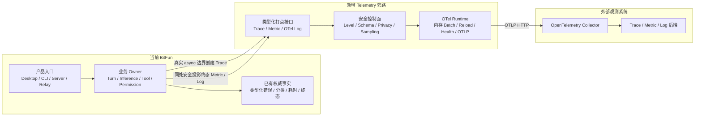
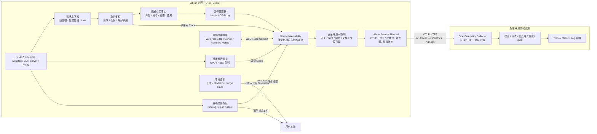

# **BitFun agent kernel 可观测性与 Telemetry 设计**


> 状态：设计方案
>
>
>
> 基线：`https://gitcode.com/OpenBitFun/bitfun_agent_kernel`
>
>
>
> 日期：2026-07-25
>
>


## **1. 背景与目标**


本文所说的安全“打点”，是在关键业务边界记录操作何时发生、持续多久、结果如何以及少量安全属性。它不等于增加普通日志。另有显式授权、独立隔离的 Debug 敏感日志通道用于远程排障；该通道不改变安全 Trace、Metric 和 Log 的类型与字段边界。


BitFun 的一次任务会跨越多个模块。当前缺少贯穿全流程的统一链路，导致慢请求和失败难以定位，也难以持续比较完成率、首次输出延迟（TTFT）和 Token 用量等关键指标。


BitFun 当前已经有日志、事件和局部耗时统计，但缺少统一上下文、字段规范和安全出口，具体表现为：


|需要回答的问题|当前不足|
|---|---|
|一次任务从提交到首个输出、最终完成分别花了多久|日志分散，无法还原端到端时序|
|慢在模型、工具、权限等待、上下文压缩还是远程链路|缺少统一 Trace 和父子关系|
|失败来自 Provider、网络、工具、权限、插件还是产品代码|错误分类不统一，难以聚合|
|新版本是否影响完成率、TTFT、Token、缓存和启动时间|缺少稳定 Metric 和版本对比基线|
|如何在不采集 Prompt、文件和身份的前提下发现问题|缺少统一隐私 schema 和出口控制|
|用户关闭遥测后是否真正停止上报|缺少统一 runtime 生命周期和关闭语义|


因此，本项目的目的不是简单增加日志量，而是建立一套可关联、可采样、可关闭、可审计的 Trace、Metric 和结构化 OTel Log 体系，用于产品质量、性能、稳定性和成本分析。

**日志、Telemetry、Hook、事件与审计的区别**

- 本地日志用于当前设备排障，可能包含较详细错误信息，它不自动上传。

- Telemetry 用于跨版本、平台和大量运行实例分析质量、性能和稳定性：默认只发送登记过的安全 Trace、Metric 和 OTel Log；Debug 另需独立授权并只发送封闭敏感记录。

- Hook 是业务执行链上的扩展点，可以检查、变换或拒绝调用。

- 产品事件用于进程内或跨模块同步已发生的状态变化；审计记录用于追溯权限和高风险操作，两者都不能由可采样、可丢失的 Telemetry 代替。


不同问题需要不同的数据处理方式。Trace、Metric 和 OTel Log 是数据形态、产生方式和成本均不同的三类信号：


|信号|核心问题和应用场景|最终数据形态|如何产生|不适合解决什么问题|
|---|---|---|---|---|
|Trace（调用链）|定位某一次请求为什么慢、失败发生在哪一步；分析父子调用、并发、等待、重试和取消|一棵由多个 Span 组成的单次请求时间线|业务 owner 在真实操作边界创建和结束 Span，通过链路上下文保持关系；数据量较大，通常按比例采样|不适合直接计算长期趋势，也不能保证每次请求都有记录|
|Metric（聚合指标）|判断一段时间内完成率、耗时分布、Token、缓存、CPU、内存、并发和队列是否变化|按有限维度聚合的累计值、数值分布或当前值，不保存单次请求过程|业务终态更新累计计数器（Counter），耗时和用量写入分布统计（Histogram），当前资源由可增减计数器或当前值采样；周期导出|不能还原某一次请求经过了哪些步骤；不能使用 Trace ID、路径等高基数字段拆分统计|
|OTel Log（结构化事件）|查询某次重试、降级、状态变化或某类错误在何时发生，并按条件检索|一条带事件名、时间、严重级别和安全属性的离散记录；存在 Trace 时可关联 TraceId/SpanId|业务或基础设施边界根据静态定义和类型安全事实生成；只发送登记字段，不转发普通日志原文|不表达完整调用层级，也不适合替代高频 Metric 或上传调试日志全文|


选择信号时先看要回答的问题：需要还原某一次执行过程时用 Trace，需要看整体趋势时用 Metric，需要检索离散状态变化时用 OTel Log。三类信号可以来自同一份完成事实，例如一次外部调用完成时同时结束 Span、更新耗时 Metric，并在发生重试或失败时生成 OTel Log；但不要求每个事实都生成三类信号。


掌握真实结果的业务模块（下文简称业务 owner）只产生开始、完成、耗时和结果等权威事实，统一 Telemetry 层负责字段和隐私校验，OTel Runtime 再通过相互独立的管线批量发送，Collector 负责接收并路由到对应后端。

### **1.1 目标**


本文设计的是 BitFun 通用 Telemetry 基础设施，不规定某个业务的根 Trace 和具体点位。需要完成以下横向设计：


|设计主题|本文给出的方案|
|---|---|
|能力边界|规定权威业务事实只能单向、安全地投影为 Telemetry；本地日志、Hook、产品事件、审计和远程观测保持独立职责与生命周期|
|信号模型|明确 Trace、Metric、结构化 OTel Log 的适用场景、数据模型、接口边界，以及如何由同一份业务事实组合产生|
|指标范围|覆盖业务质量与成本、BitFun 进程资源、运行时饱和度和 Telemetry 自观测；Desktop 不默认采集整机资源或硬件信息|
|并发与上下文|为 GUI、CLI/TUI、WebServer、Relay、远程开发和移动端定义请求级上下文隔离、显式传播、Trace Link、可信跨端传播和能力降级规则|
|接口与扩展|提供平台无关的统一入口、类型化静态定义、OTel 适配器、发送器和配置模型，使新业务不依赖 OTel SDK，SDK 或后端可替换|
|异常与崩溃|统一业务错误、超时、取消、发送器故障、Rust panic 和异常退出的分类与记录方式，并保证 Telemetry 不影响主流程|
|隐私与控制|通过字段白名单、出站校验、匿名安装 ID、遥测级别和关闭语义，保证安全信号不外发 Prompt、响应、路径及用户或机器身份；Debug 仅在独立授权后发送经过脱敏和截断的封闭敏感记录|
|行为一致性|统一不同入口的字段、生命周期和错误语义，并规定关闭、并发、新旧版本和能力缺失时的安全降级方式|
|数据交付|采用 OTLP/Collector、有界内存、批处理、重试、限流、丢弃、重配置和健康状态，保证交付行为及数据去向可解释|

### **1.2 系统边界**


一条完整链路包含三个角色，文档后续统一使用以下名称：


|角色|责任|是否属于第一阶段 BitFun 实现|
|---|---|---|
|BitFun Telemetry Client|在 Desktop、CLI、Server、Relay 等进程内产生安全信号，管理开关、Schema、采样、队列和 OTLP exporter|是|
|OTLP 接入端|由 OpenTelemetry Collector 承担，按标准 OTLP 接收、确认、限流、批处理和路由|使用标准组件并给出部署约束，不自研服务端协议|
|观测后端|存储和查询 Trace、Metric、Log，提供 dashboard、告警和保留策略|不在客户端实现范围内，但应当消费本文定义的字段契约|


其他边界如下：


- 是否新增点位以 BitFun 当前功能和隐私边界为准。

- 本地日志只保存在用户设备，用于排查当前实例；模型交换调试文件可能包含完整模型请求和响应，只用于显式本地诊断。普通远程 Telemetry 只发送登记过的安全统计和结构化记录；只有用户或运维明确授权的 Debug 敏感日志会通过独立 scope 和队列上传，且不会转发普通日志。

- Telemetry 服务端和数据存储分析平台属于配套建设，它们独立设计和部署，通过标准 OTLP 与 BitFun 客户端解耦。

- 用户画像不属于本方案目标；第一阶段告警只覆盖 Telemetry 交付质量和关键稳定性，不建设完整的通用告警平台。

## **2. 竞品分析**


调研基于 2026-07-22 拉取的官方仓库：Codex 提交 `4f3852107`，OpenCode 提交 `c9db6e9a1`。


本节只比较客户端插桩、信号建模、隐私边界和 exporter 设计，不以竞品使用的具体后端作为 BitFun 的接入目标。


### **2.1 Codex**


Codex 使用独立的 [`codex-otel`](https://github.com/openai/codex/tree/4f3852107e5eedeb4cb89b57a6d4a35b49f8a59a/codex-rs/otel) crate，分别管理 Provider、业务事件、Metric 和 W3C Trace Context。Trace、Metric、Log exporter 可以独立配置，支持 OTLP HTTP/gRPC、批处理和显式 shutdown。Log exporter 默认关闭；启用后只导出 `codex_otel*` target，但事件范围并不少，覆盖 conversation、API/WebSocket、SSE、Prompt、Tool 和 Sandbox 等。


值得借鉴的是独立 Provider、信号分离、批处理、target 隔离和独立开关。Codex 的 OTel Log 仍可能包含账号、邮箱、endpoint、错误原文、Tool 参数/输出，Prompt 也可由配置开启；这些字段不能作为 BitFun 的安全基线。


### **2.2 OpenCode**


OpenCode 使用 Effect OpenTelemetry 和 OTLP/HTTP，在 Agent、Tool、Plugin、Session 和 LLM 调用点直接创建 Span，并通过 Vercel AI SDK 采集 Provider、模型、时延、Token、缓存、Finish Reason 和重试等信息。默认 file logger 写本地；配置 OTLP endpoint 后，同一个 Effect 日志层会同时安装 file logger 和 OTLP logger，将通用应用日志发送到 `/v1/logs`。


值得借鉴的是在真实调用点创建 Span，让框架自动保持上下文。OpenCode 的通用日志实际可能包含 `cmd/args/cwd`、directory、URL、session ID 和 error/cause；BitFun 不照搬其通用日志直连 OTLP、环境变量主导配置和自由字段模式。


### **2.3 对比与选择**


|维度|Codex|OpenCode|BitFun 选择|
|---|---|---|---|
|主干|Rust OTel \+ `tracing`|Effect OTel \+ Node OTel|Rust OTel \+ `tracing`|
|Trace|独立 exporter、白名单 target|调用点原生 Span|调用点创建类型安全的 Span，根操作和层级由业务 owner 定义。|
|Metric|独立 Metric client|当前以 Log/Trace 为主|第一阶段提供 Counter/Histogram（累计计数、耗时分布、当前值 \+ 低频进程资源采样）|
|Log|默认关闭；白名单业务事件可进入 OTLP Logs，字段范围较宽|默认本地；配置 endpoint 后通用 Effect Log 可同时进入 OTLP|本地原始日志与结构化 OTel Log 分离|
|配置|信号独立、批处理、HTTP/gRPC|环境变量主导|产品 consent \+ 信号、采样、批处理和 OTLP HTTP endpoint 配置|
|内容|Prompt 默认关闭但可开启|LLM 默认元数据，应用日志仍有内容风险|Basic/Diagnostic 不发送内容；Debug 经独立授权后只允许封闭业务记录发送脱敏、截断的 Prompt、模型响应和 Tool 内容，身份与凭据仍禁止|
|身份|可含账号、邮箱、host|可含 username/session|仅伪匿名安装 ID 和短期运行 ID|


结论：BitFun 采用 Codex 的 Provider 分层、信号隔离和 OpenCode 的调用点 Span 思路。OTel Log 覆盖关键业务与运行时领域，但只能通过版本化 descriptor 和类型化字段产生；不复用两家的敏感字段，也不把普通 logger 直接连接 OTLP。


## **3. BitFun 现状与建设方式**


BitFun 不是从零建设。当前代码已经有大量事实和计时，核心工作是统一语义、安全出口和上下文，而不是重写业务链路。


|当前能力|现状|处理方式|
|---|---|---|
|Desktop 本地日志|`tauri-plugin-log`，支持文件轮转和 target 过滤|保留为本地原始日志，不自动进入 OTel Logs exporter|
|CLI/Server/Relay 日志|已使用 `tracing` / `tracing-subscriber`|复用 registry，增加只消费已登记 Log descriptor 的 OTel layer|
|Native/Web 启动计时|已有 `DesktopStartupTrace`、`startupTrace`|投影固定阶段和聚合耗时，不上传任意属性|
|Agent 生命周期|`AgenticEvent` 已覆盖 Turn、Round、Token、Tool、压缩等|仅安全投影 Metric，禁止整体序列化外发|
|模型交换调试|`ModelExchangeTraceSink` 可包含完整请求和响应|本地文件仍独立且不直接连接 exporter；Debug 授权时由同一 Model Exchange owner 另行构造封闭的 Inference 记录|
|配置|`app.telemetry: bool`，默认 `false`|已迁移为 V2 `off/basic/diagnostic/debug` 配置，Debug 另需敏感内容同意|
|Round/Tool/Token 耗时|owner 已有大量权威耗时和终态|直接复用，避免 Telemetry 再建第二套状态|


总体策略：复用现有 `tracing`、事件和权威耗时；新增统一 observability facade、隐私 schema、OTel runtime 和 exporter；不改造产品事件总线，不上传现有日志和模型交换文件。

### 3.1 跨产品形态的扩展与一致性


各产品形态共用 `Telemetry` 接口、静态信号定义、字段注册表和隐私规则。同一业务事实的名称、单位、结果分类及 owner 保持一致，入口差异只通过 `bitfun.entrypoint` 等受限枚举表达。某项平台能力不可用时省略对应信号，不能伪造 `0` 或猜测结果。


并发也使用同一规则：每个请求或任务持有独立的 `ObservationContext`，异步子任务显式继承它，共享后台工作使用独立 Trace 和 Link；取消或超时只结束当前操作。上下文只在经过认证的 BitFun 节点之间传播，不携带身份、路径或业务 ID；当前级别不采集 Trace 时退化为空实现。


各形态只实现以下差异：


|产品形态|运行组件与接入方式|形态特有能力和限制|
|---|---|---|
|Desktop GUI|Rust Desktop Host 持有运行组件和发送器；Web UI 通过类型化适配器提交安全事实和上下文|可增加页面加载和渲染 Metric；浏览器层不持有 Collector 凭据，也不直接构造 OTel 数据|
|CLI / TUI|Rust 入口直接注入 `Telemetry`；命令和后台任务分别持有上下文|可增加启动和交互延迟 Metric；按键、终端输出、窗口变化和重绘不逐条打点|
|WebServer / Relay|每个服务进程持有独立运行组件，凭据由服务端密钥提供器注入|可在安全上限内调整采样和容量；主机及容器资源由部署平台采集|
|远程开发|发起端记录自身边界，执行端记录权威结果；认证节点之间传播 W3C Trace Context|断连、旧版本或不支持上下文时降级为独立链路；不传递远端路径、机器或工作区身份|
|Web、Mobile Web 与未来原生移动端|Web 端通过认证的 Host 或 WebServer 适配器提交有限事实；未来原生端实现同一平台端口|浏览器不携带发送凭据，服务端重新校验事实；移动端可根据前后台、弱网和系统能力调整采样与发送时机|
|新增产品形态|只新增入口生命周期组装、平台能力适配器和可信上下文适配器，并声明支持的信号、资源项和发送能力|不修改平台无关接口或复制业务定义；调用方使用能力交集，新旧端组合不得因 Telemetry 不兼容而阻断产品功能|

## **4. 整体架构**


### **4.1 整体架构及与当前 BitFun 的关系**


当前 BitFun 保留原有职责；Telemetry 作为旁路能力接入，不替换 Agent 执行、事件总线、本地日志或模型调试链路。





这条主链路只有三个责任域：当前 BitFun 继续产生真实业务事实；新增 Telemetry 旁路将事实转换成安全信号并批量发送；外部系统负责接收、存储和查询。具体执行顺序如下：


1. `ExecutionEngine`、`RoundExecutor`、Inference、Tool 和 Permission owner 产生真实开始、结束、耗时和终态。

2. Trace 在真实 async 调用边界创建；同一个 owner 在结束 Span 时，用同一份类型化事实恰好各投影一次终态 Metric 和 OTel Log。公共 `AgenticEvent` 继续服务 UI/host，不承担遥测终态重建，也不为遥测扩充契约。

3. `bitfun-observability` 只接受类型化 facts，并根据静态 descriptor 检查 level、字段、类型、基数、采样和隐私规则。

4. `bitfun-observability-otel` 将安全记录映射为 OTel SDK 类型，在有界内存中按信号批处理，再通过附录 G.1 的三个 OTLP endpoint 发送。

5. Collector 完成接收、路由和后端适配；客户端按第 5 节处理成功、部分成功、重试、丢弃和运行时健康状态。

本地原始日志和 `ModelExchangeTraceSink` 始终走独立路径，不接入远程 Exporter。Web、Desktop、Server 和 Remote 只在经过认证的 BitFun hop 之间传播 W3C `traceparent`；安装 ID、Session ID 和 Baggage 不进入跨端上下文，也不注入模型、公共 MCP、插件脚本或任意第三方 URL。


### **4.2 核心技术机制**


#### **4.2.1 接口和 SDK 边界**


业务代码和 OTel SDK 之间分成两层。第一层是 portable `bitfun-observability`：它定义 Turn、Inference、Tool 等领域 facts、静态 descriptor 和隐私规则，并输出与具体 SDK 无关的 `ValidatedRecord`。第二层是 concrete `bitfun-observability-otel`：它消费 `ValidatedRecord`，映射为 OTel Span、Metric DataPoint 或 LogRecord，再交给 Exporter。


业务调用保持在领域层：


```Rust
let observation = start_turn(&telemetry, start_facts, parent_context);
let child_parent = observation.context();
let result = execute_turn(/* 原有业务参数 */).await;
observation.finish(turn_finish_facts(&result));
```


这段伪代码表达四件事：`start_turn` 记录开始时间和安全起始属性；`child_parent` 供 Round、Inference、Tool 等子操作建立父子关系；原有业务流程保持不变；`finish` 记录唯一终态、计数和耗时。安全 facts 只能包含类型化安全值，业务代码不能借此提交任意 attribute、JSON、EventName、日志正文或原始错误。Debug 使用另一套封闭记录枚举，只有真实 owner 可以构造固定 Turn/Inference/Tool/Approval 变体。Slash command 使用普通安全 facts，Recovery 事实则归回各自业务 owner，两者都不建 Debug 事件变体。


静态 descriptor 声明安全信号类型、字段、枚举、单位、基数、采样、保留类别和消费者；Schema Registry 是允许安全记录进入 Exporter 的唯一字段事实源。Debug 记录使用固定版本的封闭 schema，不加入任意字段注册。第一版固定 `opentelemetry 0.32.0`、`opentelemetry_sdk 0.32.1` 和 `opentelemetry-otlp 0.32.0`，只启用 Trace、Metric、Log、HTTP和 gzip 所需 feature。上层 contract 和插件 ABI 不暴露 OTel 类型，从而把 SDK Beta/RC API 的升级影响限制在 concrete service 内。


#### **4.2.2 隐私和运行时控制**


数据在三个位置受控：

|位置|作用|
|---|---|
|业务入口|安全接口只接受登记过的枚举、布尔值和数值。Debug 只接受封闭的 owner 记录，不接受任意事件名或任意 JSON 事件|
|Telemetry 运行组件|安全信号按字段注册表、级别、采样、速率和容量准入；Debug 先做结构化整值替换、自由文本模式脱敏和 256 KiB 头尾截断，再进入独立有界队列。拒绝只丢 Telemetry，不等待网络或影响业务|
|网络出口|发送前再次确认授权和当前 generation。用户关闭、降低级别或切换出口时撤销旧 generation；离开 Debug 立即清空未发送的敏感记录<br>|


`off/basic/diagnostic` 只能缩小安全采集范围，不能放宽安全 schema。`debug` 也不能绕过封闭记录、脱敏、截断、身份排除和容量限制。Collector 的校验只是数据离开设备后的服务端防御，不能替代客户端检查。


第一阶段不向插件开放 `Telemetry`、OTel SDK、发送器或任意属性接口。宿主只能投影自己掌握的插件类别、耗时和结果；插件自行联网不受本通道控制，由插件权限和沙箱治理。

### **4.3 最终输出产物**


下面是一条 `diagnostic` 级别、经过采样的 Agent Turn 在 Trace 后端中的期望形态。


```Plain Text
bitfun.agent.turn                                  completed   12.84s
├── bitfun.context.prepare                        completed    0.21s
├── bitfun.agent.round                            completed    9.20s
│   ├── bitfun.inference.request                  completed    3.74s
│   │   ├── bitfun.inference.attempt              failed       0.42s
│   │   │   error.type=network_unavailable
│   │   └── bitfun.inference.attempt              completed    3.12s
│   │       attempt.bucket=2, ttft=0.63s
│   └── bitfun.tool.execute                       completed    5.18s
│       └── bitfun.permission.evaluate            allow        1.41s
├── bitfun.agent.round                            completed    3.31s
│   └── bitfun.inference.request                  completed    3.26s
└── bitfun.persistence.save                       completed    0.08s
```


这棵树由多个 Span 组成：每一行操作都是一个 Span，缩进表示父子关系，`completed/failed` 是状态，末尾数值是耗时；`error.type`、`attempt.bucket` 等缩进行不是新的 Span，而是所属 Span 的业务属性。点击后端中的某个 Span 时，看到的是以下逻辑结构：


|部分|内容|是否每个 Span 独有|
|---|---|---|
|Resource / Scope|服务名、版本、产品入口、运行环境，以及产生信号的打点库名称和版本|否；通常由同一进程或同一打点库的一组 Span 共享|
|Span 核心结构|TraceId、SpanId、ParentSpanId、名称、开始/结束时间和状态|是；根 Span 没有 ParentSpanId|
|Span Attributes|`error.type`、结果分类、模型或 Tool 类别、Token 等登记过的安全业务字段|按 Span 的静态定义提供，不适用时可以没有|


远程产物中的 Key 按所有权分层，业务不能把它当作可任意追加字段的 Map：


|Key 层级|由谁设置|代表性内容|业务能否扩展|
|---|---|---|---|
|OTel 核心 Key|OTel SDK 和运行组件|TraceId、SpanId、ParentSpanId、时间戳、Span 名称和状态、Metric 数据点、Log 严重级别|不能；业务通过类型化接口触发，不能填写或覆盖|
|通用运行 Key|产品入口和运行组件|`service.name`、版本、运行环境、短期进程 ID、`os.type`、打点库名称和版本|不能；由构建信息和运行环境统一产生|
|BitFun 产品保留 Key|产品组装层和 Telemetry 基础设施|`bitfun.entrypoint`、字段规则版本、发布渠道、按接收方隔离的安装 ID|不能；只允许修改产品级字段契约|
|业务 Key|掌握事实的业务 owner|操作结果、Agent 模式、Workspace 类型、模型类别、Token、Tool 类别和安全错误类型|可以，但必须在领域打点模块中增加类型化事实和静态定义|
|后端派生 Key|Collector 或观测后端|慢请求分组、版本对比、完成率和服务目标状态|不从客户端发送，不属于客户端字段契约|


以下 Key 是 BitFun 对远程信号的必填要求；缺失时整条记录不发送：


|适用范围|必填 Key|条件必填 Key|
|---|---|---|
|所有远程信号|`service.name`、`service.version`、`service.instance.id`、`deployment.environment.name`、`bitfun.entrypoint`、`bitfun.telemetry.schema.version`、`InstrumentationScope.name`、`InstrumentationScope.version`|原生入口增加 `os.type`、`host.arch`；发布构建增加 `bitfun.release.channel`|
|Trace Span|TraceId、SpanId、Span 名称、开始时间、结束时间、状态|子 Span 必须有 ParentSpanId；失败 Span 必须有 `error.type`；领域定义可增加必填业务 Key|
|Metric 数据点|Metric 名称、类型、单位、时间和值|所有维度必须由静态定义声明；累计型指标必须声明聚合语义|
|OTel Log|事件时间、事件名、严重级别和固定正文|位于活动 Span 中时关联 TraceId/SpanId；错误事件必须有 `error.type`；领域定义可增加必填业务 Key|


BitFun 需要保留少量产品级 Key，因为 OTel 标准字段不能完整表达这些产品语义：


|Key|保留原因|
|---|---|
|`bitfun.entrypoint`|区分 Desktop GUI、CLI/TUI、Server、Relay、Web 和移动端等产品入口，支持跨形态比较；`service.name` 只能标识服务，不能稳定表达产品入口|
|`bitfun.telemetry.schema.version`|标识 `bitfun.*` 字段契约版本，使客户端、Collector 和查询在滚动升级期间能够兼容|
|`bitfun.release.channel`|相同应用版本可能来自 stable、beta 等不同渠道，需要支持灰度和版本回归分析|
|`bitfun.installation.pseudonymous_id`|在用户授权时支持跨启动的安装级趋势；ID 按接收方隔离，不能作为账号或设备身份|


业务扩展只能发生在“业务事实 → 类型化领域打点函数 → `bitfun-observability` 字段注册表”这一层。调用点、OTel 适配器、发送器、Collector 和插件接口都不能临时创建业务 Key。名称使用 `bitfun.<domain>.<field>` 或 `bitfun.<domain>.<subdomain>.<field>`：`bitfun` 后的领域段和可选的子领域/操作段必须来自受限注册表，末级字段也必须在静态定义中声明。插件名、Tool 名、模型名、路径、Session ID 等运行时值不能成为 Key 的任何一段；只有 `tool.kind`、`model_class` 等预先登记的有限分类可以作为字段值，路径和业务 ID 仍然禁止发送。完整命名规则和允许的二级、三级领域见附录 C.3。


同一个 Turn 还会产生聚合 Metric 和少量结构化 OTel Log。例如 `bitfun.agent.turn.total` 增加一次，`bitfun.agent.turn.duration` 记录 `12.84s`，Inference TTFT 和 Tool duration 进入各自 Histogram；第一次 Inference attempt 失败时产生一条 `bitfun.inference.request` Warn Log，并携带当前 TraceId/SpanId、`error.type=network_unavailable` 和重试分类。Metric 不携带 Trace ID 作为 label，Log 也不包含错误原文。


## **5. DFX 与数据交付**


本章中的 DFX 指 Telemetry 自身的可靠性、可观测性等。

### **5.1 故障和丢失处理**

Telemetry 采用尽力交付：数据可能因采样、容量、退出或网络故障而丢失，也可能因响应丢失后的重试而重复。


```Plain Text
业务记录 -> 安全检查 -> 有界内存 -> 后台批量发送 -> Collector
```


|情况|客户端行为|
|---|---|
|正常发送|Trace 和 Log 进入各自的内存队列，Metric 在内存中聚合；业务线程不等待网络|
|临时断网、限流或服务端繁忙|当前批次保持不变并按预算重试；其他发送名额仍可处理后续批次|
|配置、凭据或其他不可重试错误|停止当前出口并进入降级状态，不持续制造失败请求|
|队列已满或重试耗尽|释放当前记录或批次，只记录丢弃原因，不扩大内存或阻塞业务|
|用户关闭、降低级别或切换出口|立即停止接收并撤销旧运行实例；旧队列不会继续发送或改发到新地址|


Span 结束后即可独立入队，因此同一条 Trace 可以跨多个批次并乱序到达；Collector 根据 TraceId 和父子 Span 关系重建调用链。重试只处理原批次，不会撤销或重发已经完成的其他批次。无法确认 Collector 是否已收到的数据标记为“结果不确定”，不伪装成成功或明确未送达。


默认最多重试 `8` 次，采用 `1s` 起步、`30s` 封顶并带随机抖动的指数退避，总预算 `5min`。Trace 和 Log 各允许 `2` 个在途批次，Metric 允许 `1` 个，避免一个重试中的批次堵住全部后续数据。具体配置见附录 D，HTTP 结果处理见附录 G.2。


### 5.2 过载保护和自诊断


第一阶段只使用有界内存，不把待发送数据写入磁盘。所有限制都只作用于 Telemetry：达到上限时尽早返回空实现或丢弃新记录，不增加业务等待、取消业务请求或无限扩容。


|风险|处理方式|
|---|---|
|流式片段、终端输出或文件事件频率过高|业务先聚合为数量、字节数或耗时 Metric，不逐条生成 Span 或 Log|
|Metric 使用动态值导致维度持续增长|只允许登记过的有限维度；达到组合上限后拒绝新组合，已有统计继续更新|
|Collector 变慢、断网或队列积压|先减少低优先级信号，容量耗尽后丢弃新记录；不扩容、不落盘、不反压业务|
|发送器自身失败|只更新内存健康状态并写限速的本地安全日志，不能再通过同一个发送器上报“发送失败”|


初始保险丝包括：Trace 和 Log 各最多保留 `2048` 条、`8 MiB` 未终结数据；单个 Metric 最多 `256` 个维度组合，全进程最多 `4096` 个、`4 MiB` 聚合状态；待发送磁盘容量固定为 `0 B`；正常退出最多等待 `2s`。记录数和字节数任一达到上限即拒绝新数据。


运行组件对外提供关闭、启动中、正常、发送异常、队列积压和关闭中六种状态，并给出队列水位、重试、丢弃和最近成功时间。断网时服务端无法知道某个客户端为何没有数据，因此即时诊断来自客户端本地状态和安全日志；链路恢复后只能发送一次受限的聚合摘要，不能上传失败请求或错误原文。


组件落位见附录 A.3，全部配置和健康阈值见附录 D，容量、内存和并发验收见附录 F.2。


## **6. 实施路径**


以下是技术依赖顺序。`P0/P1/P2` 表示实现优先级而非故障等级：P0 是形成闭环所必需的核心链路，P1 是核心链路稳定后接入的扩展功能和跨端场景，P2 是不阻塞核心上线的性能与内部观测增强。


|顺序|目标|完成标志|完成后的业务效果|
|---|---|---|---|
|1. 安全和协议基线|Schema、字段 Manifest、No-op/In-memory exporter、配置迁移、Privacy Gate、安装 ID|不联网即可验证字段分类、level、关闭竞态、隐私 canary 和 OTLP 映射|业务可以按同一套规则开发打点，并在本地确认“采什么、什么不能采、关闭后会发生什么”；新增点位不会直接获得任意数据外发能力|
|2. Rust OTel 主干|独立 OTel service、三类 OTLP HTTP 请求、批处理、重试、reload、health、shutdown|完整/部分/失败响应符合附录 G，DFX 计数可解释，`off` 无网络发送|测试环境中的 Trace、Metric 和 OTel Log 能够稳定到达 Collector；研发可以看到数据是否已发送、积压、丢弃或失败，网络和服务端故障不会影响产品功能|
|3. P0 核心链路|Startup、Session、Turn、Round、Inference、Token、Tool、Permission、Compression|单进程 Trace/Metric/OTel Log 闭环可用，字段符合附录 schema|Desktop GUI、CLI/TUI、WebServer、Relay、远程开发和支持的 Web/移动端可以用一致口径观察运行问题；多任务并发时链路不会串线，能够区分业务故障与 Telemetry 自身故障|
|4. P1 扩展与跨端|Web/Tauri、Server/Remote context，Subagent、Deep Review、Plugin、MCP|受信任 hop 可关联，旧端可降级，第三方边界不泄露 context|数据能够实际回答版本前后成功率和耗时是否变化、一次慢请求卡在哪里、失败属于哪一类、Token 和资源成本如何变化，而不依赖上传 Prompt、路径或错误原文|
|5. 生产启用|Collector DFX、dashboard/SLO、保留、访问控制、删除和回滚|交付质量、队列、告警和隐私策略明确后才连接生产 endpoint|产品和研发可以持续发现版本回归、定位线上稳定性问题并评估优化效果；数据由谁访问、保留多久、如何停用和删除都有明确规则|

正文到此已经给出方案的技术选型、数据流、核心接口、安全边界、故障语义、容量和生产依赖。附录用于实现时查询精确模块位置、接口、字段、配置、点位、验证清单和 OTLP 线协议。


**---**

# 技术附录


## 附录 A：模块落位与复用边界


### A.1 详细组件关系


正文 4.1 只展示主数据流；实现时各组件的完整关系如下：





### A.2 仓库落位


|层|建议位置|职责|
|---|---|---|
|稳定契约|`src/crates/contracts/runtime-ports`|两个真实跨进程消费者接入后承载 `TraceContextEnvelope`|
|平台无关打点层|新增 `src/crates/execution/observability`|静态信号定义、类型化 Span/Log、Metric 统一入口、隐私字段规则、`AdmissionController` 和关闭/超限时的空实现|
|Agent 终态投影|`src/crates/assembly/core` 的真实业务 owner + `src/crates/execution/observability` 的类型化终态句柄|owner 结束 Span 的同处，用同一份类型化事实投影终态 Metric 与 OTel Log；Log 仅关联采样的 W3C Span context；不得经公共事件往返重建|
|具体 SDK 和发送层|新增 `src/crates/services/observability-otel`|OTel 信号提供器、OTLP、批处理、TLS、重配置、进程资源采样和健康状态|
|产品组装层|`src/crates/assembly`|注入统一接口、注册事件订阅者并选择具体 OTel 服务|
|产品入口|Desktop GUI、CLI/TUI、Server、Relay；未来原生移动端对应的 `src/apps/*`|组装平台能力适配器；拥有本地运行组件的入口安装一次日志/Trace 分发层并管理生命周期，没有本地发送器的入口注入空实现或代理端口|
|前端适配层|`src/web-ui/src/infrastructure/observability`、`src/mobile-web` 对应基础设施目录|浏览器计时、有限事实投影和可信 Trace Context 注入；不持有 Collector 凭据或直接暴露任意遥测接口|


依赖方向：`contracts <- execution/observability <- assembly/apps`；`execution/observability <- services/observability-otel <- assembly/apps`。平台无关打点层不依赖 agent-runtime、assembly 或 app，避免 Rust 模块之间形成循环依赖。


### A.3 复用和新增


|能力|处理方式|
|---|---|
|`tracing` / `tracing-subscriber`|复用调用点和订阅注册机制，不远程导出普通日志来源|
|`AgenticEvent` / `EventRouter`|继续作为 UI/host 业务事件；不序列化整个事件，也不重建终态遥测|
|Round/Tool/Token/Startup 已有耗时|复用为 Metric 事实源|
|`DesktopStartupTrace` / Web `startupTrace`|保留本地时间线，只投影固定阶段|
|`ModelExchangeTraceSink`|本地文件保留且不直接连接 Telemetry exporter；Debug Inference 记录由其 owner 经封闭 API 发送|
|Desktop/CLI 本地日志|保留本地，禁止通用 Log bridge 外发|
|OTel Provider、OTLP Exporter、和 HTTP 客户端|复用 `opentelemetry 0.32.0`、`opentelemetry_sdk 0.32.1` 和 `opentelemetry-otlp 0.32.0`，只启用 Trace、Metric、Log、HTTP 和 gzip 所需功能；不自研 OTLP 协议和三类信号数据模型|
|OTel SDK 默认 `BatchSpanProcessor` / `BatchLogProcessor`|现有实现可复用其单队列、定时批量和 drop-new 基础能力，但同一信号一次只发送一个批次，并且只按记录数限制容量|
|`BoundedBatchScheduler`|在 `observability-otel` 中新增；负责每类信号最多两个在途批次、批次字节上限、重试状态、容量名额和逐批次终态。达到该目标前，不能把现有实现描述成已经支持同信号并发发送|
|`AdmissionController`|在平台无关打点层新增并由每个进程共享；按固定顺序执行 level/采样、单记录、单操作、静态定义速率、进程入口、活动 Span 和 Metric 状态预算，拒绝后返回空实现或丢弃记录，不把保险丝散落到 Agent/Tool 等业务代码|
|`PipelineCounters`、`Guarded*Exporter` 和 `TelemetryRuntime::health()`|复用现有原子计数、发送结果拦截和内存快照骨架；扩展为按运行实例/信号统计的 `DiagnosticsStore`，并增加 `BatchTicket`、队列水位、时间窗口和健康状态计算|
|本地日志设施|复用 Desktop/CLI/Server/Relay 已有本地日志输出；新增固定的 `bitfun_telemetry_internal` target、远程桥接排除规则、`5min` 限速和重复次数汇总|
|`RecoveryReporter`|新增恢复窗口状态和固定 `bitfun.telemetry.export.recovered` 描述；最多每个故障窗口一条，且明确禁止由自身失败再次触发|
|类型化字段规则、隐私校验门、Metric/OTel Log 静态定义|新增平台无关能力|
|OTel 信号提供器、发送器和可替换运行实例|新增具体服务|
|进程 CPU/实际物理内存采样器、请求上下文隔离和退出标记|新增通用运行能力；通过服务和产品入口适配器处理平台差异|


## 附录 B：接口设计


### B.1 总体接口


|接口|形态|调用方|约束|
|---|---|---|---|
|`Telemetry`|可复制的平台无关统一入口|各业务、服务和入口 owner|只暴露领域函数，不暴露任意属性 API|
|`TelemetrySpan`|Span \+ 类型安全的终态句柄|异步调用点|异步任务使用 `.instrument(span)` 绑定上下文；不能跨 `.await` 持有临时进入 Span 的守卫对象|
|领域 Trace 函数|`start_xxx(&Telemetry, &StartFacts) -> TelemetrySpan`|对应领域 owner|新特性新增函数和静态定义，不修改一个不断膨胀的统一 trait|
|领域 Metric 函数|类型化 observation 的终态 finish，或 `record_xxx(&Telemetry, &MetricFacts)` 聚合入口|对应业务 owner|只能引用预注册的指标工具（instrument）；同一终态事实恰好发一次|
|`LogDescriptor`|静态名称/版本、严重级别、正文模板、字段和采样类别|各业务与基础设施 owner|静态定义必须登记，调用方不能动态创建事件名或正文|
|领域 Log 函数|类型化 observation 的终态 finish|对应领域 owner|只接受类型安全事实，不接受任意消息、JSON、错误文本和调用栈；诊断级别关联同 owner Span 的 W3C context|
|`TelemetryRuntimeHandle`|`policy_snapshot`、`apply_config`、`force_flush`、`shutdown`、`health`|应用生命周期和 assembly|业务、插件和 UI 不可直接操作发送器|
|`TelemetryCapabilities`|字段规则版本、支持的信号和进程资源项、发送器所有权、可信上下文传播能力|产品 assembly 和形态适配器|只用于选择能力交集；不包含 endpoint、凭据、用户身份或动态业务状态，能力不足时安全降级|
|`TelemetryBackend`|接收 `ValidatedRecord` 的内部后端接口|具体 OTel 服务|不从 `bitfun-core`、SDK、插件二进制接口再次对外暴露|


### B.2 Trace 接口和结构


框架只规定 Trace 的通用契约，不规定业务 Span 名称和层级：


|元素|契约|
|---|---|
|根上下文|由入口或业务 owner 为一个可独立完成、取消和计量的请求或任务创建；不得从全局“当前请求”推断|
|`SpanDescriptor`|静态声明名称、版本、level、允许字段和采样类别；由业务 owner 注册，运行时不能动态拼接名称|
|开始事实（Start facts）|只包含开始时已经确定的安全枚举、布尔值和数值，不放业务 ID、名称、内容或路径|
|完成事实（Finish facts）|由 owner 的统一出口提供结果分类、安全错误类型、耗时和有限数值；同一 Span 只能完成一次|
|`ObservationContext`|只读、可 Clone，显式传递 Trace/Span 关系；不能携带安装 ID、Session ID 或任意附加业务键值|
|Trace Link|表达多个并行任务汇合、共享后台工作和长任务之间的非父子关联，避免制造错误层级或超长根 Span|
|`TelemetrySpan`|封装 SDK Span 和可重复调用但只生效一次的终态句柄；对象被释放或发生 panic 时只能标记 `incomplete`，不能猜测业务结果|


异步规则：


|场景|规则|
|---|---|
|普通异步调用|外层包装函数创建 Span，`.instrument()` 将 Span 绑定到具体实现，统一出口记录终态|
|并发子任务|每个 Future 绑定创建时的显式上下文，不能读取全局最近活动 Span|
|重试|是否为每次尝试建立子 Span 由业务 owner 决定；框架保证每次尝试的上下文隔离和唯一终态|
|取消/超时|记录稳定结果分类和错误类型，不记录原因原文|
|panic/栈回退|未正常完成的句柄标记为 `incomplete`|
|并行拆分/汇合|单 owner 子任务使用父子关系；共享工作使用新 Trace \+ Link|
|跨进程|只从认证 BitFun peer 接受版本兼容的 `TraceContextEnvelope`，否则建立新根|


### B.3 Metric 接口


|Metric 类别|推荐指标类型|事实来源|为什么这样选 / 接口要求|
|---|---|---|---|
|业务数量和结果|累计计数器（`Counter`）|业务 owner 的统一终态|每完成一次就增加一次，适合计算总量、失败率和完成率；由领域函数引用预注册的静态定义|
|业务时延、用量和大小分布|分布统计（`Histogram`）|owner 持有的权威耗时或计量值|每次写入一个数值，系统按固定区间聚合，可计算 P50/P95 等分位数；单位和区间必须固定|
|活动请求和运行时并发|可增减计数器（`UpDownCounter`）或采集时读取当前值（`ObservableGauge`）|请求调度器、队列或资源 owner|能可靠记录开始/结束时使用前者；已有权威当前值时使用后者。增减必须配对，新进程从零开始|
|进程 CPU|累计 CPU 时间（单调 `Counter`）\+ 区间利用率（`ObservableGauge`）|平台进程采样器|前者记录进程累计使用了多少 CPU 时间，后者记录采样区间内的利用率；采样失败时省略该点|
|进程内存|采集时读取当前值（`ObservableGauge`，单位 bytes）|平台进程采样器|第一阶段至少覆盖进程实际占用的物理内存（RSS）；不采集整机总内存、其他进程和硬件型号|
|进程线程和文件资源|采集时读取当前值（`ObservableGauge`）|平台进程采样器|仅在平台语义稳定时启用，缺失不视为业务故障|
|Telemetry 队列和交付|累计计数器 \+ 分布统计 \+ 当前值|Telemetry 运行组件|分别记录丢弃/重试总数、发送耗时分布、当前/历史最高队列水位和距上次成功的时间|


这里的三类指标并非只是命名不同：累计计数器保存“到现在共发生多少次”；分布统计保存“一批数值大致落在哪些区间”；当前值表示“采集这一刻是多少”。因此请求总数不能使用当前值，单次耗时也不能使用累计计数器，否则后端无法正确计算速率或分位数。


Metric 禁止使用 Trace ID、Session ID、路径、URL、用户定义名称、服务地址和错误原文作为拆分统计的指标维度（label）。时间统一使用秒，数据量使用字节（bytes），Token 使用整数。采样 Trace 可以作为示例关联（exemplar）附在某个统计点上，但 Trace ID 不能成为指标维度，否则每条 Trace 都会创建一组新的统计序列。


业务 Metric 通过 `record_xxx(&Telemetry, &MetricFacts)` 一类领域函数接入。进程资源不要求业务模块主动打点，由 services 层的 `ProcessMetricSource` 提供可选快照，运行组件低频采样并优先映射稳定的 OTel 进程字段；没有稳定标准字段时才使用版本化 `bitfun.process.*` 字段。


### B.4 OTel Log 和发送器接口


|项目|设计|
|---|---|
|本地原始日志|继续使用现有 `log` / `tracing` 文件和控制台，可以保留本地诊断所需细节，但不自动进入远程 OTel Log 发送器|
|结构化 OTel Log|业务 owner 从类型安全事实生成 `LogRecord`，经隐私校验门和字段注册表后通过 OTLP `/v1/logs` 发送|
|Debug 敏感 OTel Log|业务 owner 构造封闭 `DebugTelemetryRecord`，经脱敏和截断后使用独立 scope/队列通过同一 `/v1/logs` 发送|
|LogRecord|事件时间、客户端观察时间、事件名、严重级别、固定正文、类型安全属性，以及可选 TraceId/SpanId|
|事件名 / 正文|事件名来自版本化静态定义；正文只能使用静态定义中的固定模板，调用方不能提交自由文本|
|严重级别与采样|安全 Error/Warn 不做概率采样；低频状态变化 Info 全量；高频成功 Info 按静态规则采样。`TelemetryLevel::Debug` 的敏感记录不做概率采样，使用独立容量保护；它与普通日志的 DEBUG severity 不是同一个概念|
|Trace 关联|处于活动 Span 中的 LogRecord 自动带 TraceId/SpanId；跨 Trace 的后台状态不伪造父子关系|
|禁止字段|安全 Log 禁止 `error.to_string()` 原文、调用栈、路径、URL、请求体、Prompt、模型输出、Tool 参数/结果、用户和机器身份；Debug 仍禁止调用栈、独立用户/机器身份和未脱敏凭据|
|发送实现|生产配置只提供 `none`（不发送）和 `otlp_http`；`local_safe_jsonl`、`in_memory` 仅由开发和测试环境注入，不是用户可配置出口|
|生产链路|按标准 OTLP HTTP 的三类信号通道发送到 Collector，再做后端路由和协议转换|

Debug 敏感 Log 与安全信号复用业务操作事件名，例如 `bitfun.agent.turn`、`bitfun.inference.request`、`bitfun.inference.attempt`、`bitfun.tool.execute` 和 `bitfun.permission.*`；生命周期阶段由封闭记录的 `record_type` 区分。独立 instrumentation scope、`data_class=debug_sensitive` 和 `bitfun.debug.*` 信封元数据负责通道隔离，不另建一套 `bitfun.debug.<domain>.*` 业务命名空间。

内容字段统一使用 `DebugContentField { value, original_size_bytes, truncated }`。脱敏发生在截断之前，所有内容字段共享确定性的记录预算，外层记录再执行 256 KiB 兜底。路径、命令和业务关联 ID 只允许出现在这一通道；账号、邮箱、组织、设备身份和凭据仍禁止。Turn 修改路径由当前 Turn Snapshot 事实生成，Tool `part_index` 由 `tool_call_order` 生成，均不从普通日志或 Display 文本反推。

Compression 的压缩后 Token 是本地估算时，字段必须命名为 `tokens_after_estimate`；没有 provider 精确值时不得冒充 `truePostCompactTokenCount`。模型压缩调用的 Usage 仅在 provider 返回时透传，本地 fallback 保持缺失。


结构化事件的静态定义按责任分为四类，但具体事件名和触发点仍由对应 owner 定义：


|类别|适用事件|约束|
|---|---|---|
|业务状态|业务操作完成、取消、重试、拒绝和稳定错误类别|必须来自业务 owner 的权威事实，不从普通日志反推|
|应用与进程生命周期|就绪、关闭、组件降级/恢复和上次异常退出|只记录固定阶段、状态和耗时，不记录 panic 文本和调用栈|
|基础设施状态|连接变化、限流、队列阈值越界和持久化结果|只允许稳定的操作、状态、结果和错误类型，不记录服务地址、传输内容和路径|
|Telemetry 自身|发送器恢复、背压解除和前一周期丢弃摘要|当前发送失败只写本地并更新内部 Metric，避免递归上报|


下面仅用一次外部请求失败说明 LogRecord 的规范化形态，不把该 EventName 规定为基础设施必备点位，也不要求业务代码构造 JSON。


```JSON
{
  "timestamp": "<event-time>",
  "observed_timestamp": "<observed-time>",
  "severity_text": "WARN",
  "event_name": "bitfun.inference.request",
  "body": "Inference request finished",
  "trace_id": "<otel-trace-id>",
  "span_id": "<otel-span-id>",
  "attributes": {
    "bitfun.inference.provider_class": "openai_compatible",
    "bitfun.inference.model_class": "general_reasoning",
    "bitfun.inference.protocol_class": "responses",
    "bitfun.inference.attempt.index_bucket": "2",
    "http.response.status_code": 503,
    "bitfun.inference.request.outcome": "failed",
    "error.type": "network_unavailable",
    "bitfun.inference.request.retryable": true,
    "bitfun.inference.request.duration_ms": 842
  }
}
```


## 附录 C：字段与隐私规则


### C.1 字段注册表


每个静态信号定义必须声明：


|元数据|用途|
|---|---|
|名称 / 版本|稳定名称和发生不兼容变更时的版本|
|信号 / 最低级别|信号类型和最低授权级别|
|Key 层级 / 命名空间|OTel 核心、通用进程、BitFun 产品保留或业务 Key，以及登记的领域/子领域|
|owner 模块|掌握事实的代码模块，不表示人员分工|
|字段|类型、必填性、枚举、长度，以及能否作为 Metric 维度|
|维度组合预算|单字段取值数和多字段组合数上限|
|采样 / 速率 / 保留类别|保留比例、持续速率、token bucket 突发量和逻辑保留类别；缺少速率预算的定义不能注册|
|操作级预算|该定义在一个可选业务操作中最多产生多少 Span/Log；高频且没有操作上下文的来源必须使用进程/定义速率预算|
|频率类型|`low/normal/aggregate_only` 固定枚举；Token、流式片段、终端输出、按键和文件事件等 `aggregate_only` 来源禁止逐条产生 Span/Log|
|消费方|数据看板、告警、版本回归或成本查询|
|替代关系|旧定义如何退场，以及由哪个新定义替代|


内部使用版本化 `bitfun.*` 字段规则。发送适配器只映射已经稳定的 OTel 标准字段约定；仍在开发中的 GenAI 字段约定放在独立版本映射模块，不能直接改变内部字段含义。


### C.2 字段分类和共享必填契约


本节是字段所有权和共享必填条件的详细契约。OTLP 核心字段属于协议标准结构，不注册成普通属性；OTel 标准字段和 BitFun 扩展字段都必须在机器可读字段清单（Manifest）中标明来源、设置方和必填条件，不能只靠字段名猜测。Collector 或后端生成的慢请求分组、完成率和服务目标状态属于派生字段，不从客户端发送。


|字段|分类|必填条件|来源和约束|
|---|---|---|---|
|`service.name`|OTel 标准|启用任一信号|固定产品入口服务名，如 `bitfun-desktop`；不接受用户输入|
|`service.version`|OTel 标准|启用任一信号|构建版本，限制长度和字符集|
|`service.instance.id`|OTel 标准|启用任一信号|每次进程启动随机生成，不持久化|
|`deployment.environment.name`|OTel 标准|启用任一信号|`production/staging/development/test` 固定枚举|
|`InstrumentationScope.name`|OTLP 核心|启用任一信号|固定为 `bitfun-observability`；位于 OTLP Scope 结构，不作为普通 Attribute|
|`InstrumentationScope.version`|OTLP 核心|启用任一信号|打点库版本；位于 OTLP Scope 结构，不作为普通 Attribute|
|`os.type`|OTel 标准|原生应用入口|从编译目标映射，不读取机器名|
|`host.arch`|OTel 标准|原生应用入口|从编译目标映射，固定枚举|
|`bitfun.entrypoint`|BitFun 扩展|启用任一信号|`desktop/cli/server/relay/web/mobile_web/mobile_native` 固定枚举；`mobile_native` 为未来保留值，不表示当前已有原生移动端实现|
|`bitfun.release.channel`|BitFun 扩展|发布构建|固定发布渠道，不包含下载来源 URL|
|`bitfun.installation.pseudonymous_id`|BitFun 扩展|用户授权且存在明确接收方范围|使用按接收方隔离的 HMAC 摘要；本地根 ID 永不发送|
|`bitfun.telemetry.schema.version`|BitFun 扩展|启用任一信号|标识 BitFun 扩展字段规则的主版本|


不保留 `bitfun.platform.class`：操作系统由 `os.type` 表达，产品运行入口由 `bitfun.entrypoint` 表达，继续保留第三个字段会产生 `macos` 与 `native/web/remote` 两种相互冲突的解释。


消费者必须忽略未知的可选 `bitfun.*` 字段并保留同一记录中的已知字段，不能因为滚动升级期间出现新字段而拒绝整个批次；改名、改类型或改变已有语义必须升级字段规则的主版本。


TraceId、SpanId、ParentSpanId、Span 时间、Metric DataPoint 时间和 Log Timestamp 使用对应 OTLP 字段，不重复创建 `bitfun.trace_id`、`bitfun.duration` 等副本。业务属性遵循以下规则：


- OTel 已有完全相同且稳定的语义时，直接使用标准字段。例如 HTTP 状态使用 `http.response.status_code`，错误分类使用 `error.type`。

- 只保留聚合分类而不是标准原值时，必须进入对应的 `bitfun.<domain>.*` 命名空间。例如模型请求只记录 `2xx/4xx/5xx` 时使用 `bitfun.inference.request.http_status_class`，不能伪装成标准 HTTP 状态字段。

- `bitfun.inference.request.duration_ms`、`bitfun.inference.request.retryable` 等字段是 BitFun 扩展；其类型、单位和适用信号必须由静态信号定义声明。

- Metric 维度只能使用字段清单标记为安全的有限枚举、布尔值和固定区间；TraceId、Session ID、路径、URL、服务地址和错误原文不能成为维度。

- `host.name`、设备序列号、用户名、姓名、邮箱、账号/组织 ID、IP、MAC、机器 ID、仓库标识和业务 Session/Dialog Turn ID 不进入 Resource。


### C.3 业务 Key 扩展与命名


业务只能在所属领域的打点模块中扩展 Key。调用点提供类型化事实，`bitfun-observability` 完成静态定义和注册，OTel 适配器只做机械映射：


|位置|可以做什么|不能做什么|
|---|---|---|
|业务 owner 的领域打点模块|定义 `StartFacts`、`FinishFacts`、`MetricFacts`、`LogFacts` 和对应静态信号定义|接受任意 Map、JSON、日志正文、错误原文或运行时生成的 Key|
|`bitfun-observability` 字段注册表|登记名称、类型、必填性、枚举、单位、隐私级别、维度资格、采样和容量预算，并生成字段清单|根据字段值猜测类型或允许未登记字段透传|
|`bitfun-observability-otel`|将已校验记录映射到 OTel SDK 和 OTLP|新增业务语义、改名、补业务默认值或读取业务对象|
|插件接口|第一阶段不开放业务 Key 扩展；宿主只能记录自己掌握的 `plugin` 领域安全事实|让插件提交自定义事件名、属性、日志正文或直接操作 OTel SDK|
|Collector / 后端|生成查询、分组和告警所需的派生字段|把派生字段反向定义成客户端必填业务 Key|


自定义名称遵守以下规则：


1. OTel 已有含义完全一致且稳定的标准字段时，必须使用标准名称，不能再创建 `bitfun.*` 同义字段。

2. BitFun 业务属性使用 `bitfun.<domain>.<field>` 或 `bitfun.<domain>.<subdomain>.<field>`；Span 和 EventName 使用 `bitfun.<domain>.<operation>`，Metric 名称再增加稳定的测量项，例如 `bitfun.agent.turn.duration`。

3. `bitfun` 后的二级 `<domain>` 和三级语义段（子领域或操作）都必须来自字段注册表的受限枚举。新增领域或操作需要先登记 owner、用途、消费者和隐私边界，不能由调用方动态创建。

4. 各段使用小写 `snake_case`，层级使用点号分隔；名称表达稳定语义，不包含插件名、Tool 名、模型名、Provider 名、路径、URL、Session ID 或其他运行时值。

5. 取值放在字段值中，不能编码进 Key。例如使用 `bitfun.tool.kind="shell"`，不能生成 `bitfun.tool.shell.duration`。

6. 同一 Key 的类型、单位和含义一经发布不得改变；新增可选 Key 属于兼容变更，改名、改类型、改变单位或复用旧 Key 表达新含义必须升级字段规则主版本。


第一阶段允许的二级领域和三级名称如下。表中未列出的名称默认拒绝；后续可以按上述登记流程做兼容性扩展：


|二级领域|允许的三级名称（子领域/操作）|负责的稳定语义|
|---|---|---|
|`app`|`startup`、`shutdown`、`lifecycle`|应用启动、关闭和固定生命周期阶段|
|`telemetry`|`schema`、`runtime`、`queue`、`export`、`config`|字段版本、运行状态、队列和发送质量|
|`agent`|`turn`、`round`、`context`、`compression`|Agent 对话执行和上下文处理|
|`inference`|`request`、`attempt`、`usage`、`cache`|模型请求、重试、Token 用量和缓存|
|`tool`|`execute`|Tool 分类和执行结果，不包含 Tool 自定义名称和参数|
|`permission`|`evaluate`|权限判断类别、结果和耗时|
|`workspace`|`lifecycle`|local/remote 等固定工作区类型和生命周期，不包含路径或仓库|
|`remote`|`connection`、`request`|受信 BitFun 节点之间的连接和请求状态|
|`persistence`|`load`、`save`|持久化操作类别、结果和耗时，不包含存储 Key 或内容|
|`plugin`|`lifecycle`、`invoke`|BitFun 宿主掌握的插件运行事实，不包含插件名称、参数或结果|
|`process`|`cpu`、`memory`、`thread`、`file`|BitFun 自身进程资源|


`bitfun.entrypoint`、`bitfun.telemetry.schema.version`、`bitfun.release.channel` 和 `bitfun.installation.pseudonymous_id` 是产品级保留 Key，不开放给业务领域；其中字段规则版本位于受限的 `telemetry.schema` 命名空间，但仍只能由 Telemetry 基础设施设置。字段注册表应分别维护“产品保留 Key”和“业务领域 Key”，防止业务 owner 占用产品命名空间。


### C.4 安全错误类型


|允许的 `SafeErrorType`|
|---|
|cancelled、timeout、authentication、rate\_limited、network\_unavailable、network\_protocol|
|invalid\_request、context\_overflow、tool\_validation、permission\_denied、persistence、provider|
|internal、other|


错误必须从 Rust 类型中的明确分支（variant）映射。新错误默认归 `other`，禁止通过错误显示文本、模型服务商响应正文或正则表达式推断类别。


### C.5 安全遥测禁止数据与 Debug 硬边界


|类别|禁止内容|
|---|---|
|模型|Basic/Diagnostic 禁止 API 请求/响应、请求头、URL 查询参数、Prompt、输出、思考/推理内容；Debug 可发送脱敏和截断后的封闭请求/响应记录|
|Tool|Basic/Diagnostic 禁止参数、结果、命令、终端输入输出、拒绝和取消原文；Debug 可发送 owner 构造的 Tool/Approval 固定记录|
|文件与项目|Basic/Diagnostic 禁止文件内容、代码差异、路径、工作目录、仓库 URL、分支名、远端机器名；Debug 可发送排障所需路径、仓库根、分支和基线提交，不发送独立机器身份|
|用户与设备|用户名、邮箱、账号、组织、机器名、设备 ID、IP、MAC|
|凭据|API key、令牌、Cookie、身份凭据和环境变量|
|错误|Basic/Diagnostic 禁止原文、调用栈、模型服务商原始响应；Debug 可发送脱敏和截断后的 owner 原始错误，不发送调用栈|
|扩展|Basic/Diagnostic 禁止 Skill/Agent/Hook 文本、插件传输内容、MCP 参数/结果、自定义名称；Debug 只允许固定 Tool/Inference 字段，不提供插件任意事件接口|
|媒体|图片、音频、附件内容和文件名|


三道防线：调用点没有敏感字段；字段注册表校验类型和维度组合数量；发送器再按禁止字段表和长度限制兜底。出口兜底不能成为允许业务提交任意数据的理由。


### C.6 安装 ID 和链路上下文


|项目|规则|
|---|---|
|本地根 ID（root ID）|首次启用时生成 UUID v4，原子写入应用数据目录，在 Unix 上权限为仅当前用户读写（`0600`）；该值永不发送|
|按接收方隔离的 ID（scoped ID）|使用带密钥的不可逆摘要 `HMAC-SHA256(root_id, version + audience)` 计算并截断后发送；不同 Collector 得到不同 ID|
|接收方范围（audience）|由 Collector 的协议、域名、端口和凭据命名空间生成，不包含 URL 路径或查询参数，不允许调用方任意复用|
|短期进程 ID（instance ID）|每次启动随机生成，不持久化|
|重置（reset）|撤销当前运行实例、丢弃队列、删除本地根 ID；只影响未来关联|
|`TraceContextEnvelope`|版本、`traceparent`、可选 `tracestate`；不含任意附加业务键值、安装 ID、Session ID|
|信任边界|只有经过认证的 BitFun 对端才采用远端父上下文；不可信上下文直接忽略|
|`tracestate`|第一版不生成自定义值，只保留已登记的 BitFun 厂商键|
|第三方|模型、公共 MCP、插件脚本和任意外部 URL 默认不注入 Trace Context|


## 附录 D：配置


现有 `app.telemetry: bool` 兼容迁移：`false -> off`、`true -> basic`，保存后写 V2 版本化配置。V1 保持可读；未知新版本保留原值但按 `off` 执行。


|配置|默认|语义与校验|重配置|
|---|---|---|---|
|`version`|`2`|未知高版本拒绝启用并保留原配置|否|
|`level`|`off`|`off`（关闭）/`basic`（基础聚合）/`diagnostic`（增加采样 Trace）/`debug`（增加独立敏感 Log）|降低立即撤销 generation；离开 Debug 清空未发送敏感记录|
|`sensitive_content_consent`|`false`|Desktop Debug 必须为 `true`；Server/Relay 仅把 `BITFUN_TELEMETRY_LEVEL=debug` 视为显式运维授权|随 level 重配置|
|`signals.traces`|`true`|仍受 level 限制|可重载|
|`signals.metrics`|`true`|仍受 level 限制|可重载|
|`signals.logs`|`true`|控制结构化 OTel Log；仍受遥测级别和隐私校验门限制|可重载|
|`logs.minimum_severity`|level 默认值|`basic=info`、`diagnostic=debug`；用户或组织策略只能提高阈值|新 LogRecord 生效|
|`logs.success_sample_ratio`|`basic=0.1`、`diagnostic=0.5`|仅作用于高频成功 Info/Debug；Error/Warn 和低频状态变化不采样|新 LogRecord 生效|
|`logs.max_records_per_operation`|`128`|单个可选业务操作的 Log 上限；没有操作上下文时只使用静态定义和进程速率预算|新记录生效|
|`logs.low_priority_queue_ratio`|`0.75`|固定为 `0.75`；达到该水位后停止接收 Info/Debug，为 Warn/Error 和生命周期事件保留剩余容量|新记录生效|
|`exporter.kind`|`otlp_http`|`none`（不发送）/`otlp_http`（通过 OTLP HTTP 发送）|重建运行实例|
|`exporter.endpoint`|产品配置|Collector 基础 URL，不含 `/v1/traces` 等信号路径、查询参数、片段或内嵌凭据；生产仅 HTTPS，开发可显式允许本机回环地址 HTTP|旧队列丢弃后切换|
|`exporter.compression`|`gzip`|固定压缩方式|重建发送器|
|`headers_secret_ref`|无|凭据引用，不保存凭据原文；Desktop 使用系统凭据存储，Server/Relay 使用密钥提供器|重建发送器|
|`retry.enabled`|`true`|只重试附录 G.2 列出的可重试故障；业务和插件不能关闭安全上限|重建发送器|
|`retry.max_retries`|`8`|取值 `[0,8]`；表示初次发送失败后最多再尝试的次数，默认最多共 `9` 次网络尝试|重建发送器|
|`retry.initial_backoff_ms`|`1000`|取值 `[100,30000]`；第一次重试的等待上限，实际等待使用全随机抖动|重建发送器|
|`retry.max_backoff_ms`|`30000`|取值 `[retry.initial_backoff_ms,30000]`；指数退避的单次等待上限|重建发送器|
|`retry.max_elapsed_time_ms`|`300000`|取值 `[1000,300000]`；包含等待和网络请求时间，到期后释放当前批次，并按是否可能送达记为 `locally_dropped` 或 `ambiguous`|重建发送器|
|`disk_queue.enabled`|`false`|第一阶段固定为 `false`；配置为 `true` 时拒绝启用，不写入任何待发送 Telemetry 数据|不可重载|
|`scheduled_delay_ms`|`5000`|最早一条待处理记录形成批次前的最长等待时间，有界且非零|重建批处理器|
|`admission.traces_per_second`|`500`|取值 `[1,2000]`；进程内所有 Trace 定义共享的持续入口速率|重建入口限速器|
|`admission.traces_burst`|`512`|取值 `[1,2048]`；Trace 入口 token bucket 的最大突发量|重建入口限速器|
|`admission.logs_per_second`|`200`|取值 `[1,1000]`；进程内所有 Log 定义共享的持续入口速率|重建入口限速器|
|`admission.logs_burst`|`256`|取值 `[1,1024]`；Log 入口 token bucket 的最大突发量|重建入口限速器|
|`admission.metrics_per_second`|`2000`|取值 `[1,10000]`；进程内所有 Metric 更新共享的持续入口速率|重建入口限速器|
|`admission.metrics_burst`|`2048`|取值 `[1,10000]`；Metric 更新入口 token bucket 的最大突发量|重建入口限速器|
|`descriptors.max_registered`|`512`|第一阶段固定上限；Trace/Metric/Log 静态定义总数，启动后冻结|重建运行实例|
|`contexts.max_active`|`4096`|全进程同时活动的业务操作上下文上限|新上下文生效|
|`contexts.max_state_bytes`|`1 MiB`|活动业务操作上下文的估算状态上限|新上下文生效|
|`traces.max_active_spans`|`1024`|全进程同时活动的记录型 Span 数量上限|新 Span 生效|
|`traces.max_active_bytes`|`4 MiB`|全进程活动 Span 的估算状态上限，与数量上限同时生效|新 Span 生效|
|`traces.max_active_spans_per_operation`|`64`|单个业务操作同时活动的 Span 上限；超限返回不记录数据的空实现句柄|新 Span 生效|
|`traces.max_spans_per_operation`|`256`|单个业务操作生命周期内累计产生的 Span 上限|新 Span 生效|
|`max_queue_size`|`2048`|Trace 和 Log 各自的未终结记录数上限；统计排队、在途和等待重试的全部记录|重建批处理器|
|`max_queue_bytes_per_signal`|`8 MiB`|Trace 和 Log 各自的未终结数据上限；记录从队列移入在途批次时不释放字节名额|重建批处理器|
|`max_export_batch_size`|`512`|单次发送的最大记录数，不得超过队列记录数上限|重建批处理器|
|`max_export_batch_bytes`|`1 MiB`|单次发送的估算编码数据上限；与记录数限制任一先达到即封闭当前批次|重建批处理器|
|`max_in_flight_trace_batches`|`2`|取值 `[1,2]`；包括正在请求和等待重试的 Trace 批次|重建批处理器|
|`max_in_flight_log_batches`|`2`|取值 `[1,2]`；包括正在请求和等待重试的 Log 批次|重建批处理器|
|`max_in_flight_metric_exports`|`1`|第一阶段固定为 `1`；前一快照未终结时不并发创建新的 Metric 快照|重建指标读取器|
|`max_record_encoded_bytes`|`8 KiB`|单条 Span/Log 的硬上限；超限在进入 OTel SDK 前拒绝|新记录生效|
|`max_record_attributes`|`32`|单条 Span/Log 的属性数量上限；静态定义必须不超过该值|新记录生效|
|`max_string_attribute_bytes`|`256`|单个远程字符串属性的 UTF-8 字节上限；超限拒绝记录，不静默截断|新记录生效|
|`encoding.max_scratch_bytes`|`4 MiB`|全进程编码和压缩临时缓冲上限；无名额时批次留在队列|重建批处理器|
|`export_timeout_ms`|`10000`|取值 `[1000,10000]`；单次网络尝试实际使用 `min(export_timeout, 剩余总重试时间)`|重建发送器|
|`shutdown_timeout_ms`|`2000`|正常退出最大等待|可重载|
|`metrics.export_interval_ms`|`60000`|Metric 导出周期毫秒数，有界且非零|重建指标读取器|
|`metrics.process.enabled`|`true`|仅在遥测级别非 `off` 且 Metric 启用时采集 BitFun 进程 CPU/物理内存等安全资源指标|启停进程采样器|
|`metrics.process.sample_interval_ms`|`60000`|进程资源采样周期毫秒数；必须低频且不得小于产品安全下限，不采集整机和其他进程|重建进程采样器|
|`metrics.max_series`|`4096`|进程内 Metric 维度组合总上限，同时受各静态定义的组合预算约束|重建指标读取器|
|`metrics.max_series_per_instrument`|`256`|单个 Metric 定义的维度组合上限；注册时先计算有限枚举的理论组合数|重建指标读取器|
|`metrics.max_state_bytes`|`4 MiB`|Metric 聚合状态的估算字节上限，与组合数量上限同时生效|重建指标读取器|
|`sampling.strategy`|`parent_based_trace_id_ratio`|固定枚举|新 Trace 生效|
|`sampling.ratio`|`0.1`|`[0,1]`|新 Trace 生效|


重试倍率固定为 `2`，并使用“全随机抖动”：第 n 次重试先计算 `min(initial_backoff * 2^(n-1), max_backoff)`，再从 `0` 到该值之间随机选择实际等待时间。默认参数对应 `1/2/4/8/16/30/30/30s` 的等待上限。该算法不向业务或插件开放；有效的 `Retry-After` 可以覆盖本次 `max_backoff`，但仍受 `retry.max_elapsed_time_ms` 总预算约束。


第 5.2 节中的健康阈值和本地诊断限速属于框架内部规则，不作为用户配置：连续失败 `3` 次、无成功 `2min`、高水位 `80%/30s`、恢复低水位 `50%/30s`、容量拒绝观察窗 `60s`、同类本地诊断间隔 `5min`、恢复摘要全局间隔 `10min`。产品只能通过版本化框架策略整体调整并配套测试，业务和插件不能覆盖。


有效策略按“硬编码隐私上限 \> 组织/紧急收紧策略 \> 用户配置 \> 安全默认值”合并。Desktop 环境变量不得静默开启遥测；Server/Relay 的部署配置仍受相同字段规则和隐私上限约束。


运行时使用一个常驻的信号分发层，并允许替换内部运行实例。关闭时先关隐私校验门，再撤销旧实例、取消其在途任务并释放全部未终结数据。服务地址或凭据变化时不能继续使用旧出口；`GuardedExporter` 在真正发起网络请求前再次检查运行实例和策略版本，防止“用户已经关闭，但并发发送仍继续”的竞态。


## 附录 E：业务接入规则


### E.1 职责划分


|责任方|负责内容|不负责内容|
|---|---|---|
|Telemetry 基础设施|三类信号接口、上下文、字段规则、隐私、采样、队列、发送器、配置和健康状态|猜测业务成功条件、决定业务 Span 层级或复制业务状态机|
|业务 owner|明确观测问题，提供开始、终态、耗时和稳定结果分类，注册领域静态定义|操作 OTel SDK、发送器、服务地址，或提交任意属性和错误正文|
|插件宿主|只从宿主掌握的插件生命周期中产生预先登记的安全事实；控制插件是否获得网络或其他敏感能力|把插件日志、参数、结果或自定义事件直接转发到 Telemetry；向插件暴露 OTel SDK 或任意属性接口|
|产品入口和适配器|组装运行组件、设置进程信息、建立请求根上下文、在可信节点传播上下文并处理关闭|为所有业务统一创建一个全局根 Trace|
|Collector 和后端|接收、限流、路由、存储、查询、数据看板、告警和保留|修复客户端缺失的业务语义或接收被客户端禁止的敏感字段|


### E.2 新业务接入检查


1. 明确要回答的问题、数据消费者和保留需求；没有明确用途的不新增信号。

2. 确认掌握权威开始、终态和耗时的 owner，不从日志文本或下游事件反推业务结果。

3. 按第 1.1 节选择成本最低且语义充分的信号，在附录 C.3 的受限领域中定义稳定的静态信号描述、单位、结果分类、安全错误类型、指标维度上限和最低遥测级别；新增领域必须先登记，不能在调用点临时创建。

4. 对所有字段执行隐私分类；Prompt、响应、参数、内容、路径和错误原文只能进入明确授权的封闭 Debug 记录；身份和凭据没有例外入口。

5. 定义并发、异步派生、取消、超时、重试和跨进程时的上下文规则；不依赖全局当前请求。

6. 分别给出单操作 Span/Log 上限、单定义持续速率/突发量、Metric 理论维度组合数和是否属于 `aggregate_only` 高频来源；不能用“典型 Turn 点位数”代替最坏情况预算。

7. 使用内存测试发送器验证成功、失败、取消、并发串线、`off`、重配置和敏感数据探针；多入口共享同一静态定义时增加行为一致性测试。


## 附录 F：验证和生产前置条件


### F.1 测试矩阵


|测试|必须覆盖|
|---|---|
|字段规则|类型安全事实的快照、OTel 标准/BitFun 扩展字段分类、必填 Key、产品保留 Key、受限领域/子领域、机器可读字段清单生成、未知枚举兜底、维度组合/长度限制和不兼容版本变更|
|敏感数据探针|确认 Prompt、响应、Tool 内容、路径和业务 ID 在 Off/Basic/Diagnostic 三类安全信号均不可见；Debug 授权后内容按固定记录可见，但用户名、机器名、Authorization、Cookie、Token、API key、私钥和插件任意字段仍不可见|
|插件边界|插件二进制接口不暴露 Telemetry/OTel/发送器；插件日志、参数、结果和自定义事件不能进入宿主 Telemetry；宿主产生的插件运行事实仍经过业务入口、运行组件和网络出口三处控制|
|Trace|Agent Dialog Turn、CLI 命令、Server 请求和后台任务分别作为可选根操作；父子关系、两个并发根请求隔离、创建异步任务时显式传播、重试、取消、超时、提前返回、未正常完成和 Trace Link；运行组件不读取 `turn_id` 或假设所有信号都有根 Trace|
|Metric|不重复计数、投影器丢弃 ID/内容、维度组合数受限；CPU/进程物理内存在支持平台有值，不可用平台省略且不伪造 `0`|
|OTel Log|安全 Log 的严重级别、成功采样、固定正文、Trace 关联和自由文本拒绝；Debug Log 的独立 scope、固定 schema、Trace 关联、全采集、脱敏、截断和原始日志不进入远程发送器|
|TUI / 多入口一致性|TUI 输入和重绘不继承业务 Trace；GUI/Host、客户端/服务端、本地/远端和移动端前后台任务不串线；共享静态定义在 Desktop GUI、CLI/TUI、WebServer、Relay、Web/Mobile 和远程执行端的名称、单位和结果分类一致；结果 Metric 只由真实 owner 记录一次|
|形态能力降级|各适配器声明的信号、进程资源、发送器所有权和可信上下文传播能力可组合测试；旧端、能力缺失和未知规则版本安全降级为空实现或独立链路，不伪造字段、不重复计量、不影响产品功能|
|异常和崩溃|业务错误、取消和超时的稳定分类；panic 回调不联网；正常/panic/无法确认的退出标记；故障发生时或当前为 `off` 均不补报|
|运行组件|关闭、降低级别、切换服务地址、关闭竞态、旧队列丢弃、重复应用配置、六种健康状态和每个运行实例的数据去向计数|
|发送器本地诊断|`DiagnosticsStore` 不发起网络；`BatchTicket.finish` 在响应/取消竞态下只成功一次；未终结凭证按是否开始网络发送归入 `locally_dropped` 或 `ambiguous`；本地日志 target 不进入远程 Log bridge，同类错误按 `5min` 限速并汇总抑制次数|
|健康状态和恢复|连续失败、无成功窗口、80% 高水位、容量拒绝和 50% 恢复水位的边界；多信号取最严重状态；恢复摘要每个故障窗口至多一条且全局 `10min` 限速，摘要自身失败不递归触发|
|OTLP Contract|三个标准 path、gzip、Header 白名单、完整成功和 `partial_success`|
|可靠性 / 发送器|内存发送、TLS/请求头、断网和超时、429/502/503/504 重试、其他 4xx 不重试、初次失败后最多再试 `8` 次（最多 `9` 次网络尝试）、`1s` 起始/`30s` 上限的指数退避与全随机抖动、包含请求时间的 `5min` 总预算、`Retry-After`、重试耗尽、队列满、关闭超时和结果不确定|
|批次隔离和并发|Span 结束后独立入队、同一 Trace 跨批次、不同 Trace 共批次、批次封闭后不可追加；批次 A 重试时批次 B 可成功且互不改写；Trace/Log 各最多两个在途批次、Metric 最多一个，进程总 OTLP 请求不超过五个；全部名额占用时只排队或 drop-new|
|丢弃时机|入队前拒绝、容量申请失败、完整成功、`partial_success`、不可重试、重试耗尽、正常退出超时和运行实例撤销分别释放正确范围；可能送达的数据只记 `ambiguous`，不能同时记 `locally_dropped`|
|资源保险丝|定义总量 `512`、活动上下文 `4096/1 MiB`、缺少速率预算和 `aggregate_only` 逐条信号无法注册；单操作 `64/256/128`、活动 Span `1024/4 MiB`、Trace/Log 入口默认值与安全上限、Log 75% 低优先级截止、Metric `256/4096/4 MiB`、临时缓冲 `4 MiB` 均独立触发且只影响 Telemetry|
|配置和身份|旧布尔、V1、V2、未知版本迁移/降级，Debug 授权和环境变量，ID 并发生成/损坏/重置，以及 endpoint、密钥和安装身份不出现在状态接口中|
|依赖边界|OTel 类型不进入稳定契约或插件二进制接口；模型交换调试文件、普通日志、Hook 输入输出、完整产品事件和审计记录不连接发送器；Debug 只复用 Model Exchange 边界的权威内存事实，不读取本地文件；Telemetry 成败不触发 Hook、权限决定或产品事件|


### F.2 性能不变量


- `off` 下高频调用路径只做策略检查，不分配属性、不加互斥锁、不启动 Tokio 异步任务。

- Metric 更新不等待网络，不复制或序列化完整 `AgenticEvent`。

- 安全 OTel Log 不格式化原始错误和业务对象；未采样的成功 Log 在构造 Attributes 前丢弃。Debug 记录在 owner 边界构造，发送前必须先脱敏和截断，且不做概率采样。

- 未采样 Span 尽早进入空实现，不继续构造记录。

- Trace、安全 Log 与 Debug Log 分别受记录数和估算编码字节数双重约束；Debug 单记录上限 256 KiB、队列上限 256 条/8 MiB。单记录、属性数、字符串长度、Metric 维度组合数和单次业务操作 Span/Log 数有硬上限，超限只丢 Telemetry，不限制业务。

- 运行组件不按 Turn、Session、请求 ID 或其他业务对象创建队列、发送器、Metric 维度和长期状态；可选操作上下文只持有有界计数和 Trace 关系。


初始容量预算用于发现数量级错误，正式阈值由性能测试校准：


|项目|初始预算或估算|验证重点|
|---|---|---|
|定义和操作上下文|最多 `512` 个冻结的静态定义；活动操作上下文最多 `4096` 个且估算状态不超过 `1 MiB`|动态名称无法注册；超量并发请求获得空上下文，结束/取消后名额释放，运行组件不存在按业务 ID 增长的 Map|
|活动 Span|全进程最多 `1024` 个且估算状态不超过 `4 MiB`；单操作同时最多 `64` 个|Span 未结束、Future 取消和高并发时名额最终释放；超限返回不记录数据的空实现句柄，不阻塞业务|
|单操作信号|生命周期内最多 `256` 个 Span 和 `128` 条 OTel Log|长任务、循环 Tool、递归 Subagent 和取消路径达到上限后内存不再增长，已有 Span 仍能正确结束|
|进程入口速率|Trace 默认 `500/s`、最高 `2000/s`；Log 默认 `200/s`、最高 `1000/s`；Metric 更新默认 `2000/s`、最高 `10000/s`，并验证各自突发量|默认值持续运行 `10min` 无非预期丢弃；达到安全上限时 RSS/CPU/业务 P95 合格；超过上限只增加限速拒绝数|
|Trace/Log 未终结数据|每类信号的排队、在途和等待重试记录合计最多 `2048` 条且估算编码数据不超过 `8 MiB`，两类合计不超过 `16 MiB`|记录在状态间移动时容量名额不释放；实际内存对象通常大于编码后的数据大小，需要同时测进程物理内存|
|单记录|最多 `32` 个属性、字符串最多 `256 B`、Link/Event 各 `16` 个，估算编码后不超过 `8 KiB`|每项边界及组合边界在创建 SDK 对象前拒绝，不静默截断字段|
|单批次与并发|每批最多 `512` 条且估算编码数据不超过 `1 MiB`；Trace/Log 各最多 `2` 个在途批次，Metric 最多 `1` 个|慢请求和重试时并发数不突破上限，临时编码/压缩缓冲随批次释放，批次可乱序完成|
|Metric 聚合|每个指标最多 `256` 个维度组合，全进程最多 `4096` 个且估算状态不超过 `4 MiB`|注册时拒绝理论组合超限，运行时拒绝动态新组合；长时间运行和重配置后旧状态释放|
|编码临时缓冲|全进程最多 `4 MiB`|五个发送名额同时活跃时仍不突破缓冲预算；无名额的批次停留在队列而不是额外分配|
|单批次重试|初次失败后最多再试 `8` 次；单次请求 `10s`；等待上限从 `1s` 倍增到 `30s`，总时间不超过 `5min`|每个上限独立生效，授权关闭时立即停止，重试期间队列总量仍不突破容量上限|
|磁盘待发送数据|`0 B`；仅允许小于 `1 KiB` 且不含遥测记录的退出状态文件|崩溃和离线后无补发文件，`off` 下退出状态文件也必须删除|
|客户端额外内存|正常运行目标低于 `16 MiB`，活动 Span、Metric、队列和临时缓冲接近上限时低于 `48 MiB`|分别测稳定物理内存增量、并发峰值和持续离线峰值，不能只用编码字节数推算|
|业务性能|代表性 BitFun 场景的 P95（95% 请求不超过的耗时）回归目标小于 `1%`|分别比较 `off/basic/diagnostic`，同时记录 CPU 时间|


容量验证不使用一个“典型 Turn”代替负载模型。至少组合以下生产者：高频 `aggregate_only` 来源、长时间操作、递归子任务、无 Trace 的后台任务，以及 TUI/Server/Relay 多个独立并发请求；入口负载分别取默认持续速率、安全上限和超过上限两倍；Metric 分别达到单指标与全进程组合边界；出口分别为正常、慢响应和持续离线。每组记录 CPU、额外 RSS、OTLP 压缩前/后字节数、各层预算当前值/最高值、按原因拒绝数和业务 P95。持续离线、活动 Span 满载和 Metric 基数满载必须同时证明内存稳定且业务不被阻塞。实测超过预算时先减少信号、聚合高频来源、降低采样和记录大小，再评估是否调整安全上限；不能直接改成无界队列或磁盘缓存。


### F.3 生产启用前必须确认


|决策|约束|
|---|---|
|生产拓扑|明确实际 Collector、Trace/Metric/Log 后端、环境地址和容量边界，并完成三类信号的端到端验证|
|服务地址与凭据|HTTPS、证书信任、密钥提供器、轮换、吊销和应急停用均已验证；配置和诊断中不存在明文凭据|
|最小消费闭环|每类信号至少有一个真实查询或数据看板；稳定性关键项有告警，避免只采集但无人消费|
|保留天数|分别配置聚合指标、诊断 Trace 和结构化 OTel Log 的保留时间；未配置不得上线|
|网络元数据|IP 和访问日志不转成 Telemetry 属性，执行独立基础设施策略|
|数据访问|数据看板和查询使用最小权限并保留审计记录|
|删除|重置 ID 只影响未来；服务端删除必须是独立可验证流程|
|灰度和熔断|只能按版本、平台、入口和采样比例逐步启用；远端策略只能降低用户已经授予的权限，不能代替用户开启|
|回滚|SDK、字段规则和 Collector 变更都有明确兼容和退场方案|
|交付质量|明确客户端尽力交付边界，监控丢弃、重试、服务端部分拒绝、队列和距上次成功的时间，并验证数据去向计数关系|
|Collector 可靠性|健康检查、自观测、内存限制、批处理、重试、到后端的持久化发送队列和出口告警已配置并演练|
|协议兼容|Collector 接受本文固定的 OTLP HTTP 请求；字段消费者验证当前及上一版 BitFun 字段清单的滚动升级|


## 附录 G：OTLP 对外协议


### G.1 请求格式


配置中的 `exporter.endpoint` 是 Collector 的基础服务地址，例如 `https://collector.example.com`。客户端按信号追加标准路径，不能把三类信号混在同一个请求体中。


|信号|HTTP 请求|
|---|---|
|Trace|`POST {endpoint}/v1/traces`|
|Metric|`POST {endpoint}/v1/metrics`|
|OTel Log|`POST {endpoint}/v1/logs`|


- 鉴权请求头只从密钥提供器注入，不出现在普通配置、日志、健康状态或 Telemetry 属性中。

- 客户端可启用 gzip；Trace、Metric、Log 请求分别受单次批量记录数、编码后字节数和发送超时时间限制。

- 传输编码由封装后的 OTel SDK 负责，业务代码不感知请求体结构。


### G.2 响应和重试约定


|结果|客户端行为|数据状态|
|---|---|---|
|HTTP 200，响应无“部分成功”（`partial_success`）|解析完成后释放批次和名额|当前批次全部记为 `acknowledged`|
|HTTP 200，`partial_success.rejected_* > 0`|按响应中的拒绝数量拆分计数，随后释放整个批次，不重试|其余数量记为 `acknowledged`，拒绝数量记为 `server_rejected`；标准响应不能指出具体记录|
|HTTP 429、502、503、504|当前批次保持不可变并占用在途名额，有界指数退避并遵守 `Retry-After`|预算内继续重试；耗尽后按“明确未送达”或“可能送达”分别记为 `locally_dropped` / `ambiguous`|
|连接失败、DNS 临时失败、网络超时|按可重试故障处理；同信号另一个名额仍可发送后续批次|能确认请求未离开客户端时可以记为未送达；请求体可能发出但响应丢失时只能记为 `ambiguous`|
|HTTP 400、401、403、404 和其他不可重试响应|不重试，进入“降级”（`degraded`）状态并输出本地安全诊断|当前批次记为 `locally_dropped`；确认属于服务地址或凭据配置错误时撤销当前运行实例|
|服务地址格式或凭据装载错误|默认停止发送，不启用该运行实例|不产生网络发送|
|TLS 证书校验失败|不重试并撤销当前运行实例|TLS 握手未完成，请求体没有发送；当前批次记为 `locally_dropped`|
|请求体已经发送，但 OTLP 响应无法解码|不重试当前批次，进入“降级”状态|Collector 是否接受未知，当前批次记为 `ambiguous`|


OTLP 的部分成功响应不能通过重发整个批次解决，否则会重复已经接受的数据。响应只提供拒绝数量，客户端不能据此定位并重发某几个 Span、LogRecord 或 Metric 数据点。客户端可能在“Collector 已接收、响应却丢失”后重试，因此整体采用尽力交付：既可能丢失，也可能重复。无论批次以何种结果终结，都只释放该批次持有的记录数、字节数和在途名额，不影响已经封闭或正在排队的其他批次。


## 资料来源


- [OpenTelemetry Specification 1.59](https://opentelemetry.io/docs/specs/otel/)

- [OTLP Specification 1.11](https://opentelemetry.io/docs/specs/otlp/)

- [OpenTelemetry Logs Data Model](https://opentelemetry.io/docs/specs/otel/logs/data-model/)

- [OpenTelemetry Rust](https://opentelemetry.io/docs/languages/rust/)

- [OpenTelemetry Rust project status](https://github.com/open-telemetry/opentelemetry-rust#project-status)

- [OpenTelemetry Semantic Conventions](https://opentelemetry.io/docs/specs/semconv/)

- [OpenTelemetry GenAI Semantic Conventions](https://github.com/open-telemetry/semantic-conventions-genai)

- [W3C Trace Context](https://www.w3.org/TR/trace-context/)

- [OpenAI Codex ](https://github.com/openai/codex/tree/4f3852107e5eedeb4cb89b57a6d4a35b49f8a59a/codex-rs/otel)[`codex-otel`](https://github.com/openai/codex/tree/4f3852107e5eedeb4cb89b57a6d4a35b49f8a59a/codex-rs/otel)

- [OpenAI Codex OTel Log target filter](https://github.com/openai/codex/blob/4f3852107e5eedeb4cb89b57a6d4a35b49f8a59a/codex-rs/otel/src/targets.rs)

- [OpenAI Codex OTel event fields](https://github.com/openai/codex/blob/4f3852107e5eedeb4cb89b57a6d4a35b49f8a59a/codex-rs/otel/src/events/session_telemetry.rs)

- [OpenCode observability implementation](https://github.com/anomalyco/opencode/tree/c9db6e9a1fe181fad2259689ef4ad9a5e89fbd5b/packages/core/src/observability)

- [OpenCode OTel Log pipeline](https://github.com/anomalyco/opencode/blob/c9db6e9a1fe181fad2259689ef4ad9a5e89fbd5b/packages/core/src/observability/otlp.ts)
