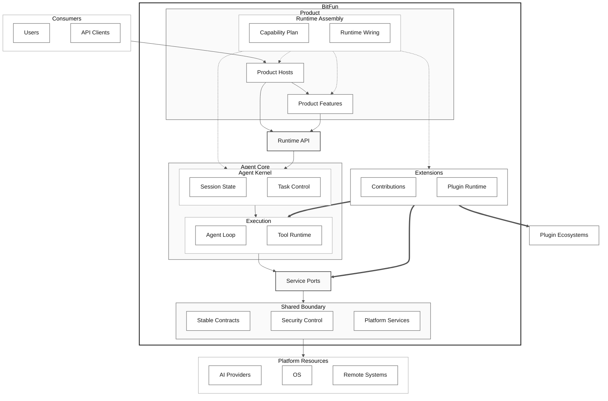
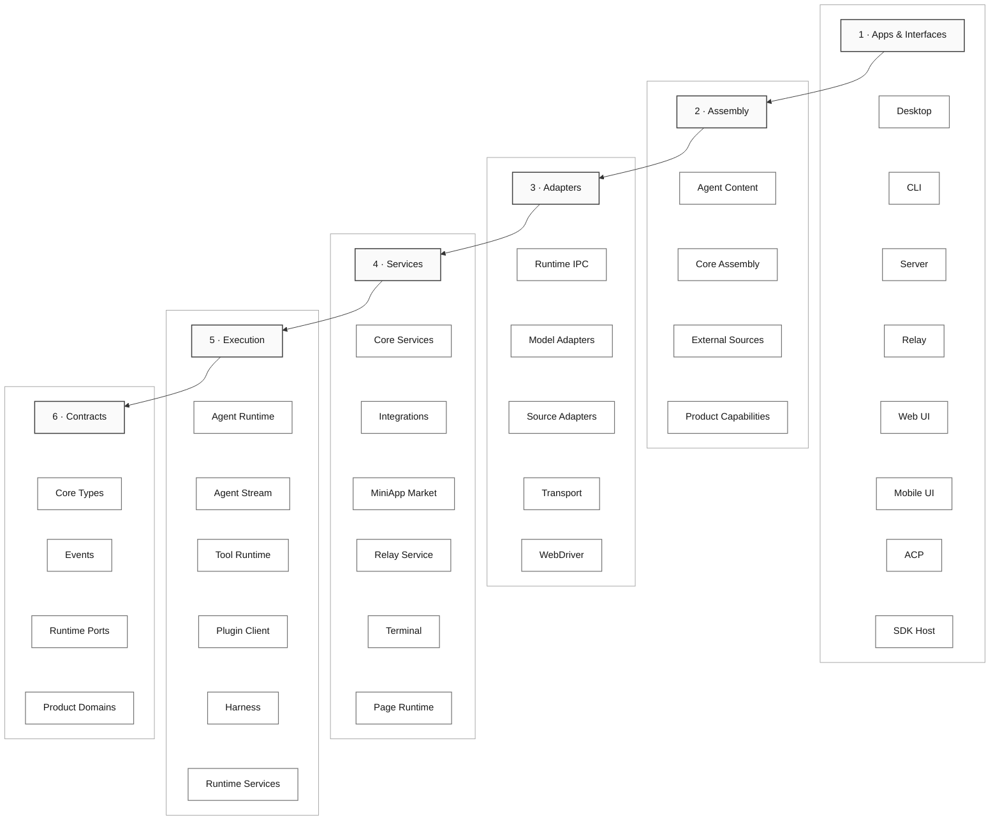
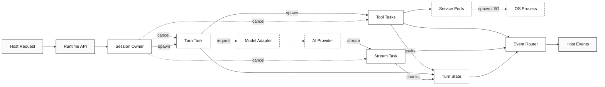
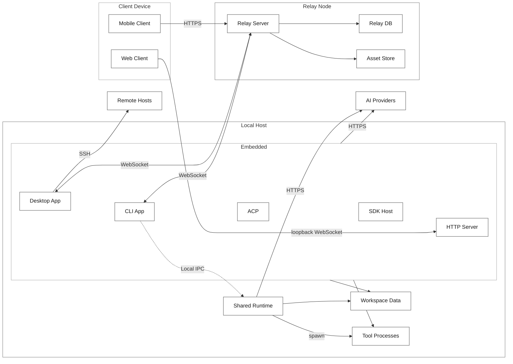
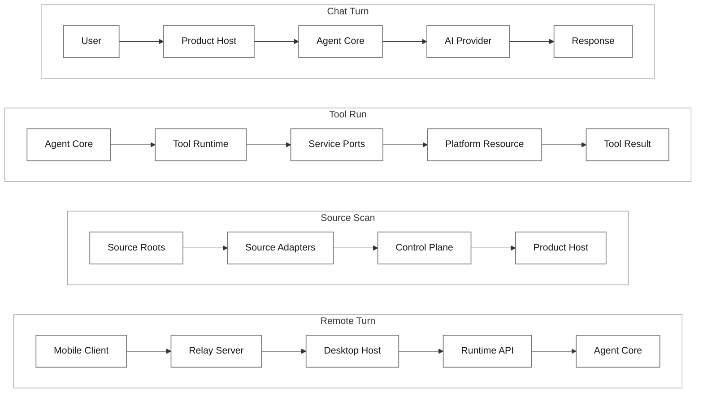
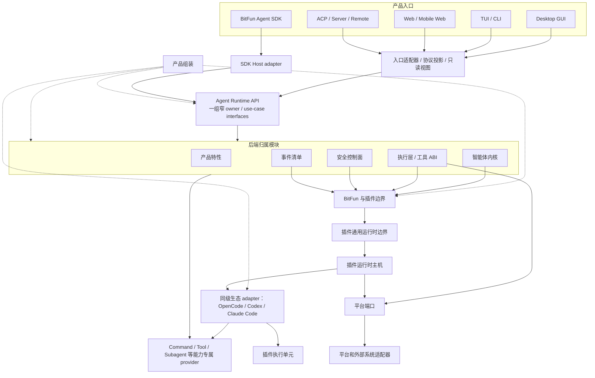
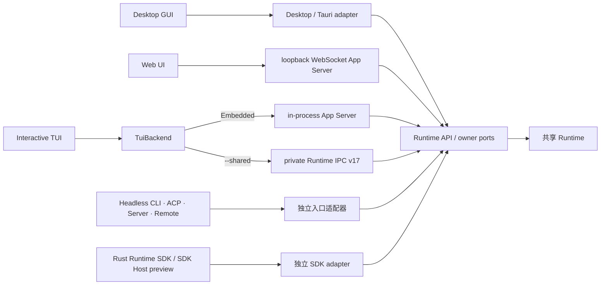

# BitFun 产品运行时架构

本文件定义 BitFun 产品运行时的稳定架构边界。详细执行计划见
[`../specs/plans/core-decomposition-plan.md`](../specs/plans/core-decomposition-plan.md)；智能体内核、运行时服务和 crate
约束见 [`agent-runtime-services-design.md`](agent-runtime-services-design.md)；插件运行时、Plugin Host 进程和生态适配细节见
[`plugin-runtime-design.md`](extensions/plugin-runtime-design.md)；跨 GUI/TUI 的产品定制、布局选择和
内置扩展边界见 [`product-customization-blueprint.md`](product-customization-blueprint.md)；CLI 产品入口和配置
兼容见 [`cli-product-line-design.md`](cli-product-line-design.md)；HarmonyOS PC 原生 CLI/TUI 平台规约见
[`platform-portability-design.md`](platform-portability-design.md)。跨专题实施顺序见
[`../specs/plans/product-architecture-evolution-plan.md`](../specs/plans/product-architecture-evolution-plan.md)。外部 AI 工作内容架构见
[`external-ai-work-sources-design.md`](extensions/external-ai-work-sources-design.md)；OpenCode 扩展总矩阵、配置资产、插件执行、
终端插件和外部集成适配分别见
[`opencode-extension-compatibility.md`](extensions/opencode-extension-compatibility.md)、
[`opencode-config-assets-adapter-design.md`](extensions/opencode-config-assets-adapter-design.md)、
[`opencode-plugin-runtime-adapter-design.md`](extensions/opencode-plugin-runtime-adapter-design.md)、
[`opencode-tui-plugin-adapter-design.md`](extensions/opencode-tui-plugin-adapter-design.md) 和
[`opencode-external-integration-adapter-design.md`](extensions/opencode-external-integration-adapter-design.md)；BitFun 能力如何
可装配并双向接入 Claude Code、Codex、OpenCode、Trae 等宿主见
[`capability-runtime-integration-design.md`](extensions/capability-runtime-integration-design.md)；公开 BitFun Agent SDK、SDK Host、
Headless CLI 与各产品入口的统一心智见
[`agent-sdk-product-architecture.md`](agent-sdk-product-architecture.md)；Desktop GUI、Web UI 和交互式 TUI 的统一产品后端协议、
Embedded/Shared App Server 边界及迁移约束见
[`app-server-architecture.md`](app-server-architecture.md)。该专题当前是待评审的目标提案；在决策门槛通过前，当前调用路径和稳定
owner 边界仍以本文及已接线代码为准。其他已批准的详细设计与本文件冲突时，以本文件为准。
多个 GUI/TUI/Remote/CLI/SDK 实例共存时的 Agent Runtime 部署、状态共享、隔离、容量与 Plugin Host 关系见
[`agent-runtime-deployment-design.md`](agent-runtime-deployment-design.md)。

Cargo feature、第三方依赖 owner、测试目标和本地/CI 验证分工见
[`rust-build-dependency-boundaries.md`](rust-build-dependency-boundaries.md)。该文档补充本架构的构建视图，不改变本文定义的运行时 owner 和分层依赖方向。

本文件只约束稳定边界，不记录单次 PR 进度，也不把未来可能支持的生态能力提前声明为公开接口。

## 1. 架构目标

BitFun 同时面向桌面 GUI、TUI/CLI、Web、ACP、Server、Remote、SDK 和插件生态。架构目标是降低后端实现高频变更对稳定接口的影响，同时保持插件生态和 OpenCode-compatible 能力可以按受控路径扩展。

设计原则：

1. **接口少而稳定**：每个接口边界只有一个主入口；不能因为新增生态适配或实现重构而新增平行接口。
2. **实现不外溢**：运行时、平台服务、生态适配器、插件执行单元和传输实现只能通过稳定接口、只读视图或内部 ABI 被消费。
3. **外部语义可变换，最终提交有归属**：OpenCode Hook 可以按其稳定语义修改输入、输出和权限决定；BitFun
   归属模块负责顺序、结构、一致性和用户/组织策略校验并提交最终状态，不能把可写 Hook 一律降级成只读候选。
4. **OpenCode 是兼容目标，不是内部模型**：适配层尽量保持 OpenCode plugin、hook、custom tool、TUI plugin、
   Client、配置和加载顺序的外部可观察行为，但这些类型不能反向成为 BitFun 智能体、配置或界面的内部数据模型。
5. **公开接口有预算**：新增公开 DTO、trait、模块或门面必须同时具备归属模块、真实消费方、版本策略、验证方式和退场条件。
6. **入口形态受宿主约束**：TUI、GUI、Web、Headless CLI 和公开 SDK adapter 共享 Agent Runtime API
   用例、能力服务接口和只读视图，不共享公开语言包、传输、渲染句柄、主题键、键位模型或界面状态；
   插件界面贡献必须先声明目标入口形态，再由对应宿主适配。
7. **产品定制先解析，运行时扩展后加载**：产品身份、能力上限和 GUI/TUI 布局选择在构建/组装期解析；用户配置和插件只能在该上限内扩展，不能反向改写产品事实。
8. **平台差异留在入口和具体能力实现**：target 只选择 ABI，feature 只控制确实可选的依赖；共享内核不按平台
   分叉业务语义，也不新增包含所有 OS 方法的总接口。新端口必须有当前调用方。
9. **发现无感，生效按风险分级**：外部用户/项目来源后台发现，不阻塞产品入口；无冲突的低风险声明式内容可自动应用并提供撤销；
   Command、Tool、Subagent 等可执行来源与产品本地能力或独立外部 provider 同名时必须由用户选择，且选择只在候选身份与内容版本不变时复用。现有 Skill 根继续按已发布顺序解析，并展示来源和默认覆盖项；带模式的管理界面展示应用模式开关后的实际采用项；
   可执行来源首次启用或能力扩大时形成非阻塞确认。激活后的本地 OpenCode 扩展默认按当前用户能力
   运行；经 BitFun 能力接口的调用可细分限制，脚本直接文件/网络/进程能力只在真实操作系统或容器边界存在时可
   粗粒度收紧，否则停用相应 target。策略降级必须与待确认、解析错误和插件故障分开显示。
10. **开放权限不降低可靠性**：第三方 JS/TS 始终位于受监督子进程；standalone Tool 使用现有 worker，完整
    package plugin 使用 Plugin Host。目标边界具备期限、取消、背压、崩溃回收、错误去重和结构校验；业务等待
    不得被单个插件无限阻塞。缺少平台硬资源限制时，内存、CPU 或进程风暴仍是明确残余风险，不能用
    “独立进程”宣称完全隔离。
11. **来源发现与执行准入分离**：生态来源和加载顺序只决定候选输入，不自动授予执行权限。任何可执行来源在
    首次激活、启动或 import 前，以及来源身份/内容版本、target、执行域/用户、策略上限或凭据/环境可见范围
    变化时，由既有 owner 重新评估来源准入。经 BitFun owner/facade 的调用仍执行调用时权限判断；脚本运行时的
    直接文件、网络和进程副作用只能依靠真实 OS/容器边界限制。来源/target 的首次选择由产品来源体验保存，
    不因此新增对内部准备阶段的重复激活、通用 trusted-folder 模型或独立信任服务。
12. **一个能力核心，多种宿主适配**：Memory、Context、Workflow、Subagent、Tool 等能力只在已有 owner 中按真实
     第二实现增量开放 Provider/策略装配；对外通过窄能力门面和宿主 adapter 暴露。MCP、Plugin、Hook、SDK 或
     Server 入口不能反向替换状态 owner、权限上限、取消树、资源硬额度、事件身份或审计，也不能被描述为一个
     跨产品通用插件包。
13. **一个 Agent Runtime，多种交付形态**：GUI、TUI、Headless CLI、公开 SDK、ACP 与 Server/Remote 都是
     同一 Agent Runtime 的 adapter。Query、Session、Tool/MCP、Permission、Hook、Event/Usage 只有一个行为
     owner；公开 SDK 不成为内部入口的依赖，ACP 和 Headless CLI 也不成为完整 SDK 的别名。目标部署中，第一方
     GUI/TUI/本机 Remote 可以共享 Agent Runtime，一次性 Headless CLI 保留 Embedded，公开 SDK 默认使用私有
     SDK Host；这些 Rust 部署都只通过 `PluginRuntimeClient` 和 services 归属模块管理自己的 Node/Bun Plugin Host 子进程。

调用路径长度只作为工程成本处理，不作为独立架构目标。允许保留承担兼容隔离、只读视图或能力选择职责的中间层；不允许为了兼容而长期暴露没有消费方的抽象接口。

### 1.1 仓库级拆解护栏

对 `bitfun-core` 拆解、feature 边界、依赖边界或 Rust 构建提速重构，除遵循上文原则外，还必须遵守：

1. **不要把 DTO / contract 抽取误判为 runtime owner 已迁移。** 抽出共享类型不等于能力归属已经下沉或更换。
2. **产品表面可以有差异；共享稳定 facts 与 ports，不共享 UI、protocol、lifecycle 或平台实现。**
3. **迁移 runtime owner 必须有评审过的 port/provider 设计、旧路径兼容、行为等价测试；** 若可能改变行为边界，须先确认。模块级 ownership 细节写在离代码最近的模块 `AGENTS.md`，不在本文件展开。

## 2. 4+1 Architecture Views

4+1 视图分别描述系统职责、代码组织、运行协作、部署边界和关键场景，避免把逻辑模块、crate、进程和调用链混在同一张图中。分类沿用 [Kruchten 4+1](https://www3.software.ibm.com/ibmdl/pub/software/rational/web/whitepapers/2003/Pbk4p1.pdf)，图的层级、动态协作和部署节点表达参考 [C4](https://c4model.com/diagrams) 以及 arc42 的 [Building Block](https://docs.arc42.org/section-5/)、[Runtime](https://docs.arc42.org/section-6/) 和 [Deployment](https://docs.arc42.org/section-7/) 视图；这些方法只提供视角和表达规则，不替代 BitFun 的真实 owner 与代码边界。

Level 0 展示系统级主要边界和依赖方向；Level 1 再按 Level 0 的模块或范围展开。每张图必须能独立说明范围和图例，关系使用明确方向或协议，逻辑模块、crate、运行任务和部署实例不要求一一对应。Scenarios 用关键路径校验前四个视图，但不能替代任何一个视图。专题 Level 1 只能展开对应 Level 0，不能反向替代产品级全景。

| Level 0 view | Level 1 drill-down | Scope relationship |
|---|---|---|
| Logical | [`agent-runtime-services-design.md`](agent-runtime-services-design.md)、[`plugin-runtime-design.md`](extensions/plugin-runtime-design.md)、[`app-server-architecture.md`](app-server-architecture.md) | 分别展开 Agent Runtime/Services、Plugin Host，以及待评审的 Rich Client App Server 逻辑边界 |
| Development | [`rust-build-dependency-boundaries.md`](rust-build-dependency-boundaries.md)、根 [`AGENTS.md`](../../AGENTS.md) 的 Layered Module Index | 展开 crate/feature 依赖与物理仓库分层；不把 crate 等同于逻辑模块 |
| Process | [`agent-runtime-deployment-design.md`](agent-runtime-deployment-design.md)、[`plugin-runtime-design.md`](extensions/plugin-runtime-design.md)、[`app-server-architecture.md`](app-server-architecture.md) | 展开 Session/Turn、Plugin Host 生命周期和候选 App Server transport；保留各自 Current/Proposed 标签 |
| Physical | [`agent-runtime-deployment-design.md`](agent-runtime-deployment-design.md)、[`app-server-architecture.md`](app-server-architecture.md)、[`remote-workspace-transport.md`](remote-workspace-transport.md)、[`peer-device-mode.md`](peer-device-mode.md) | 展开 Embedded/Shared、候选 App Server、远程工作区和 Relay/Peer 部署；局部拓扑不替代全产品部署图 |
| Scenarios (+1) | [`agent-runtime-deployment-design.md`](agent-runtime-deployment-design.md)、[`external-ai-work-sources-design.md`](extensions/external-ai-work-sources-design.md)、[`remote-workspace-transport.md`](remote-workspace-transport.md) | 展开 Runtime 生命周期、Source Scan 和 Remote 路径；专题场景只验证其覆盖范围 |

### 2.1 Logical View · Level 0

Logical View 只表达当前系统的职责模块与依赖方向，不表达 crate 归属或进程位置。

实线表示依赖，虚线表示装配，粗线表示扩展路径。

| Boundary | Responsibility |
|---|---|
| Product | 承载产品入口、能力选择和用户功能 |
| Runtime API | 向产品入口提供稳定用例接口 |
| Agent Core | 管理会话与任务，并推进 Agent 和工具执行 |
| Extensions | 接收生态贡献并隔离插件执行 |
| Service Ports | 隔离执行逻辑与具体平台能力 |
| Shared Boundary | 统一稳定契约、安全控制和平台服务 |

稳定边界：Product Hosts 只经过 Runtime API 和只读投影消费能力，不能直接调用插件执行单元或具体平台实现；Extensions 只能提交受控贡献，最终状态、权限结果、工具结果和审计事实仍由对应 owner 提交。`PluginRuntimeClient` 持有类型化调用、期限、串行化和响应校验；物理进程健康与进程树回收属于 Services。

### 2.2 Development View · Level 0

Development View 展示仓库的静态代码组织。层间依赖只允许向下，可跨过中间层，但不能反向依赖上层；图中子项表示主要 crate 家族或产品入口，不等同于 Logical View 的职责模块。

箭头表示允许的依赖方向；实际 crate 可以直接依赖任意更低层。Logical 与 Development 的主要映射如下，映射是多对多关系：

| Development layer | Repository scope | Logical elements |
|---|---|---|
| Apps & Interfaces | `src/apps/*`、Web/Mobile UI、`interfaces/*` | Product Hosts、Product Features、Runtime API |
| Assembly | `assembly/*` | Runtime Assembly、Product Features、Agent Kernel |
| Adapters | `adapters/*` | Extensions、Platform Services |
| Services | `services/*` | Agent Kernel、Security Control、Platform Services |
| Execution | `execution/*` | Agent Core、Extensions、Service Ports |
| Contracts | `contracts/*` | Stable Contracts、Security Control、Service Ports |

Assembly 是唯一组装根，只选择下层能力和实现，不能反向依赖 app。每个生态 adapter 独立保留外部格式和顺序语义，再映射到 BitFun owner；生态 adapter 之间不能形成兄弟依赖。

### 2.3 Process View · Level 0

Process View 展示当前 Agent Runtime 内的异步任务、流和取消传播；Embedded 与 Shared 复用同一任务结构。本视图不描述具体部署环境，也不把一次用户场景误作进程结构。

实线表示调用、数据或事件流，虚线表示取消传播。Session Owner 持有会话与活动 turn 的生命周期；Turn、Stream 和 Tool 任务可异步重叠，但只能通过事件和类型化结果提交状态。产品入口只经过 Runtime API，不能直接调用 Tool Tasks 或具体平台进程。

### 2.4 Physical View · Level 0

Physical View 展示当前可执行单元到设备、主机和存储的映射。Desktop、CLI、ACP、SDK Host 和当前 HTTP Server 使用 Embedded Runtime；交互式 TUI 可以显式连接 Shared Runtime。Relay Server 不承载 Agent Runtime。

实线表示主要协议、存储访问或进程创建，虚线表示显式启用的 Shared TUI 本机连接。当前 HTTP Server 固定 loopback、单用户且缺少连接级身份与作用域绑定，不构成远程或多用户 Server API。Relay DB 只在账户模式启用，Asset Store 的具体实现由部署配置选择。完整 package plugin 尚未形成生产闭环，因此不把规划中的 Plugin Host 画成当前部署实例。

| Deployment unit | Main contents |
|---|---|
| Desktop App | Web UI、Tauri Host、embedded Agent Runtime |
| CLI App | TUI、Headless、Peer；默认 Embedded，可显式使用 Shared TUI |
| Shared Runtime | 私有本机 IPC；当前只有交互式 TUI consumer |
| ACP | Embedded Agent Runtime、ACP 协议生命周期 |
| SDK Host | 私有跨进程 adapter；公开 SDK 产品尚未交付 |
| HTTP Server | Embedded Agent Runtime、`BitfunAppServer`、loopback WebSocket transport；不构成公开远程 Server API |
| Relay Server | WebSocket/HTTP bridge、账户与同步；不包含 Agent Runtime |

### 2.5 Scenarios (+1) · Level 0

Scenarios 选择少量具有架构意义的当前路径来校验前四个视图，不穷举产品功能，也不重复 Process View 的任务调度细节。

四条路径分别覆盖核心对话、内置工具、运行时无关的外部来源发现，以及经 Relay 回到 Desktop owner 的远程控制。Source Scan 的发现与控制事实由 `ExternalSourceControlPlane` 统一持有，adapter 不成为第二个业务 owner。完整 package plugin、公开 SDK 产品和 HarmonyOS 不在当前生产闭环中，因此不作为 Level 0 场景。

## 3. 接口边界

BitFun 只保留四个稳定接口边界；工具、事件和权限作为归属子接口被复用，不在插件层重复定义。本文使用“接口”描述可被调用或依赖的能力面；只有描述跨进程消息封装、结构化 schema、序列化对象或强兼容约束时才使用“契约”；只读状态视图表示从权威状态派生出的查询结果。

跨本文与扩展专题使用下列唯一术语映射：

| 术语 | 本仓唯一含义 | 不表示 |
|---|---|---|
| owner | 唯一校验并提交某类权威业务事实的现有模块；其他层只能请求、适配或投影其结果 | 人员负责人、Host、UI 状态或同名 facade |
| facade / 门面 | 把 owner 的窄用例、只读状态、事件和类型化错误投影给特定调用方或兼容生态的薄入口 | 新 owner、第二份状态、通用 service locator 或独立产品承诺 |
| target | 来源和插件身份下可独立准入、路由、启停并报告诊断的逻辑贡献执行项 | OS 进程、workspace、session、Plugin Host 或默认物理隔离键 |
| Host ABI / 主机内部 ABI | Rust 调用侧、生态 adapter 与受监督 Plugin Host 之间的版本化类型请求/响应边界 | 公开 SDK、前后端 wire、OpenCode 原始对象或 Node/Bun/进程拓扑承诺 |
| Generation | 由具体 owner 单调递增的快照/发布 fence，用于拒绝同一命名空间内的陈旧发现、路由或执行结果 | 插件版本、进程实例、全仓共享时钟或可跨 owner 比较的 ID |

`owner → facade → caller` 只表示权威事实的投影方向；`target` 与 `Generation` 是 owner 管理的逻辑身份和陈旧结果保护，均不决定 Plugin Host 数量。Plugin Host 的进程复用和故障域以
[`plugin-runtime-design.md`](extensions/plugin-runtime-design.md) 为准。

| 接口边界 | 主要消费方 | 主入口 | 稳定内容 | 禁止暴露 |
|---|---|---|---|---|
| Agent Runtime API / 前后端能力服务边界 | GUI、TUI/CLI、Web、ACP、Server、Remote、公开 SDK adapter | 一组能力 owner 的窄类型化用例接口 | Query/Turn、会话/工作区状态、工具/MCP、权限提示、Hook 结果、诊断、产物引用、能力状态、事件流、用量和类型化错误 | 单一 service locator、公开语言 package、内核状态机、执行层内部类型、`PluginRuntimeClient`、主机内部状态、生态原始载荷、Tauri/React/TUI 实现、具体服务提供方、未预算的界面贡献接口 |
| BitFun 与插件边界 | 插件运行时主机、安全控制面、产品组装、生态适配器 | 扩展贡献接口 | 插件来源、启用状态、能力与副作用、真实工具定义、钩子变换、权限要求、界面贡献、诊断和故障事实 | 最终权限结果、最终工具结果、审计写入、内核权威状态、前后端协议 DTO、界面实现代码 |
| 插件通用运行时边界 | 智能体内核、执行层、产品组装、插件运行时主机 | 主机内部 ABI | 类型化调用、请求身份、期限、取消、有界队列、健康状态、响应校验和诊断 | SDK 门面、前后端接口、生态适配器对象、worker/subprocess 句柄、产品入口状态 |
| 外部生态兼容适配边界 | 来源协调器、能力 owner、插件运行时主机和脚本执行进程内部 | 每生态独立兼容适配层 + 能力专属 provider 契约 | 各生态来源发现、优先级、格式/参数语义、诊断，以及到 Command/Tool/Subagent/Config 等 BitFun 模块的类型化映射 | 跨生态任意 payload、兄弟适配器依赖、生态原始类型泄漏到产品接口、把外部 CLI 作为默认前置依赖 |

这四项是能力必须归入的接口分类，不表示表中每项已有稳定 API。当前接口仍须满足 3.1 节的真实消费方、版本与验证准入。

归属子接口：

| 子接口 | 归属 | 用法 |
|---|---|---|
| 工具 ABI | `tool-contracts` / 执行层 | 具备真实执行实现的插件 custom tool、MCP 工具和内置工具进入同一可调用工具集合、权限和陈旧调用保护路径；只有声明或候选项的插件工具不能进入该集合。 |
| 事件清单 | `events` / 智能体内核事件 schema | 对固定生态版本维护各自事件清单；插件观察兼容事件，BitFun 内部私有字段在对应适配层转换或脱敏。 |
| 权限与副作用 | 安全控制面 / runtime ports | 来源/target 激活后，默认兼容策略允许 OpenCode `permission.ask` 和直接脚本能力按当前用户权限运行；经 BitFun 接口的调用可细分收紧，直接脚本能力只能由真实 OS/容器环境粗粒度限制，否则停用 target。 |

### 3.1 公开接口准入规则

新增或保留公开接口必须满足以下条件：

1. 属于上表一个明确接口边界，不能同时承担前后端协议、插件扩展、host ABI 和生态适配职责。
2. 有当前消费方；仅为了未来兼容、完整矩阵或概念完整性保留的代码接口不进入稳定面。该规则不阻止需求、
   风险、完整能力矩阵和阶段计划记录未来工作，也不能用来把官方稳定能力从兼容审计中删除。
3. 能映射到 OpenCode-compatible P0 关键场景，或属于 BitFun 已有关键路径的稳定子接口。
4. 不能由既有工具 ABI、事件清单、权限控制面或能力服务接口承接时，才允许新增。
5. PR 必须说明版本影响、验证命令和退场条件。

`scripts/core-boundaries/rules/source/public-api-rules.mjs` 当前是插件与运行时公开接口的增量 allowlist，不是全仓
`pub` 符号扫描器。已登记接口必须声明 `contractSlice` 供机器校验归属；未登记接口仍须满足上述准入条件，并由
PR 审查和最近的边界测试验证。边界脚本通过不能解释为全仓公开接口已经自动完成预算审计。

没有 OpenCode 对应能力、没有当前消费方、不能归入关键 BitFun 场景的接口，处理方式只有三种：删除、降级为主机内部实现，或返回类型化 `unsupported` / 诊断。

已批准后续工作所需的短期前置接口不等于占位实现。确需预留时，必须在相邻设计中写明首个消费方、稳定语义、
接入验证和未接入时的删除条件；在端到端调用链落地前保持内部可见或显式标为未接入，不能用空实现、测试替身或
公开 re-export 宣称产品支持。无法给出这些信息时，仍按无消费方接口处理。

“前后端能力服务边界”是概念边界，不对应一个必须存在的统一 API crate。单一宿主使用的命令投影、宿主协议 DTO 和
协议转换留在该宿主入口；只有多个当前生产宿主或独立版本化的外部消费者确实复用同一语义，并且版本与退场条件
明确时，才抽取共享 API 模块。仅返回合成 ID、空历史、固定健康状态，或绕过既有服务直接执行文件 I/O 的占位
handler，不构成生产消费闭环。

传输 adapter 是已接入宿主的交付实现，不是未来协议路线图。保留一个 transport adapter 必须同时存在生产构造点、
事件或请求消费方、宿主生命周期，以及错误、取消或背压语义的验证。独立存在的 Server 路由、前端 WebSocket
client 或未来 CLI/HarmonyOS 计划，不能证明同名 Rust transport adapter 已接入；未接入实现应删除，待端到端
调用链确定后再按宿主边界实现。

### 3.2 宿主通信契约与 Tauri 薄适配

前后端契约按能力语义归属，不按 Tauri command 名称归属。稳定的请求、响应、状态事实和类型化错误放在对应
`contracts/*`、Agent Runtime API 或能力 owner。当前 Desktop GUI 仍使用 Tauri adapter，Web UI 使用 loopback WebSocket
App Server，Embedded TUI 使用 in-process App Server，Shared TUI 通过 `TuiBackend` 映射 private Runtime IPC v17。待评审目标是让
Desktop GUI、Web UI 和交互式 TUI 复用同一 Rich Client App Server 行为与 wire contract；Tauri 和各 Rich Client Host 负责
transport、平台能力及生命周期。ACP、Headless CLI、Peer Host 与公开 SDK 继续由各自 adapter 映射到稳定 owner 接口，不因该目标
复用 App Server wire。该规则降低框架耦合，但不要求把 controller-local Desktop DTO 搬进共享 crate。

| 层 | 允许 | 禁止 |
|---|---|---|
| 能力 owner / Agent Runtime API | 类型化请求/响应、状态事实、权限/取消语义、与框架无关的用例方法 | `tauri::State`、`AppHandle`、窗口/菜单对象、command 宏、HTTP/WebSocket/ACP/SDK Host envelope |
| Desktop Tauri / proposed App Server Host adapter | 当前组装 Tauri adapter；目标组装 transport、注入真实 capability 与平台 provider、管理窗口和桌面生命周期、投递 App Server typed notification 或桌面专属事件 | 复制业务校验、持有第二份权威状态、在目标迁移完成后为同一能力保留第二条 Runtime 旁路、把 Tauri 类型传入下层 |
| Server / Remote adapter | 路由鉴权、协议 envelope、连接生命周期、背压与取消映射 | 为同一能力另建语义不同的 DTO 或 handler |
| GUI / Web / TUI frontend | 当前依赖各自 infrastructure 或 `TuiBackend`；目标依赖生成的 App Server client、稳定读模型和 Host-local capability adapter；各自保留渲染状态 | 在 UI component/view 中直接依赖 Runtime/Core/Service、公开 Python/TypeScript SDK、Tauri 业务 command 或私有 Shared IPC |

本文其他章节和历史设计中出现的“Runtime SDK”，如果指 `agent-runtime::sdk`，统一称为
**Rust Runtime SDK（当前 preview）**；它是共享 **Agent Runtime API** 的当前 Rust 入口。只有
[`agent-sdk-product-architecture.md`](agent-sdk-product-architecture.md) 定义的 Python/TypeScript package 才称为公开
**BitFun Agent SDK**，其跨进程适配器称为 **SDK Host**。该术语区分不要求机械重命名现有 crate/module，但禁止用
Rust preview 的存在证明公开 SDK 已交付。

Rust 与 TypeScript 的字段一致性以能力所有者的 DTO 为事实源，不以 Tauri command 参数为事实源。单宿主阶段由
前端基础设施层维护对应接口，并用序列化契约测试锁定字段命名、可选字段和错误形状；达到独立版本化门槛后，才使用
不依赖 Tauri 的 JSON Schema 或类型生成任务输出只读 TypeScript 类型。生成结果只同步数据形状，不承载权限、重试或
业务分支。本阶段不为此新增生成器或框架依赖。

抽取共享契约需要满足以下任一条件：至少两个当前生产宿主复用同一语义，或存在独立版本化的外部消费者。只有一个
Desktop command 使用的序列化对象继续留在 `src/apps/desktop`；即使它不含 Tauri 类型，也不因“未来可能复用”而
提升为公共 DTO。共享的框架中立用例 handler 也遵循同一门槛：它必须拥有真实的编排、权限、取消或错误语义，不能
只是通用转发层。

单条能力按垂直切片迁移：

1. 先确认权威 owner、当前生产消费方、远程/多产品形态语义和现有行为基线。
2. 把稳定事实与请求/响应放到能力所有者的契约模块，并以序列化、错误、取消和行为等价测试锁定。
3. 让非 Desktop 消费方或第二宿主先通过 Agent Runtime API / owner 接口形成真实调用链。
4. 将 Tauri command 收敛为薄 adapter；前端基础设施层负责 `invoke` 映射，UI 组件不直接依赖 Tauri API。
5. 删除重复 DTO、旧 handler 或兼容方法；无法证明等价时保留已标注的兼容边界，不做批量迁移。

因此仓库不恢复一个通用 `api-layer` 作为默认中转层。只有达到上述复用门槛且现有 owner 无法合理承载时，才评审
窄范围共享 API 模块。HarmonyOS GUI/TUI 可复用稳定能力契约，但仍需各自的平台宿主、生命周期和交付验证；契约
抽取只是前置条件，不代表 HarmonyOS 已受支持。

### 3.3 入口形态接口规则

入口形态接口只描述宿主可消费的声明，不描述具体渲染实现。TUI 与 GUI 的能力边界不同，不能因为存在一个界面插件就自动扩展为全入口稳定接口。

| 目标入口形态 | 可进入稳定接口的内容 | 必须由宿主决定 | 禁止进入插件接口 |
|---|---|---|---|
| TUI / CLI | 斜杠命令、键位候选、状态行/通知候选、终端主题语义 token、只读状态视图 | 键位冲突处理、终端能力降级、ANSI/truecolor 映射、文本回退 | React/DOM/Tauri 句柄、CSS token、GUI 布局、可执行界面代码 |
| Desktop GUI / Web | 路由、面板、槽位、对话框、提示、GUI 主题语义 token、只读状态视图 | 组件装载位置、布局约束、焦点与可访问性、设计 token 映射 | 终端键位、ANSI 颜色、TUI 状态行键、宿主组件实例 |
| SDK / Server / Remote / ACP | 状态、诊断、能力清单、类型化 `unsupported` | 是否暴露只读状态或降级原因 | 任意界面贡献、主题键、渲染句柄 |

主题贡献只能声明语义角色和目标入口形态，例如 `accent`、`danger`、`surface`、`text`、`border`。TUI 宿主把语义角色映射为终端颜色、ANSI 或 truecolor；GUI 宿主把语义角色映射为设计 token 或 CSS 变量。若插件只提供 GUI 主题键而当前入口是 TUI，系统只能使用语义回退或返回类型化 `unsupported`，不得把 GUI 主题键直接传给 TUI。

## 4. 运行视图

### 4.1 图表合并记录

目录重组前的运行协作和产品形态图没有静默删除；其语义按下表合并到当前权威位置。图的合并只去除重复或已经被代码事实替代的表达，不改变 owner、边界或成熟度标签。

| 旧图 | 当前承接位置 | 保持或替代的语义 |
|---|---|---|
| “产品入口” | 本节“当前已接线的产品入口路径”图 + 2.1 Logical / 2.4 Physical | 入口 adapter、SDK Host、Runtime API、Embedded/Shared 部署关系 |
| “插件调用”与“插件贡献提交链” | 本节总运行图 + [`plugin-runtime-design.md`](extensions/plugin-runtime-design.md) §2–§6 | `PluginRuntimeClient`、生态 adapter、process service、Plugin Host、provider 和 owner 的调用/提交边界 |
| “平台能力” | 本节总运行图中的 Platform Ports / Platform Adapters | Runtime 或 Plugin Host 只经平台端口访问 OS/外部系统 |
| “当前本机入口组装”“当前 Peer 运行连接”“尚未交付的公开 SDK 路径” | 本节当前路径图 + 第 6 节产品形态矩阵 | 合并 Desktop/CLI/ACP/Server/Peer/SDK 的当前状态；旧 Server dormant 表述已由 [`main.rs`](../../src/apps/server/src/main.rs) 的 Embedded Runtime 构造和 [`websocket.rs`](../../src/apps/server/src/routes/websocket.rs) 的 `/ws` App Server `serve` 当前事实替代 |

OpenCode 来源到 Plugin Host 的图仍在第 5 节保留，因为它表达生态兼容顺序而不是通用运行协作。

入口 adapter 消费同一 Runtime API，部署选择不能进入业务 owner：Embedded 使用进程内强类型调用；Shared 或 SDK Host 才在各自私有 adapter 中执行 transport 封装。GUI、TUI、Headless CLI、ACP 和 SDK 不共享 wire、renderer 或生命周期，也不得为了统一接口而让默认 Embedded 路径承担序列化成本。

当前已接线的产品入口路径如下；该图只描述已接线请求路径，不表示待评审目标：

当前 Embedded TUI 核心路径经过 App Server，Shared TUI 则由 `TuiBackend` compatibility adapter 映射到 private Runtime IPC v17。
Desktop GUI 尚未完成 App Server 迁移；当前 loopback Web Host 已通过 WebSocket 承载 App Server。Headless CLI/CI、ACP、Peer Host
和 SDK Host 保留独立 adapter。所有路径最终消费同一 Runtime API 或 owner port，部署选择不能进入业务 owner。

待评审目标是让 Desktop GUI、Web UI 和交互式 TUI 复用同一 App Server 行为与 wire contract，并让 Embedded/Shared 只在 Host 与
transport 层不同。是否用 Shared App Server 替换 v17，仍取决于鉴权、实例身份、controller/lease、事件恢复、取消、限制、性能和
回滚门槛；目标不表示这些能力已经交付。各入口仍各自拥有 renderer、平台能力和生命周期。Headless CLI/CI、ACP、Peer Host 和
公开 SDK 不共享 App Server wire。完整目标形态见
[`app-server-architecture.md`](app-server-architecture.md)。

关键规则：

- 产品入口先经过自己的 adapter/projection，再消费 Agent Runtime API 和只读视图；公开 SDK 只多一层
  SDK Host 跨进程适配。Agent Runtime API 是一组窄 owner/use-case interfaces，不是必须实例化的总门面；adapter
  可以调用对应 owner 的窄接口，但不能访问 manager/内部状态、绕过既有编排或复制业务规则。任何入口都不直接调用插件主机。
  Rich Client App Server 统一路径只有在相应 Host 完成迁移和验证后才成为当前路径。
- 插件只进入扩展贡献接口，不直接写内核状态、工具结果、权限结果或审计事实。
- 插件运行时主机只负责类型化调用、期限、取消、有界队列、逻辑 target 状态、响应校验和故障状态；
  物理进程健康、资源预算与进程树回收属于脚本执行服务。
- 外部来源的 Command、Tool、Subagent、MCP 仍保留能力专属 DTO 和 owner，但它们的发现调度统一由
  `ExternalSourceControlPlane` 持有；当前 Desktop/TUI/Peer 的控制事实只通过版本化的 product-domain 只读视图共享，
  不复制生态 payload、界面状态机或远端专用 DTO。App Server 已注册 external-source schema、handler 和 client translation；Embedded Host
  注入 management owner 后可以调用。通用 Server `/ws` 当前没有绑定可信工作区的 management owner，因此返回类型化 `unsupported`；只有注入 Host 持有的作用域化 owner 并通过 WebSocket round-trip 后，Server 才交付该共享边界。
- 每个生态适配层独立保留该生态的外部格式、来源顺序和调用语义，并映射到 BitFun 归属模块；它本身不成为新的
  业务归属模块，也不能依赖或修改兄弟生态 adapter。通用目录、生命周期协调器和能力 owner 只依赖开放生态 ID、
  来源限定身份与能力专属 provider 契约，不按 OpenCode、Codex 或 Claude Code 分支行为。
- 产品组装是组装根，只在组装期选择能力、服务实现、插件运行时绑定和降级策略。
- 对外能力门面只投影现有 owner 的窄用例、只读状态、事件和类型化错误；它不是第二个 Agent Runtime、通用服务
  定位器或插件 Host。外部产品扩展、外部 SDK 控制端和“使用外部 Runtime 组装新产品”是三种不同交付路径，
  覆盖上限和兼容结论分别维护。
- 依赖方向保持为产品入口 / interfaces → assembly → adapters / services / execution → contracts。assembly
  可以选择下层提供方，但不能依赖 app crate；需要同时被独立应用和嵌入式模式复用的实现必须下沉到可复用 owner，
  再由各 app 和 assembly 组合。

## 5. OpenCode-compatible 当前基线与目标

Plugin Runtime P0 只验证了 BitFun 专用插件目录中的来源校验、工作区审核、启停记录、CLI 诊断和 custom tool 名称预览。
它不执行 JS/TS，不注册真实工具，也不运行 OpenCode 钩子、Client 或终端插件。现有能力只能称为“静态预览”，
不能称为“OpenCode 插件运行时”。详细代码事实集中在
[`plugin-runtime-design.md#7-当前实现`](extensions/plugin-runtime-design.md#7-当前实现)。

与 Plugin Runtime 分离的四条纵向基线已经通过各自的能力专属 provider 契约接入：Prompt Command 可发现本地
用户/项目 OpenCode Command、处理跨来源冲突，并在 CLI/TUI 中执行受支持的 prompt-only 模板；standalone Tool
可把受支持的单文件 `.js` 经确认后接入现有 Tool Runtime；Subagent 可把全局/项目声明的安全子集经确认和同名冲突
选择后接入现有 Task/Subagent owner，并以 generation lease 固定 fresh single-run 调用；MCP 可把受支持的用户/项目
配置经确认和同名冲突选择后交给现有 MCP owner 运行。四类贡献对象互不复用，主体逻辑不按生态分支。当前仍不表示
package plugin、Hook、primary agent、外部 agent 续接、SSH Remote 工作区来源发现或完整
配置兼容已经可用。独立的静态 Hook 目录可以发现并脱敏展示 OpenCode、Claude Code 与 Codex 的本地声明，但不加载
handler、不授予权限，也不改变这里对 Hook Runtime“尚不可用”的判断。

目标路线不要求 OpenCode 插件作者维护 `bitfun.plugin.json` 或复制到 `.bitfun/plugins`。BitFun 直接发现用户和
项目的 OpenCode 配置、插件目录、工具目录和软件包来源；低风险内容按用户偏好自动应用或先询问，可执行来源在
首次启用或能力扩大时非阻塞确认。已准入候选自动记录当前执行版本，在自有脚本进程中真实加载插件，再通过兼容
适配层把工具、稳定钩子、Client 和 TUI target 接入现有归属模块。

```mermaid
flowchart LR
  Source["OpenCode 用户 / 项目来源"] --> Discover["发现配置、入口与依赖"]
  Discover --> Catalog["来源清单、作用域与能力摘要"]
  Catalog --> Policy["自动应用 / 待确认 / 策略限制"]
  Policy --> Prepare["记录已准入候选执行版本"]
  Prepare --> Worker["BitFun 管理的脚本进程"]
  Worker <--> Adapter["OpenCode 兼容适配层"]
  Adapter <--> Host["插件运行时主机"]
  Host <--> Owners["工具 / 配置 / 权限 / 会话 / TUI 归属模块"]
  Owners --> Surface["桌面 / CLI / Web / Remote"]
```

稳定决策如下：

- 不启动完整 OpenCode Runtime，也不依赖用户安装 OpenCode CLI；BitFun 实现自己的监督、适配和 Rust 转发层。
  当前 standalone Tool 子集通过受监督的 Node.js worker 执行且不安装依赖；未来只有冻结的 package plugin 样例证明
  确有需要时，才单独裁决 Bun、依赖准备和版本兼容方案。OpenCode v2 当前同时维护 Bun 编译产物与 Node SEA 并行
  产物，因此 BitFun 不把外部项目尚未收敛的运行时选择提升为 Host ABI 或核心架构约束。
- 用户全局和项目来源自动发现；低风险内容默认无感应用并显示可撤销摘要，可执行来源首次启用或能力扩大时等待
  非阻塞确认。确认前不得 import module、启动 worker、读取凭据或产生直接脚本副作用。
- 激活后的本地 target 默认按 OpenCode 语义运行，允许当前用户通常拥有的文件、网络、进程和环境能力；用户、
  产品或组织可以按需收紧，差异必须明确显示为策略限制。
- 当前 standalone Tool 的每个 target 使用独立可终止 worker；期限、取消、大小限制、崩溃恢复和终端恢复始终生效，
  不因默认权限开放而省略。完整 package plugin 的目标 Plugin Host 则按运行环境和安全范围复用；workspace、session、
  插件和 contribution 数量都不是默认进程键。其期限、取消和有界队列目标保持不变。
- 执行进程实际加载的工具、钩子和导出是权威结果；静态扫描只可用于快速预览，不能作为拒绝动态插件的依据。
- 插件工具只有具备真实定义和执行函数、接入现有 Tool Runtime 并经过调用时权限判断后，才能显示为可用工具。
- OpenCode 可写钩子按固定版本和原始顺序执行合法变换，最后由对应归属模块做结构和策略校验。
- 服务插件和终端插件按 target 独立加载、启停和恢复；普通 target 失败不使另一个 target 自动失效。同一 Plugin Host
  内的进程级故障会影响该 Host 承载的所有插件，恢复与复用边界以插件运行时专题为准。
- 来源变化先生成候选代次；import 前执行包络扩大先确认，已批准包络内的隔离 import 后若发现新增动态贡献则在
  注册前确认。普通更新只有在来源身份/完整性和更新策略仍有效时才安全切换；候选失败可沿用仍合规的上一有效
  代次，明确删除、撤销、停用或策略失效必须撤下旧贡献，不能靠缓存继续运行。
- GUI、TUI、Web 和 Remote 只消费能力服务、稳定状态和操作接口，不直接依赖主机、worker 或 OpenCode 原始类型。

最明显的首期降级是 OpenCode TUI 的原始 `CliRenderer`、Solid/OpenTUI 组件树。BitFun CLI 使用 Ratatui，无法直接
执行这些组件；宿主操作和结构化贡献可以适配，原始组件必须返回明确降级且不能打开空白或无法退出的页面。
其他暂不承诺项、原因和风险统一在
[`opencode-extension-compatibility.md#6-明确限制与延期决策`](extensions/opencode-extension-compatibility.md#6-明确限制与延期决策)
维护，不能因为某一项降级就把整体状态写成“完整覆盖”。

产品内置扩展与用户插件可以复用主机可靠性和最终能力归属，但来源、升级、卸载和产品必要性不同。只有产品
身份、安全恢复或法律要求等少量明确保护项不可被覆盖；普通内置命令、工具和主题可经用户明确选择被外部扩展
替换或关闭，不能按注册或适配器顺序静默切换。具体规则见
[`product-customization-blueprint.md#8-产品内置扩展与用户插件`](product-customization-blueprint.md#8-产品内置扩展与用户插件)。

完整能力状态、设计细节和阶段顺序分别见
[`opencode-extension-compatibility.md`](extensions/opencode-extension-compatibility.md)、
[`opencode-plugin-runtime-adapter-design.md`](extensions/opencode-plugin-runtime-adapter-design.md) 和
[`../specs/plans/opencode-extension-compatibility-plan.md`](../specs/plans/opencode-extension-compatibility-plan.md)。

## 6. 产品形态与降级

产品定义、Delivery Profile、Runtime Configuration 和 Capability Availability 必须分离：

- 产品定义只在构建/组装期选择产品身份、品牌资源、产品能力上限、默认策略引用、内置扩展版本和发行事实；
  不承载用户配置、凭据或任意脚本。
- Delivery Profile 只表示 CLI、Desktop、ACP、SDK 等交付形态，不表示品牌或 SKU。
- 声明一个 Delivery Profile、生成测试计划或通过 crate 单测，不等于该产品形态已经接入生产。只有入口实际提交
  唯一 profile、消费组装结果和统一能力可用性，并通过入口级行为验证后，才能把该 profile 标为已接入。
- 产品入口向组装根提交唯一 Delivery Profile；组装根只校验并派生静态计划，不在内部再次选择交付形态。
- 入口必须在任何配置规范化或全局工具 registry 首次读取之前提交 Delivery Profile，避免进程级 registry 被兼容默认值提前锁定。Desktop 提交 `Desktop`；当前 loopback Server Host 仍承载完整兼容能力，因此提交 `ProductFull`，空的 `Server` profile 仍表示尚未交付的独立 Server 产品形态。
- Agent Runtime 的最小工具计划不是 Delivery Profile。Product Assembly 单独生成 `ProductToolPlan`，显式列出工具 owner；基线只选择 `Basic` 与 `AgentControl`，完整交付计划由已提交的 Delivery Profile 派生。
- Runtime Configuration 承载用户、项目、工作区和本次运行的可变配置；不能启用产品定义
  未组装的能力，也不能放宽产品或组织策略。
- Capability Availability 是根据产品计划、服务健康和当前策略计算出的能力状态；所有入口读取同一状态，
  入口隐藏不等于能力已禁用。
- 构建期校验器读取产品定义、品牌资源和 GUI/TUI 布局选择，输出本次交付的产品组装结果；它不是常驻服务，
  也不执行产品定义中携带的任意脚本。
- Runtime Product Assembly 只消费产品组装结果和调用方唯一传入的 Delivery Profile；不读取原始品牌资源，
  不运行构建脚本，也不从产品定义再次选择 Delivery。
- GUI 与 TUI 布局由对应宿主独立校验，只共享产品身份、Capability ID、品牌资源索引和策略引用，不共享布局、
  组件、主题键、键位或渲染状态。
- 布局选择只能引用宿主已注册的稳定 ID；品牌生成和校验继续使用仓库现有构建流程，不新增通用脚本运行时。
- 产品内置扩展、BitFun 原生包和 OpenCode 标准来源不共享来源根、信任/启用记录、安装状态、更新通道或卸载
  生命周期；三者只复用适用的包校验、Host ABI、隔离和经 BitFun 能力接口的权限/审计路径。

产品定制和品牌资源的详细边界见
[`product-customization-blueprint.md`](product-customization-blueprint.md)；CLI/TUI 的消费方式和配置导入见
[`cli-product-line-design.md`](cli-product-line-design.md)。

产品形态由产品组装决定，不由插件配置、单个 Cargo feature 或生态适配器临时决定。

| 产品形态 | 当前扩展能力 | 入口行为 |
|---|---|---|
| Desktop | 使用 `product-full`；Settings 从现有来源目录和 integration policy 生成简短应用概览，具体审批与冲突仍进入 Tool、Agent、MCP 或 Hook owner | 可执行能力在事实所在 Host 运行；Safe Mode 只阻止新调用，不改来源、不取消正在运行的调用 |
| CLI / TUI | 使用显式 Core owner closure：`agent-runtime` 基线、实际 service owner（包括 Remote Connect、DeepResearch、LSP、external/plugin source 与 SSH）以及九组 `tools-*`；`/extensions` 只提供状态、启停和刷新，`/hooks`、`/tools`、`/agent` 和 `/mcp` 处理各自能力 | `agent-runtime` 不再隐式携带完整 MCP/Remote/Browser/Web/Git/LSP/模型目录闭包；非交互不等待权限输入，生态解析仍在适配器，远程能力未接入时不回退本机 |
| ACP | 使用 `DeliveryProfile::Acp`、Runtime Parts、`agent-runtime` 基线、所需 service owner 与九组 `tools-*`，但不选择 CLI 的 plugin runtime 和 Remote Connect owner | load 成功后才发布活动状态；close 排空后再卸载；完整历史、Canvas 工具物化、兼容指令来源和配置仍由 Core/ACP 管理；未选择的能力不得借 Cargo feature union 偶然出现 |
| Peer / Server | Peer Host 执行真实工作区操作；通用 HTTP Server 未绑定可信 workspace owner 时明确返回不支持 | 控制端不替远端发现或执行；loopback 单用户边界不扩展到远程/多用户；SSH Remote 未接入时返回不支持 |
| Web / Mobile Web | 依赖现有后端入口 | 不持有插件执行单元，也不能据空 profile 宣称独立能力 |
| HarmonyOS 手机 Remote | phone-only ArkTS 远程入口 | 不等于 HarmonyOS PC 本地 Runtime、CLI/TUI 或 GUI |

| 目标形态 | 当前状态 | 设计边界 |
|---|---|---|
| HarmonyOS PC CLI/TUI | 未实现 | HAP、手机 Remote App 和远端代执行均不能替代 |
| HarmonyOS PC GUI | 未实现 | 与 CLI/TUI 共享 Runtime 语义，但独立验证宿主、界面和发布 |
| Public Agent SDK | Python/TypeScript 尚未交付；Rust Runtime SDK 是内部 preview | 一个 `AgentClient`、多个语言绑定；SDK Host 不依赖或冒充 CLI |

Shared Agent Runtime 是第一方多实例的目标部署，不是上表新增的当前产品形态。当前文档中表示“事实实际所在位置”的泛称 Host
可能仍指 Desktop 进程、Peer、Server 或 Remote execution host，不能据此推断 Shared deployment、多 Client Session 单写或
跨进程重连已经交付；完成条件以
[`agent-runtime-deployment-design.md`](agent-runtime-deployment-design.md) 为准。

底层来源与能力继续使用[外部 AI 工作内容设计](extensions/external-ai-work-sources-design.md#7-状态与提示规则)定义的
已发现、已应用、可用、需确认、更新中、沿用上一版本、部分受限、暂时过期、已移除/已停用和不可用，并附带
原因与恢复建议。Settings 首页和 TUI 可以把这些事实压缩为简短应用/来源概览，但不能建立第二套连接、审批或任务结果状态机，也不能因为进入来源清单就误报为已应用或可用。

## 7. 完成判定

架构或实现 PR 必须满足：

- 未新增无消费方的公开接口、空注册表、泛描述符或多生态稳定接口。
- 没有把 OpenCode 类型或 CLI 可用性提升为 BitFun 内部数据模型；适配器仍应保持 OpenCode 配置、加载顺序和
  冲突的外部可观察语义。
- 插件可按 OpenCode Hook 语义提出并链式应用变换，最终结构、策略、审计和状态提交仍由对应模块完成。
- 只有名称或静态声明、没有真实执行实现的插件工具不能进入最终可调用工具集合。
- 前后端入口不能消费 `PluginRuntimeClient`、host 内部状态、生态原始载荷或插件执行单元句柄。
- 工具、事件、权限能力优先复用既有归属子接口，不在插件层重复建模。
- 可替换 Provider 只替换实现或策略，不替换 session/turn/run 身份、权威状态提交、最终权限、取消/资源硬上限、
  事件因果和审计；Slot 的 exclusive、ordered-chain、namespace-union、fallback 或 fan-out 语义必须由能力 owner 明确。
- TUI 与 GUI 不共享内部主题键、键位模型或界面状态；OpenCode TUI 原始键和组件只存在于适配层，转换后由
  TUI 宿主消费，不能用构建期布局选择冒充运行时插件兼容。
- 只有产品身份、安全恢复和法律要求等明确保护项不能被用户扩展覆盖；普通内置工具、命令和主题作为 BitFun
  来源候选保留，跨生态同名时由用户选择，不能按注册顺序静默决胜。冲突界面固定先展示 BitFun 候选，但展示顺序
  不等于自动选择。产品内置扩展不能复用用户来源批准或启用记录，产品签名也不能绕过运行时
  权限、审计和故障隔离。
- GUI/TUI 布局选择不复制主题 schema，不固化动态能力状态，也不携带可执行 UI 或任意构建脚本。
- 新 profile 只有在真实入口消费组装结果、能力可用性和类型化降级后才算接入；仅有枚举、空计划、re-export
  或单测不构成产品支持。
- assembly 不得依赖 app crate。relay 的 room/device 状态、account/sync 存储、asset store 与 HTTP/WebSocket router
  归属 `services/relay-service`，Cargo metadata 实际解析图检查阻止同类依赖回流。Desktop embedded relay 的 TCP bind、
  静态 fallback 和任务生命周期由 `src/apps/desktop` 通过窄 `EmbeddedRelayHost` 端口持有；assembly 只保留连接方式选择、
  启停顺序和失败回滚。这项宿主接入不构成 CLI、Server、ACP 或 HarmonyOS 本地产品支持。
- HarmonyOS PC 的完整目标同时包含本地 CLI/TUI 与 GUI，当前均不能标记可用；两种宿主分别验收，具体支持证据和禁止替代项以平台规约及各自专题为准。
- 文档、边界脚本和 focused 测试能说明本次变更保护了哪个稳定接口边界，或删除/降级了哪个过宽接口。
