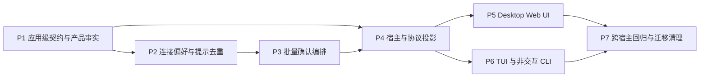

# 外部 AI 应用连接体验执行计划

> 本计划把[外部 AI 工作内容总体架构](../../architecture/extensions/external-ai-work-sources-design.md)和[外部 AI 应用连接与管理详细设计](../../architecture/extensions/external-ai-app-connection-experience-design.md)拆成可独立评审、验证和回退的实施阶段。本文不扩大任何生态的能力兼容范围；OpenCode 具体能力路线仍以[OpenCode 扩展兼容计划](opencode-extension-compatibility-plan.md)为准。

> **实现状态：分阶段交付。** 当前分支已完成共享 V2 应用契约、产品默认、旧偏好迁移、分页批量确认、Desktop/Peer/App Server 薄适配，以及 Desktop Settings 和交互式 TUI 的纵向切片。Web 在旧 Host 上保持严格 V1 只读回退；交互式 TUI 只在 Embedded 旧 Host 上回退 V1，未接线的 Shared Runtime 明确不支持且不会改在控制进程本地执行。通用 Server 尚未绑定可信 workspace owner，任务相关 `action-required`、非交互 CLI 结果、组合 Hook 摘要和完整跨宿主回归仍按本计划后续阶段推进，不能据此宣称支持。

## 1. 目标与执行原则

目标是在保留现有 Command、Tool、Subagent、MCP、Safe Mode、冲突和远端保护语义的前提下，把“外部 AI 应用”从能力平铺页调整为应用级连接与管理体验：

1. 后台发现、应用连接和能力加载明确分离；
2. OpenCode 可由产品事实默认连接，Codex 与 Claude Code 默认只发现；
3. 低风险声明式内容按共享策略自动应用，可执行或权限扩大的内容进入单页批量确认；
4. Desktop、TUI、Peer 和 Server 消费同一应用级读模型、默认策略和决策结果；
5. 提示一次性、持久化去重，只在任务受阻/降级或实质权限扩大时再次主动出现；
6. 不把应用级聚合对象变成新的配置、权限或执行归属模块。

执行遵守以下原则：

- 每个阶段形成可独立评审的纵向结果，不能用仅有 DTO、固定假数据或未接线组件宣称完成；
- 先以测试冻结共享契约和策略，再接宿主，再替换信息架构；
- 当前 `ExternalSourceControlSnapshotV1`、V1 动作/恢复闭合枚举、V1 宿主能力和能力专属 DTO 保持字段与行为不变；应用级读写使用独立版本化 V2 接口，V2 快照不提交用户决定或运行能力写动作并直接用于能力探测；首次 owner 激活仍可执行可重入迁移和既有后台发现；
- 所有 V2 写操作携带 `execution_domain_id`、`target_scope`、`operation_id` 和与该作用域绑定的 `expected_preference_revision`；`workspace_override` 必须携带宿主快照返回的 `workspace_scope_id`，`user_default` 必须省略。`operation_id` 只做请求/响应关联，不承诺幂等重放；偏好版本是唯一写并发保护；
- 宿主能力、Safe Mode、组织/产品安全上限和 Remote/只读限制只能收紧结果；
- React、TUI、Desktop 适配层和 Server 适配层不按生态 ID 重算默认连接、推荐集合或应用级状态；
- 不建立第二套审批存储、冲突存储、监听系统、调度器或运行时注册表；
- 先完成版本化旧偏好迁移，再启用新的默认连接；升级不能静默撤下已有效使用的能力或覆盖显式 disabled/discover-only；
- GUI 与 TUI 共享语义和契约样例，不共享布局、组件、主题键、快捷键或渲染数据结构。

## 2. 变更地图

| 责任 | 主要文件 | 计划内变更 |
|---|---|---|
| 共享应用级契约 | `src/crates/contracts/product-domains/src/external_source_control.rs` | 保持 V1 不变，独立定义 `ExternalApplicationSnapshotV2`、五种摘要状态、主操作、默认连接事实、确认计划、逐项结果和 V2 类型化动作；任务依赖结果归 Agent 事件契约，不塞入可轮询应用快照。 |
| 产品默认与能力上限 | `src/crates/assembly/core/src/external_sources.rs` 及 assembly 中现有产品能力事实归属模块 | 提供 OpenCode 默认连接、Codex/Claude Code 默认只发现的产品事实；派生推荐集合、安全上限与应用状态。 |
| 偏好、迁移与提示去重 | `src/crates/assembly/core/src/external_sources.rs` | 在现有原子偏好存储中加入作用域化连接、暂不使用、提示决定和一次性 `connection_schema_migration_version`；每个旧作用域直接生成真实连接决定，不新增第二个迁移状态机或存储。 |
| 批量确认编排 | `src/crates/assembly/core/src/external_sources.rs` | 预检整批偏好版本、发现代次和宿主条件，按能力类型分派现有归属模块，汇总逐项权威结果。 |
| Desktop/Peer/App Server 投影 | `src/apps/desktop/src/api/external_sources_api.rs`、`src/apps/desktop/src/api/remote_workspace_policy.rs`、Peer 适配层、`src/crates/interfaces/app-server{,-protocol,-client}` 与 `src/apps/server` | 保持薄适配层；先把当前缺失的 V1 Server 只读投影接入 App Server 协议、客户端和处理器，再增加独立 V2 协商和接口；声明远端策略；旧宿主保持 V1 并拒绝 V2 写操作。 |
| Runtime 任务依赖结果 | `src/crates/contracts/events/src/agentic.rs`、`src/crates/assembly/core/src/agentic`、`src/crates/interfaces/app-server{,-protocol,-client}`、`src/crates/adapters/agent-runtime-ipc`、CLI 执行生命周期 | 能力归属模块产生依赖事实，Agent Runtime 关联根/来源轮次并发布 `ExternalDependencyActionRequired`；App Server 与 Shared IPC 传输同一事件，CLI 只投影匹配当前根轮次的结果。 |
| TypeScript 基础设施 | `src/web-ui/src/infrastructure/api/service-api/ExternalSourcesAPI.ts`、`ExternalSourcesAPI.test.ts` | 保持 V1 转换不变，新增独立 V2 转换，并对作用域、发现代次、偏好版本和协议协商安全拒绝。 |
| Web UI | `src/web-ui/src/infrastructure/config/components/ExternalSourcesConfig.tsx` 及同目录拆分组件、样式和测试 | 收敛页面控制器，增加首页、待办、详情、批量确认和高级设置的纵向单列体验。 |
| TUI/CLI | `src/apps/cli/src/modes/chat/external_review.rs`、`external_hooks.rs`、`external_sources.rs`、`src/apps/cli/src/actions.rs` | `/extensions` 应用级入口、`/extensions review`、共享提示去重和任务相关 `action-required`。 |
| i18n 与主题 | 外部来源设置页现有命名空间、CLI 自有本地化资源、现有 SCSS/主题令牌 | 新文案进入归属模块的命名空间，复用 600px 布局和主题令牌，不提高治理基线。 |

具体文件可在实施阶段按仓库当时结构做最小调整，但责任归属和依赖方向不得改变。

## 3. 阶段依赖



P1-P4 是共享语义和协议前置；P5 与 P6 可以在 P4 稳定后并行，但必须以同一契约样例验证。P7 只在 Desktop 与 TUI 都消费共享读模型后执行，不能提前删除旧投影。

## 4. P1：应用级契约、产品事实与状态派生

### 归属与范围

- 归属：`contracts/product-domains` 与 Product Assembly；
- 主要文件：
  - `src/crates/contracts/product-domains/src/external_source_control.rs`
  - `src/crates/assembly/core/src/external_sources.rs`
  - 对应 crate 内已存在的 focused tests。

### 实施内容

1. 冻结 `ExternalSourceControlSnapshotV1`、V1 动作/恢复枚举和 V1 `hostCapabilities`，另行增加 `ExternalApplicationSnapshotV2`：
   - `application_id` 与 `ecosystem_id`；
   - `execution_domain_id`、可选但非通配的 `workspace_scope_id` 和实际连接作用域；`workspace_scope_id` 复用当前宿主的 `workspace_policy_key`，不新增路径注册或反查；
   - 发现、连接、健康等正交事实；
   - `已连接 / 发现可用配置 / 未发现配置 / 需要处理 / 暂时不可用`；
   - 唯一 `primary_action`；
   - `enabled`、`pending_review`、`blocked`、`conflict` 数量；
   - 风险摘要和恢复动作；
   - 确认摘要、稳定 `review_id`、推荐数量/风险、`max_selection_count` 和总数，不内嵌项目列表或可执行载荷。
2. 另行定义 `ExternalApplicationReviewPageV2`：首次无 cursor/no-generation 打开允许 Host 在后台发现刚完成时返回当前只读计划，客户端从该响应接续；其余分页游标严格绑定执行域、工作区作用域、`review_id`、偏好版本和发现代次。每页最多 128 项，只携带稳定项目引用、显示摘要、推荐和安全上限。读取分页不能触发重新发现或能力加载，提交仍必须绑定首次响应的权威计划。
3. 将应用级状态优先级固定在共享归属模块：
   `需要处理 > 暂时不可用 > 已连接 > 发现可用配置 > 未发现配置`；Safe Mode 独立投影。
4. 在 Product Assembly 中定义默认连接事实及原因：
   - OpenCode：允许默认连接；
   - Codex、Claude Code：默认只发现；
   - 未注册生态、旧宿主或受限产品形态：明确不支持或只读，不猜测默认值。
5. 从现有目录、能力控制事实和归属模块状态派生应用聚合；未连接应用不参与运行时冲突和能力注册。
6. 推荐集合由共享策略生成，高风险项默认不推荐；宿主只展示，并只允许在安全上限内调整。
7. 应用快照不持久化或全局聚合任务影响；任务相关结果在 P6 由 Agent Runtime 事件契约单独实现，P1 只定义供其引用的稳定应用/依赖引用。
8. 应用级纯状态、动作和作用域规则归 `contracts/product-domains`；具体聚合、持久化和归属模块分派留在 `WorkspaceExternalSourceService`，`ExternalSourceControlPlane` 不接收产品状态职责。

### 测试优先顺序

先增加失败测试，再实现最小派生逻辑：

- OpenCode、Codex、Claude Code 默认连接事实；
- 五种状态的优先级和 Safe Mode 独立性；
- “已连接但有能力待确认”不会错误显示为全部已启用；
- 未连接应用不进入运行时冲突；
- 未知枚举、不同发现代次或不同偏好版本均安全拒绝；
- 用户默认、工作区覆盖和不同执行域的状态互不污染；
- V1 序列化固定样例完全不变，V2 未协商时不可调用；
- 首页快照不含确认项目；分页单页不超过 128，过期游标不能与新代次拼接；
- 一个轮次的任务依赖结果不能改变另一个轮次的应用状态或退出结果；
- 高风险项默认不进入推荐集合；
- 产品、组织和宿主上限不能被宿主推荐放宽。

### 验证

```bash
cargo test -p bitfun-product-domains external_source_control
cargo test -p bitfun-core external_source
cargo check --workspace
```

实际 package 名以对应 `Cargo.toml` 为准；若 focused test 过滤器不能覆盖新增测试，运行受影响 crate 的完整测试，不用全 workspace 测试代替静态检查。

### 用户可见结果

无独立用户界面变化；后端能够稳定返回应用级状态、默认策略、主操作和确认计划。

### 退出条件

- Desktop/TUI 无需生态分支即可渲染同一 fixture；
- V1 消费方保持可编译、golden wire shape 和原有行为；
- 应用级状态完全由共享归属模块派生；
- V2 应用状态按执行域和工作区作用域求值，任务依赖只存在于根会话和根轮次绑定的 Agent Runtime 事件；
- 默认连接事实有产品组装测试，不存在 `ecosystem_id == "opencode"` 的宿主业务分支。

### 暂停条件

若应用级聚合需要读取能力 owner 尚未公开且无第二个真实消费方的内部状态，先设计最窄只读事实并完成 owner 评审；不得通过公开任意 payload 或复制 owner 状态绕过。

## 5. P2：连接、断开、暂不使用与提示去重

### 归属与范围

- 归属：`assembly/core` 的 `WorkspaceExternalSourceService`（或实施时同一现有产品级服务的私有协调单元）和现有偏好存储；`assembly/external-sources` 的 `ExternalSourceControlPlane` 只提供与提供方无关的发现结果；
- 主要文件：
  - `src/crates/assembly/core/src/external_sources.rs`
  - `src/crates/contracts/product-domains/src/external_source_control.rs`
  - 对应持久化和并发测试。

### 实施内容

1. 在 V2 endpoint 增加闭合类型化动作：
   - `ConnectApplication`；
   - `DisconnectApplication`；
   - `SetApplicationDeferred`；
   - 保持已有 `Refresh`、`SetSourceEnabled` 和 `SetSafeMode`。
2. 在现有偏好文件和跨进程原子更新路径中持久化：
   - execution domain ID；
   - `user_default` 或 `workspace_override`；workspace override 携带当前 `workspace_policy_key` 产生的 Host-local `workspace_scope_id`；
   - application/ecosystem ID；
   - desired connection 状态；
   - 明确断开或暂不使用决定；
   - notice key、内容/行为版本、风险摘要版本和用户决策状态；
   - 一次性 `connection_schema_migration_version`；它只与整份文档的原子转换一起写入；
   - 按 `(execution_domain_id, application_id, workspace_scope_id?)` 保存的真实连接决定与 `decision_origin`，无法归属的项直接使用 `needs_review`，不保存逐 scope 迁移进度。
3. 在启用新默认连接前执行锁内、可重入的旧偏好迁移。`WorkspaceExternalSourceService` 启动时先建立全局迁移 gate；所有 discovery、MCP revision-key helper 和 V2 endpoint 必须等待它完成或返回明确 incompatible/needs-review 状态。该 gate 先读取原始存储存在性和 schema，再调用会通过 MCP secret/revision-key 初始化自动物化默认文件的 `external_sources_config_with_mcp_revision_key`；不得根据已经默认化的对象猜测旧文件来源：
   - 新决定已存在时保持不变；
   - 只有确认从未存在偏好文件的 V2 新安装写入 `config_origin=fresh_v2`，允许保持“无决定”并应用新产品默认；已有文件、legacy 默认文件和 incompatible-policy reset 都不能获得该 origin；
   - 任一 legacy 文件中的 `integration_policy.enabled=false` 都保守迁移为显式未连接，并记录 `decision_origin=legacy_safety`；这包括旧版本自动写出的默认文件。它与用户显式 `SetEnabled(false)` 无法区分，因此不能让 OpenCode 默认连接覆盖。代价是部分从未主动关闭的旧用户需重新连接一次，迁移说明必须明确该安全取舍；
   - 目标 user default/workspace override 下该生态明确求得 disabled/discover-only 时，同样迁移为显式未连接；
   - 只有旧作用域的 `integration_policy.enabled=true` 且已有效使用某生态时才迁移为已连接；该判断晚于上一条保守未连接规则。“有效使用”要求至少一项实际访问级别为 `ask_before_use`/`auto`，或存在可按来源归属的审批、冲突决定或活动路由；
   - 当前 `workspace_overrides` 的键已是 `workspace:` 加规范化工作区 SHA-256 的前 16 字节十六进制；直接把每个键作为 `workspace_scope_id` 逐项迁移，不建立路径反查。无法可靠归属应用、执行域或作用域的旧记录写为 `needs_review`，对应作用域继续由 V1 路径管理；
   - 读到未知未来 `schemaMajor` 时沿用当前 incompatible-policy fail-closed：不迁移、不应用默认、不写 V2 决定、不进入偏好 update/atomic replace，byte-for-byte 保留包含 opaque policy 的原文件；用户执行既有“备份并重置”时，在同一原子更新中备份 raw policy、写入 `config_origin=incompatible_reset` 和显式未连接决定，继续保持外部执行关闭，不能转成 fresh V2；
   - 先在内存中计算全部旧作用域决定，再把决定、schema migration version 和现有审批/冲突数据一次原子替换。成功时不存在部分迁移；失败保持旧文件和完整 legacy 路径，重启后重试整次转换。
4. 默认连接只对 `fresh_v2` 或已完成迁移且确实没有显式决定的作用域生效；工作区覆盖优先于同一执行域的用户默认；明确断开、暂不使用、不兼容策略或 `decision_origin=legacy_safety` 不得被监听器、重启或重新发现覆盖。
5. 连接先在现有权威偏好文档中提交作用域化决定并推进 preference revision，再协调允许自动应用的低风险内容；返回已启用、待确认、受限和失败摘要。
6. 断开先撤下该 execution domain/workspace scope 上的新调用路由和由该连接注册的能力，再停止持续同步；不改写外部配置，不影响其他作用域或生态。
7. Instruction、Skill、Hook 和复制后的原生配置仍服从各自 owner。没有来源限定撤下端口的能力必须报告 `managed_separately`/部分支持，并暂停“完整断开”交付，不能由 UI 隐藏冒充卸载。
8. 提示规则：
   - 首次发现只允许一次性非阻塞轻提示；
   - 用户关闭、决定或完成处理后，同一版本不再主动提示；
   - 仅当前任务受阻/降级或已确认内容权限实质扩大时再次主动提示；
   - 普通数量变化、无关更新失败和来源删除只更新状态。

### 测试优先顺序

- 默认连接与显式断开/暂不使用的优先级；
- fresh V2 无文件时 OpenCode 可应用产品默认；旧版自动物化的默认文件与用户显式 `enabled=false` 都保守保持未连接，且不会被默认连接覆盖；
- legacy 配置中 disabled/discover-only、已有效使用的 Claude Code/Codex/OpenCode、无决定生态分别迁移到预期状态；
- 多个 workspace scope 的迁移要么一次全部提交，要么一个都不提交；写入失败和崩溃重启不会留下部分新状态；
- discovery、MCP revision-key 初始化与 V2 endpoint 并发首次访问时都等待同一 migration gate，不能先物化默认文件或观察半迁移状态；
- 未知未来 `schemaMajor` 保持原始 JSON、拒绝迁移和 V2 mutation；备份并重置后记录 `incompatible_reset` 且仍显式未连接，不应用 OpenCode 默认；
- future-major → backup/reset → restart fixture 证明 raw backup 保留、外部执行仍关闭，只有后续显式 ConnectApplication 才改变状态；
- stale preference revision 整个 mutation 不应用；
- 响应丢失后使用旧偏好版本重试会返回过期；客户端重读权威快照后再决定是否发送新操作，相同 `operation_id` 不能绕过版本检查或重放旧结果；同一活动连接中的并发请求不复用 ID；
- 跨进程并发更新不丢失另一个应用的决定；
- 两个工作区作用域和两个执行域的连接、提示与偏好版本相互隔离；
- watcher 更新不会重新连接用户已断开的应用；
- 断开仅卸载目标生态能力；
- notice key 在 GUI/TUI/重启之间去重；
- 权限扩大产生新风险版本，普通数量变化不产生主动提示。

### 验证

```bash
cargo test -p bitfun-core external_source
cargo check --workspace
```

### 用户可见结果

连接、断开和暂不使用具有明确完成结果；同一发现不会在多个项目、进程或宿主反复提示。

### 退出条件

- 所有连接决定和 `connection_schema_migration_version` 使用现有原子偏好存储，且没有第二套逐 scope 迁移状态机；
- 默认连接与用户显式决定的优先级可由重启测试证明；
- 断开后目标 execution domain/workspace scope 的相关新调用不可达，其他作用域和生态不受影响；
- 旧审批、拒绝、冲突和来源抑制记录在迁移后保持，只有 fingerprint 失效或权限扩大才重新确认；
- 提示去重不依赖 React local storage 或 TUI 进程内集合。

### 暂停条件

若某能力 owner 无法按来源/生态撤下路由，先补 owner 的类型化撤下能力和行为测试；不得把“UI 显示已断开”作为运行时已卸载的替代证据。

## 6. P3：单页批量确认与归属模块分派

### 归属与范围

- 归属：`assembly/core` 的产品级 `WorkspaceExternalSourceService` 负责预检与分派，各能力归属模块负责最终业务决定；`ExternalSourceControlPlane` 不参与审批、偏好写入或产品状态派生；
- 主要文件：
  - `src/crates/contracts/product-domains/src/external_source_control.rs`
  - `src/crates/assembly/core/src/external_sources.rs`
  - 现有 Tool、Subagent、MCP 审批与冲突测试。

### 实施内容

1. 定义 `GetApplicationReviewPage` 只读请求：
   - `execution_domain_id`、`target_scope` 与可选 `workspace_scope_id`；
   - `review_id`、cursor 和页面大小；服务端将页面大小限制为 128；
   - 响应只含同一偏好版本/发现代次的稳定 item reference 和脱敏显示摘要；stale cursor 要求从第一页重读；
   - 从当前不可变发现结果派生，不重新扫描文件、不启动能力，也不持有偏好写锁。
2. 定义 `SubmitApplicationReview` 请求：
   - `execution_domain_id`、`target_scope`；仅 workspace override 携带 Host 快照返回的 `workspace_scope_id`；
   - `review_id`；
   - `operation_id`，仅用于请求/响应关联；
   - `expected_preference_revision`；
   - 相关 provider/owner generations；
   - `selection_baseline = recommended | none`；
   - 有界 `selection_overrides[]`，每项只含稳定项目引用和与基线不同的选择结果。
3. 请求不携带命令正文、提示词、凭据值、任意执行载荷或整份确认项目。服务端用 `review_id` 查找同代不可变计划，先应用共享推荐或空集合基线，再应用改动项，并从计划取得能力类型、决策键、行为版本和归属模块代次。最终选择数量服从现有归属模块/协议上限，并由确认摘要返回 `max_selection_count`；改动项也不得超过该上限。
4. 整批预检以下条件：
   - V2 schema/协议协商、Host identity 和 capability；
   - execution domain、workspace scope 与当前 Host 连接绑定；
   - preference revision；
   - review plan/generation；
   - application connection 状态；
   - Safe Mode 和 safety ceiling。
5. 整批预检失败时不应用任何项；通过后按能力类型分派现有单项审批/冲突 owner。
6. owner 可以逐项拒绝业务请求；响应必须返回每项 `applied / rejected / blocked / stale / failed` 等闭合结果及恢复动作，未知结果不得视为成功。
7. 只持久化实际成功且仍与 decision key/behavior version 匹配的决定；返回与最终 preference revision 同代的新快照。

这里的零应用保证止于分派前预检。分派开始后若某个 owner 的事实并发变化，响应可以同时包含已应用项与类型化 stale/failed 项；本阶段不增加跨 owner 事务或回滚管理器，也不宣称批量业务执行原子化。

### 测试优先顺序

- stale revision、generation 或 Host capability 导致整批零应用；
- snapshot 只含 review summary；分页大小、总量上限、cursor 绑定和 stale 重读均按契约执行，翻页不触发重新发现；
- 推荐项跨越多页且用户未读取后续页面时，`recommended` 基线仍选择同代完整推荐集合；已查看页面的改动项准确覆盖基线，不为提交强制拉取全部页面；
- `none` 基线加选择改动项可以表达从空集合开始的选择；改动项越界、未知引用或来自另一 `review_id` 时整批拒绝；
- 作用域身份不匹配或从另一 workspace scope/Host 重放导致整批零应用；
- 两个不同 owner 的成功项共同提交；
- 一个 owner 业务拒绝时另一个成功项的逐项结果准确；
- 未知 item reference 和未知能力类型 fail closed；
- safety ceiling 阻止宿主选择高于上限的项；
- 高风险默认未选，但用户可在上限允许时显式选择；
- 重放旧 review plan 不恢复旧权限；
- 逐项结果与最终快照状态一致。

### 验证

```bash
cargo test -p bitfun-core external_source
cargo test -p bitfun-core external_tool
cargo test -p bitfun-core external_subagent
cargo test -p bitfun-core external_mcp
cargo check --workspace
```

过滤器以实际测试模块为准，至少覆盖本次触及的所有 owner。

### 用户可见结果

用户可以在一个 review 页面确认推荐集合；无需连续处理 Tool、Subagent、MCP 和冲突弹窗，并能看到逐项真实结果。

### 退出条件

- 整批并发保护与逐项业务结果边界清楚；
- 没有通用任意 payload API；
- owner 仍是最终批准、注册和失败事实的权威；
- 旧单项入口在迁移期间仍可工作，并与批量入口共享决定。

### 暂停条件

如果无法定义跨 owner 的原子回滚，不得宣称批量业务执行原子化；保留“整批预检原子、owner 逐项结果”的明确语义，并确保响应与快照可解释。

## 7. P4：Desktop、Peer、App Server 与 Server 协议投影

### 归属与范围

- 归属：各应用/传输适配层与 `interfaces/app-server` 线协议适配层；
- 主要文件：
  - `src/apps/desktop/src/api/external_sources_api.rs`
  - `src/apps/desktop/src/api/remote_workspace_policy.rs`
  - `src/apps/cli/src/peer_host/commands/external_sources.rs`
  - `src/crates/interfaces/app-server-protocol/src/external_sources.rs` 及 `method.rs`/`lib.rs` 注册
  - `src/crates/interfaces/app-server-client/src/lib.rs`
  - `src/crates/interfaces/app-server/src/server/handlers/external_sources.rs` 及 Runtime/domain-to-wire conversion
  - `src/apps/server/src/app_server.rs`、`src/apps/server/src/routes/external_sources.rs` 与 WebSocket round-trip tests
  - `src/web-ui/src/infrastructure/api/service-api/ExternalSourcesAPI.ts`
  - `src/web-ui/src/infrastructure/api/service-api/ExternalSourcesAPI.test.ts`。

### 实施内容

1. 保持现有 V1 DTO、Desktop/Peer endpoint、TypeScript union/allowlist 和 wire fixtures 不变；不得向 V1 action、recovery action 或 `hostCapabilities` 追加应用级字段。当前 Server `/ws` 经 `BitfunAppServer` 处理，仓库中的旧 `routes/external_sources.rs::dispatch` 已脱离生产路径并返回 `method_not_found`，不能把它当作“现有 Server adapter”。
2. 先完成 P4a Server V1 只读前置切片：
   - 在 `app-server-protocol` 定义独立的 V1 snapshot/control-snapshot method、wire DTO 和错误；`AppServer`/`AppClient` role 保持 schema-free，不登记领域方法；
   - `app-server-client` 增加 typed request/response，`app-server` 只注册 handler、校验 wire contract 并转换 Runtime/domain 类型；handler 注入 `WorkspaceExternalSourceService` 的最窄只读 owner port，不持有第二份状态；
   - `interfaces/app-server-client` 与 TypeScript translation 保持 V1 wire shape，Server Host 绑定其真实 workspace，不读取浏览器或控制端路径；
   - Server 不注册 write handler；未知/写方法在反序列化 mutation payload 前以 method-not-found/host-capability-unavailable 拒绝；
   - 用真实 `/ws` transport 做 Server bootstrap → `BitfunAppServer::serve` → handler → owner → client 的端到端 round-trip。该切片通过前，Server 不进入 V2 共享 fixture，也不得标记为只读 external-source Host。
3. P4a 后新增不提交用户决定或运行能力写动作的 `get_external_application_snapshot_v2`，直接作为版本探测：成功响应必须是严格 V2 数据结构，并携带宿主读写能力；首次 owner 激活可执行可重入迁移和既有后台发现，确认分页不得冷启动 owner。旧宿主的传输层 method-not-found 等价于“仅 V1”。不增加独立版本信息接口，也不引入“声明支持但接口不可用”的第二种状态。
4. 客户端只有在 V2 snapshot 校验成功后，才调用 `get_external_application_review_page_v2` 或 `apply_external_application_action_v2`。V2 snapshot/action 不与 V1 对象混合序列化；read-only Server 只登记 snapshot/review read endpoint，不登记 mutation endpoint。
5. Desktop Tauri command 只映射结构化 request/response，不派生状态、默认策略或推荐集合。
6. 每个新增 Desktop command 在 remote workspace policy 中声明明确策略；Remote 未支持时返回 V2 类型化 unsupported，不回退本机。
7. Peer Host 在事实所在 Host 执行相同 V2 typed action；Host 始终校验 `execution_domain_id`，并在 workspace override/上下文存在时校验快照返回的 `workspace_scope_id` 与连接绑定；控制端只原样回传 scope id，再用 Host identity、generation 和 accepted sequence 隔离响应。
8. 旧 Peer/Host：
   - 新客户端回退显示 legacy V1 control/catalog，不把候选误报为应用级已连接；
   - V2 mutation 在客户端禁用；“升级 Host”是协商失败后的本地 UI 恢复建议，不发送给旧 Host；
   - 不由控制端模拟 mutation。
9. TypeScript 为 V1/V2 使用独立 normalization；V2 严格检查 schema、作用域身份、generation、preference revision、Host capability 和 item reference，未知字段组合 fail closed。

### 测试优先顺序

- V1 Rust/TypeScript golden fixtures 在新 Host/客户端中保持完全一致；
- old client → new Host 继续只使用 V1；new client → old Host 经 method-not-found 明确回退 V1 且没有 V2 mutation；
- V2 Rust/TypeScript 序列化字段一致；V2 snapshot 成功、method-not-found 回退和未知 schema 拒绝均有契约测试；
- App Server V1 read-only 方法在真实 Server `/ws` 往返成功，且 wire fixture 与 Desktop/Peer V1 一致；
- control、catalog 和 application snapshot 同代；
- read-only Host 未注册 mutation endpoint，并在 mutation payload 解析前拒绝；
- Remote 不回退本机；
- 旧 Host 降级不会把候选误报为已连接或已启用，也不会收到未知 V2 action/recovery enum；
- Host identity、execution domain 或 workspace scope 不匹配时拒绝响应/结果；
- accepted sequence 防止旧响应覆盖新连接决定；
- 未知状态、动作、逐项结果和恢复动作安全失败。

### 验证

```bash
cargo check -p bitfun-desktop
cargo test -p bitfun-app-server
cargo test -p bitfun-server external_source
pnpm --dir src/web-ui run test:run src/infrastructure/api/service-api/ExternalSourcesAPI.test.ts
pnpm run type-check:web
```

同时运行 Desktop/Peer/Server 中与 external source command 直接对应的 focused tests。

### 用户可见结果

本机 Desktop、Peer 控制界面和只读 Host 对相同应用事实给出一致状态；不支持的宿主明确说明升级、重连或切换 Host。

### 退出条件

- adapter 无生态业务分支；
- 新 Desktop commands 全部具备 remote workspace policy；
- TypeScript 对未知、未协商或不同作用域/代快照 fail closed；
- V1 wire contract 冻结，V2 只在独立 endpoint 协商后启用；
- Server V1 read-only App Server 前置切片有真实 WebSocket round-trip，不能由 dead dispatch 单元测试替代；
- 双向新旧 Host/客户端组合有契约测试，旧 Host 降级不产生执行位置 fallback。

## 8. P5：Desktop Web UI 信息架构

### 归属与范围

- 归属：Web UI Settings；
- 主要文件：
  - `src/web-ui/src/infrastructure/config/components/ExternalSourcesConfig.tsx`
  - `src/web-ui/src/infrastructure/config/components/ExternalSourcesConfig.scss`
  - `src/web-ui/src/infrastructure/config/components/ExternalSourcesConfig.test.tsx`
  - 同目录新增的聚焦组件与测试
  - `src/web-ui/src/infrastructure/config/components/common/config-page-layout.tokens.scss`
  - 外部来源设置页现有 i18n namespace。

### 实施内容

1. 保留 `ExternalSourcesConfig` 作为页面 controller，继续负责读取、轮询、mutation sequencing、accepted sequence、pending mutation、scope mutation 栅栏和错误恢复。
2. 按责任拆分：
   - `ExternalAppsOverview`；
   - `ExternalAttentionSummary`；
   - `ExternalAppDetail`；
   - `ExternalAppReview`；
   - `ExternalAdvancedSettings`；
   - 无策略判断的 presentation helpers。
3. 首页使用现有 `ConfigPageLayout` 的 760px 单列阅读轴：标题、应用列表、高级设置。真实的任务相关待办通过就地提示或状态变化处理，不把无法归属的系统诊断聚合成首页数量。
4. 每个应用行只显示应用名、一个状态、一句结果摘要和唯一主操作；有工作区时主操作明确标注“仅当前工作区”，没有工作区时先进入详情选择范围。来源路径、能力清单、冲突和诊断进入详情。
5. 详情按“结果优先、控制后置”排列；连接完成显示生效范围、已启用、待确认和受限摘要。`user_default` 只在详情/高级设置中提供，并在提交前再次展示会影响同一执行域的所有工作区。
6. 批量确认页面先使用快照摘要，再按需分页读取项目引用；默认只显示确认数量和“使用推荐/暂不启用”两个决定，单项名称、风险和安全上限放在折叠的调整区，不展示内部错误码、处理阶段或任意载荷。高风险默认未选。提交使用同代推荐/空集合基线和用户改动项，不为提交强制读取全部页面；首页轮询不读取项目页面。
7. Safe Mode 在首页和详情显著展示，高级设置保留现有 source、scope、冲突、诊断和能力级管理。
8. 首次发现只使用一次性轻提示和 Settings 导航状态；不增加启动 Modal 或常驻 banner。
9. 所有文案进入现有 i18n namespace，颜色与状态复用主题 token，不提高主题治理基线。

### 测试优先顺序

- 五种应用状态和唯一主操作；
- “需要处理”仅在真实待办时出现；
- OpenCode 默认连接结果与 Codex/Claude 主动连接路径；
- 连接完成摘要；
- 当前工作区主操作不会改写 `user_default`；无工作区时不会直接执行全局连接；全局连接必须明确选择并二次确认范围；
- 批量默认选择严格等于共享推荐；跨页未读取项由同代推荐基线表达，已修改项只作为覆盖提交；
- 首页请求不携带 review items；打开/翻页才读取 bounded page，stale page 会整体刷新而不是混合显示；
- stale response/mutation 不覆盖新状态；
- review 整体失败和逐项失败；
- 断开与暂不使用；
- Safe Mode 显著状态；
- 旧 Host/read-only/Remote 降级；
- 键盘焦点、展开、批量选择和状态非颜色表达；
- 现有审批、冲突、诊断、scope 和脱敏回归保持通过。

### 验证

```bash
pnpm --dir src/web-ui run test:run src/infrastructure/config/components/ExternalSourcesConfig.test.tsx src/infrastructure/api/service-api/ExternalSourcesAPI.test.ts
pnpm run type-check:web
pnpm run i18n:audit
pnpm run theme:color-audit:all
```

若组件拆分出独立测试文件，将这些文件加入同一次 focused test 命令。

### 用户可见结果

Settings 以应用为主入口，采用纵向单列；用户先看到连接结果和唯一下一步，高级能力管理仍可访问但不占据首页。

### 退出条件

- 首页不再平铺 Tool、Subagent、MCP、来源和诊断；
- controller 的竞态保护有回归测试；
- UI 不包含 OpenCode/Codex/Claude 默认策略分支；
- 现有高级操作没有被隐藏为不可达；
- type-check、focused tests、i18n 和主题治理通过。

### 暂停条件

若拆分组件需要重写现有 controller 并改变 mutation 顺序，先保留 controller，仅提取纯展示组件；不得以视觉改版为由同时重构请求状态机。

## 9. P6：TUI `/extensions` 与非交互 CLI

### 归属与范围

- 归属：能力归属模块产生阻塞事实，Agent Runtime 拥有根任务结果与父子关系；App Server/Shared IPC 只传输，`src/apps/cli` 只投影交互和退出结果；
- 主要文件：
  - `src/crates/contracts/events/src/agentic.rs`
  - `src/crates/contracts/runtime-ports/src/lib.rs`
  - `src/crates/assembly/core/src/agentic/coordination/coordinator.rs` 及真实外部能力解析/调用 owner
  - `src/crates/interfaces/app-server-protocol/src/tui.rs`、`src/crates/interfaces/app-server-protocol/src/event.rs`、`src/crates/interfaces/app-server-client/src/lib.rs` 与 event round-trip tests
  - `src/crates/interfaces/app-server/src/server/event_forwarder.rs` 及 handler/conversion tests
  - `src/crates/adapters/agent-runtime-ipc/src/protocol.rs` 及 Shared Runtime client/server tests
  - `src/apps/cli/src/modes/chat/external_review.rs`
  - `src/apps/cli/src/modes/chat/external_hooks.rs`
  - `src/apps/cli/src/modes/chat/external_sources.rs`
  - `src/apps/cli/src/actions.rs`
  - `src/apps/cli/src/peer_host/commands/external_sources.rs`
  - `src/apps/cli/src/modes/exec/lifecycle.rs`
  - 对应 parser、action registry、snapshot、事件和输出测试。

### 实施内容

1. `/extensions` 使用共享应用级快照展示应用、状态、数量、默认策略、主操作和 Safe Mode。
2. 增加连接、断开、暂不使用和详情动作；默认命令作用于当前工作区并在输出中显示范围，全执行域默认必须使用明确参数/确认路径。parser、help、palette/action registry 与 dispatch 从同一 action 定义保持一致。
3. `/extensions review` 使用共享 review summary，并按需读取有界 item page：
   - 默认采用推荐集合；
   - 高风险默认不选；
   - 支持查看技术详情和调整；
   - 用同代推荐/空集合基线和有界改动项提交同一类型化批量动作，不强制读取全部页面；
   - 逐项展示权威结果。
4. `/tools`、`/agent`、`/mcp` 和 `/hooks` 保留专项/高级管理，不复制首次连接向导。
5. 删除仅进程内有效的重复提示判断，改为读取共享 notice/user decision facts；首次发现不阻塞聊天。
6. 复用现有提交身份，不新增任务 ID：`AgentSubmissionResult` 仍只返回 accepted/turn ID；根 `session_id + turn_id` 唯一标识本次任务，子代理来源由现有 `SubagentSessionLinked` 追溯。
7. 能力 owner 在真实解析或调用路径因未连接、待批量确认或权限扩大而阻止一个被请求的外部依赖时，返回类型化依赖事实。Agent Runtime 用 turn-local collector 聚合并发布新的 `AgenticEvent::ExternalDependencyActionRequired`，事件至少包含：
   - `execution_domain_id` 与可选、非通配的 `workspace_scope_id`；
   - 根 `session_id + turn_id`；
   - `origin_session_id + origin_turn_id + origin_tool_call_id?`；
   - 依赖引用、风险摘要、`can_degrade` 与闭合恢复动作。
8. Runtime 使用现有 `SubagentSessionLinked(parent_session_id, parent_dialog_turn_id, parent_tool_call_id)` 递归追溯子代理来源。只有根 turn 仍在等待来源 tool call 时，子代理阻断事实才聚合给根；无关、后台或已脱离等待链的子代理结果不改变根任务。聚合事件必须在对应根任务结束事件前发出；并发根 turn 之间不共享 collector。
9. 通过已有 Agent 事件路径端到端传输，而不是新增 CLI 私有旁路：
   - `bitfun-events` 拥有事件 wire contract；应用级 product-domain DTO 只提供稳定 dependency reference，不拥有任务结果；
   - App Server 继续通过 `agent/event` 的 `AgenticEventEnvelope` 转发，但新闭合事件是 wire 扩展：提升 `app-server-protocol::PROTOCOL_VERSION`，按每连接协商版本过滤 `ExternalDependencyActionRequired`。旧协议连接继续接收其已知事件但绝不能收到新 variant；若实现无法可靠逐连接过滤，就必须同步提升 `MIN_PROTOCOL_VERSION` 并在 initialize 时拒绝旧客户端，不能让其在事件流中反序列化失败；
   - `app-server-client` 只有在 Host 协商到新增版本后才解释该事件；新客户端连接旧 App Server Host 时明确报告“任务依赖结果不支持”，不从结束文本猜测；
   - Shared Runtime 继续通过 `RuntimeIpcEvent::Agent` 转发。由于 IPC 是严格版本协议，新增事件时同步提升 `PROTOCOL_VERSION`，旧 client/server 在握手失败后明确降级，不能混读；
   - Peer/Remote fanout 必须保留根任务和来源身份，不得重写为控制端 workspace。
10. 非交互 CLI 只缓存与当前 `execution_domain_id + workspace_scope_id? + root session + root turn` 全部匹配的事件；不可降级的事件在根任务结束后投影为类型化 `action-required`，可降级事件保留为结构化警告并沿用真实结束结果。不得从轮询应用快照、任意子代理事件或错误文本推断退出状态。
11. stdout/stderr 与现有结构化输出契约保持不变；不得把交互式选择提示写入非交互 stdout。

### 测试优先顺序

- `/extensions` parser、help、palette 和 dispatch 一致；
- GUI/TUI 对同一 fixture 的状态、默认策略、数量和主操作一致；
- GUI/TUI 默认连接或断开只改变当前 workspace scope；全执行域操作必须明确选择，结果摘要显示最终生效范围；
- `/extensions review` 默认选择与共享推荐一致，跨页未访问项与用户改动项的结果和 GUI 相同；
- stale review 重新读取，不重放旧决定；
- 首次提示跨进程去重；
- 无关待办不阻塞聊天或非交互任务；
- 根 turn 直接命中 pending capability 时，在 terminal event 前收到匹配的 `ExternalDependencyActionRequired` 并返回 `action-required`；
- 通过 `SubagentSessionLinked` 证明依赖的 child blocking fact 聚合到根；无关/后台 child、错误 parent tool-call 或已断开的依赖边不影响根；
- 两个并发根 turn 的事件不串扰，来自另一 execution domain、workspace scope、session 或 turn 的事件被拒绝；
- App Server Embedded 与 Shared Runtime IPC 对同一事件 fixture 的字段、顺序和 terminal 结果等价；Shared 新旧协议版本在握手处 fail closed；
- new App Server Host → protocol v2/v3 client 不发送未知 outcome variant；新版本 client → old Host 不提交/不期待该能力；协商新版本时完整 round-trip；
- Peer/Remote 转发保留 root/origin identity 且不回退控制端 workspace；
- read-only/Remote/旧 Host 输出明确恢复动作；
- `/tools`、`/agent`、`/mcp`、`/hooks` 原有职责和兼容别名保持通过。

### 验证

```bash
cargo test -p bitfun-cli external
cargo test -p bitfun-cli action
cargo test -p bitfun-events external_dependency
cargo test -p bitfun-app-server agent_event
cargo test -p bitfun-agent-runtime-ipc agent_event
cargo check -p bitfun-cli
```

同时运行 action registry 和相关 slash command 的现有 focused tests。

### 用户可见结果

TUI 与 Desktop 共享“发现—连接—加载”的心智和决定；CLI 用户通过 `/extensions` 完成首次连接和批量确认，能力专项入口继续可用。

### 退出条件

- GUI/TUI golden fixture 一致；
- 交互提示不阻塞普通输入；
- 非交互只对当前 execution domain、workspace scope、根 session/turn 的不可降级任务相关待办返回 `action-required`；
- direct root、linked subagent、unrelated/background subagent、并发 roots、Embedded/Shared 和 Peer/Remote 路径都有端到端事件证据；
- TUI 无生态默认策略分支，且不共享 GUI 布局或组件 schema。

## 10. P7：跨宿主回归、迁移与清理

### 归属与范围

- 归属：Product Assembly、Desktop、Web UI、CLI 共同完成；
- 范围：共享 fixtures、i18n、主题、旧投影退场和文档同步。

### 实施内容

1. 建立同一组跨宿主 fixture，至少覆盖：
   - 首次发现并默认连接 OpenCode；
   - 首次发现但不连接 Codex/Claude Code；
   - 多应用并存；
   - 已连接且部分待确认；
   - 权限扩大；
   - 连接失败、沿用上一版本和 Host 不支持；
   - Safe Mode；
   - stale revision/generation；
   - 断开后重新发现；
   - 当前任务相关与无关待办；
   - user default 与 workspace override；
   - 本机、Peer、Remote execution domain 隔离；
   - old client/new Host、new client/old Host；
   - fresh V2 无文件、legacy 自动物化默认文件/显式 false、disabled/discover-only、已有效使用、无法归属、多个 workspace scope 原子转换和 future-major incompatible policy。
2. 对比 Rust read model、TypeScript normalization、Desktop 展示和 TUI 文本中的状态、默认策略、数量、主操作及恢复动作。
3. 验证 P2 的原位旧偏好迁移和切换：
   - 全部 scope 决定与 `connection_schema_migration_version` 一次原子提交，崩溃/写失败保持完整旧文件，不存在部分完成状态；
   - legacy 自动物化默认文件、显式 false 和 disabled/discover-only 均不被新默认覆盖；只有明确 `fresh_v2` 无文件初始化可应用 OpenCode 默认；已有效使用的 Claude Code/Codex/OpenCode 能力、审批和冲突决定不因升级静默撤下；
   - future-major incompatible policy byte-for-byte 保留包含 opaque policy 的原文件，拒绝迁移、默认连接、MCP secret 自动写入和 V2 mutation；备份并重置后写入 `incompatible_reset` 并保持显式未连接，直到用户主动连接；
   - 无法归属的旧状态继续留在 legacy V1 路径并要求审阅，直到有明确迁移决定；
   - Instruction、Skill、Hook 和复制后的原生配置按各自 owner 验证，不被应用连接误删。
4. 迁移旧入口：
   - 保留能力专项操作；
   - 删除 React/TUI 中重复的状态优先级、默认连接和提示去重逻辑；
   - 只有所有生产宿主切换且回归通过后，才删除不再消费的 legacy 聚合字段或 action；
   - 只要仍有旧 Host/客户端，V1 wire contract 和 endpoint 就继续保留；V2 不复用或扩展 V1 闭合枚举；Server 只有在 App Server V1 read-only round-trip 交付后才计入生产宿主。
5. 更新架构、详细设计、CLI 架构和实现状态；不能把目标能力写成已交付。
6. 记录首页快照和确认分页的序列化大小、聚焦读取延迟及前后对比；读取不得重新扫描、启动外部能力或持有偏好写锁。明显回退必须先减少返回数据或重复计算，不能无基线地增加缓存。
7. 复核远端策略、日志脱敏、i18n、主题、仓库卫生和未跟踪生成文件。

### 综合验证

```bash
pnpm run fmt:rs
cargo check --workspace
cargo test -p bitfun-core external_source
cargo test -p bitfun-cli external
cargo check -p bitfun-desktop
pnpm --dir src/web-ui run test:run src/infrastructure/config/components/ExternalSourcesConfig.test.tsx src/infrastructure/api/service-api/ExternalSourcesAPI.test.ts
pnpm run type-check:web
pnpm run i18n:contract:test
pnpm run i18n:audit
pnpm run theme:color-audit:all
pnpm run check:repo-hygiene
```

仅在实际触及对应范围时运行 i18n contract 或全主题审计；Rust 和 Web UI 的最小必需检查仍按仓库根 `AGENTS.md` 执行。

### 退出条件

- Desktop、TUI、Peer 与已完成 App Server 前置切片的 Server 对共享 fixture 的应用事实一致；
- 连接、批量确认、断开、提示去重和任务相关 `action-required` 均有端到端证据；
- 现有 Safe Mode、能力审批、冲突、诊断、脱敏和竞态测试保持通过；
- 无宿主按生态 ID 重算产品事实；
- 未连接应用不加载能力、不参与运行时冲突；
- Remote/read-only 不回退本机；
- legacy 升级不改变显式策略、已有效使用的能力、审批或冲突决定，失败可重试且不产生半迁移；
- 连接、提示和确认按执行域与工作区作用域隔离；任务结果按执行域、工作区作用域、根会话和根轮次隔离，并沿用子代理来源关系；
- 首页快照与确认分页保持有界，且性能对比没有未解释的明显回退；
- V1 wire fixtures 不变，V2 协商及双向新旧组合通过；
- 旧字段和逻辑只在确认无生产消费方后删除；
- 文档明确区分当前能力与目标状态。

## 11. 提交与评审边界

建议按 P1-P7 分为独立提交或 PR；P5 与 P6 可以在 P4 后并行。每个提交必须：

1. 包含自己的失败测试、实现和最小验证；
2. 说明修改了哪个稳定 contract/owner，是否影响旧 Host；
3. 不混入新的生态能力解析、OpenCode package runtime、聊天历史迁移或显式配置导入；
4. 不提高 i18n/theme 治理基线来掩盖新增债务；
5. 不删除与旧消费方仍有关联的公共 V1 符号；
6. 在评审描述中列出实际执行的 focused commands 和剩余由 CI 覆盖的范围。

出现以下任一情况应停止当前阶段并回到架构评审：

- 需要让 UI/TUI 解析生态原始 payload；
- 需要新增跨能力任意执行 DTO；
- 需要通过本地 fallback 掩盖 Remote/Host 不支持；
- 需要绕过 owner 才能批量批准或卸载；
- 需要为连接体验建立第二套偏好、权限、冲突或 watcher 系统；
- 无法在不改变现有能力运行语义的情况下实现应用聚合。
